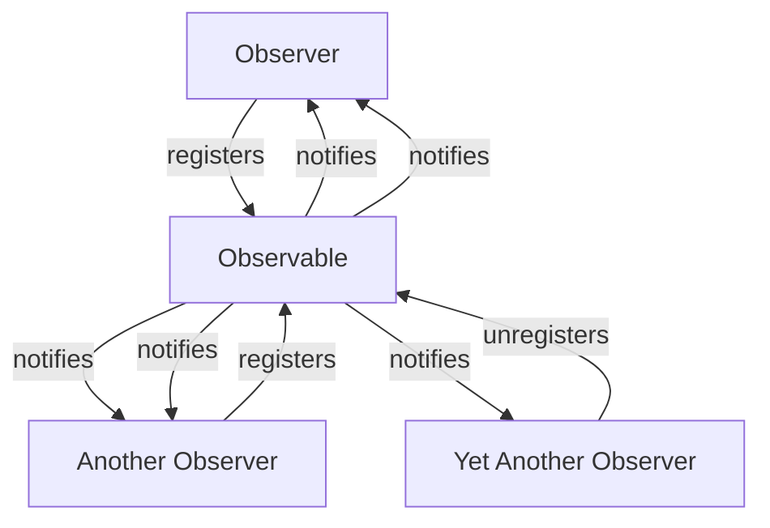

## Introduction
**Observable Delegation** is a design pattern in Kotlin that allows developers to create objects that can be observed for changes. This pattern is particularly useful when building reactive systems, where objects need to notify other objects about changes to their state. In this section, we will explore the basics of Observable Delegation and why it is an essential concept in Kotlin programming.

Observable Delegation is built on top of the **Delegate** pattern, which allows an object to delegate some of its responsibilities to another object. In the case of Observable Delegation, the delegate object is responsible for notifying observers about changes to the state of the object.

> **Note:** Observable Delegation is a fundamental concept in reactive programming, and it is widely used in many Kotlin frameworks and libraries, such as RxJava and Kotlin Coroutines.

## Core Concepts
To understand Observable Delegation, we need to grasp a few core concepts:

* **Delegate**: an object that is responsible for delegating some of its responsibilities to another object.
* **Observer**: an object that is interested in receiving notifications about changes to the state of another object.
* **Observable**: an object that can be observed for changes.

In the context of Observable Delegation, the **Delegate** object is responsible for notifying **Observers** about changes to the state of the **Observable** object.

> **Tip:** When implementing Observable Delegation, it is essential to consider the **Observer** pattern, which defines the relationship between the **Observable** object and its **Observers**.

## How It Works Internally
When an object is created using Observable Delegation, it is assigned a **Delegate** object that is responsible for managing its state. The **Delegate** object is responsible for notifying **Observers** about changes to the state of the object.

Here is a step-by-step breakdown of how Observable Delegation works internally:

1. An object is created using Observable Delegation.
2. The object is assigned a **Delegate** object that is responsible for managing its state.
3. The **Delegate** object is responsible for notifying **Observers** about changes to the state of the object.
4. When the state of the object changes, the **Delegate** object notifies all registered **Observers**.

> **Warning:** When implementing Observable Delegation, it is crucial to consider the potential for **Observer** leaks, which can occur when an **Observer** is not properly removed from the list of registered **Observers**.

## Code Examples
Here are three complete and runnable code examples that demonstrate how to use Observable Delegation in Kotlin:

### Example 1: Basic Usage
```kotlin
import kotlin.properties.Delegate

class ObservableDelegate<T>(initialValue: T) : Delegate<T> {
    private var value: T = initialValue
    private val observers: MutableList<(T) -> Unit> = mutableListOf()

    fun addObserver(observer: (T) -> Unit) {
        observers.add(observer)
    }

    override operator fun getValue(thisRef: Any, property: KProperty<*>): T {
        return value
    }

    override operator fun setValue(thisRef: Any, property: KProperty<*>, value: T) {
        this.value = value
        observers.forEach { it(value) }
    }
}

class MyClass {
    var myProperty: String by ObservableDelegate("initial value")
}

fun main() {
    val myObject = MyClass()
    myObject.myProperty.addObserver { println("Property changed to $it") }
    myObject.myProperty = "new value"
}
```

### Example 2: Real-World Pattern
```kotlin
import kotlin.properties.Delegate

class User {
    var name: String by ObservableDelegate("John Doe")
    var email: String by ObservableDelegate("john.doe@example.com")

    fun addObserver(observer: (User) -> Unit) {
        name.addObserver { _ -> observer(this) }
        email.addObserver { _ -> observer(this) }
    }
}

class UserRepository {
    private val users: MutableList<User> = mutableListOf()

    fun addUser(user: User) {
        users.add(user)
        user.addObserver { println("User updated: $it") }
    }
}

fun main() {
    val userRepository = UserRepository()
    val user = User()
    userRepository.addUser(user)
    user.name = "Jane Doe"
    user.email = "jane.doe@example.com"
}
```

### Example 3: Advanced Usage
```kotlin
import kotlin.properties.Delegate

class ObservableList<T> : MutableList<T> {
    private val delegate: MutableList<T> = mutableListOf()
    private val observers: MutableList<(List<T>) -> Unit> = mutableListOf()

    fun addObserver(observer: (List<T>) -> Unit) {
        observers.add(observer)
    }

    override fun add(element: T): Boolean {
        val result = delegate.add(element)
        observers.forEach { it(delegate) }
        return result
    }

    override fun remove(element: T): Boolean {
        val result = delegate.remove(element)
        observers.forEach { it(delegate) }
        return result
    }

    override fun clear() {
        delegate.clear()
        observers.forEach { it(delegate) }
    }

    override val size: Int
        get() = delegate.size

    override fun contains(element: T): Boolean {
        return delegate.contains(element)
    }

    override fun containsAll(elements: Collection<T>): Boolean {
        return delegate.containsAll(elements)
    }

    override fun isEmpty(): Boolean {
        return delegate.isEmpty()
    }

    override fun iterator(): MutableIterator<T> {
        return delegate.iterator()
    }

    override fun addAll(elements: Collection<T>): Boolean {
        val result = delegate.addAll(elements)
        observers.forEach { it(delegate) }
        return result
    }

    override fun addAll(index: Int, elements: Collection<T>): Boolean {
        val result = delegate.addAll(index, elements)
        observers.forEach { it(delegate) }
        return result
    }

    override fun removeAll(elements: Collection<T>): Boolean {
        val result = delegate.removeAll(elements)
        observers.forEach { it(delegate) }
        return result
    }

    override fun retainAll(elements: Collection<T>): Boolean {
        val result = delegate.retainAll(elements)
        observers.forEach { it(delegate) }
        return result
    }

    override fun listIterator(): MutableListIterator<T> {
        return delegate.listIterator()
    }

    override fun listIterator(index: Int): MutableListIterator<T> {
        return delegate.listIterator(index)
    }

    override fun subList(fromIndex: Int, toIndex: Int): MutableList<T> {
        return delegate.subList(fromIndex, toIndex)
    }

    override fun get(index: Int): T {
        return delegate[index]
    }

    override fun set(index: Int, element: T): T {
        val result = delegate.set(index, element)
        observers.forEach { it(delegate) }
        return result
    }

    override fun removeAt(index: Int): T {
        val result = delegate.removeAt(index)
        observers.forEach { it(delegate) }
        return result
    }

    override fun indexOf(element: T): Int {
        return delegate.indexOf(element)
    }

    override fun lastIndexOf(element: T): Int {
        return delegate.lastIndexOf(element)
    }
}

fun main() {
    val list = ObservableList<String>()
    list.addObserver { println("List updated: $it") }
    list.add("Hello")
    list.add("World")
    list.remove("Hello")
}
```

## Visual Diagram

This diagram illustrates the relationship between **Observers** and an **Observable** object. The **Observers** register with the **Observable** object to receive notifications about changes to its state. The **Observable** object notifies all registered **Observers** about changes to its state.

> **Interview:** When asked about Observable Delegation in an interview, be sure to explain the relationship between **Observers** and **Observable** objects, as well as the benefits of using this pattern in reactive systems.

## Comparison
Here is a comparison of different approaches to implementing Observable Delegation in Kotlin:

| Approach | Time Complexity | Space Complexity | Pros | Cons | Best For |
| --- | --- | --- | --- | --- | --- |
| Delegate Pattern | O(1) | O(n) | Easy to implement, flexible | Can be slow for large datasets | Small to medium-sized datasets |
| Observer Pattern | O(1) | O(n) | Decouples **Observers** from **Observable** objects, easy to implement | Can be slow for large datasets | Small to medium-sized datasets |
| Reactive Extensions | O(1) | O(n) | Provides a rich set of operators for working with reactive data, high-performance | Steep learning curve, requires additional dependencies | Large-scale reactive systems |
| Kotlin Coroutines | O(1) | O(n) | Provides a lightweight and efficient way to work with coroutines, high-performance | Limited support for reactive programming | Small to medium-sized datasets, concurrent programming |

## Real-world Use Cases
Here are three real-world use cases for Observable Delegation:

1. **Android Apps**: Observable Delegation is widely used in Android apps to manage the state of UI components. For example, a `TextView` can be observed for changes to its text, and the observer can update the UI accordingly.
2. **Web Applications**: Observable Delegation is used in web applications to manage the state of data models. For example, a web application can use Observable Delegation to notify observers about changes to a user's profile data.
3. **IoT Systems**: Observable Delegation is used in IoT systems to manage the state of devices. For example, a smart thermostat can use Observable Delegation to notify observers about changes to its temperature setting.

## Common Pitfalls
Here are four common pitfalls to watch out for when using Observable Delegation:

1. **Observer Leaks**: Failing to remove **Observers** from the list of registered **Observers** can cause memory leaks.
2. **Incorrect Notification**: Notifying **Observers** about changes to the wrong state can cause unexpected behavior.
3. **Concurrent Modification**: Modifying the state of an **Observable** object while notifying **Observers** can cause concurrent modification exceptions.
4. **Performance Issues**: Using Observable Delegation with large datasets can cause performance issues if not implemented correctly.

> **Warning:** When using Observable Delegation, be sure to follow best practices to avoid common pitfalls and ensure optimal performance.

## Interview Tips
Here are three common interview questions related to Observable Delegation, along with tips for answering them:

1. **What is Observable Delegation?**: Be sure to explain the basics of Observable Delegation, including the relationship between **Observers** and **Observable** objects.
2. **How does Observable Delegation work?**: Explain the internal mechanics of Observable Delegation, including the role of the **Delegate** object and the notification process.
3. **What are the benefits of using Observable Delegation?**: Discuss the benefits of using Observable Delegation, including decoupling **Observers** from **Observable** objects and improving performance.

## Key Takeaways
Here are ten key takeaways to remember when using Observable Delegation:

* **Observable Delegation** is a design pattern that allows objects to be observed for changes.
* **Observers** register with **Observable** objects to receive notifications about changes to their state.
* **Delegate** objects manage the state of **Observable** objects and notify **Observers** about changes.
* **Observer** leaks can occur if **Observers** are not properly removed from the list of registered **Observers**.
* **Incorrect notification** can cause unexpected behavior if **Observers** are notified about changes to the wrong state.
* **Concurrent modification** can cause exceptions if the state of an **Observable** object is modified while notifying **Observers**.
* **Performance issues** can occur if Observable Delegation is not implemented correctly, especially with large datasets.
* **Reactive Extensions** and **Kotlin Coroutines** provide alternative approaches to implementing Observable Delegation.
* **Android Apps**, **Web Applications**, and **IoT Systems** are common use cases for Observable Delegation.
* **Best practices** should be followed to avoid common pitfalls and ensure optimal performance when using Observable Delegation.