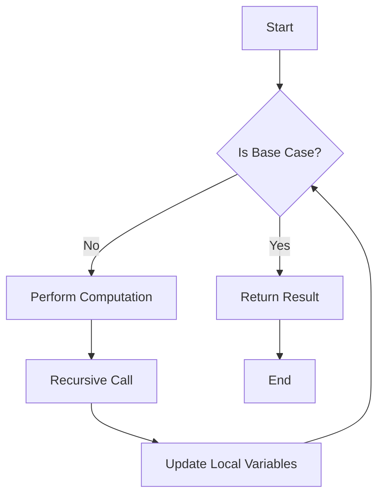

## Introduction
**Tail-recursive functions** are a fundamental concept in programming, particularly in functional programming languages like Kotlin. A tail-recursive function is a function that calls itself recursively, but with a twist: the recursive call is the last thing the function does. This allows the function to avoid the overhead of creating a new stack frame for each recursive call, which can lead to a significant performance improvement. In this section, we will explore the world of tail-recursive functions, their benefits, and how they are used in real-world applications.

> **Note:** Tail-recursive functions are not unique to Kotlin and can be found in other programming languages, such as Scala, Haskell, and Scheme.

In Kotlin, tail-recursive functions are denoted by the `tailrec` keyword, which allows the compiler to optimize the function call. The `tailrec` keyword is not a function itself, but rather a modifier that indicates to the compiler that the function can be optimized for tail recursion.

## Core Concepts
To understand tail-recursive functions, we need to grasp the following core concepts:

* **Recursion**: a function that calls itself repeatedly until it reaches a base case.
* **Tail recursion**: a function that calls itself recursively, but with the recursive call being the last thing the function does.
* **Stack frame**: a region of memory that stores the function's local variables, parameters, and return address.

A tail-recursive function has the following characteristics:

* The recursive call is the last statement in the function.
* The function does not perform any additional computations after the recursive call.
* The function's local variables and parameters are not used after the recursive call.

> **Tip:** When writing a tail-recursive function, make sure to use the `tailrec` keyword and follow the above guidelines to ensure optimal performance.

## How It Works Internally
When a tail-recursive function is called, the compiler optimizes the function call by reusing the existing stack frame. This means that the function's local variables and parameters are not pushed onto the stack, reducing memory allocation and deallocation overhead.

Here's a step-by-step breakdown of how a tail-recursive function works:

1. The function is called with the initial arguments.
2. The function performs the necessary computations and reaches the recursive call.
3. The compiler optimizes the recursive call by reusing the existing stack frame.
4. The function's local variables and parameters are updated with the new values.
5. The function returns the result, and the process repeats until the base case is reached.

> **Warning:** If a function is not tail-recursive, the compiler will not optimize the function call, and the function may cause a stack overflow error for large input values.

## Code Examples
### Example 1: Basic Tail-Recursive Function
```kotlin
tailrec fun factorial(n: Int, acc: Int = 1): Int {
    if (n == 0) return acc
    return factorial(n - 1, n * acc)
}
```
This function calculates the factorial of a given number using a tail-recursive approach.

### Example 2: Real-World Pattern - Tree Traversal
```kotlin
data class Node(val value: Int, val left: Node?, val right: Node?)

tailrec fun traverse(node: Node?, acc: List<Int> = emptyList()): List<Int> {
    if (node == null) return acc
    return traverse(node.left, acc + node.value) + traverse(node.right, acc)
}
```
This function traverses a binary tree using a tail-recursive approach.

### Example 3: Advanced Usage - Memoization
```kotlin
val memo = mutableMapOf<Int, Int>()

tailrec fun fibonacci(n: Int, a: Int = 0, b: Int = 1): Int {
    if (n == 0) return a
    if (memo.containsKey(n)) return memo[n]!!
    memo[n] = b
    return fibonacci(n - 1, b, a + b)
}
```
This function calculates the nth Fibonacci number using a tail-recursive approach with memoization.

## Visual Diagram

This diagram illustrates the flow of a tail-recursive function, from the initial call to the base case.

> **Note:** The recursive call is the last thing the function does, allowing the compiler to optimize the function call.

## Comparison
| Approach | Time Complexity | Space Complexity | Pros | Cons | Best For |
| --- | --- | --- | --- | --- | --- |
| Tail Recursion | O(n) | O(1) | Efficient, optimized | Limited to specific use cases | Calculating factorials, tree traversal |
| Iterative Approach | O(n) | O(1) | Easy to implement, efficient | Less elegant, more code | General-purpose programming |
| Memoization | O(n) | O(n) | Fast, efficient | High memory usage | Calculating Fibonacci numbers, dynamic programming |

## Real-world Use Cases
* **Google's PageRank Algorithm**: uses a tail-recursive approach to calculate the importance of web pages.
* **Apache Spark's RDD**: uses a tail-recursive approach to process large datasets.
* **Kotlin's Standard Library**: uses tail-recursive functions to implement various algorithms, such as sorting and searching.

## Common Pitfalls
* **Not using the `tailrec` keyword**: can lead to performance issues and stack overflow errors.
* **Not following the tail recursion guidelines**: can lead to incorrect results and performance issues.
* **Using tail recursion for non-recursive problems**: can lead to unnecessary complexity and performance issues.
* **Not considering the base case**: can lead to infinite recursion and stack overflow errors.

> **Warning:** When using tail recursion, make sure to consider the base case and follow the guidelines to avoid common pitfalls.

## Interview Tips
* **What is tail recursion?**: A tail-recursive function is a function that calls itself recursively, but with the recursive call being the last thing the function does.
* **How does tail recursion work?**: The compiler optimizes the function call by reusing the existing stack frame, reducing memory allocation and deallocation overhead.
* **What are the benefits of tail recursion?**: Efficient, optimized, and reduces memory usage.

> **Interview:** When asked about tail recursion, make sure to explain the concept, its benefits, and provide examples of how it is used in real-world applications.

## Key Takeaways
* **Tail recursion is a fundamental concept in programming**: used to optimize function calls and reduce memory usage.
* **The `tailrec` keyword is used to denote tail-recursive functions**: allows the compiler to optimize the function call.
* **Tail recursion has a time complexity of O(n) and a space complexity of O(1)**: making it efficient for large input values.
* **Tail recursion is used in various algorithms, such as calculating factorials and tree traversal**: provides an elegant and efficient solution.
* **Memoization can be used with tail recursion to improve performance**: reduces the number of recursive calls and improves efficiency.
* **Common pitfalls include not using the `tailrec` keyword and not following the tail recursion guidelines**: can lead to performance issues and stack overflow errors.
* **Tail recursion is used in real-world applications, such as Google's PageRank Algorithm and Apache Spark's RDD**: provides an efficient and scalable solution.