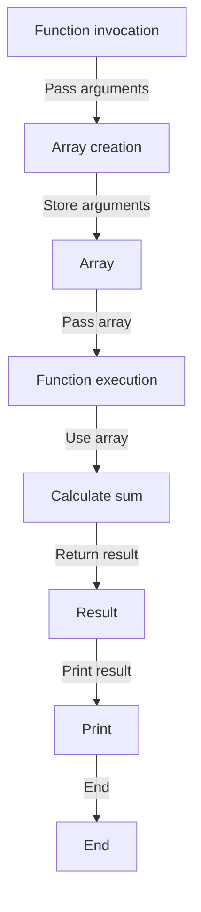

## Introduction
**Vararg parameters**, short for variable-length argument parameters, are a feature in programming languages that allows a function to accept a variable number of arguments. In Kotlin, vararg parameters are denoted by the `vararg` keyword and are used to pass a variable number of arguments to a function. This feature is useful when we need to write functions that can handle a dynamic number of inputs, such as logging functions or functions that perform calculations on a variable number of numbers.

> **Note:** Vararg parameters are not unique to Kotlin and can be found in other programming languages such as Java and Python.

Vararg parameters are essential in real-world applications, especially when working with data that has a variable number of elements. For example, when working with a database, we might need to write a function that can handle a variable number of queries. In such cases, vararg parameters come in handy.

## Core Concepts
- **Vararg parameter**: A parameter that can accept a variable number of arguments.
- **Spread operator**: An operator used to pass an array as separate arguments to a function.
- **Array**: A collection of elements of the same data type stored in contiguous memory locations.

> **Tip:** When working with vararg parameters, it's essential to understand how arrays work in Kotlin. Arrays in Kotlin are similar to arrays in other programming languages and are used to store collections of elements.

## How It Works Internally
When we use vararg parameters in a function, Kotlin treats them as an array of the specified type. For example, if we have a function `fun calculateSum(vararg numbers: Int)`, Kotlin will treat the `numbers` parameter as an array of integers.

Here's a step-by-step breakdown of how vararg parameters work internally:

1. **Compilation**: When we compile a Kotlin program that uses vararg parameters, the compiler converts the vararg parameter into an array.
2. **Function invocation**: When we invoke a function with vararg parameters, we can pass a variable number of arguments.
3. **Array creation**: Kotlin creates an array to store the arguments passed to the function.
4. **Function execution**: The function executes, using the array of arguments.

> **Warning:** When working with vararg parameters, be careful not to confuse them with regular parameters. Vararg parameters must be the last parameter in a function signature.

## Code Examples
### Example 1: Basic Usage
```kotlin
fun calculateSum(vararg numbers: Int) {
    var sum = 0
    for (number in numbers) {
        sum += number
    }
    println("The sum is: $sum")
}

fun main() {
    calculateSum(1, 2, 3, 4, 5)
}
```
This example demonstrates the basic usage of vararg parameters in Kotlin. The `calculateSum` function takes a variable number of integers as arguments and calculates their sum.

### Example 2: Real-World Pattern
```kotlin
fun logMessage(vararg messages: String) {
    for (message in messages) {
        println("LOG: $message")
    }
}

fun main() {
    logMessage("User logged in", "User logged out")
}
```
This example demonstrates a real-world pattern of using vararg parameters to log messages.

### Example 3: Advanced Usage
```kotlin
fun calculateStatistics(vararg numbers: Double) {
    var sum = 0.0
    var max = Double.MIN_VALUE
    var min = Double.MAX_VALUE
    for (number in numbers) {
        sum += number
        if (number > max) {
            max = number
        }
        if (number < min) {
            min = number
        }
    }
    val mean = sum / numbers.size
    println("Mean: $mean")
    println("Max: $max")
    println("Min: $min")
}

fun main() {
    calculateStatistics(1.0, 2.0, 3.0, 4.0, 5.0)
}
```
This example demonstrates an advanced usage of vararg parameters to calculate statistics such as mean, max, and min.

## Visual Diagram

This diagram illustrates the flow of vararg parameters from function invocation to function execution.

## Comparison
| Approach | Time Complexity | Space Complexity | Pros | Cons | Best For |
| --- | --- | --- | --- | --- | --- |
| Vararg parameters | O(n) | O(n) | Flexible, easy to use | Can lead to performance issues if not used carefully | Logging, statistics calculation |
| Arrays | O(n) | O(n) | Fixed size, fast access | Limited flexibility | Image processing, matrix operations |
| Lists | O(n) | O(n) | Dynamic size, fast insertion | Slow access | Database queries, file operations |
| Sets | O(n) | O(n) | Fast lookup, unique elements | Slow insertion | Data validation, caching |

## Real-world Use Cases
1. **Logging**: Vararg parameters can be used to log messages with a variable number of arguments. For example, in a web application, we might want to log user interactions with a variable number of arguments.
2. **Statistics calculation**: Vararg parameters can be used to calculate statistics such as mean, max, and min. For example, in a data analysis application, we might want to calculate statistics on a variable number of data points.
3. **Database queries**: Vararg parameters can be used to pass a variable number of arguments to a database query. For example, in a web application, we might want to query a database with a variable number of filters.

> **Interview:** Can you explain how vararg parameters work in Kotlin? How would you use them to log messages with a variable number of arguments?

## Common Pitfalls
1. **Confusing vararg parameters with regular parameters**: Vararg parameters must be the last parameter in a function signature.
2. **Not checking the size of the array**: When working with vararg parameters, we must check the size of the array to avoid index out of bounds errors.
3. **Not handling null values**: When working with vararg parameters, we must handle null values to avoid null pointer exceptions.
4. **Not using the spread operator**: When passing an array as separate arguments to a function, we must use the spread operator to avoid compilation errors.

## Interview Tips
1. **What is the difference between vararg parameters and regular parameters?**: Vararg parameters are used to pass a variable number of arguments to a function, while regular parameters are used to pass a fixed number of arguments.
2. **How do you use vararg parameters to log messages with a variable number of arguments?**: We can use vararg parameters to log messages by passing a variable number of arguments to a logging function.
3. **What are the common pitfalls when working with vararg parameters?**: The common pitfalls include confusing vararg parameters with regular parameters, not checking the size of the array, not handling null values, and not using the spread operator.

## Key Takeaways
* Vararg parameters are used to pass a variable number of arguments to a function.
* Vararg parameters are treated as an array of the specified type.
* The spread operator is used to pass an array as separate arguments to a function.
* Vararg parameters have a time complexity of O(n) and a space complexity of O(n).
* Vararg parameters are flexible and easy to use but can lead to performance issues if not used carefully.
* Vararg parameters are best used for logging, statistics calculation, and database queries.
* The common pitfalls when working with vararg parameters include confusing vararg parameters with regular parameters, not checking the size of the array, not handling null values, and not using the spread operator.