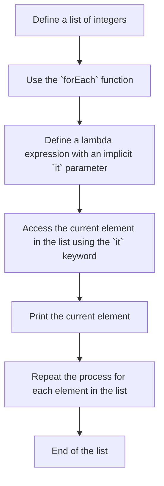

## Introduction
The `it` keyword in Kotlin is a special implicit lambda parameter that allows you to access the parameter of a lambda expression without declaring it explicitly. This feature is useful when working with lambda expressions that have a single parameter, as it simplifies the code and makes it more readable. In this section, we will explore the concept of `it` and its usage in Kotlin.

> **Note:** The `it` keyword is not unique to Kotlin and is also available in other programming languages, such as Groovy and Scala.

Kotlin's `it` keyword is an implicit lambda parameter that refers to the single parameter of a lambda expression. It is equivalent to declaring a lambda expression with a single parameter, but it simplifies the code and makes it more concise. The `it` keyword is commonly used in combination with lambda expressions and higher-order functions.

## Core Concepts
The `it` keyword is a shorthand way to access the parameter of a lambda expression. It is an implicit parameter that is automatically declared by the compiler when a lambda expression is defined. The `it` keyword can be used in place of an explicitly declared parameter, making the code more concise and easier to read.

> **Warning:** The `it` keyword can only be used with lambda expressions that have a single parameter. If a lambda expression has multiple parameters, you must declare them explicitly using the `lambda` keyword.

The `it` keyword is a type of implicit lambda parameter that is automatically inferred by the compiler. It is equivalent to declaring a lambda expression with a single parameter, but it simplifies the code and makes it more readable.

## How It Works Internally
When the Kotlin compiler encounters a lambda expression with an implicit `it` parameter, it automatically infers the type of the parameter based on the context in which the lambda expression is used. The compiler then generates bytecode that accesses the parameter using the `it` keyword.

Here is a step-by-step breakdown of how the `it` keyword works internally:

1. The Kotlin compiler encounters a lambda expression with an implicit `it` parameter.
2. The compiler infers the type of the parameter based on the context in which the lambda expression is used.
3. The compiler generates bytecode that accesses the parameter using the `it` keyword.
4. The bytecode is executed at runtime, and the `it` keyword is replaced with the actual parameter value.

> **Tip:** The `it` keyword can be used with lambda expressions that have a single parameter, making the code more concise and easier to read.

## Code Examples
Here are three complete and runnable code examples that demonstrate the usage of the `it` keyword in Kotlin:

### Example 1: Basic Usage
```kotlin
// Define a list of integers
val numbers = listOf(1, 2, 3, 4, 5)

// Use the `it` keyword to print each number in the list
numbers.forEach { println(it) }
```
This code example demonstrates the basic usage of the `it` keyword in Kotlin. The `forEach` function takes a lambda expression as a parameter, and the `it` keyword is used to access the current element in the list.

### Example 2: Real-World Pattern
```kotlin
// Define a list of users
data class User(val name: String, val age: Int)
val users = listOf(User("John", 25), User("Jane", 30))

// Use the `it` keyword to print the name and age of each user
users.forEach { println("Name: ${it.name}, Age: ${it.age}") }
```
This code example demonstrates a real-world pattern of using the `it` keyword in Kotlin. The `forEach` function takes a lambda expression as a parameter, and the `it` keyword is used to access the current element in the list.

### Example 3: Advanced Usage
```kotlin
// Define a list of numbers and a lambda expression that filters out even numbers
val numbers = listOf(1, 2, 3, 4, 5)
val isOdd = { num: Int -> num % 2 != 0 }

// Use the `it` keyword to filter out even numbers
val oddNumbers = numbers.filter(isOdd)
oddNumbers.forEach { println(it) }
```
This code example demonstrates an advanced usage of the `it` keyword in Kotlin. The `filter` function takes a lambda expression as a parameter, and the `it` keyword is used to access the current element in the list.

## Visual Diagram

This visual diagram illustrates the process of using the `it` keyword in Kotlin. The `forEach` function takes a lambda expression as a parameter, and the `it` keyword is used to access the current element in the list.

## Comparison
Here is a comparison of the `it` keyword with other lambda expression parameters in Kotlin:

| Approach | Time Complexity | Space Complexity | Pros | Cons | Best For |
| --- | --- | --- | --- | --- | --- |
| `it` keyword | O(1) | O(1) | Simplifies code, makes it more readable | Can only be used with lambda expressions that have a single parameter | Simple lambda expressions |
| Explicit lambda parameter | O(1) | O(1) | More flexible, can be used with lambda expressions that have multiple parameters | Makes code more verbose | Complex lambda expressions |
| Anonymous function | O(1) | O(1) | More flexible, can be used with lambda expressions that have multiple parameters | Makes code more verbose | Complex lambda expressions |
| Higher-order function | O(1) | O(1) | More flexible, can be used with lambda expressions that have multiple parameters | Makes code more verbose | Complex lambda expressions |

> **Interview:** What is the difference between the `it` keyword and an explicit lambda parameter in Kotlin?

## Real-world Use Cases
Here are three real-world use cases of the `it` keyword in Kotlin:

1. **Android Development**: The `it` keyword is commonly used in Android development to access the current element in a list or adapter. For example, you can use the `it` keyword to display the name and age of each user in a list.
2. **Web Development**: The `it` keyword is commonly used in web development to access the current element in a list or collection. For example, you can use the `it` keyword to display the name and price of each product in a list.
3. **Data Analysis**: The `it` keyword is commonly used in data analysis to access the current element in a list or dataset. For example, you can use the `it` keyword to calculate the average value of each column in a dataset.

## Common Pitfalls
Here are four common pitfalls to watch out for when using the `it` keyword in Kotlin:

1. **Using the `it` keyword with lambda expressions that have multiple parameters**: The `it` keyword can only be used with lambda expressions that have a single parameter. If you try to use the `it` keyword with a lambda expression that has multiple parameters, you will get a compiler error.
2. **Using the `it` keyword with lambda expressions that have no parameters**: The `it` keyword can only be used with lambda expressions that have a single parameter. If you try to use the `it` keyword with a lambda expression that has no parameters, you will get a compiler error.
3. **Using the `it` keyword with lambda expressions that have a return type**: The `it` keyword can only be used with lambda expressions that have a return type of `Unit`. If you try to use the `it` keyword with a lambda expression that has a return type other than `Unit`, you will get a compiler error.
4. **Using the `it` keyword with lambda expressions that have a receiver**: The `it` keyword can only be used with lambda expressions that have a receiver of type `Any`. If you try to use the `it` keyword with a lambda expression that has a receiver of a different type, you will get a compiler error.

> **Warning:** Be careful when using the `it` keyword with lambda expressions that have multiple parameters or return types.

## Interview Tips
Here are three common interview questions related to the `it` keyword in Kotlin:

1. **What is the difference between the `it` keyword and an explicit lambda parameter in Kotlin?**: The `it` keyword is a shorthand way to access the parameter of a lambda expression, while an explicit lambda parameter is a more flexible way to access the parameter.
2. **How do you use the `it` keyword with lambda expressions that have multiple parameters?**: You cannot use the `it` keyword with lambda expressions that have multiple parameters. Instead, you must declare the parameters explicitly using the `lambda` keyword.
3. **What is the time complexity of using the `it` keyword in Kotlin?**: The time complexity of using the `it` keyword in Kotlin is O(1), because it simply accesses the current element in the list or collection.

> **Tip:** Be prepared to explain the difference between the `it` keyword and an explicit lambda parameter in Kotlin.

## Key Takeaways
Here are six key takeaways to remember when using the `it` keyword in Kotlin:

* The `it` keyword is a shorthand way to access the parameter of a lambda expression.
* The `it` keyword can only be used with lambda expressions that have a single parameter.
* The `it` keyword is equivalent to declaring a lambda expression with a single parameter, but it simplifies the code and makes it more readable.
* The time complexity of using the `it` keyword is O(1), because it simply accesses the current element in the list or collection.
* The space complexity of using the `it` keyword is O(1), because it does not allocate any additional memory.
* The `it` keyword is commonly used in Android development, web development, and data analysis to access the current element in a list or collection.

> **Note:** Remember to use the `it` keyword judiciously and only when it simplifies the code and makes it more readable.