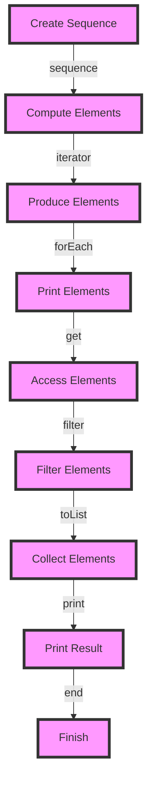

## Introduction
In Kotlin, **sequences** and **collections** are two fundamental concepts that serve distinct purposes. Understanding the difference between them is crucial for writing efficient and effective code. In this section, we will explore what sequences and collections are, why they exist, and their real-world relevance. 
> **Note:** Sequences and collections are not unique to Kotlin; they are fundamental concepts in programming that can be applied to various languages.

Sequences and collections are used to store and manipulate data in a program. However, they differ in their approach to handling data. A **collection** is a container that stores a fixed set of elements, whereas a **sequence** is a stream of elements that can be computed on demand. 
> **Tip:** When working with large datasets, using sequences can be more memory-efficient than collections.

In real-world scenarios, sequences and collections are used extensively. For instance, when fetching data from a database, you might use a sequence to lazily load the data, whereas when working with a small dataset, you might use a collection for faster access.

## Core Concepts
To grasp the concept of sequences and collections, it's essential to understand the following key terms:

* **Sequence**: A sequence is an iterable that computes its elements on demand. It's a lazy collection that only loads the data when needed.
* **Collection**: A collection is a container that stores a fixed set of elements. It's an eager collection that loads all the data at once.
* **Iterable**: An iterable is an object that can be iterated over, such as a sequence or a collection.

Mental models can help solidify these concepts:
> **Note:** Think of a sequence as a pipe that produces water (data) only when you turn the faucet (iterate over it), whereas a collection is a bucket that already contains water (data).

## How It Works Internally
Under the hood, sequences and collections work differently:

1. **Sequence**:
	* A sequence is created using the `sequence` function or the `asSequence()` function.
	* When you iterate over a sequence, it computes the elements on demand using the `iterator()` function.
	* The `iterator()` function returns an `Iterator` object that produces the elements of the sequence.
2. **Collection**:
	* A collection is created using the `listOf()`, `setOf()`, or `mapOf()` functions.
	* When you create a collection, it loads all the data into memory at once.
	* The collection provides random access to its elements using the `get()` function.

Step-by-step, here's how it works:

1. Create a sequence or collection.
2. Iterate over the sequence or collection using a `for` loop or the `forEach()` function.
3. For a sequence, the `iterator()` function is called to compute the elements on demand.
4. For a collection, the elements are accessed directly using the `get()` function.

## Code Examples
Here are three complete and runnable examples that demonstrate the use of sequences and collections:

### Example 1: Basic Sequence
```kotlin
// Create a sequence of numbers from 1 to 10
val numbers = sequence {
    for (i in 1..10) {
        yield(i)
    }
}

// Iterate over the sequence and print the numbers
numbers.forEach { println(it) }
```

### Example 2: Real-World Pattern - Filtering a Sequence
```kotlin
// Create a sequence of numbers from 1 to 10
val numbers = sequence {
    for (i in 1..10) {
        yield(i)
    }
}

// Filter the sequence to get only the even numbers
val evenNumbers = numbers.filter { it % 2 == 0 }

// Iterate over the filtered sequence and print the numbers
evenNumbers.forEach { println(it) }
```

### Example 3: Advanced Usage - Using a Sequence with a Collection
```kotlin
// Create a list of numbers from 1 to 10
val numbersList = listOf(1, 2, 3, 4, 5, 6, 7, 8, 9, 10)

// Convert the list to a sequence
val numbersSequence = numbersList.asSequence()

// Use the sequence to filter out the odd numbers
val evenNumbers = numbersSequence.filter { it % 2 == 0 }

// Collect the filtered sequence into a new list
val evenNumbersList = evenNumbers.toList()

// Print the resulting list
println(evenNumbersList)
```

## Visual Diagram

This diagram illustrates the workflow of creating a sequence, computing its elements, and printing the result. 

## Comparison
Here's a comparison table between sequences and collections:

| Approach | Time Complexity | Space Complexity | Pros | Cons | Best For |
|----------|----------------|-----------------|------|------|----------|
| Sequence | O(1) for creation, O(n) for iteration | O(1) for creation, O(n) for iteration | Lazy loading, memory-efficient | Can be slower than collections | Large datasets, lazy loading |
| Collection | O(n) for creation | O(n) for creation | Fast access, random access | Can be memory-intensive | Small datasets, fast access |
| List | O(n) for creation | O(n) for creation | Fast access, random access | Can be memory-intensive | Small datasets, fast access |
| Set | O(n) for creation | O(n) for creation | Fast lookup, no duplicates | Can be memory-intensive | Small datasets, fast lookup |

## Real-world Use Cases
Here are three real-world use cases for sequences and collections:

1. **Data Processing**: When processing large datasets, using sequences can be more memory-efficient than collections. For example, when processing a large CSV file, you can use a sequence to lazily load the data and process it in chunks.
2. **Database Querying**: When querying a database, using sequences can be more efficient than collections. For example, when fetching a large number of records from a database, you can use a sequence to lazily load the data and process it in chunks.
3. **File I/O**: When reading or writing files, using sequences can be more efficient than collections. For example, when reading a large file, you can use a sequence to lazily load the data and process it in chunks.

## Common Pitfalls
Here are four common pitfalls when using sequences and collections:

1. **Using Collections for Large Datasets**: Using collections for large datasets can be memory-intensive and slow. Instead, use sequences to lazily load the data and process it in chunks.
2. **Using Sequences for Small Datasets**: Using sequences for small datasets can be slower than using collections. Instead, use collections for fast access and random access.
3. **Not Using `asSequence()`**: Not using `asSequence()` when working with collections can result in unnecessary memory allocation and copying. Instead, use `asSequence()` to convert the collection to a sequence.
4. **Not Using `toList()`**: Not using `toList()` when working with sequences can result in unnecessary memory allocation and copying. Instead, use `toList()` to collect the sequence into a list.

> **Warning:** Be careful when using sequences and collections, as they can have different performance characteristics.

## Interview Tips
Here are three common interview questions related to sequences and collections:

1. **What is the difference between a sequence and a collection?**: A strong answer should explain the difference between sequences and collections, including their performance characteristics and use cases.
2. **How do you use sequences and collections in your code?**: A strong answer should provide examples of using sequences and collections in real-world scenarios, including their benefits and trade-offs.
3. **What are some common pitfalls when using sequences and collections?**: A strong answer should identify common pitfalls, such as using collections for large datasets or not using `asSequence()` and `toList()`.

> **Interview:** Be prepared to answer questions about the differences between sequences and collections, as well as their use cases and performance characteristics.

## Key Takeaways
Here are ten key takeaways about sequences and collections:

* Sequences are lazy collections that compute their elements on demand.
* Collections are eager collections that load all the data at once.
* Sequences are more memory-efficient than collections for large datasets.
* Collections are faster than sequences for small datasets.
* Use `asSequence()` to convert a collection to a sequence.
* Use `toList()` to collect a sequence into a list.
* Sequences are suitable for large datasets, lazy loading, and memory-efficient processing.
* Collections are suitable for small datasets, fast access, and random access.
* Be careful when using sequences and collections, as they can have different performance characteristics.
* Use sequences and collections judiciously, depending on the specific use case and performance requirements.

> **Tip:** Remember to use sequences and collections judiciously, depending on the specific use case and performance requirements.