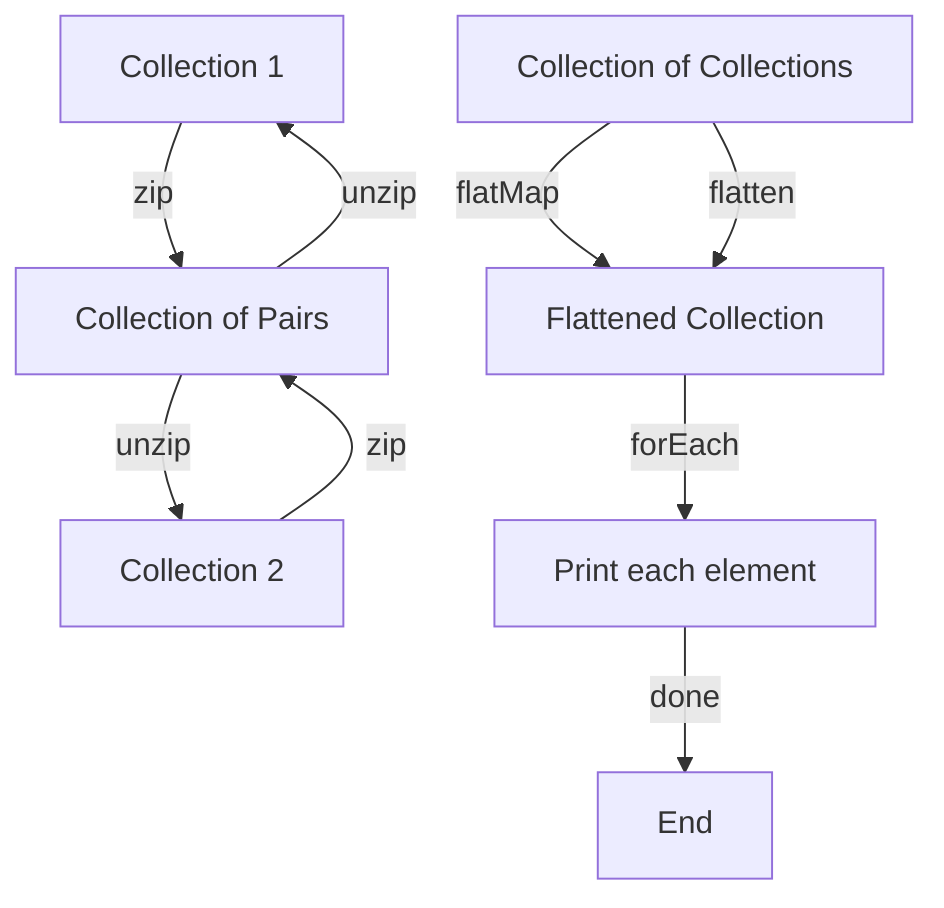

## Introduction
The Kotlin programming language provides several useful functions for working with collections, including `flatMap`, `flatten`, `zip`, and `unzip`. These functions enable developers to transform and manipulate collections in various ways, making it easier to solve complex problems. In this section, we will explore the importance of these functions, their real-world relevance, and why every engineer should understand how to use them effectively.

> **Note:** Understanding the basics of Kotlin collections and functional programming is essential for working with these functions. If you're new to Kotlin, it's recommended to start with the basics before diving into this topic.

## Core Concepts
Before we dive into the details of each function, let's define some key terms and concepts:

* **flatMap**: A function that applies a transformation to each element of a collection and then flattens the resulting collection of collections into a single collection.
* **flatten**: A function that takes a collection of collections and returns a single collection containing all the elements from the original collections.
* **zip**: A function that combines two collections into a single collection of pairs, where each pair contains one element from each of the original collections.
* **unzip**: A function that takes a collection of pairs and returns two separate collections, one containing the first element of each pair and the other containing the second element of each pair.

> **Tip:** When working with collections, it's essential to consider the time and space complexity of each operation. `flatMap` and `flatten` have a time complexity of O(n), while `zip` and `unzip` have a time complexity of O(n), where n is the size of the collection.

## How It Works Internally
Let's take a closer look at how these functions work internally:

1. **flatMap**: When you call `flatMap` on a collection, Kotlin applies the transformation function to each element and then flattens the resulting collection of collections into a single collection. This is done using a combination of `map` and `flatten`.
2. **flatten**: When you call `flatten` on a collection of collections, Kotlin creates a new collection containing all the elements from the original collections. This is done using a simple loop that iterates over each collection and adds its elements to the new collection.
3. **zip**: When you call `zip` on two collections, Kotlin creates a new collection of pairs, where each pair contains one element from each of the original collections. This is done using a simple loop that iterates over each collection and creates a pair for each element.
4. **unzip**: When you call `unzip` on a collection of pairs, Kotlin creates two separate collections, one containing the first element of each pair and the other containing the second element of each pair. This is done using two separate loops that iterate over the collection of pairs and extract the corresponding elements.

> **Warning:** When using `flatMap` and `flatten`, be careful not to create infinite collections, as this can lead to a `StackOverflowError`.

## Code Examples
Here are three complete and runnable examples that demonstrate the use of `flatMap`, `flatten`, `zip`, and `unzip`:

### Example 1: Basic Usage of `flatMap`
```kotlin
fun main() {
    val numbers = listOf(1, 2, 3, 4, 5)
    val doubledNumbers = numbers.flatMap { listOf(it, it * 2) }
    println(doubledNumbers) // [1, 2, 2, 4, 3, 6, 4, 8, 5, 10]
}
```

### Example 2: Real-World Usage of `zip` and `unzip`
```kotlin
fun main() {
    val names = listOf("John", "Jane", "Bob")
    val ages = listOf(25, 30, 35)
    val pairs = names.zip(ages)
    println(pairs) // [(John, 25), (Jane, 30), (Bob, 35)]
    val (namesAgain, agesAgain) = pairs.unzip()
    println(namesAgain) // [John, Jane, Bob]
    println(agesAgain) // [25, 30, 35]
}
```

### Example 3: Advanced Usage of `flatten`
```kotlin
fun main() {
    val numbers = listOf(listOf(1, 2, 3), listOf(4, 5, 6), listOf(7, 8, 9))
    val flattenedNumbers = numbers.flatten()
    println(flattenedNumbers) // [1, 2, 3, 4, 5, 6, 7, 8, 9]
}
```

## Visual Diagram

This diagram illustrates the relationships between `flatMap`, `flatten`, `zip`, and `unzip`, as well as how they can be used to transform collections.

## Comparison
Here is a comparison of the different functions:

| Function | Time Complexity | Space Complexity | Pros | Cons |
| --- | --- | --- | --- | --- |
| flatMap | O(n) | O(n) | Flexible and powerful | Can be slow for large collections |
| flatten | O(n) | O(n) | Simple and efficient | Limited to collections of collections |
| zip | O(n) | O(n) | Useful for combining collections | Limited to two collections at a time |
| unzip | O(n) | O(n) | Useful for separating pairs | Limited to collections of pairs |

## Real-world Use Cases
Here are three real-world use cases for `flatMap`, `flatten`, `zip`, and `unzip`:

1. **Data processing**: When working with large datasets, `flatMap` and `flatten` can be used to transform and manipulate the data.
2. **API design**: `zip` and `unzip` can be used to combine and separate data in API responses.
3. **Machine learning**: `flatMap` and `flatten` can be used to transform and manipulate data for machine learning algorithms.

> **Interview:** Can you explain the difference between `flatMap` and `flatten`? How would you use `zip` and `unzip` to combine and separate data in an API response?

## Common Pitfalls
Here are four common pitfalls to watch out for when using `flatMap`, `flatten`, `zip`, and `unzip`:

1. **Infinite collections**: Be careful not to create infinite collections when using `flatMap` and `flatten`.
2. **Null safety**: Make sure to handle null values when using `zip` and `unzip`.
3. **Type safety**: Make sure to use the correct types when using `flatMap` and `flatten`.
4. **Performance**: Be aware of the performance implications of using `flatMap` and `flatten` on large collections.

> **Tip:** Use the `take` function to limit the size of the collection when using `flatMap` and `flatten`.

## Interview Tips
Here are three common interview questions related to `flatMap`, `flatten`, `zip`, and `unzip`:

1. **What is the difference between `flatMap` and `flatten`?**
	* Weak answer: "They're similar, but I'm not sure how they differ."
	* Strong answer: " `flatMap` applies a transformation to each element of a collection and then flattens the resulting collection of collections, while `flatten` simply flattens a collection of collections."
2. **How would you use `zip` and `unzip` to combine and separate data in an API response?**
	* Weak answer: "I'm not sure, but I think I would use `zip` to combine the data and `unzip` to separate it."
	* Strong answer: "I would use `zip` to combine the data into a collection of pairs, and then use `unzip` to separate the pairs into two separate collections."
3. **What are some common pitfalls to watch out for when using `flatMap`, `flatten`, `zip`, and `unzip`?**
	* Weak answer: "I'm not sure, but I think I would just use them carefully."
	* Strong answer: "Some common pitfalls include creating infinite collections, not handling null values, not using the correct types, and not considering performance implications."

## Key Takeaways
Here are ten key takeaways to remember:

* `flatMap` applies a transformation to each element of a collection and then flattens the resulting collection of collections.
* `flatten` simply flattens a collection of collections.
* `zip` combines two collections into a single collection of pairs.
* `unzip` separates a collection of pairs into two separate collections.
* Be careful not to create infinite collections when using `flatMap` and `flatten`.
* Handle null values when using `zip` and `unzip`.
* Use the correct types when using `flatMap` and `flatten`.
* Consider performance implications when using `flatMap` and `flatten` on large collections.
* Use `take` to limit the size of the collection when using `flatMap` and `flatten`.
* Use `zip` and `unzip` to combine and separate data in API responses.