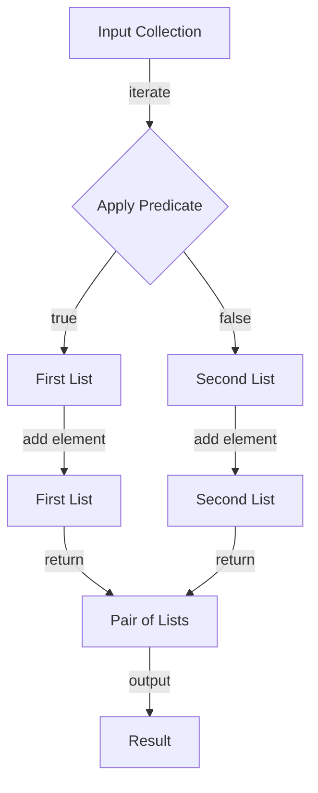

## Introduction
The **partition** function is a powerful tool in Kotlin that allows you to split a collection into two separate lists based on a given predicate. This function is a part of the Kotlin standard library and is widely used in various applications, including data processing, filtering, and grouping. In this section, we will explore the concept of partition, its importance, and its real-world relevance.
> **Note:** The partition function is a part of the Kotlin standard library, which means it is available for use in any Kotlin project without the need for additional dependencies.

## Core Concepts
The **partition** function takes a collection and a predicate as input and returns a pair of lists. The first list contains all elements that satisfy the predicate, while the second list contains all elements that do not satisfy the predicate.
> **Tip:** The partition function is often used in conjunction with other collection functions, such as filter, map, and reduce.

The core concepts related to the partition function are:
* **Predicate**: a function that takes an element as input and returns a boolean value indicating whether the element satisfies a certain condition.
* **Collection**: a group of elements that can be iterated over and manipulated.
* **Partition**: the act of splitting a collection into two separate lists based on a given predicate.

## How It Works Internally
The **partition** function works by iterating over the input collection and applying the predicate to each element. If the predicate returns true, the element is added to the first list; otherwise, it is added to the second list.
> **Warning:** The partition function has a time complexity of O(n), where n is the size of the input collection, because it needs to iterate over the entire collection.

Here is a step-by-step breakdown of how the partition function works:
1. Initialize two empty lists: one for elements that satisfy the predicate and one for elements that do not satisfy the predicate.
2. Iterate over the input collection.
3. For each element, apply the predicate and determine which list to add it to.
4. Return the pair of lists.

## Code Examples
### Example 1: Basic Usage
```kotlin
fun main() {
    val numbers = listOf(1, 2, 3, 4, 5)
    val (even, odd) = numbers.partition { it % 2 == 0 }
    println("Even numbers: $even")
    println("Odd numbers: $odd")
}
```
This example demonstrates the basic usage of the partition function. It takes a list of numbers and splits it into two lists: one for even numbers and one for odd numbers.

### Example 2: Real-World Pattern
```kotlin
data class Person(val name: String, val age: Int)

fun main() {
    val people = listOf(
        Person("John", 25),
        Person("Jane", 30),
        Person("Bob", 20),
        Person("Alice", 35)
    )
    val (adults, minors) = people.partition { it.age >= 18 }
    println("Adults: ${adults.map { it.name }}")
    println("Minors: ${minors.map { it.name }}")
}
```
This example demonstrates a real-world use case for the partition function. It takes a list of people and splits it into two lists: one for adults and one for minors.

### Example 3: Advanced Usage
```kotlin
fun main() {
    val numbers = listOf(1, 2, 3, 4, 5)
    val (small, large) = numbers.partition { it < 3 }
    println("Small numbers: $small")
    println("Large numbers: $large")
    val (even, odd) = large.partition { it % 2 == 0 }
    println("Even large numbers: $even")
    println("Odd large numbers: $odd")
}
```
This example demonstrates an advanced usage of the partition function. It takes a list of numbers and splits it into two lists: one for small numbers and one for large numbers. Then, it takes the list of large numbers and splits it further into two lists: one for even large numbers and one for odd large numbers.

## Visual Diagram

This diagram illustrates the internal workings of the partition function. It shows how the input collection is iterated over and how the predicate is applied to each element. The resulting lists are then returned as a pair.

## Comparison
| Approach | Time Complexity | Space Complexity | Pros | Cons | Best For |
| --- | --- | --- | --- | --- | --- |
| Partition | O(n) | O(n) | Efficient, easy to use | Creates two new lists | Splitting a collection into two lists |
| Filter | O(n) | O(n) | Efficient, easy to use | Creates a new list | Filtering a collection |
| GroupBy | O(n) | O(n) | Efficient, easy to use | Creates a map of groups | Grouping a collection by a key |

## Real-world Use Cases
1. **Data Processing**: The partition function can be used to split a large dataset into smaller chunks based on certain criteria, such as demographic information or purchase history.
2. **Recommendation Systems**: The partition function can be used to split a list of users into two groups: one for users who have purchased a certain product and one for users who have not.
3. **Financial Analysis**: The partition function can be used to split a list of transactions into two groups: one for transactions that are above a certain threshold and one for transactions that are below a certain threshold.

## Common Pitfalls
1. **Incorrect Predicate**: Using an incorrect predicate can lead to incorrect results. For example, using a predicate that checks for equality instead of inequality.
```kotlin
// Incorrect predicate
val (even, odd) = numbers.partition { it == 2 }
```
2. **Null Safety**: Not checking for null safety can lead to NullPointerExceptions. For example, not checking if the input collection is null before calling the partition function.
```kotlin
// Null safety issue
val numbers: List<Int>? = null
val (even, odd) = numbers!!.partition { it % 2 == 0 }
```
3. **Performance Issues**: Using the partition function on a large collection can lead to performance issues. For example, using the partition function on a collection of millions of elements can take a long time.
```kotlin
// Performance issue
val largeCollection = List(1000000) { it }
val (even, odd) = largeCollection.partition { it % 2 == 0 }
```
4. **Memory Issues**: Using the partition function on a large collection can lead to memory issues. For example, using the partition function on a collection of millions of elements can consume a lot of memory.
```kotlin
// Memory issue
val largeCollection = List(1000000) { it }
val (even, odd) = largeCollection.partition { it % 2 == 0 }
```

## Interview Tips
1. **What is the time complexity of the partition function?**: The time complexity of the partition function is O(n), where n is the size of the input collection.
2. **How does the partition function work internally?**: The partition function works by iterating over the input collection and applying the predicate to each element. If the predicate returns true, the element is added to the first list; otherwise, it is added to the second list.
3. **What are some common use cases for the partition function?**: The partition function can be used to split a collection into two lists based on certain criteria, such as demographic information or purchase history.

## Key Takeaways
* The partition function is a powerful tool in Kotlin that allows you to split a collection into two separate lists based on a given predicate.
* The partition function has a time complexity of O(n), where n is the size of the input collection.
* The partition function is often used in conjunction with other collection functions, such as filter, map, and reduce.
* The partition function can be used to split a collection into two lists based on certain criteria, such as demographic information or purchase history.
* The partition function can be used to improve the performance of certain algorithms by reducing the number of iterations required.
* The partition function can be used to simplify complex code by breaking it down into smaller, more manageable pieces.
* The partition function is a part of the Kotlin standard library, which means it is available for use in any Kotlin project without the need for additional dependencies.
* The partition function is a versatile function that can be used in a variety of contexts, including data processing, recommendation systems, and financial analysis.