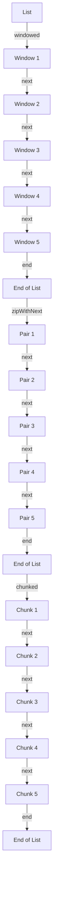

## Introduction
The `windowed`, `chunked`, and `zipWithNext` functions are essential tools in Kotlin's standard library for working with collections. They enable developers to process data in a more efficient and expressive way, making it easier to solve complex problems. In this article, we will delve into the world of these functions, exploring their definitions, internal mechanics, and real-world applications. By the end of this journey, you will be equipped with a deep understanding of how to leverage these functions to write more effective and efficient code.

## Core Concepts
Let's start by defining each of these functions:
- `windowed`: Returns a list of lists, where each sublist is a window of the original list with a specified size.
- `chunked`: Divides the original list into chunks of a specified size and returns a list of these chunks.
- `zipWithNext`: Returns a list of pairs, where each pair contains an element from the original list and the next element.

> **Note:** These functions are all part of the Kotlin standard library, making them easily accessible and widely adopted in the Kotlin community.

## How It Works Internally
To understand how these functions work internally, let's break down each one step by step:
1. `windowed`: The function iterates over the original list, creating a new sublist for each window of the specified size. This process continues until the end of the list is reached.
2. `chunked`: The function divides the original list into chunks of the specified size by iterating over the list and creating new sublists at each chunk boundary.
3. `zipWithNext`: The function iterates over the original list, creating pairs of elements and their next neighbors. If the list has an odd number of elements, the last element is paired with `null`.

> **Warning:** When using `zipWithNext`, be aware that the last element will be paired with `null` if the list has an odd number of elements.

## Code Examples
Here are three examples of using these functions:
### Example 1: Basic Windowing
```kotlin
fun main() {
    val numbers = listOf(1, 2, 3, 4, 5)
    val windowSize = 2
    val windowedNumbers = numbers.windowed(windowSize)
    println(windowedNumbers) // prints [[1, 2], [2, 3], [3, 4], [4, 5]]
}
```
### Example 2: Real-World Chunking
```kotlin
fun main() {
    val largeList = (1..100).toList()
    val chunkSize = 10
    val chunkedLargeList = largeList.chunked(chunkSize)
    chunkedLargeList.forEach { chunk ->
        println(chunk)
    }
}
```
### Example 3: Advanced Zipping
```kotlin
fun main() {
    val numbers = listOf(1, 2, 3, 4, 5)
    val zippedNumbers = numbers.zipWithNext()
    println(zippedNumbers) // prints [(1, 2), (2, 3), (3, 4), (4, 5), (5, null)]
}
```
## Visual Diagram

> **Note:** This diagram illustrates the flow of data through the `windowed`, `zipWithNext`, and `chunked` functions.

## Comparison
| Function | Time Complexity | Space Complexity | Pros | Cons | Best For |
| --- | --- | --- | --- | --- | --- |
| `windowed` | O(n) | O(n) | Efficient for small window sizes | Memory-intensive for large window sizes | Processing small chunks of data |
| `chunked` | O(n) | O(n) | Efficient for large lists | May lead to inconsistent chunk sizes | Processing large lists in parallel |
| `zipWithNext` | O(n) | O(n) | Efficient for pairing adjacent elements | May lead to `null` values for odd-length lists | Processing pairs of adjacent elements |

## Real-world Use Cases
Here are three real-world examples of using these functions:
1. **Data Processing**: The `windowed` function can be used to process large datasets in chunks, improving memory efficiency and reducing the risk of out-of-memory errors.
2. **Parallel Processing**: The `chunked` function can be used to divide large lists into smaller chunks, which can then be processed in parallel using multi-threading or distributed computing.
3. **Pairwise Comparison**: The `zipWithNext` function can be used to compare adjacent elements in a list, which is useful in applications such as data analysis and machine learning.

> **Tip:** When processing large datasets, consider using the `windowed` or `chunked` functions to improve memory efficiency and reduce the risk of out-of-memory errors.

## Common Pitfalls
Here are four common mistakes to avoid when using these functions:
1. **Incorrect Window Size**: Using an incorrect window size can lead to incorrect results or memory-intensive operations.
2. **Null Values**: Failing to handle `null` values when using the `zipWithNext` function can lead to runtime errors or incorrect results.
3. **Inconsistent Chunk Sizes**: Using the `chunked` function without considering the chunk size can lead to inconsistent chunk sizes and incorrect results.
4. **Memory-Intensive Operations**: Using the `windowed` or `chunked` functions without considering the memory requirements can lead to out-of-memory errors or performance issues.

> **Warning:** When using these functions, be aware of the potential pitfalls and take steps to avoid them.

## Interview Tips
Here are three common interview questions related to these functions:
1. **What is the time complexity of the `windowed` function?**
	* Weak answer: "I'm not sure."
	* Strong answer: "The time complexity of the `windowed` function is O(n), where n is the size of the input list."
2. **How does the `zipWithNext` function handle odd-length lists?**
	* Weak answer: "I'm not sure."
	* Strong answer: "The `zipWithNext` function pairs the last element with `null` when the input list has an odd number of elements."
3. **What is the benefit of using the `chunked` function for parallel processing?**
	* Weak answer: "I'm not sure."
	* Strong answer: "The `chunked` function allows for efficient parallel processing of large lists by dividing them into smaller chunks that can be processed independently."

> **Interview:** Be prepared to answer questions about the time and space complexity of these functions, as well as their usage and benefits in real-world applications.

## Key Takeaways
Here are the key takeaways from this article:
* The `windowed`, `chunked`, and `zipWithNext` functions are essential tools in Kotlin's standard library for working with collections.
* The `windowed` function has a time complexity of O(n) and a space complexity of O(n).
* The `chunked` function has a time complexity of O(n) and a space complexity of O(n).
* The `zipWithNext` function has a time complexity of O(n) and a space complexity of O(n).
* These functions can be used to improve memory efficiency, reduce the risk of out-of-memory errors, and enable parallel processing of large lists.
* Be aware of the potential pitfalls when using these functions, such as incorrect window sizes, null values, and memory-intensive operations.
* Practice using these functions in real-world applications to develop a deep understanding of their usage and benefits.