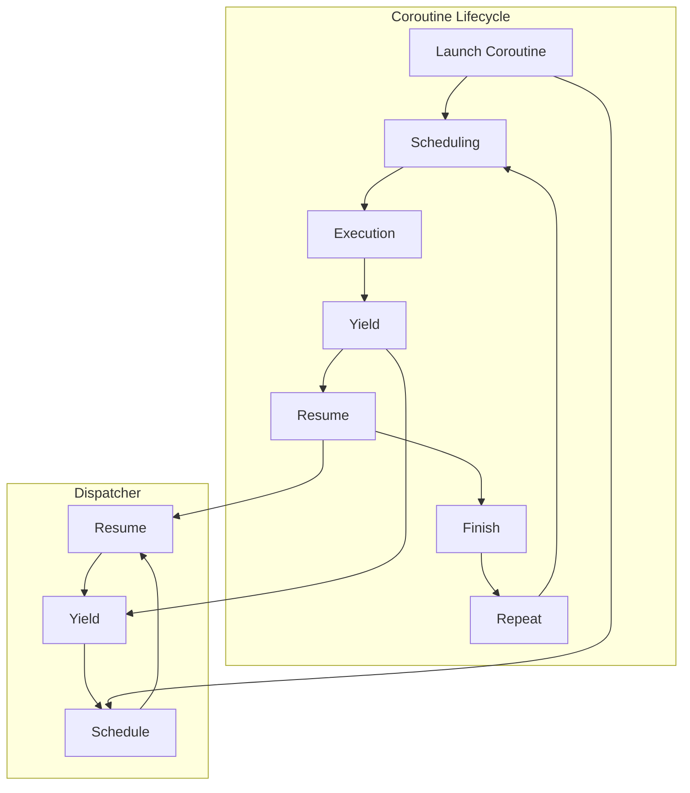

## Introduction
Coroutines are a fundamental concept in Kotlin that allows for asynchronous programming without the need for callbacks or threads. In Android development, coroutines are used extensively to handle background tasks, network requests, and database operations. The `viewModelScope` and `lifecycleScope` are two essential scopes in Android that provide a way to manage the lifecycle of coroutines. In this article, we will delve into the world of coroutines with Android, exploring the core concepts, internal mechanics, and real-world use cases.

> **Note:** Coroutines are a powerful tool for asynchronous programming, but they can be complex and difficult to master. Understanding the basics of coroutines is essential for building robust and efficient Android applications.

## Core Concepts
To understand coroutines, we need to grasp the following core concepts:
* **Coroutine**: A coroutine is a special type of function that can suspend and resume its execution.
* **Scope**: A scope defines the lifecycle of a coroutine. In Android, we have `viewModelScope` and `lifecycleScope`.
* **Context**: The context of a coroutine determines the thread on which it runs.
* **Dispatcher**: A dispatcher is responsible for scheduling coroutines on a specific thread or thread pool.

> **Tip:** When working with coroutines, it's essential to choose the right scope and context to ensure that your coroutines are executed correctly and efficiently.

## How It Works Internally
When a coroutine is launched, it is scheduled on a dispatcher, which determines the thread on which the coroutine will run. The coroutine is then executed until it reaches a suspension point, at which point it yields control back to the dispatcher. The dispatcher can then schedule other coroutines or resume the suspended coroutine.

Here's a step-by-step breakdown of how coroutines work internally:
1. **Launch**: A coroutine is launched using the `launch` function.
2. **Scheduling**: The coroutine is scheduled on a dispatcher.
3. **Execution**: The coroutine is executed until it reaches a suspension point.
4. **Yield**: The coroutine yields control back to the dispatcher.
5. **Resume**: The dispatcher resumes the suspended coroutine.

> **Warning:** Coroutines can be complex and difficult to debug. It's essential to use the correct scope and context to avoid common pitfalls.

## Code Examples
### Example 1: Basic Usage
```kotlin
import kotlinx.coroutines.*

fun main() = runBlocking {
    launch {
        delay(1000)
        println("Coroutine finished")
    }
    println("Main function finished")
}
```
This example demonstrates the basic usage of coroutines. The `launch` function is used to launch a coroutine that delays for 1 second and then prints a message.

### Example 2: Real-World Pattern
```kotlin
import kotlinx.coroutines.*
import retrofit2.Call
import retrofit2.Callback
import retrofit2.Response

class UserRepository(private val api: Api) {
    suspend fun getUser(id: Int): User {
        return api.getUser(id).await()
    }
}

class UserViewModel(private val repository: UserRepository) {
    fun getUser(id: Int) {
        viewModelScope.launch {
            val user = repository.getUser(id)
            println(user)
        }
    }
}
```
This example demonstrates a real-world pattern for using coroutines in Android. The `UserRepository` class provides a suspend function for retrieving a user, and the `UserViewModel` class uses the `viewModelScope` to launch a coroutine that retrieves the user.

### Example 3: Advanced Usage
```kotlin
import kotlinx.coroutines.*
import kotlinx.coroutines.flow.*

class AdvancedViewModel {
    fun advancedUsage() {
        lifecycleScope.launch {
            flow {
                emit(1)
                delay(1000)
                emit(2)
            }.collect { value ->
                println(value)
            }
        }
    }
}
```
This example demonstrates an advanced usage of coroutines. The `flow` function is used to create a flow that emits values, and the `collect` function is used to collect the values.

## Visual Diagram

This diagram illustrates the coroutine lifecycle and the dispatcher. The coroutine is launched and scheduled on the dispatcher, which executes the coroutine until it yields control back to the dispatcher. The dispatcher then resumes the suspended coroutine.

> **Interview:** Can you explain the difference between `viewModelScope` and `lifecycleScope`? How do you choose the right scope for your coroutines?

## Comparison
| Approach | Time Complexity | Space Complexity | Pros | Cons | Best For |
| --- | --- | --- | --- | --- | --- |
| `viewModelScope` | O(1) | O(1) | Easy to use, automatic cancellation | Limited to view model lifecycle | View models |
| `lifecycleScope` | O(1) | O(1) | Easy to use, automatic cancellation | Limited to lifecycle owner | Fragments, activities |
| `CoroutineScope` | O(1) | O(1) | Flexible, manual cancellation | Requires manual cancellation | Custom scopes |
| `GlobalScope` | O(1) | O(1) | Global scope, no cancellation | Can lead to memory leaks | Avoid using |

## Real-world Use Cases
* **Google Play Store**: The Google Play Store uses coroutines to handle background tasks, such as updating app listings and retrieving user reviews.
* **Instagram**: Instagram uses coroutines to handle network requests, such as retrieving user feeds and uploading images.
* **Uber**: Uber uses coroutines to handle background tasks, such as updating driver locations and retrieving ride requests.

> **Tip:** When using coroutines in real-world applications, it's essential to choose the right scope and context to ensure that your coroutines are executed correctly and efficiently.

## Common Pitfalls
* **Incorrect scope**: Using the wrong scope can lead to memory leaks or unexpected behavior.
* **Manual cancellation**: Failing to cancel coroutines manually can lead to memory leaks.
* **Incorrect context**: Using the wrong context can lead to unexpected behavior or crashes.
* **Uncaught exceptions**: Failing to catch exceptions can lead to crashes or unexpected behavior.

> **Warning:** Coroutines can be complex and difficult to debug. It's essential to use the correct scope and context to avoid common pitfalls.

## Interview Tips
* **What is the difference between `viewModelScope` and `lifecycleScope`?**: The main difference is that `viewModelScope` is tied to the view model lifecycle, while `lifecycleScope` is tied to the lifecycle owner.
* **How do you choose the right scope for your coroutines?**: The choice of scope depends on the specific use case and the requirements of the application.
* **What is the importance of manual cancellation?**: Manual cancellation is essential to prevent memory leaks and ensure that coroutines are properly cleaned up.

## Key Takeaways
* **Coroutines are a powerful tool for asynchronous programming**: Coroutines provide a flexible and efficient way to handle background tasks and network requests.
* **Choose the right scope and context**: The choice of scope and context is essential to ensure that coroutines are executed correctly and efficiently.
* **Use manual cancellation**: Manual cancellation is essential to prevent memory leaks and ensure that coroutines are properly cleaned up.
* **Understand the coroutine lifecycle**: Understanding the coroutine lifecycle is essential to building robust and efficient applications.
* **Use the correct dispatcher**: The choice of dispatcher is essential to ensure that coroutines are executed on the correct thread or thread pool.
* **Handle exceptions correctly**: Handling exceptions correctly is essential to prevent crashes and unexpected behavior.
* **Use flows for data streams**: Flows provide a flexible and efficient way to handle data streams and asynchronous programming.
* **Test your coroutines thoroughly**: Testing your coroutines thoroughly is essential to ensure that they are working correctly and efficiently.