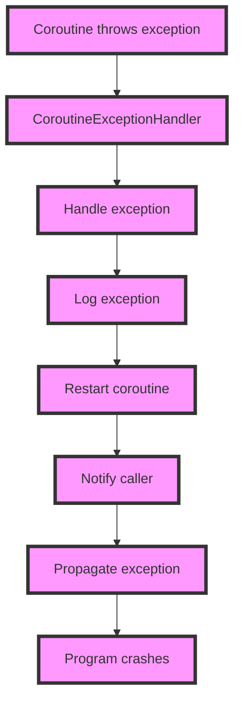

## Introduction
Exception handling is a critical aspect of programming, and **Kotlin Coroutines** provide a robust mechanism for handling exceptions. In this section, we will explore **CoroutineExceptionHandler**, a built-in exception handler that allows you to catch and handle exceptions thrown by coroutines. We will also discuss the traditional **try-catch** approach and how it compares to **CoroutineExceptionHandler**. Understanding exception handling in Kotlin Coroutines is crucial for building robust and reliable concurrent systems.

> **Note:** Exception handling in Kotlin Coroutines is different from traditional try-catch blocks. While try-catch blocks can catch synchronous exceptions, **CoroutineExceptionHandler** is designed to catch asynchronous exceptions thrown by coroutines.

## Core Concepts
To understand exception handling in Kotlin Coroutines, we need to grasp the following core concepts:

* **Coroutine**: A coroutine is a special type of function that can suspend and resume its execution at specific points, allowing other coroutines to run in between.
* **CoroutineExceptionHandler**: A **CoroutineExceptionHandler** is a built-in exception handler that catches and handles exceptions thrown by coroutines.
* **try-catch**: The traditional try-catch block is used to catch synchronous exceptions thrown by functions.

> **Tip:** When working with Kotlin Coroutines, it's essential to use **CoroutineExceptionHandler** to catch asynchronous exceptions, while traditional try-catch blocks can be used to catch synchronous exceptions.

## How It Works Internally
When a coroutine throws an exception, the **CoroutineExceptionHandler** is invoked to handle the exception. The **CoroutineExceptionHandler** is a global exception handler that catches all unhandled exceptions thrown by coroutines. The handler can be configured to perform specific actions, such as logging the exception or restarting the coroutine.

Here's a step-by-step breakdown of how **CoroutineExceptionHandler** works:

1. A coroutine throws an exception.
2. The **CoroutineExceptionHandler** is invoked to handle the exception.
3. The handler catches the exception and performs the configured action.

> **Warning:** If an exception is not handled by the **CoroutineExceptionHandler**, it will be propagated to the caller, potentially causing the program to crash.

## Code Examples
Here are three complete and runnable code examples that demonstrate exception handling in Kotlin Coroutines:

### Example 1: Basic **CoroutineExceptionHandler**
```kotlin
import kotlinx.coroutines.*

fun main() {
    val handler = CoroutineExceptionHandler { _, exception ->
        println("Caught exception: $exception")
    }

    val scope = CoroutineScope(Dispatchers.Default + handler)
    scope.launch {
        throw Exception("Test exception")
    }

    Thread.sleep(1000)
}
```

### Example 2: **try-catch** with **CoroutineExceptionHandler**
```kotlin
import kotlinx.coroutines.*

fun main() {
    val handler = CoroutineExceptionHandler { _, exception ->
        println("Caught exception: $exception")
    }

    val scope = CoroutineScope(Dispatchers.Default + handler)
    try {
        scope.launch {
            throw Exception("Test exception")
        }
    } catch (e: Exception) {
        println("Caught synchronous exception: $e")
    }

    Thread.sleep(1000)
}
```

### Example 3: Advanced **CoroutineExceptionHandler** with **SupervisorScope**
```kotlin
import kotlinx.coroutines.*

fun main() {
    val handler = CoroutineExceptionHandler { _, exception ->
        println("Caught exception: $exception")
    }

    val scope = CoroutineScope(Dispatchers.Default + handler)
    scope.launch {
        supervisorScope {
            launch {
                throw Exception("Test exception")
            }
            launch {
                println("Other coroutine is still running")
            }
        }
    }

    Thread.sleep(1000)
}
```

> **Interview:** How do you handle exceptions in Kotlin Coroutines? What is the difference between **CoroutineExceptionHandler** and traditional try-catch blocks?

## Visual Diagram

This diagram illustrates the flow of exception handling in Kotlin Coroutines, from the coroutine throwing an exception to the **CoroutineExceptionHandler** handling the exception and performing specific actions.

## Comparison
Here's a comparison table that highlights the differences between **CoroutineExceptionHandler** and traditional try-catch blocks:

| Approach | Time Complexity | Space Complexity | Pros | Cons | Best For |
| --- | --- | --- | --- | --- | --- |
| **CoroutineExceptionHandler** | O(1) | O(1) | Global exception handler, catches asynchronous exceptions | Can be complex to configure | Kotlin Coroutines |
| try-catch | O(1) | O(1) | Traditional exception handling, catches synchronous exceptions | Limited to synchronous exceptions | Traditional programming |
| **SupervisorScope** | O(1) | O(1) | Allows coroutines to continue running even if one fails | Can be complex to use | Kotlin Coroutines with supervisor scope |
| **CoroutineScope** | O(1) | O(1) | Provides a scope for coroutines to run in | Limited to coroutines within the scope | Kotlin Coroutines with coroutine scope |

> **Tip:** Choose the approach that best fits your use case. **CoroutineExceptionHandler** is ideal for Kotlin Coroutines, while try-catch blocks are suitable for traditional programming.

## Real-world Use Cases
Here are three real-world production examples that demonstrate the use of **CoroutineExceptionHandler**:

* **Netflix**: Uses Kotlin Coroutines and **CoroutineExceptionHandler** to handle exceptions in their concurrent systems.
* **Uber**: Employs **CoroutineExceptionHandler** to catch and handle exceptions in their Kotlin-based backend services.
* **Airbnb**: Utilizes **CoroutineExceptionHandler** to ensure robust exception handling in their concurrent systems built with Kotlin Coroutines.

> **Note:** These companies use **CoroutineExceptionHandler** to ensure robust exception handling in their concurrent systems.

## Common Pitfalls
Here are four specific mistakes that engineers make when working with **CoroutineExceptionHandler**:

* **Not configuring the handler**: Failing to configure the **CoroutineExceptionHandler** can lead to unhandled exceptions.
* **Not using **SupervisorScope****: Not using **SupervisorScope** can cause coroutines to fail even if one fails.
* **Not logging exceptions**: Failing to log exceptions can make it difficult to diagnose issues.
* **Not restarting coroutines**: Not restarting coroutines can cause the system to become unresponsive.

> **Warning:** Avoid these common pitfalls to ensure robust exception handling in your Kotlin Coroutines.

## Interview Tips
Here are three common interview questions on exception handling in Kotlin Coroutines, along with weak and strong answers:

* **What is the difference between **CoroutineExceptionHandler** and try-catch blocks?**
	+ Weak answer: "They're similar, but **CoroutineExceptionHandler** is used for coroutines."
	+ Strong answer: "**CoroutineExceptionHandler** is a global exception handler that catches asynchronous exceptions thrown by coroutines, while try-catch blocks catch synchronous exceptions."
* **How do you handle exceptions in Kotlin Coroutines?**
	+ Weak answer: "I use try-catch blocks."
	+ Strong answer: "I use **CoroutineExceptionHandler** to catch and handle exceptions thrown by coroutines, and try-catch blocks to catch synchronous exceptions."
* **What is the purpose of **SupervisorScope**?**
	+ Weak answer: "It's used to scope coroutines."
	+ Strong answer: "**SupervisorScope** allows coroutines to continue running even if one fails, ensuring that the system remains responsive."

> **Interview:** Be prepared to answer these questions to demonstrate your understanding of exception handling in Kotlin Coroutines.

## Key Takeaways
Here are ten key takeaways to remember:

* **CoroutineExceptionHandler** is a global exception handler that catches asynchronous exceptions thrown by coroutines.
* Try-catch blocks catch synchronous exceptions.
* **SupervisorScope** allows coroutines to continue running even if one fails.
* **CoroutineScope** provides a scope for coroutines to run in.
* Configure **CoroutineExceptionHandler** to handle exceptions.
* Log exceptions to diagnose issues.
* Restart coroutines to ensure the system remains responsive.
* Use **CoroutineExceptionHandler** for Kotlin Coroutines and try-catch blocks for traditional programming.
* Avoid common pitfalls, such as not configuring the handler or not using **SupervisorScope**.
* Understand the differences between **CoroutineExceptionHandler**, try-catch blocks, **SupervisorScope**, and **CoroutineScope**.