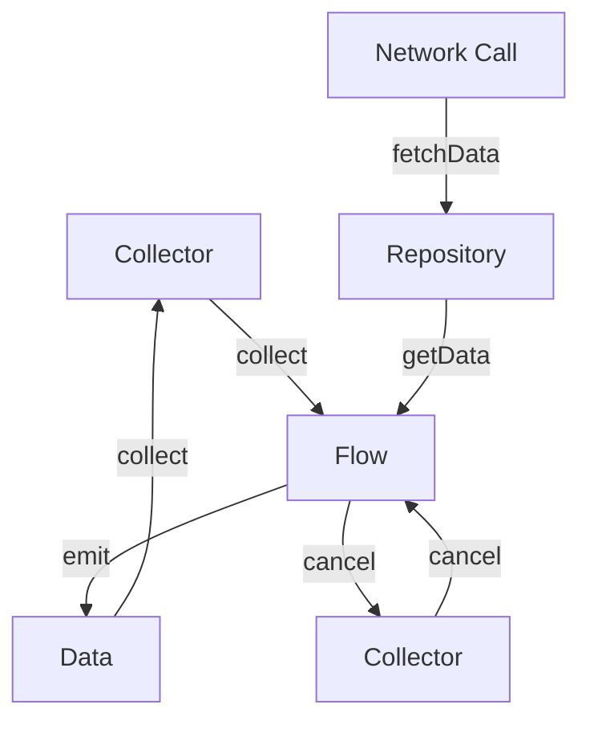

## Introduction
The **Flow** is a Kotlin library that allows developers to work with asynchronous data streams in a more reactive way. It's a part of the Kotlin Coroutines library and provides a powerful tool for handling asynchronous data streams. In this study guide, we'll explore the **Cold Asynchronous Stream** aspect of the Flow library, which is essential for building scalable and efficient data-driven applications. **Flow** is crucial for any Android or Kotlin developer, as it simplifies the process of handling asynchronous data streams and makes it easier to write efficient and readable code.

> **Note:** The **Flow** library is designed to work seamlessly with Kotlin Coroutines, which provides a more efficient and concise way of writing asynchronous code. Understanding the basics of Coroutines is essential for working with **Flow**.

## Core Concepts
To understand the **Cold Asynchronous Stream**, we need to grasp the following core concepts:
* **Flow**: A stream of data that can be asynchronous, meaning it's not available immediately.
* **Cold**: A cold flow is one that doesn't start emitting data until someone starts collecting it.
* **Asynchronous**: Data is emitted and collected asynchronously, allowing for non-blocking operations.
* **Collector**: An entity that collects the data emitted by the flow.
* **Context**: The scope in which the flow operates, which can be a coroutine scope or a regular scope.

> **Tip:** Think of a **Flow** as a stream of water. A **Cold** flow is like a tap that's turned off. It doesn't start flowing until someone turns it on. An **Asynchronous** flow is like a stream that's flowing, but you don't have to wait for the entire stream to arrive before you can start using it.

## How It Works Internally
When a **Cold Asynchronous Stream** is created, it's not yet emitting data. The flow only starts emitting data when a collector starts collecting it. Here's a step-by-step breakdown of what happens when a collector starts collecting data from a **Cold Asynchronous Stream**:
1. The collector calls the `collect` function on the flow.
2. The flow starts emitting data, which is collected by the collector.
3. The collector can choose to suspend or cancel the collection at any time.
4. If the collector cancels the collection, the flow stops emitting data.

> **Warning:** If you're not careful, a **Cold Asynchronous Stream** can lead to a memory leak if the collector is not properly cancelled. Always make sure to cancel the collector when you're done collecting data.

## Code Examples
Here are three examples of working with **Cold Asynchronous Stream**:
### Example 1: Basic Usage
```kotlin
import kotlinx.coroutines.*
import kotlinx.coroutines.flow.*

fun main() = runBlocking {
    val flow = flow {
        for (i in 1..5) {
            println("Emitting $i")
            emit(i)
            delay(100)
        }
    }

    val collector = flow.collect { value ->
        println("Collected $value")
    }
}
```
This example creates a simple **Cold Asynchronous Stream** that emits numbers from 1 to 5 with a delay of 100ms between each emission.

### Example 2: Real-World Pattern
```kotlin
import kotlinx.coroutines.*
import kotlinx.coroutines.flow.*

class DataRepository {
    fun getData(): Flow<Data> = flow {
        // Simulate a network call
        delay(1000)
        emit(Data("John", 30))
        delay(500)
        emit(Data("Jane", 25))
    }
}

data class Data(val name: String, val age: Int)

fun main() = runBlocking {
    val repository = DataRepository()
    val collector = repository.getData().collect { data ->
        println("Collected $data")
    }
}
```
This example demonstrates a real-world pattern where a **Cold Asynchronous Stream** is used to fetch data from a repository.

### Example 3: Advanced Usage
```kotlin
import kotlinx.coroutines.*
import kotlinx.coroutines.flow.*

fun main() = runBlocking {
    val flow = flow {
        for (i in 1..5) {
            println("Emitting $i")
            emit(i)
            delay(100)
        }
    }

    val collector = flow
        .filter { it % 2 == 0 }
        .map { it * 2 }
        .collect { value ->
            println("Collected $value")
        }
}
```
This example shows how to use operators like `filter` and `map` to transform the data emitted by the **Cold Asynchronous Stream**.

## Visual Diagram

This diagram illustrates the relationship between the collector, flow, data, and repository. It shows how the collector collects data from the flow, and how the flow emits data. It also shows how the repository fetches data from the network.

## Comparison
| Approach | Time Complexity | Space Complexity | Pros | Cons | Best For |
| --- | --- | --- | --- | --- | --- |
| **Cold Asynchronous Stream** | O(n) | O(n) | Efficient, non-blocking | Can lead to memory leaks if not cancelled | Real-time data processing |
| **Hot Asynchronous Stream** | O(1) | O(1) | Simple to use, no cancellation needed | Can be blocking, less efficient | Background tasks |
| **RxJava** | O(n) | O(n) | Mature library, robust features | Steep learning curve, verbose code | Complex, event-driven systems |
| **Kotlin Coroutines** | O(1) | O(1) | Lightweight, concise code | Limited features compared to RxJava | Simple, asynchronous tasks |

> **Interview:** When asked about the difference between **Cold Asynchronous Stream** and **Hot Asynchronous Stream**, explain that **Cold Asynchronous Stream** only starts emitting data when a collector starts collecting it, while **Hot Asynchronous Stream** starts emitting data as soon as it's created.

## Real-world Use Cases
1. **Android**: Use **Cold Asynchronous Stream** to fetch data from a repository and display it in a RecyclerView.
2. **Backend**: Use **Cold Asynchronous Stream** to handle real-time updates from a database and send them to clients.
3. **Finance**: Use **Cold Asynchronous Stream** to process real-time stock prices and update the UI accordingly.

## Common Pitfalls
1. **Not cancelling the collector**: Failing to cancel the collector can lead to memory leaks.
2. **Using the wrong operator**: Using the wrong operator can lead to incorrect results or performance issues.
3. **Not handling errors**: Failing to handle errors can lead to crashes or unexpected behavior.
4. **Using **Cold Asynchronous Stream** for simple tasks**: Using **Cold Asynchronous Stream** for simple tasks can lead to unnecessary complexity.

> **Warning:** Always make sure to cancel the collector when you're done collecting data to avoid memory leaks.

## Interview Tips
1. **What is the difference between **Cold Asynchronous Stream** and **Hot Asynchronous Stream****?**: Explain that **Cold Asynchronous Stream** only starts emitting data when a collector starts collecting it, while **Hot Asynchronous Stream** starts emitting data as soon as it's created.
2. **How do you cancel a collector?**: Explain that you can use the `cancel` function to cancel a collector.
3. **What is the time complexity of **Cold Asynchronous Stream****?**: Explain that the time complexity of **Cold Asynchronous Stream** is O(n), where n is the number of elements emitted by the flow.

## Key Takeaways
* **Cold Asynchronous Stream** is a stream of data that only starts emitting data when a collector starts collecting it.
* **Cold Asynchronous Stream** is efficient and non-blocking, making it suitable for real-time data processing.
* **Cold Asynchronous Stream** can lead to memory leaks if not cancelled properly.
* **Cold Asynchronous Stream** has a time complexity of O(n), where n is the number of elements emitted by the flow.
* **Cold Asynchronous Stream** is suitable for real-time data processing, while **Hot Asynchronous Stream** is suitable for background tasks.
* **RxJava** is a mature library with robust features, but has a steep learning curve and verbose code.
* **Kotlin Coroutines** is a lightweight library with concise code, but has limited features compared to RxJava.