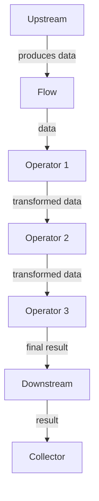

## Introduction
Flow operators are a set of functions in Kotlin that allow you to manipulate and transform data streams in a reactive way. They are an essential part of the Kotlin Coroutines API and are used to handle asynchronous data processing. Flow operators are designed to be composable, making it easy to build complex data processing pipelines. In this section, we will explore the different types of flow operators, including `map`, `filter`, `transform`, `collect`, `take`, `debounce`, and `distinctUntilChanged`. We will also discuss their real-world relevance and why every engineer needs to know about them.

> **Note:** Flow operators are a crucial part of building scalable and efficient data processing systems. They allow you to handle large amounts of data in a reactive way, making it easier to build systems that can handle high volumes of data.

## Core Concepts
Flow operators are built around the concept of a **flow**, which is a stream of data that can be processed asynchronously. There are several key concepts that are essential to understanding flow operators:

* **Flow**: A stream of data that can be processed asynchronously.
* **Collector**: A function that collects the results of a flow and returns a single value.
* **Transformer**: A function that transforms the data in a flow.
* **Operator**: A function that takes a flow as input and returns a new flow.

Some of the key terminology used in flow operators includes:

* **Upstream**: The source of the data flow.
* **Downstream**: The destination of the data flow.
* **Backpressure**: The ability of the downstream to control the rate at which data is sent by the upstream.

> **Warning:** Not handling backpressure correctly can lead to performance issues and even crashes. It is essential to understand how to handle backpressure when working with flow operators.

## How It Works Internally
Flow operators work by creating a pipeline of functions that process the data in a flow. Each operator takes the output of the previous operator as its input and produces a new output that is passed to the next operator. The pipeline is created by composing multiple operators together.

Here is a high-level overview of how flow operators work internally:

1. The upstream produces a stream of data.
2. The downstream requests data from the upstream.
3. The upstream sends the data to the downstream.
4. The downstream processes the data and sends the result to the next operator in the pipeline.
5. The pipeline continues until the final operator produces the final result.

> **Tip:** Understanding how flow operators work internally is essential to building efficient and scalable data processing systems.

## Code Examples
Here are three complete and runnable examples of using flow operators in Kotlin:

### Example 1: Basic Usage
```kotlin
import kotlinx.coroutines.*
import kotlinx.coroutines.flow.*

fun main() = runBlocking {
    val flow = flow {
        emit(1)
        emit(2)
        emit(3)
    }

    flow.collect { value ->
        println(value)
    }
}
```
This example demonstrates the basic usage of flow operators. It creates a flow that emits three values and then collects the values using the `collect` operator.

### Example 2: Real-World Pattern
```kotlin
import kotlinx.coroutines.*
import kotlinx.coroutines.flow.*

data class User(val id: Int, val name: String)

fun main() = runBlocking {
    val users = flow {
        emit(User(1, "John"))
        emit(User(2, "Jane"))
        emit(User(3, "Bob"))
    }

    users.filter { it.id % 2 == 0 }
        .map { it.name }
        .collect { value ->
            println(value)
        }
}
```
This example demonstrates a real-world pattern of using flow operators to process data. It creates a flow of users, filters out the users with odd IDs, maps the remaining users to their names, and then collects the names.

### Example 3: Advanced Usage
```kotlin
import kotlinx.coroutines.*
import kotlinx.coroutines.flow.*

data class User(val id: Int, val name: String)

fun main() = runBlocking {
    val users = flow {
        emit(User(1, "John"))
        emit(User(2, "Jane"))
        emit(User(3, "Bob"))
    }

    users.debounce(100)
        .distinctUntilChanged { it.name }
        .take(2)
        .collect { value ->
            println(value)
        }
}
```
This example demonstrates advanced usage of flow operators. It creates a flow of users, debounces the flow to only emit values that are at least 100ms apart, removes duplicate values based on the user's name, takes the first two values, and then collects the values.

## Visual Diagram

This diagram illustrates the pipeline of flow operators. The upstream produces data, which is then processed by multiple operators. The final result is collected by the downstream.

> **Note:** The diagram shows a simplified pipeline with only three operators. In a real-world scenario, the pipeline can be much more complex with multiple operators and collectors.

## Comparison
| Operator | Time Complexity | Space Complexity | Pros | Cons | Best For |
| --- | --- | --- | --- | --- | --- |
| map | O(n) | O(n) | Easy to use, composible | Can be slow for large datasets | Simple data transformations |
| filter | O(n) | O(n) | Easy to use, composible | Can be slow for large datasets | Removing unwanted data |
| transform | O(n) | O(n) | Flexible, composible | Can be complex to use | Complex data transformations |
| collect | O(n) | O(n) | Easy to use, composible | Can be slow for large datasets | Collecting final results |
| take | O(n) | O(n) | Easy to use, composible | Can be slow for large datasets | Limiting the number of results |
| debounce | O(n) | O(n) | Easy to use, composible | Can be slow for large datasets | Debouncing data streams |
| distinctUntilChanged | O(n) | O(n) | Easy to use, composible | Can be slow for large datasets | Removing duplicate values |

> **Warning:** The time and space complexity of flow operators can vary depending on the specific use case. It is essential to understand the complexity of each operator to optimize performance.

## Real-world Use Cases
Here are three real-world use cases of flow operators:

1. **Data Processing Pipelines**: Flow operators can be used to build complex data processing pipelines. For example, a company like Netflix can use flow operators to process user data, such as watch history and ratings, to recommend movies and TV shows.
2. **Real-time Analytics**: Flow operators can be used to build real-time analytics systems. For example, a company like Google can use flow operators to process real-time search queries and provide instant results.
3. **IoT Sensor Data**: Flow operators can be used to process IoT sensor data. For example, a company like Tesla can use flow operators to process sensor data from its cars to detect anomalies and predict maintenance needs.

## Common Pitfalls
Here are four common pitfalls to avoid when using flow operators:

1. **Not handling backpressure**: Not handling backpressure correctly can lead to performance issues and even crashes.
2. **Using the wrong operator**: Using the wrong operator can lead to incorrect results or performance issues.
3. **Not optimizing performance**: Not optimizing performance can lead to slow and inefficient data processing pipelines.
4. **Not handling errors**: Not handling errors correctly can lead to crashes and data loss.

> **Tip:** Understanding common pitfalls and how to avoid them is essential to building efficient and scalable data processing systems.

## Interview Tips
Here are three common interview questions related to flow operators:

1. **What is the difference between map and transform?**: A strong answer should explain the difference between map and transform, including their time and space complexity.
2. **How do you handle backpressure in flow operators?**: A strong answer should explain how to handle backpressure correctly, including using the `buffer` operator and handling errors.
3. **What is the best way to optimize performance in flow operators?**: A strong answer should explain how to optimize performance, including using the `parallel` operator and minimizing the use of synchronous operators.

## Key Takeaways
Here are ten key takeaways to remember:

* Flow operators are a set of functions that allow you to manipulate and transform data streams in a reactive way.
* Flow operators are composable, making it easy to build complex data processing pipelines.
* Understanding how flow operators work internally is essential to building efficient and scalable data processing systems.
* Flow operators have a time and space complexity that can vary depending on the specific use case.
* Handling backpressure correctly is essential to building efficient and scalable data processing systems.
* Using the wrong operator can lead to incorrect results or performance issues.
* Not optimizing performance can lead to slow and inefficient data processing pipelines.
* Not handling errors correctly can lead to crashes and data loss.
* Flow operators can be used to build complex data processing pipelines, real-time analytics systems, and IoT sensor data processing systems.
* Understanding common pitfalls and how to avoid them is essential to building efficient and scalable data processing systems.