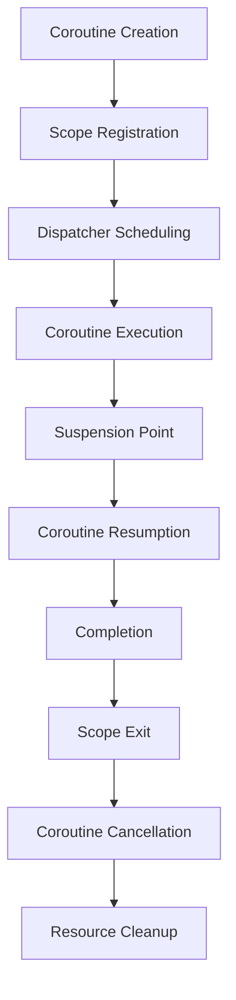

## Introduction
**Structured Concurrency with Coroutines** is a paradigm-shifting approach to writing concurrent code that's both efficient and easy to reason about. In traditional concurrency models, threads are the primary unit of concurrency, which can lead to issues like thread leaks, unhandled exceptions, and complex synchronization logic. Coroutines, on the other hand, offer a more structured and composable way to write concurrent code, making it easier to manage complexity and write correct programs. In Kotlin, coroutines are tied to scope, which ensures that the coroutine is automatically cancelled when the scope is exited, preventing resource leaks and simplifying error handling. This concept is crucial in modern software development, as it enables developers to write high-performance, concurrent code that's both maintainable and efficient.

## Core Concepts
To understand structured concurrency with coroutines, it's essential to grasp the following core concepts:
- **Coroutine**: a lightweight thread that can suspend and resume its execution at specific points, allowing other coroutines to run in the meantime.
- **Coroutine Scope**: the context in which a coroutine runs, defining its lifetime and cancellation behavior.
- **Context**: a set of elements that define the execution environment of a coroutine, including the dispatcher, exception handler, and other configuration options.
- **Dispatcher**: the entity responsible for scheduling coroutines on threads or other execution units.

> **Note:** In Kotlin, the `kotlinx.coroutines` library provides a comprehensive set of APIs for working with coroutines, including the `CoroutineScope` interface, which defines the scope of a coroutine.

## How It Works Internally
When a coroutine is launched, it's tied to a specific scope, which determines its lifetime and cancellation behavior. Here's a step-by-step breakdown of the internal mechanics:
1. **Coroutine Creation**: a coroutine is created using the `launch` or `async` function, which returns a `Job` object representing the coroutine.
2. **Scope Registration**: the coroutine is registered with the scope, which adds it to the scope's job queue.
3. **Dispatcher Scheduling**: the dispatcher schedules the coroutine on a thread or other execution unit, taking into account the coroutine's context and priority.
4. **Coroutine Execution**: the coroutine executes until it reaches a suspension point or completes.
5. **Cancellation**: when the scope is exited or cancelled, the coroutine is automatically cancelled, preventing resource leaks and ensuring prompt cleanup.

> **Warning:** Failing to properly cancel coroutines can lead to resource leaks and performance issues. Always ensure that coroutines are tied to a scope and properly cancelled when the scope is exited.

## Code Examples
### Example 1: Basic Coroutine Usage
```kotlin
import kotlinx.coroutines.*

fun main() = runBlocking {
    val job = launch {
        println("Coroutine started")
        delay(1000)
        println("Coroutine finished")
    }
    job.join()
}
```
This example demonstrates the basic usage of coroutines, including launching a coroutine and waiting for its completion using `join`.

### Example 2: Real-World Pattern - Concurrent Data Fetching
```kotlin
import kotlinx.coroutines.*

suspend fun fetchData(url: String): String {
    delay(500)
    return "Data from $url"
}

fun main() = runBlocking {
    val urls = listOf("https://example.com/data1", "https://example.com/data2")
    val results = urls.map { async { fetchData(it) } }
    val data = results.awaitAll()
    println(data)
}
```
This example illustrates a real-world pattern of concurrent data fetching using coroutines, where multiple coroutines are launched to fetch data from different URLs, and the results are collected using `awaitAll`.

### Example 3: Advanced Usage - Error Handling
```kotlin
import kotlinx.coroutines.*

fun main() = runBlocking {
    val job = launch {
        try {
            delay(1000)
            throw Exception("Coroutine failed")
        } catch (e: Exception) {
            println("Error: $e")
        }
    }
    job.join()
}
```
This example demonstrates advanced error handling in coroutines, where a coroutine catches and handles an exception, ensuring that the error is properly propagated and handled.

## Visual Diagram

This diagram illustrates the lifecycle of a coroutine, from creation to cancellation, highlighting the key steps and transitions involved.

## Comparison
| Approach | Time Complexity | Space Complexity | Pros | Cons | Best For |
| --- | --- | --- | --- | --- | --- |
| Traditional Threads | O(n) | O(n) | Easy to implement | Resource-intensive, prone to thread leaks | Simple, low-concurrency applications |
| Coroutines | O(1) | O(1) | Lightweight, efficient | Steeper learning curve | High-concurrency, performance-critical applications |
| Actors | O(n) | O(n) | Easy to reason about | Limited flexibility | Distributed systems, concurrent data processing |
| Reactive Programming | O(1) | O(1) | Compositional, efficient | Complex, hard to debug | Real-time data processing, event-driven systems |

> **Tip:** Choose the approach that best fits your performance and complexity requirements. Coroutines offer a great balance between efficiency and ease of use, making them an excellent choice for many modern applications.

## Real-world Use Cases
1. **Android App Development**: coroutines are widely used in Android app development to handle concurrent tasks, such as network requests, database queries, and UI updates.
2. **Web Development**: coroutines are used in web development to handle concurrent requests, improve responsiveness, and reduce latency.
3. **Distributed Systems**: coroutines are used in distributed systems to handle concurrent tasks, such as data processing, message passing, and fault tolerance.

> **Interview:** Be prepared to discuss the trade-offs between different concurrency models, including traditional threads, coroutines, and actors. Explain how coroutines can be used to improve performance and simplicity in concurrent programming.

## Common Pitfalls
1. **Failing to Cancel Coroutines**: forgetting to cancel coroutines can lead to resource leaks and performance issues.
2. **Ignoring Exception Handling**: neglecting to handle exceptions in coroutines can cause unexpected behavior and crashes.
3. **Overusing Coroutines**: using coroutines excessively can lead to performance issues and complexity.
4. **Misusing Coroutine Scopes**: misusing coroutine scopes can cause unexpected behavior and errors.

> **Warning:** Always ensure that coroutines are properly cancelled and exception handling is implemented to prevent common pitfalls.

## Interview Tips
1. **Define Structured Concurrency**: explain the concept of structured concurrency and its benefits.
2. **Discuss Coroutine Scopes**: describe the importance of coroutine scopes and how they relate to cancellation behavior.
3. **Explain Error Handling**: discuss how to handle exceptions in coroutines and the importance of proper error handling.

> **Tip:** Show a deep understanding of coroutine internals, including dispatcher scheduling, context, and job queues. Be prepared to write example code and explain the trade-offs between different concurrency models.

## Key Takeaways
* **Coroutines are lightweight**: coroutines are more efficient than traditional threads.
* **Coroutine scopes are essential**: scopes determine the lifetime and cancellation behavior of coroutines.
* **Error handling is crucial**: proper exception handling is necessary to prevent crashes and unexpected behavior.
* **Dispatcher scheduling is important**: understanding how dispatchers schedule coroutines is essential for optimizing performance.
* **Context is key**: context defines the execution environment of a coroutine, including the dispatcher and exception handler.
* **Job queues are fundamental**: job queues manage the execution of coroutines and ensure proper cancellation behavior.
* **Coroutine cancellation is automatic**: coroutines are automatically cancelled when the scope is exited, preventing resource leaks.