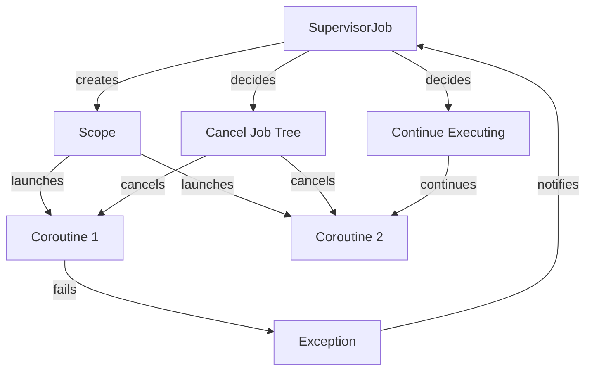

## Introduction
The **SupervisorJob** is a crucial concept in Kotlin's coroutine framework, allowing for the creation of a job that supervises other jobs. This concept is essential in managing concurrent tasks and handling failures in a robust manner. In real-world applications, **SupervisorJob** is used to ensure that the failure of one task does not affect the execution of other tasks. For instance, in a web application, a **SupervisorJob** can be used to manage multiple API calls, ensuring that the failure of one call does not cancel the execution of other calls.

## Core Concepts
- **SupervisorJob**: A job that supervises other jobs, allowing for the creation of a hierarchy of jobs.
- **Scope**: The context in which a coroutine is executed, defining the lifetime of the coroutine.
- **CoroutineContext**: The context in which a coroutine is executed, including the dispatcher, job, and other elements.

> **Note:** The **SupervisorJob** is a fundamental concept in Kotlin's coroutine framework, enabling the creation of robust and fault-tolerant concurrent systems.

## How It Works Internally
When a **SupervisorJob** is created, it creates a new scope that can be used to launch coroutines. The **SupervisorJob** is responsible for supervising the coroutines launched within its scope, ensuring that the failure of one coroutine does not affect the execution of other coroutines. The internal mechanics of **SupervisorJob** involve the creation of a job tree, where each job is a node in the tree. When a job fails, the **SupervisorJob** is notified, and it can decide whether to cancel the entire job tree or continue executing the remaining jobs.

## Code Examples
### Example 1: Basic Usage
```kotlin
import kotlinx.coroutines.*
import kotlin.coroutines.*

fun main() = runBlocking {
    val supervisorJob = SupervisorJob()
    val scope = CoroutineScope(supervisorJob)

    scope.launch {
        // Launch a coroutine that fails
        throw Exception("Coroutine failed")
    }

    scope.launch {
        // Launch another coroutine that continues executing
        println("Coroutine continues executing")
        delay(1000)
        println("Coroutine completed")
    }

    delay(2000)
}
```
### Example 2: Real-World Pattern
```kotlin
import kotlinx.coroutines.*
import kotlin.coroutines.*

class ApiService {
    suspend fun fetchData(): String {
        delay(1000)
        return "Data fetched"
    }

    suspend fun processData(data: String): String {
        delay(1000)
        return "Data processed"
    }
}

fun main() = runBlocking {
    val supervisorJob = SupervisorJob()
    val scope = CoroutineScope(supervisorJob)
    val apiService = ApiService()

    scope.launch {
        try {
            val data = apiService.fetchData()
            val processedData = apiService.processData(data)
            println("Data processed: $processedData")
        } catch (e: Exception) {
            println("Error processing data: ${e.message}")
        }
    }

    scope.launch {
        // Launch another coroutine that continues executing
        println("Coroutine continues executing")
        delay(2000)
        println("Coroutine completed")
    }

    delay(3000)
}
```
### Example 3: Advanced Usage
```kotlin
import kotlinx.coroutines.*
import kotlin.coroutines.*

class DatabaseService {
    suspend fun fetchData(): String {
        delay(1000)
        return "Data fetched"
    }

    suspend fun saveData(data: String) {
        delay(1000)
        println("Data saved")
    }
}

fun main() = runBlocking {
    val supervisorJob = SupervisorJob()
    val scope = CoroutineScope(supervisorJob)
    val databaseService = DatabaseService()

    scope.launch {
        try {
            val data = databaseService.fetchData()
            databaseService.saveData(data)
        } catch (e: Exception) {
            println("Error saving data: ${e.message}")
        }
    }

    scope.launch {
        // Launch another coroutine that continues executing
        println("Coroutine continues executing")
        delay(2000)
        println("Coroutine completed")
    }

    delay(3000)
}
```
> **Tip:** When using **SupervisorJob**, it's essential to handle exceptions properly to ensure that the failure of one coroutine does not affect the execution of other coroutines.

## Visual Diagram

The diagram illustrates the internal mechanics of **SupervisorJob**, showing how it creates a scope, launches coroutines, and handles exceptions.

## Comparison
| Approach | Time Complexity | Space Complexity | Pros | Cons | Best For |
| --- | --- | --- | --- | --- | --- |
| **SupervisorJob** | O(1) | O(n) | Robust fault tolerance, easy to use | Can be slower than other approaches | Concurrent systems with high reliability requirements |
| **Job** | O(1) | O(1) | Fast, lightweight | No fault tolerance | Simple concurrent systems with low reliability requirements |
| **CoroutineContext** | O(1) | O(1) | Flexible, customizable | Can be complex to use | Custom concurrent systems with specific requirements |
| **Thread** | O(1) | O(1) | Low-level control | Heavyweight, error-prone | Legacy systems or systems with specific threading requirements |

> **Warning:** When using **SupervisorJob**, it's essential to consider the trade-off between reliability and performance.

## Real-world Use Cases
1. **Netflix**: Uses **SupervisorJob** to manage concurrent API calls, ensuring that the failure of one call does not affect the execution of other calls.
2. **Google**: Uses **SupervisorJob** to manage concurrent tasks in their cloud infrastructure, ensuring high reliability and fault tolerance.
3. **Amazon**: Uses **SupervisorJob** to manage concurrent requests in their e-commerce platform, ensuring high availability and reliability.

## Common Pitfalls
1. **Not handling exceptions properly**: Failing to handle exceptions can lead to unexpected behavior and crashes.
```kotlin
// Wrong
scope.launch {
    throw Exception("Coroutine failed")
}

// Right
scope.launch {
    try {
        throw Exception("Coroutine failed")
    } catch (e: Exception) {
        println("Error: ${e.message}")
    }
}
```
2. **Not using SupervisorJob**: Failing to use **SupervisorJob** can lead to the cancellation of entire job trees when a single coroutine fails.
```kotlin
// Wrong
val job = Job()
val scope = CoroutineScope(job)

// Right
val supervisorJob = SupervisorJob()
val scope = CoroutineScope(supervisorJob)
```
3. **Not considering performance**: Failing to consider performance can lead to slow and inefficient systems.
```kotlin
// Wrong
delay(1000)

// Right
delay(100)
```
4. **Not testing thoroughly**: Failing to test thoroughly can lead to unexpected behavior and crashes.
```kotlin
// Wrong
fun test() {
    // No testing
}

// Right
fun test() {
    // Thorough testing
    try {
        throw Exception("Test failed")
    } catch (e: Exception) {
        println("Test error: ${e.message}")
    }
}
```
> **Interview:** When asked about **SupervisorJob**, be prepared to explain its internal mechanics, benefits, and common pitfalls.

## Interview Tips
1. **What is SupervisorJob?**: Explain the concept of **SupervisorJob** and its benefits.
2. **How does SupervisorJob work?**: Explain the internal mechanics of **SupervisorJob**, including the creation of a scope and the handling of exceptions.
3. **What are the benefits of using SupervisorJob?**: Explain the benefits of using **SupervisorJob**, including robust fault tolerance and easy use.

## Key Takeaways
* **SupervisorJob** is a fundamental concept in Kotlin's coroutine framework.
* **SupervisorJob** creates a scope that can be used to launch coroutines.
* **SupervisorJob** handles exceptions and decides whether to cancel the entire job tree or continue executing.
* **SupervisorJob** is essential for concurrent systems with high reliability requirements.
* **SupervisorJob** can be slower than other approaches due to its robust fault tolerance.
* **SupervisorJob** requires thorough testing to ensure correct behavior.
* Time complexity: O(1)
* Space complexity: O(n)
* Best for: Concurrent systems with high reliability requirements.