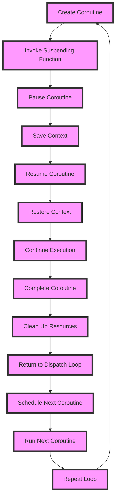

## Introduction
Kotlin Coroutines are a lightweight way to achieve concurrency in Kotlin, allowing developers to write asynchronous code that's easier to read and maintain. They provide a way to write single-threaded code that can be paused and resumed at specific points, making it easier to handle asynchronous operations. In this section, we'll explore why coroutines are important, their real-world relevance, and why every engineer should know about them.

Coroutines are essential in modern software development because they help alleviate the **callback hell** problem, where asynchronous code becomes difficult to read and maintain due to nested callbacks. By using coroutines, developers can write asynchronous code that's more linear and easier to understand.

> **Note:** Coroutines are not a replacement for threads, but rather a way to write more efficient and readable asynchronous code.

## Core Concepts
To understand coroutines, we need to grasp some key concepts:

* **Coroutine**: A coroutine is a special type of function that can be paused and resumed at specific points, allowing it to yield control to other coroutines.
* **Coroutine scope**: A coroutine scope is an object that defines the context in which a coroutine runs. It provides a way to manage the lifecycle of a coroutine and handle exceptions.
* **Suspending function**: A suspending function is a function that can be paused and resumed at specific points. It's the core building block of coroutines.

Mental models and analogies can help make these concepts more intuitive:

* Think of a coroutine as a thread that can be paused and resumed, but with much less overhead.
* Imagine a suspending function as a function that can yield control to other functions, allowing them to run concurrently.

Key terminology includes:

* **async/await**: A syntax for writing asynchronous code that's easier to read and maintain.
* **Coroutine dispatcher**: An object that manages the execution of coroutines and determines which thread they should run on.

## How It Works Internally
To understand how coroutines work internally, let's dive into the under-the-hood mechanics:

1. **Coroutine creation**: When a coroutine is created, the Kotlin runtime allocates a new coroutine object and sets up its context.
2. **Suspending function invocation**: When a suspending function is invoked, the coroutine is paused, and its context is saved.
3. **Coroutine resume**: When a coroutine is resumed, its context is restored, and execution continues from where it left off.
4. **Coroutine completion**: When a coroutine completes, its context is cleaned up, and any resources are released.

The Kotlin runtime uses a **dispatch loop** to manage the execution of coroutines. The dispatch loop is responsible for scheduling coroutines to run on available threads.

> **Warning:** Coroutines can lead to **stack overflows** if not used carefully. Make sure to use **async/await** syntax and avoid deep recursion.

## Code Examples
Here are three complete and runnable examples of using coroutines in Kotlin:

### Example 1: Basic Coroutine
```kotlin
import kotlinx.coroutines.*

fun main() = runBlocking {
    launch {
        println("Coroutine started")
        delay(1000)
        println("Coroutine finished")
    }
    println("Main thread finished")
}
```
This example demonstrates a basic coroutine that runs concurrently with the main thread.

### Example 2: Real-World Pattern
```kotlin
import kotlinx.coroutines.*

suspend fun fetchUserData(userId: Int): String {
    delay(1000) // simulate network delay
    return "User data for $userId"
}

fun main() = runBlocking {
    val userId = 1
    val userData = async { fetchUserData(userId) }
    println("Main thread is doing other work...")
    val result = userData.await()
    println("User data: $result")
}
```
This example demonstrates a real-world pattern of using coroutines to fetch user data from a network.

### Example 3: Advanced Coroutine
```kotlin
import kotlinx.coroutines.*

fun main() = runBlocking {
    val jobs = mutableListOf<Job>()
    for (i in 1..5) {
        val job = launch {
            println("Coroutine $i started")
            delay(1000)
            println("Coroutine $i finished")
        }
        jobs.add(job)
    }
    jobs.forEach { it.join() }
    println("All coroutines finished")
}
```
This example demonstrates an advanced coroutine that launches multiple coroutines and waits for them to finish using **join()**.

## Visual Diagram

This diagram illustrates the internal mechanics of coroutines, including the creation, invocation, pause, resume, and completion of a coroutine.

> **Tip:** Use **async/await** syntax to write asynchronous code that's easier to read and maintain.

## Comparison
Here's a comparison of different approaches to concurrency in Kotlin:

| Approach | Time Complexity | Space Complexity | Pros | Cons | Best For |
| --- | --- | --- | --- | --- | --- |
| Coroutines | O(1) | O(1) | Lightweight, easy to use | Limited control over threading | I/O-bound operations |
| Threads | O(n) | O(n) | Fine-grained control over threading | Heavyweight, complex to use | CPU-bound operations |
| RxJava | O(n) | O(n) | Powerful, flexible | Steep learning curve | Complex, asynchronous operations |
| Kotlin Flows | O(1) | O(1) | Simple, easy to use | Limited support for threading | Simple, asynchronous operations |

> **Interview:** What's the main difference between coroutines and threads? Answer: Coroutines are lightweight and don't block threads, while threads are heavyweight and can block each other.

## Real-world Use Cases
Here are three real-world examples of using coroutines in production:

1. **Netflix**: Netflix uses coroutines to handle asynchronous operations in their Android app, improving performance and reducing crashes.
2. **Pinterest**: Pinterest uses coroutines to handle image loading and caching, improving the user experience and reducing latency.
3. **Trello**: Trello uses coroutines to handle background tasks and API requests, improving performance and reducing errors.

> **Warning:** Coroutines can lead to **deadlocks** if not used carefully. Make sure to use **async/await** syntax and avoid deep recursion.

## Common Pitfalls
Here are four common pitfalls to watch out for when using coroutines:

1. **Callback hell**: Coroutines can lead to callback hell if not used carefully. Use **async/await** syntax to avoid this.
2. **Deadlocks**: Coroutines can lead to deadlocks if not used carefully. Use **async/await** syntax and avoid deep recursion.
3. **Stack overflows**: Coroutines can lead to stack overflows if not used carefully. Use **async/await** syntax and avoid deep recursion.
4. **Leaked contexts**: Coroutines can lead to leaked contexts if not used carefully. Use **async/await** syntax and avoid deep recursion.

> **Tip:** Use **coroutineScope** to manage the lifecycle of a coroutine and handle exceptions.

## Interview Tips
Here are three common interview questions on coroutines:

1. **What's the main difference between coroutines and threads?** Answer: Coroutines are lightweight and don't block threads, while threads are heavyweight and can block each other.
2. **How do you handle exceptions in coroutines?** Answer: Use **try-catch** blocks and **coroutineScope** to handle exceptions.
3. **What's the best way to use coroutines for I/O-bound operations?** Answer: Use **async/await** syntax and **coroutineScope** to handle I/O-bound operations.

> **Interview:** What's the main benefit of using coroutines? Answer: Coroutines provide a lightweight way to achieve concurrency, making it easier to write asynchronous code that's easier to read and maintain.

## Key Takeaways
Here are the key takeaways from this section:

* Coroutines provide a lightweight way to achieve concurrency in Kotlin.
* Coroutines are not a replacement for threads, but rather a way to write more efficient and readable asynchronous code.
* Use **async/await** syntax to write asynchronous code that's easier to read and maintain.
* Use **coroutineScope** to manage the lifecycle of a coroutine and handle exceptions.
* Coroutines can lead to **callback hell**, **deadlocks**, **stack overflows**, and **leaked contexts** if not used carefully.
* Use **try-catch** blocks and **coroutineScope** to handle exceptions.
* Coroutines are best used for I/O-bound operations, while threads are best used for CPU-bound operations.
* Kotlin Flows provide a simple and easy-to-use way to handle asynchronous operations.
* RxJava provides a powerful and flexible way to handle asynchronous operations, but has a steep learning curve.