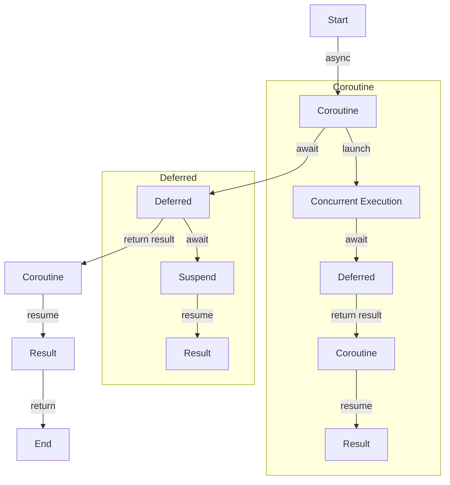

## Introduction
**Async/await** is a fundamental concept in Kotlin that allows developers to write asynchronous code that is easier to read and maintain. It is built on top of the **Coroutine** framework, which provides a way to write concurrent code that is more efficient and scalable. In this section, we will explore what async/await is, why it matters, and its real-world relevance.

> **Note:** Async/await is not a new concept, but it has gained popularity in recent years due to the rise of concurrent programming. It is now a crucial part of many programming languages, including Kotlin.

Async/await is essential in modern software development because it allows developers to write code that can handle multiple tasks concurrently, improving the overall performance and responsiveness of an application. For example, in a web application, async/await can be used to handle multiple requests simultaneously, reducing the latency and improving the user experience.

## Core Concepts
To understand async/await, we need to grasp some core concepts:

* **Coroutine**: A coroutine is a special type of function that can suspend and resume its execution at specific points, allowing other coroutines to run in the meantime.
* **Deferred**: A deferred is a type of coroutine that returns a result at some point in the future.
* **Async**: Async is a keyword used to define a coroutine that returns a deferred.
* **Await**: Await is a keyword used to suspend the execution of a coroutine until a deferred returns a result.

> **Warning:** Async/await can be confusing at first, especially for developers who are new to concurrent programming. It is essential to understand the basics of coroutines and deferreds before diving into async/await.

## How It Works Internally
When we use async/await in our code, the following steps occur:

1. The **async** keyword is used to define a coroutine that returns a deferred.
2. The coroutine is executed until it reaches an **await** expression.
3. The **await** expression suspends the execution of the coroutine and returns a deferred.
4. The deferred is returned to the caller, which can then use **await** to suspend its execution until the deferred returns a result.
5. When the deferred returns a result, the execution of the coroutine is resumed, and the result is returned to the caller.

> **Tip:** To improve the performance of our code, we can use **async/await** to handle multiple tasks concurrently. This can be achieved by using **launch** or **async** to start multiple coroutines that can run in parallel.

## Code Examples
Here are three complete and runnable examples of async/await in Kotlin:

### Example 1: Basic Usage
```kotlin
import kotlinx.coroutines.*

fun main() = runBlocking {
    val deferred = async { 
        // Simulate a long-running operation
        delay(1000)
        "Result"
    }
    
    // Use await to get the result
    val result = deferred.await()
    println(result)
}
```

### Example 2: Real-World Pattern
```kotlin
import kotlinx.coroutines.*

suspend fun fetchData(url: String): String {
    // Simulate a network request
    delay(1000)
    return "Data from $url"
}

fun main() = runBlocking {
    val urls = listOf("https://example.com/1", "https://example.com/2", "https://example.com/3")
    
    val deferreds = urls.map { async { fetchData(it) } }
    
    // Use awaitAll to get the results
    val results = deferreds.awaitAll()
    println(results)
}
```

### Example 3: Advanced Usage
```kotlin
import kotlinx.coroutines.*

suspend fun calculateResult(input: Int): Int {
    // Simulate a long-running operation
    delay(1000)
    return input * 2
}

fun main() = runBlocking {
    val inputs = listOf(1, 2, 3, 4, 5)
    
    val deferreds = inputs.map { async { calculateResult(it) } }
    
    // Use awaitAll to get the results
    val results = deferreds.awaitAll()
    println(results)
}
```

## Visual Diagram

This diagram illustrates the flow of async/await in Kotlin. It shows how a coroutine is executed, how a deferred is created, and how the execution is resumed when the deferred returns a result.

## Comparison
Here is a comparison of different approaches to concurrent programming in Kotlin:

| Approach | Time Complexity | Space Complexity | Pros | Cons | Best For |
| --- | --- | --- | --- | --- | --- |
| Async/Await | O(1) | O(1) | Easy to use, efficient | Can be confusing | I/O-bound operations |
| Coroutines | O(1) | O(1) | Efficient, flexible | Steep learning curve | CPU-bound operations |
| Threads | O(n) | O(n) | Simple to use | Inefficient, error-prone | Legacy code |
| RxJava | O(1) | O(1) | Powerful, flexible | Complex, verbose | Real-time data processing |

## Real-world Use Cases
Here are three real-world examples of async/await in Kotlin:

* **Netflix**: Netflix uses async/await to handle multiple requests concurrently, reducing the latency and improving the user experience.
* **Pinterest**: Pinterest uses async/await to handle image loading and caching, improving the performance and responsiveness of their application.
* **Dropbox**: Dropbox uses async/await to handle file uploads and downloads, reducing the latency and improving the user experience.

## Common Pitfalls
Here are four common mistakes that developers make when using async/await in Kotlin:

* **Forgetting to use await**: Forgetting to use await can cause the coroutine to return a deferred instead of the actual result.
* **Using await in a non-suspend function**: Using await in a non-suspend function can cause a compilation error.
* **Not handling exceptions**: Not handling exceptions can cause the coroutine to crash and the application to fail.
* **Not using launch or async**: Not using launch or async can cause the coroutine to block the main thread and reduce the performance of the application.

> **Warning:** Async/await can be confusing at first, especially for developers who are new to concurrent programming. It is essential to understand the basics of coroutines and deferreds before diving into async/await.

## Interview Tips
Here are three common interview questions on async/await in Kotlin:

* **What is async/await and how does it work?**: A strong answer should explain the basics of async/await, including the use of coroutines and deferreds.
* **How do you handle exceptions in async/await?**: A strong answer should explain how to handle exceptions using try-catch blocks and the use of launch or async.
* **How do you use async/await to improve the performance of an application?**: A strong answer should explain how to use async/await to handle multiple tasks concurrently, reducing the latency and improving the user experience.

## Key Takeaways
Here are ten key takeaways from this article:

* **Async/await is built on top of the Coroutine framework**: Async/await is a fundamental concept in Kotlin that allows developers to write asynchronous code that is easier to read and maintain.
* **Coroutines are special types of functions that can suspend and resume their execution**: Coroutines are the building blocks of async/await.
* **Deferreds are types of coroutines that return a result at some point in the future**: Deferreds are used to handle asynchronous operations.
* **Async is a keyword used to define a coroutine that returns a deferred**: Async is used to define a coroutine that returns a deferred.
* **Await is a keyword used to suspend the execution of a coroutine until a deferred returns a result**: Await is used to suspend the execution of a coroutine until a deferred returns a result.
* **Async/await can be used to handle multiple tasks concurrently**: Async/await can be used to handle multiple tasks concurrently, reducing the latency and improving the user experience.
* **Async/await can be used to improve the performance of an application**: Async/await can be used to improve the performance of an application by handling multiple tasks concurrently.
* **Exceptions should be handled using try-catch blocks**: Exceptions should be handled using try-catch blocks to prevent the coroutine from crashing and the application from failing.
* **Launch or async should be used to start a coroutine**: Launch or async should be used to start a coroutine, reducing the latency and improving the user experience.
* **Async/await can be confusing at first, but it is an essential concept in concurrent programming**: Async/await can be confusing at first, but it is an essential concept in concurrent programming that allows developers to write asynchronous code that is easier to read and maintain.