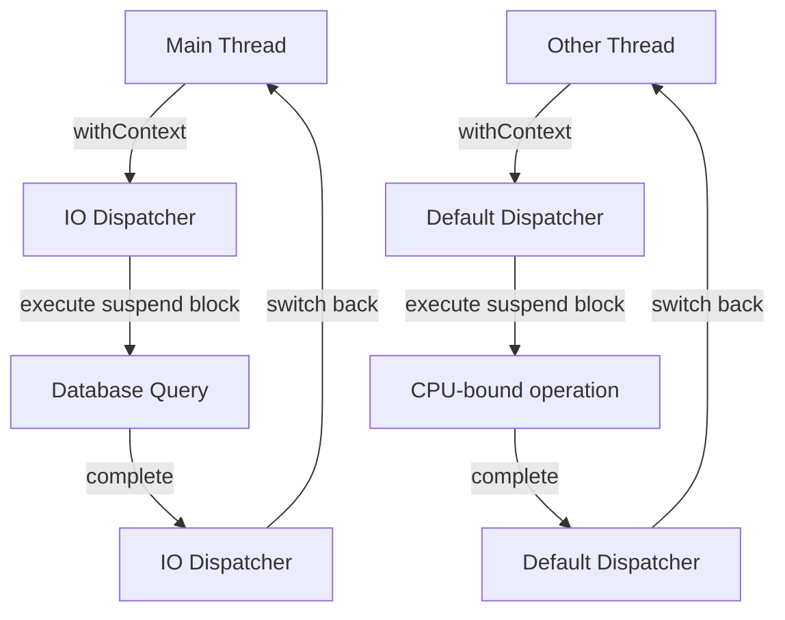

## Introduction
**withContext** is a crucial function in Kotlin Coroutines that allows you to switch the dispatcher of a coroutine. It's essential to understand how **withContext** works, as it enables you to write efficient and scalable concurrent code. In this section, we'll explore what **withContext** is, why it matters, and its real-world relevance.

**withContext** is a function that takes a **CoroutineContext** as an argument and a suspend block of code. It executes the suspend block with the specified context, allowing you to switch the dispatcher of the coroutine. This is particularly useful when you need to perform I/O-bound operations, such as reading from a database or making network requests, as it enables you to offload the work to a different thread pool.

> **Note:** In Kotlin Coroutines, a **CoroutineContext** is an immutable collection of elements that define the behavior of a coroutine. It includes the dispatcher, which determines the thread pool used to execute the coroutine.

Real-world relevance: **withContext** is widely used in production systems, such as web servers, mobile apps, and backend services. For example, in a web server, you might use **withContext** to switch the dispatcher when handling requests that involve database queries or network requests. This ensures that the main thread is not blocked, allowing the server to handle multiple requests concurrently.

## Core Concepts
To understand **withContext**, you need to grasp the following core concepts:

* **CoroutineContext**: An immutable collection of elements that define the behavior of a coroutine.
* **Dispatcher**: A component that determines the thread pool used to execute a coroutine.
* **Suspend block**: A block of code that can be paused and resumed, allowing other coroutines to run in between.

Mental model: Think of **withContext** as a way to change the " execution environment" of a coroutine. Just like how you might switch between different environments in a development setup, **withContext** allows you to switch between different dispatchers, enabling you to optimize the execution of your coroutine.

Key terminology:

* **Context**: A synonym for **CoroutineContext**.
* **Dispatcher**: A component that determines the thread pool used to execute a coroutine.
* **Suspend**: A function that can be paused and resumed, allowing other coroutines to run in between.

## How It Works Internally
When you call **withContext**, the following steps occur:

1. The **withContext** function creates a new **CoroutineContext** that includes the specified dispatcher.
2. The suspend block is executed with the new **CoroutineContext**.
3. When the suspend block is paused, the coroutine is suspended, and the dispatcher is switched to the new one.
4. When the suspend block is resumed, the coroutine is resumed, and the dispatcher is switched back to the original one.

Under-the-hood mechanics: **withContext** uses a technique called "context switching" to switch the dispatcher of the coroutine. This involves creating a new **CoroutineContext** and updating the coroutine's context to point to the new one.

> **Warning:** Be cautious when using **withContext**, as it can lead to unexpected behavior if not used correctly. For example, if you switch the dispatcher to a different thread pool, you may encounter issues with thread safety or synchronization.

## Code Examples
### Example 1: Basic usage
```kotlin
import kotlinx.coroutines.*
import kotlin.system.measureTimeMillis

fun main() = runBlocking {
    val time = measureTimeMillis {
        withContext(Dispatchers.IO) {
            // Simulate I/O-bound operation
            Thread.sleep(1000)
        }
    }
    println("Time: $time ms")
}
```
Explanation: In this example, we use **withContext** to switch the dispatcher to **Dispatchers.IO**, which is a thread pool optimized for I/O-bound operations. We then simulate an I/O-bound operation using **Thread.sleep**.

### Example 2: Real-world pattern
```kotlin
import kotlinx.coroutines.*
import kotlin.system.measureTimeMillis

class UserRepository {
    suspend fun fetchUser(id: Int): User {
        withContext(Dispatchers.IO) {
            // Simulate database query
            Thread.sleep(500)
            return User(id, "John Doe")
        }
    }
}

data class User(val id: Int, val name: String)

fun main() = runBlocking {
    val userRepository = UserRepository()
    val user = userRepository.fetchUser(1)
    println(user)
}
```
Explanation: In this example, we use **withContext** to switch the dispatcher to **Dispatchers.IO** when fetching a user from the database. This ensures that the main thread is not blocked, allowing the system to handle multiple requests concurrently.

### Example 3: Advanced usage
```kotlin
import kotlinx.coroutines.*
import kotlin.system.measureTimeMillis

class UserRepository {
    suspend fun fetchUser(id: Int): User {
        withContext(Dispatchers.IO) {
            // Simulate database query
            Thread.sleep(500)
            return User(id, "John Doe")
        }
    }

    suspend fun fetchUsers(ids: List<Int>): List<User> {
        return coroutineScope {
            ids.map { id ->
                async {
                    fetchUser(id)
                }
            }.awaitAll()
        }
    }
}

data class User(val id: Int, val name: String)

fun main() = runBlocking {
    val userRepository = UserRepository()
    val users = userRepository.fetchUsers(listOf(1, 2, 3))
    println(users)
}
```
Explanation: In this example, we use **withContext** to switch the dispatcher to **Dispatchers.IO** when fetching a user from the database. We also use **coroutineScope** and **async** to fetch multiple users concurrently.

## Visual Diagram

Explanation: This diagram illustrates the context switching mechanism used by **withContext**. When the main thread calls **withContext**, it switches to the IO dispatcher, which executes the suspend block. When the suspend block is completed, the dispatcher is switched back to the main thread.

## Comparison
| Approach | Time Complexity | Space Complexity | Pros | Cons | Best For |
| --- | --- | --- | --- | --- | --- |
| **withContext** | O(1) | O(1) | Easy to use, flexible | Can lead to unexpected behavior if not used correctly | I/O-bound operations |
| **launch** | O(1) | O(1) | Simple to use, lightweight | Limited control over the coroutine | CPU-bound operations |
| **async** | O(1) | O(1) | Allows for concurrent execution | More complex to use than **launch** | CPU-bound operations |
| **runBlocking** | O(1) | O(1) | Blocks the main thread, easy to use | Can lead to performance issues if not used carefully | Testing, debugging |

## Real-world Use Cases
* **Web servers**: Use **withContext** to switch the dispatcher to **Dispatchers.IO** when handling requests that involve database queries or network requests.
* **Mobile apps**: Use **withContext** to switch the dispatcher to **Dispatchers.IO** when performing I/O-bound operations, such as reading from or writing to storage.
* **Backend services**: Use **withContext** to switch the dispatcher to **Dispatchers.IO** when handling requests that involve database queries or network requests.

## Common Pitfalls
* **Not using **withContext****: Failing to use **withContext** can lead to unexpected behavior, such as blocking the main thread or using the wrong dispatcher.
* **Using the wrong dispatcher**: Using the wrong dispatcher can lead to performance issues or unexpected behavior.
* **Not handling exceptions**: Failing to handle exceptions can lead to crashes or unexpected behavior.
* **Not using **coroutineScope****: Failing to use **coroutineScope** can lead to unexpected behavior or performance issues.

> **Tip:** Always use **withContext** to switch the dispatcher to **Dispatchers.IO** when performing I/O-bound operations.

## Interview Tips
* **What is **withContext****?**: **withContext** is a function that allows you to switch the dispatcher of a coroutine.
* **How does **withContext** work?**: **withContext** uses a technique called "context switching" to switch the dispatcher of the coroutine.
* **What are the benefits of using **withContext****?**: The benefits of using **withContext** include easy to use, flexible, and allows for concurrent execution.

> **Interview:** Can you explain how **withContext** works and how it's used in real-world scenarios?

## Key Takeaways
* **withContext** is a function that allows you to switch the dispatcher of a coroutine.
* **withContext** uses a technique called "context switching" to switch the dispatcher of the coroutine.
* **withContext** is easy to use and flexible.
* **withContext** allows for concurrent execution.
* **withContext** can lead to unexpected behavior if not used correctly.
* **withContext** is best used for I/O-bound operations.
* **coroutineScope** is used to fetch multiple users concurrently.
* **async** is used to fetch multiple users concurrently.
* **launch** is used for CPU-bound operations.
* **runBlocking** is used for testing and debugging.