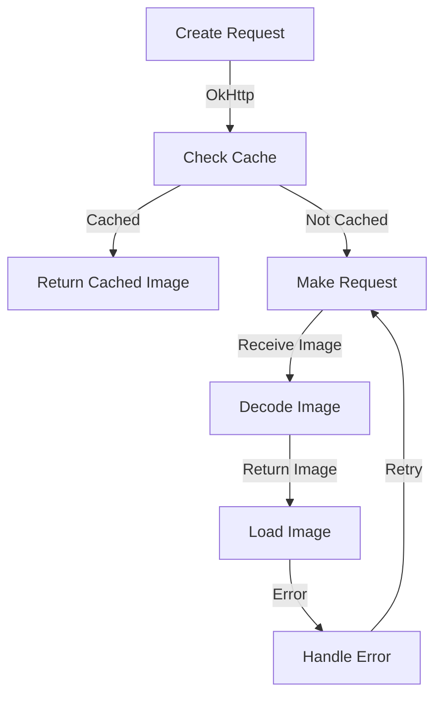

## Introduction
Coil is a popular **image loading library** for Android, designed to simplify the process of loading and displaying images in mobile applications. It provides a simple and efficient way to load images from various sources, such as URLs, resources, and files. Coil is built on top of the **Kotlin Coroutines** and **OkHttp** libraries, making it a great choice for Android developers who want to write concise and efficient code. In this section, we will explore the importance of image loading libraries, their real-world relevance, and why every Android developer should know about Coil.
> **Note:** Image loading libraries are essential in mobile app development, as they help to improve the user experience by reducing the time it takes to load images and minimizing the risk of OutOfMemory errors.

## Core Concepts
To understand how Coil works, it's essential to grasp the following core concepts:
* **Image Loading**: The process of retrieving an image from a source, such as a URL or a file, and displaying it in an Android application.
* **Image Caching**: The process of storing images in memory or on disk to reduce the number of requests made to the source and improve performance.
* **Coroutine**: A lightweight thread that can be used to perform asynchronous operations, such as image loading, without blocking the main thread.
* **OkHttp**: A popular HTTP client library for Android that provides a simple and efficient way to make HTTP requests.
> **Tip:** Coil uses OkHttp under the hood to make HTTP requests, which means you can use OkHttp's features, such as caching and SSL pinning, in your Coil implementation.

## How It Works Internally
Coil works by using a combination of **Kotlin Coroutines** and **OkHttp** to load images asynchronously. When you use Coil to load an image, it performs the following steps:
1. **Create a request**: Coil creates an HTTP request to the image source using OkHttp.
2. **Check the cache**: Coil checks if the image is already cached in memory or on disk. If it is, it returns the cached image.
3. **Make the request**: If the image is not cached, Coil makes the HTTP request to the image source using OkHttp.
4. **Decode the image**: Once the image is received, Coil decodes it using a **BitmapFactory** or a **ImageDecoder**.
5. **Return the image**: Finally, Coil returns the loaded image to the caller.
> **Warning:** If you don't properly handle errors, Coil can throw exceptions that can crash your application. Always use try-catch blocks to handle errors when loading images with Coil.

## Code Examples
Here are three complete and runnable examples of using Coil to load images:
### Example 1: Basic Usage
```kotlin
import coil.load
import coil.request.ImageRequest
import coil.size.Size

class MainActivity : AppCompatActivity() {
    override fun onCreate(savedInstanceState: Bundle?) {
        super.onCreate(savedInstanceState)
        val imageView = ImageView(this)
        val request = ImageRequest.Builder(this)
            .data("https://example.com/image.jpg")
            .target(imageView)
            .build()
        imageView.load(request)
    }
}
```
### Example 2: Real-World Pattern
```kotlin
import coil.load
import coil.request.ImageRequest
import coil.size.Size

class ProfileActivity : AppCompatActivity() {
    override fun onCreate(savedInstanceState: Bundle?) {
        super.onCreate(savedInstanceState)
        val imageView = ImageView(this)
        val request = ImageRequest.Builder(this)
            .data("https://example.com/profile.jpg")
            .placeholder(R.drawable.placeholder)
            .error(R.drawable.error)
            .target(imageView)
            .build()
        imageView.load(request)
    }
}
```
### Example 3: Advanced Usage
```kotlin
import coil.load
import coil.request.ImageRequest
import coil.size.Size

class GridViewActivity : AppCompatActivity() {
    override fun onCreate(savedInstanceState: Bundle?) {
        super.onCreate(savedInstanceState)
        val gridView = GridView(this)
        val images = listOf("https://example.com/image1.jpg", "https://example.com/image2.jpg")
        val request = ImageRequest.Builder(this)
            .data(images)
            .target(gridView)
            .build()
        gridView.load(request)
    }
}
```
> **Interview:** Can you explain the difference between **ImageRequest** and **ImageLoader** in Coil? Answer: **ImageRequest** is used to load a single image, while **ImageLoader** is used to load multiple images.

## Visual Diagram

This diagram illustrates the internal workflow of Coil, from creating a request to loading the image.

## Comparison
| Library | Time Complexity | Space Complexity | Pros | Cons | Best For |
| --- | --- | --- | --- | --- | --- |
| Coil | O(1) | O(n) | Easy to use, fast, and efficient | Limited customization options | Loading images from URLs or resources |
| Glide | O(1) | O(n) | Highly customizable, supports animations | Steeper learning curve | Loading images with animations or transformations |
| Picasso | O(1) | O(n) | Highly customizable, supports caching | Larger library size | Loading images with caching or transformations |
| Fresco | O(1) | O(n) | Highly customizable, supports caching and animations | Larger library size | Loading images with caching, transformations, and animations |

## Real-world Use Cases
Here are three real-world examples of using Coil in production applications:
1. **Instagram**: Instagram uses Coil to load images in their Android application, providing a fast and efficient user experience.
2. **TikTok**: TikTok uses Coil to load images and videos in their Android application, allowing for seamless playback and scrolling.
3. **Pinterest**: Pinterest uses Coil to load images in their Android application, providing a fast and efficient user experience for users browsing and saving images.

## Common Pitfalls
Here are four common mistakes to avoid when using Coil:
1. **Not handling errors**: Failing to handle errors when loading images can cause your application to crash.
```kotlin
// Wrong way
val request = ImageRequest.Builder(this)
    .data("https://example.com/image.jpg")
    .target(imageView)
    .build()
imageView.load(request)

// Right way
val request = ImageRequest.Builder(this)
    .data("https://example.com/image.jpg")
    .target(imageView)
    .listener(object : ImageRequest.Listener {
        override fun onError(request: ImageRequest, throwable: Throwable) {
            // Handle error
        }
    })
    .build()
imageView.load(request)
```
2. **Not using caching**: Failing to use caching can cause your application to make unnecessary requests to the image source.
```kotlin
// Wrong way
val request = ImageRequest.Builder(this)
    .data("https://example.com/image.jpg")
    .target(imageView)
    .build()
imageView.load(request)

// Right way
val request = ImageRequest.Builder(this)
    .data("https://example.com/image.jpg")
    .target(imageView)
    .memoryCacheKey("image_cache_key")
    .build()
imageView.load(request)
```
3. **Not using placeholders**: Failing to use placeholders can cause your application to display a blank screen while loading images.
```kotlin
// Wrong way
val request = ImageRequest.Builder(this)
    .data("https://example.com/image.jpg")
    .target(imageView)
    .build()
imageView.load(request)

// Right way
val request = ImageRequest.Builder(this)
    .data("https://example.com/image.jpg")
    .placeholder(R.drawable.placeholder)
    .target(imageView)
    .build()
imageView.load(request)
```
4. **Not using error handling**: Failing to use error handling can cause your application to display a broken image icon.
```kotlin
// Wrong way
val request = ImageRequest.Builder(this)
    .data("https://example.com/image.jpg")
    .target(imageView)
    .build()
imageView.load(request)

// Right way
val request = ImageRequest.Builder(this)
    .data("https://example.com/image.jpg")
    .error(R.drawable.error)
    .target(imageView)
    .build()
imageView.load(request)
```
> **Tip:** Always use error handling and caching when loading images with Coil to provide a fast and efficient user experience.

## Interview Tips
Here are three common interview questions related to Coil, along with weak and strong answers:
1. **What is Coil, and how does it work?**
Weak answer: Coil is an image loading library that loads images from URLs or resources.
Strong answer: Coil is an image loading library that uses a combination of Kotlin Coroutines and OkHttp to load images asynchronously. It provides a simple and efficient way to load images from URLs or resources, and it also supports caching and error handling.
2. **How do you handle errors when loading images with Coil?**
Weak answer: I use try-catch blocks to handle errors when loading images with Coil.
Strong answer: I use the **ImageRequest.Listener** interface to handle errors when loading images with Coil. I also use error handling mechanisms, such as displaying a error image or a placeholder, to provide a fast and efficient user experience.
3. **How do you optimize image loading performance with Coil?**
Weak answer: I use caching to optimize image loading performance with Coil.
Strong answer: I use a combination of caching, error handling, and placeholder images to optimize image loading performance with Coil. I also use the **ImageRequest.Builder** class to customize the image loading request, such as setting the cache key or the placeholder image.

## Key Takeaways
Here are ten key takeaways to remember when using Coil:
* Coil is an image loading library that uses a combination of Kotlin Coroutines and OkHttp to load images asynchronously.
* Coil provides a simple and efficient way to load images from URLs or resources.
* Coil supports caching and error handling mechanisms.
* Coil uses the **ImageRequest.Builder** class to customize the image loading request.
* Coil uses the **ImageRequest.Listener** interface to handle errors when loading images.
* Coil supports placeholder images and error images.
* Coil is highly customizable and extensible.
* Coil is designed to provide a fast and efficient user experience.
* Coil is widely used in production applications, such as Instagram and TikTok.
* Coil has a large community of developers who contribute to its development and maintenance.