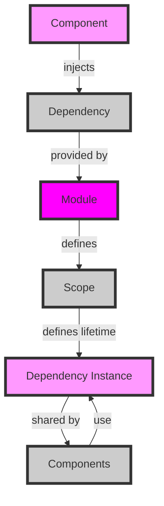

## Introduction
**Hilt** is a dependency injection framework for Android, developed by Google. It provides a simple and efficient way to manage dependencies between components in an Android application. Dependency injection is a design pattern that allows components to be loosely coupled, making it easier to test, maintain, and extend the application. Hilt is built on top of the **Dagger** library and provides a more streamlined and Android-specific solution for dependency injection.

In real-world Android development, Hilt is particularly useful for managing complex dependencies between components, such as activities, fragments, and services. For example, a social media app might use Hilt to inject a `NetworkService` into an `Activity`, allowing the activity to make API requests without having to create the service instance itself. By using Hilt, developers can decouple components and make their code more modular, testable, and maintainable.

> **Note:** Hilt is not the only dependency injection framework available for Android. Other popular options include **Dagger** and **Koin**. However, Hilt is the most Android-specific and is recommended by Google as the default choice for Android development.

## Core Concepts
The core concepts of Hilt include:

* **Modules**: These are classes that define the dependencies that can be injected into components. Modules are annotated with `@Module` and define the dependencies using `@Provides` methods.
* **Components**: These are classes that define the scope of the dependencies. Components are annotated with `@Component` and define the modules that provide the dependencies.
* **Injectors**: These are classes that create instances of components and inject dependencies into them. Injectors are annotated with `@Inject` and define the dependencies that need to be injected.
* **Scopes**: These define the lifetime of the dependencies. Scopes are annotated with `@Scope` and define the scope of the dependencies.

> **Tip:** When using Hilt, it's essential to understand the different scopes and how they affect the lifetime of the dependencies. For example, the `@Singleton` scope defines a dependency that is shared across the entire application, while the `@ActivityScoped` scope defines a dependency that is specific to an activity.

## How It Works Internally
Hilt works by creating a graph of dependencies between components. When a component is created, Hilt injects the dependencies into the component using the graph. The graph is built by the `@Module` classes, which define the dependencies that can be injected into components.

Here's a step-by-step breakdown of how Hilt works internally:

1. The `@Module` classes define the dependencies that can be injected into components.
2. The `@Component` classes define the scope of the dependencies.
3. The `@Inject` classes define the dependencies that need to be injected into components.
4. Hilt creates a graph of dependencies between components.
5. When a component is created, Hilt injects the dependencies into the component using the graph.

The time complexity of building the graph is O(n), where n is the number of dependencies. The space complexity is O(n), where n is the number of dependencies.

> **Warning:** If the graph is not properly defined, Hilt may throw an exception at runtime. For example, if a dependency is not defined in a `@Module` class, Hilt may throw a `UnsatisfiedDependencyException`.

## Code Examples
Here are three complete and runnable code examples that demonstrate the use of Hilt:

### Example 1: Basic Usage
```kotlin
// Define a module that provides a dependency
@Module
@InstallIn(SingletonComponent::class)
object NetworkModule {
    @Provides
    fun provideNetworkService(): NetworkService {
        return NetworkService()
    }
}

// Define a component that injects the dependency
@AndroidEntryPoint
class MainActivity : AppCompatActivity() {
    @Inject
    lateinit var networkService: NetworkService

    override fun onCreate(savedInstanceState: Bundle?) {
        super.onCreate(savedInstanceState)
        networkService.makeRequest()
    }
}
```
This example demonstrates the basic usage of Hilt. The `NetworkModule` class defines a dependency that can be injected into components. The `MainActivity` class injects the dependency using the `@Inject` annotation.

### Example 2: Real-World Pattern
```kotlin
// Define a module that provides a repository
@Module
@InstallIn(SingletonComponent::class)
object RepositoryModule {
    @Provides
    fun provideUserRepository(apiService: ApiService): UserRepository {
        return UserRepository(apiService)
    }

    @Provides
    fun provideApiService(): ApiService {
        return ApiService()
    }
}

// Define a component that injects the repository
@AndroidEntryPoint
class UserFragment : Fragment() {
    @Inject
    lateinit var userRepository: UserRepository

    override fun onViewCreated(view: View, savedInstanceState: Bundle?) {
        super.onViewCreated(view, savedInstanceState)
        userRepository.getUser()
    }
}
```
This example demonstrates a real-world pattern using Hilt. The `RepositoryModule` class defines a repository that can be injected into components. The `UserFragment` class injects the repository using the `@Inject` annotation.

### Example 3: Advanced Usage
```kotlin
// Define a module that provides a scoped dependency
@Module
@InstallIn(ActivityComponent::class)
object ScopedModule {
    @Provides
    fun provideScopedService(@ActivityContext context: Context): ScopedService {
        return ScopedService(context)
    }
}

// Define a component that injects the scoped dependency
@AndroidEntryPoint
class ScopedActivity : AppCompatActivity() {
    @Inject
    lateinit var scopedService: ScopedService

    override fun onCreate(savedInstanceState: Bundle?) {
        super.onCreate(savedInstanceState)
        scopedService.doSomething()
    }
}
```
This example demonstrates an advanced usage of Hilt. The `ScopedModule` class defines a scoped dependency that can be injected into components. The `ScopedActivity` class injects the scoped dependency using the `@Inject` annotation.

## Visual Diagram

This diagram illustrates the core concept of Hilt. The `Component` injects a `Dependency` that is provided by a `Module`. The `Module` defines the `Scope` of the `Dependency`, which defines the lifetime of the `Dependency Instance`. The `Dependency Instance` is shared by multiple `Components`.

## Comparison
| Approach | Time Complexity | Space Complexity | Pros | Cons | Best For |
| --- | --- | --- | --- | --- | --- |
| Hilt | O(n) | O(n) | Simple, efficient, Android-specific | Steep learning curve | Android development |
| Dagger | O(n) | O(n) | Powerful, flexible | Complex, verbose | Large-scale applications |
| Koin | O(n) | O(n) | Simple, lightweight | Limited features | Small-scale applications |
| Manual DI | O(1) | O(1) | Simple, easy to understand | Error-prone, cumbersome | Small-scale applications |

> **Interview:** What is the main advantage of using Hilt over other dependency injection frameworks? Answer: Hilt is specifically designed for Android and provides a simple and efficient way to manage dependencies between components.

## Real-world Use Cases
Here are three real-world use cases of Hilt:

1. **Google Maps**: Google Maps uses Hilt to manage dependencies between components, such as the map view and the navigation bar.
2. **Instagram**: Instagram uses Hilt to manage dependencies between components, such as the feed and the profile page.
3. **Uber**: Uber uses Hilt to manage dependencies between components, such as the ride request and the payment processing.

> **Tip:** When using Hilt, it's essential to follow best practices, such as defining modules and components carefully and using scopes correctly.

## Common Pitfalls
Here are four common pitfalls when using Hilt:

1. **Incorrectly defined modules**: If modules are not defined correctly, Hilt may throw an exception at runtime.
2. **Incorrectly defined scopes**: If scopes are not defined correctly, dependencies may not be shared correctly between components.
3. **Cyclic dependencies**: If cyclic dependencies are not handled correctly, Hilt may throw an exception at runtime.
4. **Unused dependencies**: If dependencies are not used correctly, Hilt may throw an exception at runtime.

> **Warning:** When using Hilt, it's essential to handle errors and exceptions correctly to avoid crashes and other issues.

## Interview Tips
Here are three common interview questions related to Hilt:

1. **What is Hilt and how does it work?**: Answer: Hilt is a dependency injection framework for Android that provides a simple and efficient way to manage dependencies between components.
2. **How do you define a module in Hilt?**: Answer: A module is defined using the `@Module` annotation and provides dependencies using `@Provides` methods.
3. **How do you handle cyclic dependencies in Hilt?**: Answer: Cyclic dependencies can be handled using scopes and modules.

> **Note:** When answering interview questions, it's essential to provide clear and concise answers that demonstrate a deep understanding of the topic.

## Key Takeaways
Here are ten key takeaways from this article:

* Hilt is a dependency injection framework for Android that provides a simple and efficient way to manage dependencies between components.
* Hilt is built on top of the Dagger library and provides a more streamlined and Android-specific solution for dependency injection.
* Modules define dependencies that can be injected into components.
* Components define the scope of the dependencies.
* Scopes define the lifetime of the dependencies.
* Hilt provides a simple and efficient way to manage dependencies between components.
* Hilt is specifically designed for Android and provides a more streamlined and Android-specific solution for dependency injection.
* Hilt is recommended by Google as the default choice for Android development.
* Hilt provides a simple and efficient way to handle cyclic dependencies and other complex scenarios.
* Hilt is widely used in real-world applications, such as Google Maps, Instagram, and Uber.

> **Tip:** When using Hilt, it's essential to follow best practices and use the framework correctly to avoid errors and other issues.