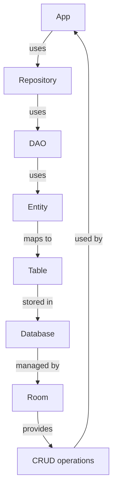

## Introduction
The Room persistence library is a part of the Android Jetpack suite of libraries, and it provides a simple, intuitive way to interact with a SQLite database. **Room** is a **ORM (Object-Relational Mapping)** system that abstracts the underlying database, making it easier to work with data in Android applications. It allows developers to define entities as Java or Kotlin classes, and then use these entities to interact with the database. In this study guide, we will delve into the core concepts of Room, including **@Entity**, **@Dao**, and **@Database**, and explore how they work together to provide a robust data storage solution for Android applications.

> **Note:** Room is a powerful tool for managing data in Android applications, and it's essential to understand its core concepts to use it effectively.

## Core Concepts
The core concepts of Room include:

* **@Entity**: An entity is a class that represents a table in the database. It's annotated with **@Entity**, and its properties are mapped to columns in the table.
* **@Dao**: A DAO (Data Access Object) is an interface that provides methods for interacting with the database. It's annotated with **@Dao**, and its methods are used to perform CRUD (Create, Read, Update, Delete) operations on the database.
* **@Database**: The **@Database** annotation is used to define the database class, which is the entry point for the Room persistence library. It's used to create a database instance and provide access to the DAOs.

> **Tip:** When defining entities, it's essential to use the **@PrimaryKey** annotation to specify the primary key of the table.

## How It Works Internally
When you use Room to interact with a database, the following steps occur:

1. The **@Entity** annotation is used to define the entity class, which represents a table in the database.
2. The **@Dao** annotation is used to define the DAO interface, which provides methods for interacting with the database.
3. The **@Database** annotation is used to define the database class, which is the entry point for the Room persistence library.
4. When you create a database instance, Room generates a SQLite database file and creates the tables based on the entity classes.
5. When you use the DAO to perform CRUD operations, Room converts the entity classes to SQLite queries and executes them on the database.

> **Warning:** When using Room, it's essential to handle the database migration correctly, as incorrect migration can lead to data loss or corruption.

## Code Examples
### Example 1: Basic Entity and DAO
```kotlin
// Entity
@Entity
data class User(
    @PrimaryKey(autoGenerate = true)
    val id: Int,
    val name: String,
    val email: String
)

// DAO
@Dao
interface UserDao {
    @Insert
    fun insertUser(user: User)

    @Query("SELECT * FROM User")
    fun getAllUsers(): List<User>
}

// Database
@Database(entities = [User::class], version = 1)
abstract class AppDatabase : RoomDatabase() {
    abstract fun userDao(): UserDao
}
```
### Example 2: Real-World Pattern
```kotlin
// Entity
@Entity
data class Product(
    @PrimaryKey
    val id: String,
    val name: String,
    val price: Double
)

// DAO
@Dao
interface ProductDao {
    @Insert
    fun insertProduct(product: Product)

    @Query("SELECT * FROM Product WHERE id = :id")
    fun getProduct(id: String): Product

    @Update
    fun updateProduct(product: Product)
}

// Repository
class ProductRepository(private val productDao: ProductDao) {
    fun insertProduct(product: Product) {
        productDao.insertProduct(product)
    }

    fun getProduct(id: String): Product {
        return productDao.getProduct(id)
    }

    fun updateProduct(product: Product) {
        productDao.updateProduct(product)
    }
}
```
### Example 3: Advanced Usage
```kotlin
// Entity
@Entity
data class Order(
    @PrimaryKey(autoGenerate = true)
    val id: Int,
    val userId: Int,
    val productId: String,
    val quantity: Int
)

// DAO
@Dao
interface OrderDao {
    @Insert
    fun insertOrder(order: Order)

    @Query("SELECT * FROM Order WHERE userId = :userId")
    fun getOrdersForUser(userId: Int): List<Order>

    @Query("SELECT * FROM Order WHERE productId = :productId")
    fun getOrdersForProduct(productId: String): List<Order>
}

// Database
@Database(entities = [Order::class], version = 1)
abstract class AppDatabase : RoomDatabase() {
    abstract fun orderDao(): OrderDao
}
```
## Visual Diagram

The diagram illustrates the relationship between the App, Repository, DAO, Entity, Table, Database, and Room. The App uses the Repository, which uses the DAO, which uses the Entity, which maps to the Table, which is stored in the Database, which is managed by Room.

> **Note:** The diagram shows the high-level architecture of the Room persistence library and how it interacts with the App.

## Comparison
| Approach | Time Complexity | Space Complexity | Pros | Cons | Best For |
| --- | --- | --- | --- | --- | --- |
| Room | O(1) | O(n) | Easy to use, provides a simple and intuitive API | Limited support for complex queries | Simple CRUD operations |
| SQLite | O(1) | O(n) | Provides low-level control over the database | Requires manual query construction | Complex queries, custom database schema |
| Realm | O(1) | O(n) | Provides a simple and intuitive API, supports complex queries | Limited support for Android | Complex queries, large datasets |
| Firebase Realtime Database | O(1) | O(n) | Provides a simple and intuitive API, supports real-time data synchronization | Limited support for offline data access | Real-time data synchronization, offline data access |

> **Tip:** When choosing a data storage solution, consider the trade-offs between ease of use, performance, and complexity.

## Real-world Use Cases
1. **Instagram**: Instagram uses a combination of Room and Firebase Realtime Database to store user data and provide real-time updates.
2. **Uber**: Uber uses Room to store user data and provide offline access to the app.
3. **Twitter**: Twitter uses a combination of Room and SQLite to store user data and provide a seamless user experience.

> **Note:** These examples illustrate how Room can be used in real-world applications to provide a robust data storage solution.

## Common Pitfalls
1. **Incorrect database migration**: When using Room, it's essential to handle database migration correctly to avoid data loss or corruption.
2. **Insufficient error handling**: When using Room, it's essential to handle errors correctly to provide a seamless user experience.
3. **Inefficient query construction**: When using Room, it's essential to construct queries efficiently to avoid performance issues.
4. **Incorrect entity definition**: When using Room, it's essential to define entities correctly to avoid data inconsistencies.

> **Warning:** When using Room, it's essential to be aware of these common pitfalls to avoid issues and provide a robust data storage solution.

## Interview Tips
1. **What is Room, and how does it work?**: A strong answer should provide a clear overview of Room and its core concepts, including entities, DAOs, and databases.
2. **How do you handle database migration with Room?**: A strong answer should provide a clear overview of how to handle database migration with Room, including the use of migration scripts and versioning.
3. **What are some common pitfalls when using Room?**: A strong answer should provide a clear overview of common pitfalls when using Room, including incorrect database migration, insufficient error handling, and inefficient query construction.

> **Interview:** When answering interview questions about Room, be sure to provide clear and concise answers that demonstrate your understanding of the core concepts and best practices.

## Key Takeaways
* Room is a powerful tool for managing data in Android applications.
* Entities, DAOs, and databases are the core concepts of Room.
* Room provides a simple and intuitive API for performing CRUD operations.
* Database migration is essential to handle correctly to avoid data loss or corruption.
* Error handling is essential to provide a seamless user experience.
* Query construction is essential to optimize performance.
* Entities should be defined correctly to avoid data inconsistencies.
* Room is suitable for simple CRUD operations, but may not be suitable for complex queries or custom database schema.
* Room provides a robust data storage solution for Android applications, but requires careful consideration of trade-offs between ease of use, performance, and complexity.