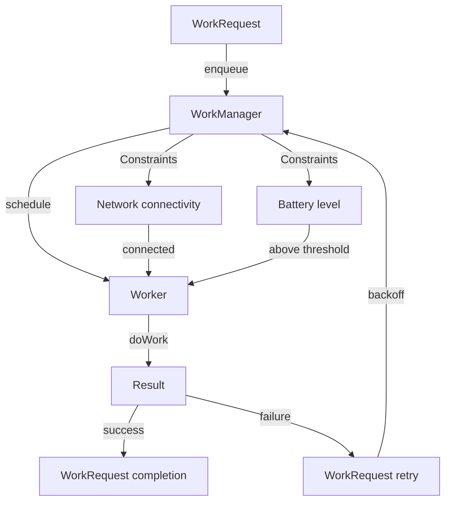

## Introduction
**WorkManager** is a library provided by the Android Jetpack team to handle background work in a reliable and efficient manner. It allows developers to schedule and manage tasks that need to be executed in the background, such as data synchronization, network requests, and file processing. With WorkManager, you can ensure that your app's background work is executed correctly, even when the app is not running or the device is restarted. This is particularly important for apps that require continuous background execution, such as music streaming services, messaging apps, and fitness trackers.

In real-world scenarios, WorkManager is used by many popular apps, including Google Play Music, Google Fit, and WhatsApp. For example, Google Play Music uses WorkManager to download music files in the background, while Google Fit uses it to synchronize fitness data with the cloud.

## Core Concepts
To understand how WorkManager works, you need to familiarize yourself with the following key concepts:
* **WorkRequest**: A request to execute a piece of work, which can be a one-time or periodic task.
* **Worker**: A class that performs the actual work, such as data synchronization or file processing.
* **WorkManager**: The main class that manages and schedules WorkRequests.
* **Constraint**: A condition that must be met before a WorkRequest can be executed, such as network connectivity or battery level.

> **Note:** WorkManager uses a **Constraint**-based system to determine when a WorkRequest can be executed. This allows you to specify conditions under which a task should be executed, such as when the device is connected to a Wi-Fi network or when the battery level is above a certain threshold.

## How It Works Internally
When you create a WorkRequest, WorkManager adds it to a queue and schedules it for execution. Here's a step-by-step breakdown of the process:
1. **WorkRequest creation**: You create a WorkRequest using the `WorkRequest.Builder` class, specifying the Worker class and any Constraints.
2. **WorkRequest enqueueing**: You enqueue the WorkRequest using the `WorkManager.enqueue()` method.
3. **WorkRequest scheduling**: WorkManager schedules the WorkRequest for execution based on its Constraints and the device's current state.
4. **Worker execution**: When the WorkRequest is executed, WorkManager creates an instance of the specified Worker class and calls its `doWork()` method.
5. **WorkRequest completion**: The Worker completes its work and returns a `Result` object indicating success or failure.

> **Warning:** If a WorkRequest fails, WorkManager will retry it based on a **backoff policy**, which can be customized using the `WorkRequest.Builder.setBackoffCriteria()` method.

## Code Examples
Here are three complete and runnable code examples that demonstrate how to use WorkManager:

### Example 1: Basic Usage
```kotlin
import android.content.Context
import androidx.work.Data
import androidx.work.ExistingWorkPolicy
import androidx.work.OneTimeWorkRequest
import androidx.work.WorkManager
import androidx.work.Worker
import androidx.work.WorkerParameters

class BasicWorker(context: Context, params: WorkerParameters) : Worker(context, params) {
    override fun doWork(): Result {
        // Perform some work
        return Result.success()
    }
}

class MainActivity : AppCompatActivity() {
    override fun onCreate(savedInstanceState: Bundle?) {
        super.onCreate(savedInstanceState)
        val workManager = WorkManager.getInstance(this)
        val workRequest = OneTimeWorkRequest.Builder(BasicWorker::class.java).build()
        workManager.enqueueUniqueWork("basic_work", ExistingWorkPolicy.REPLACE, workRequest)
    }
}
```

### Example 2: Real-World Pattern
```kotlin
import android.content.Context
import androidx.work.Data
import androidx.work.ExistingWorkPolicy
import androidx.work.PeriodicWorkRequest
import androidx.work.WorkManager
import androidx.work.Worker
import androidx.work.WorkerParameters
import java.util.concurrent.TimeUnit

class DataSynchronizer(context: Context, params: WorkerParameters) : Worker(context, params) {
    override fun doWork(): Result {
        // Synchronize data with the cloud
        return Result.success()
    }
}

class DataSynchronizerActivity : AppCompatActivity() {
    override fun onCreate(savedInstanceState: Bundle?) {
        super.onCreate(savedInstanceState)
        val workManager = WorkManager.getInstance(this)
        val workRequest = PeriodicWorkRequest.Builder(DataSynchronizer::class.java, 1, TimeUnit.HOURS).build()
        workManager.enqueueUniquePeriodicWork("data_synchronizer", ExistingWorkPolicy.REPLACE, workRequest)
    }
}
```

### Example 3: Advanced Usage
```kotlin
import android.content.Context
import androidx.work.Data
import androidx.work.ExistingWorkPolicy
import androidx.work.OneTimeWorkRequest
import androidx.work.WorkManager
import androidx.work.Worker
import androidx.work.WorkerParameters
import java.util.concurrent.TimeUnit

class ImageDownloader(context: Context, params: WorkerParameters) : Worker(context, params) {
    override fun doWork(): Result {
        // Download an image from the cloud
        return Result.success()
    }
}

class ImageDownloaderActivity : AppCompatActivity() {
    override fun onCreate(savedInstanceState: Bundle?) {
        super.onCreate(savedInstanceState)
        val workManager = WorkManager.getInstance(this)
        val workRequest = OneTimeWorkRequest.Builder(ImageDownloader::class.java)
            .setConstraints(Constraints.Builder().setRequiredNetworkType(NetworkType.CONNECTED).build())
            .build()
        workManager.enqueueUniqueWork("image_downloader", ExistingWorkPolicy.REPLACE, workRequest)
    }
}
```

## Visual Diagram

This diagram illustrates the workflow of WorkManager, from enqueuing a WorkRequest to executing the Worker and handling the result.

## Comparison
| Approach | Time Complexity | Space Complexity | Pros | Cons | Best For |
| --- | --- | --- | --- | --- | --- |
| WorkManager | O(1) | O(1) | Reliable, efficient, and easy to use | Limited control over scheduling | Background work with constraints |
| AlarmManager | O(1) | O(1) | Flexible scheduling | Battery-intensive, not reliable for background work | Scheduling tasks at specific times |
| JobScheduler | O(1) | O(1) | Efficient and reliable | Limited control over scheduling, only available on API 21+ | Background work with constraints, API 21+ |
| IntentService | O(1) | O(1) | Easy to use, reliable | Limited control over scheduling, not suitable for long-running tasks | Short-running background tasks |

> **Tip:** When choosing an approach for background work, consider the trade-offs between reliability, efficiency, and control over scheduling.

## Real-world Use Cases
1. **Google Play Music**: Uses WorkManager to download music files in the background.
2. **Google Fit**: Uses WorkManager to synchronize fitness data with the cloud.
3. **WhatsApp**: Uses WorkManager to synchronize messages and media with the cloud.
4. **Uber**: Uses WorkManager to update the driver's location and status in the background.

## Common Pitfalls
1. **Not handling WorkRequest failures**: Failing to handle WorkRequest failures can lead to infinite retries and battery drain.
```kotlin
// Wrong way
val workRequest = OneTimeWorkRequest.Builder(MyWorker::class.java).build()
workManager.enqueue(workRequest)

// Right way
val workRequest = OneTimeWorkRequest.Builder(MyWorker::class.java)
    .setBackoffCriteria(BackoffPolicy.EXPONENTIAL, 30, TimeUnit.MINUTES)
    .build()
workManager.enqueue(workRequest)
```
2. **Not using Constraints**: Not using Constraints can lead to WorkRequests being executed under unfavorable conditions, such as low battery level or no network connectivity.
```kotlin
// Wrong way
val workRequest = OneTimeWorkRequest.Builder(MyWorker::class.java).build()
workManager.enqueue(workRequest)

// Right way
val workRequest = OneTimeWorkRequest.Builder(MyWorker::class.java)
    .setConstraints(Constraints.Builder().setRequiredNetworkType(NetworkType.CONNECTED).build())
    .build()
workManager.enqueue(workRequest)
```
3. **Not handling Worker exceptions**: Failing to handle Worker exceptions can lead to WorkRequest failures and retries.
```kotlin
// Wrong way
class MyWorker(context: Context, params: WorkerParameters) : Worker(context, params) {
    override fun doWork(): Result {
        // Perform some work
        return Result.success()
    }
}

// Right way
class MyWorker(context: Context, params: WorkerParameters) : Worker(context, params) {
    override fun doWork(): Result {
        try {
            // Perform some work
            return Result.success()
        } catch (e: Exception) {
            return Result.failure()
        }
    }
}
```
4. **Not using unique WorkRequests**: Not using unique WorkRequests can lead to duplicate WorkRequests being enqueued and executed.
```kotlin
// Wrong way
val workRequest = OneTimeWorkRequest.Builder(MyWorker::class.java).build()
workManager.enqueue(workRequest)

// Right way
val workRequest = OneTimeWorkRequest.Builder(MyWorker::class.java).build()
workManager.enqueueUniqueWork("my_work", ExistingWorkPolicy.REPLACE, workRequest)
```

## Interview Tips
1. **What is WorkManager and how does it work?**: Explain the basics of WorkManager, including WorkRequests, Workers, and Constraints.
2. **How do you handle WorkRequest failures?**: Describe how to handle WorkRequest failures, including setting backoff policies and retrying failed WorkRequests.
3. **What are some common pitfalls when using WorkManager?**: Discuss common pitfalls, such as not handling WorkRequest failures, not using Constraints, and not handling Worker exceptions.

> **Interview:** Be prepared to answer questions about your experience with WorkManager, including how you've used it in previous projects and how you've handled common pitfalls.

## Key Takeaways
* WorkManager is a reliable and efficient way to perform background work on Android devices.
* WorkRequests can be scheduled with Constraints, such as network connectivity and battery level.
* Workers can be implemented to perform specific tasks, such as data synchronization and file processing.
* WorkRequest failures can be handled using backoff policies and retrying failed WorkRequests.
* Constraints can be used to ensure that WorkRequests are executed under favorable conditions.
* Unique WorkRequests can be used to prevent duplicate WorkRequests from being enqueued and executed.
* WorkManager has a time complexity of O(1) and a space complexity of O(1), making it efficient for background work.
* WorkManager is suitable for background work with constraints, such as data synchronization and file processing.
* AlarmManager and JobScheduler are alternative approaches for scheduling tasks, but have limitations and trade-offs.