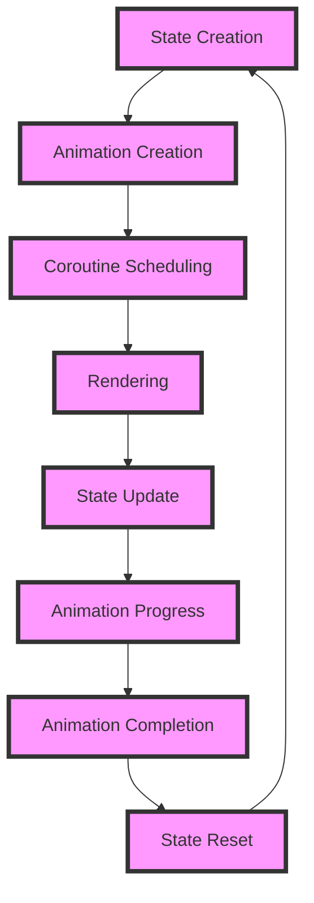

## Introduction
Animations are a crucial aspect of modern mobile applications, providing a seamless and engaging user experience. In Jetpack Compose, animations are achieved using various APIs, including `animateFloatAsState`, `AnimatedVisibility`, and `Crossfade`. These APIs enable developers to create complex animations with ease, making their applications more interactive and appealing. In this section, we will delve into the world of animations in Jetpack Compose, exploring the core concepts, internal mechanics, and best practices for implementing animations in production-ready applications.

> **Note:** Animations can greatly improve the user experience, but they can also introduce performance issues if not implemented correctly. It is essential to strike a balance between animation quality and application performance.

## Core Concepts
In Jetpack Compose, animations are built around several core concepts:
* **State**: The current state of an animation, which can be a value, a color, or a position.
* **Animation**: A sequence of states that are displayed over time, creating the illusion of movement or change.
* **Easing**: The rate at which an animation progresses, which can be linear, exponential, or custom.
* **Duration**: The length of time an animation takes to complete.

These concepts are fundamental to understanding how animations work in Jetpack Compose and how to implement them effectively.

> **Tip:** When designing animations, consider the 12 basic principles of animation, which include squash and stretch, anticipation, and timing. These principles can help create more realistic and engaging animations.

## How It Works Internally
Internally, Jetpack Compose uses a combination of Kotlin Coroutines and the Android Animation API to manage animations. When an animation is triggered, the following steps occur:
1. **State creation**: The animation state is created, which defines the initial and final values of the animation.
2. **Animation creation**: The animation is created, which defines the easing, duration, and other properties of the animation.
3. **Coroutine scheduling**: The animation is scheduled to run on a coroutine, which manages the animation's progress over time.
4. **Rendering**: The animation is rendered on the screen, with the state being updated at regular intervals.

This process is handled automatically by Jetpack Compose, making it easy to implement animations without worrying about the underlying mechanics.

> **Warning:** Animations can be resource-intensive, especially if they involve complex graphics or large datasets. Be mindful of performance when designing animations, and use tools like the Android Profiler to optimize animation performance.

## Code Examples
### Example 1: Basic Animation
```kotlin
@Composable
fun BasicAnimation() {
    var offset by remember { mutableStateOf(0f) }
    LaunchedEffect(Unit) {
        offset = animateFloatAsState(targetValue = 100f, animationSpec = tween(500)).value
    }
    Text(text = "Hello, World!", modifier = Modifier.offset(x = offset.dp))
}
```
This example demonstrates a basic animation using `animateFloatAsState`, which animates a `Text` composable from its initial position to a final position 100dp away.

### Example 2: Animated Visibility
```kotlin
@Composable
fun AnimatedVisibilityExample() {
    var isVisible by remember { mutableStateOf(true) }
    AnimatedVisibility(visible = isVisible) {
        Text(text = "Hello, World!")
    }
    Button(onClick = { isVisible = !isVisible }) {
        Text(text = "Toggle Visibility")
    }
}
```
This example demonstrates how to use `AnimatedVisibility` to animate the visibility of a `Text` composable, with a `Button` to toggle the visibility.

### Example 3: Crossfade
```kotlin
@Composable
fun CrossfadeExample() {
    var isSelected by remember { mutableStateOf(false) }
    Crossfade(targetState = isSelected) { state ->
        if (state) {
            Text(text = "Selected")
        } else {
            Text(text = "Not Selected")
        }
    }
    Button(onClick = { isSelected = !isSelected }) {
        Text(text = "Toggle Selection")
    }
}
```
This example demonstrates how to use `Crossfade` to animate between two different composables based on a state variable.

## Visual Diagram

This diagram illustrates the internal mechanics of animations in Jetpack Compose, from state creation to animation completion.

> **Interview:** What is the difference between `animateFloatAsState` and `AnimatedVisibility`? Answer: `animateFloatAsState` is used to animate a single value, while `AnimatedVisibility` is used to animate the visibility of a composable.

## Comparison
| Approach | Time Complexity | Space Complexity | Pros | Cons | Best For |
| --- | --- | --- | --- | --- | --- |
| `animateFloatAsState` | O(1) | O(1) | Easy to use, flexible | Limited to single values | Simple animations |
| `AnimatedVisibility` | O(1) | O(1) | Easy to use, flexible | Limited to visibility animations | Visibility animations |
| `Crossfade` | O(1) | O(1) | Easy to use, flexible | Limited to two composables | Simple crossfade animations |
| Custom Animation | O(n) | O(n) | Highly customizable | Complex, resource-intensive | Complex animations |

## Real-world Use Cases
* **Google Maps**: Uses animations to transition between different map views, such as satellite and street view.
* **Instagram**: Uses animations to transition between different screens, such as the feed and stories.
* **Uber**: Uses animations to display the driver's location and estimated arrival time.

> **Tip:** When designing animations, consider the user's emotional response to the animation. Animations can evoke feelings of excitement, curiosity, or frustration, depending on their design.

## Common Pitfalls
* **Over-animating**: Using too many animations can lead to a cluttered and overwhelming user interface.
* **Under-animating**: Not using enough animations can lead to a dull and unengaging user interface.
* **Incorrect easing**: Using the wrong easing function can lead to unrealistic or jarring animations.
* **Performance issues**: Not optimizing animations for performance can lead to slow or laggy animations.

> **Warning:** Animations can be distracting or overwhelming if not designed carefully. Be mindful of the user's experience when designing animations.

## Interview Tips
* **What is the difference between `animateFloatAsState` and `AnimatedVisibility`?**: Answer: `animateFloatAsState` is used to animate a single value, while `AnimatedVisibility` is used to animate the visibility of a composable.
* **How do you optimize animations for performance?**: Answer: Use tools like the Android Profiler to identify performance bottlenecks, and optimize animation code to reduce overhead.
* **What is the best way to design animations for a user interface?**: Answer: Consider the user's emotional response to the animation, and design animations that are intuitive, engaging, and easy to use.

## Key Takeaways
* Animations are a crucial aspect of modern mobile applications.
* Jetpack Compose provides a range of APIs for creating animations, including `animateFloatAsState`, `AnimatedVisibility`, and `Crossfade`.
* Animations can be optimized for performance using tools like the Android Profiler.
* Animations should be designed with the user's emotional response in mind.
* Custom animations can be complex and resource-intensive, but offer high customization.
* `animateFloatAsState` is best for simple animations, while `AnimatedVisibility` is best for visibility animations.
* `Crossfade` is best for simple crossfade animations.