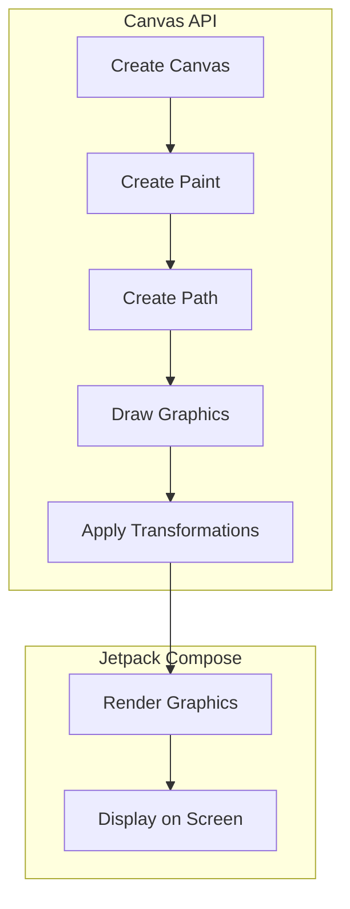

## Introduction
The **Canvas API** in **Jetpack Compose** is a powerful tool for creating custom graphics and animations in Android apps. It provides a low-level, flexible way to draw shapes, images, and text on the screen, allowing developers to create complex and engaging user interfaces. With the Canvas API, you can create everything from simple icons to complex animations, and even integrate with other Compose UI elements.

In real-world applications, the Canvas API is used in a variety of scenarios, such as:

* Creating custom icons and graphics for apps
* Building interactive animations and games
* Designing complex and dynamic user interfaces
* Integrating with other Compose UI elements, such as text and images

Every engineer working with Jetpack Compose should have a solid understanding of the Canvas API, as it provides a fundamental building block for creating custom and engaging user experiences.

## Core Concepts
The Canvas API is built around a few key concepts:

* **Canvas**: The Canvas is the surface on which graphics are drawn. It is a 2D drawing surface that can be used to draw shapes, images, and text.
* **Paint**: The Paint object is used to define the appearance of the graphics drawn on the Canvas. It includes properties such as color, stroke width, and font.
* **Path**: The Path object is used to define the shape of the graphics drawn on the Canvas. It can be used to draw lines, curves, and other shapes.
* **Layer**: The Layer object is used to group graphics together and apply transformations to them.

Understanding these core concepts is essential for working with the Canvas API.

> **Note:** The Canvas API is a low-level API, which means it provides a lot of flexibility and control over the drawing process. However, it also requires a good understanding of graphics programming concepts, such as coordinates, transformations, and clipping.

## How It Works Internally
When you use the Canvas API in Jetpack Compose, the following steps occur:

1. The Canvas is created and configured with the desired size and properties.
2. The Paint object is created and configured with the desired appearance properties.
3. The Path object is created and defined with the desired shape.
4. The graphics are drawn on the Canvas using the Paint and Path objects.
5. The Layer object is used to group the graphics together and apply transformations to them.
6. The final graphics are rendered on the screen.

Here is a high-level overview of the Canvas API workflow:
```kotlin
// Create a Canvas
val canvas = Canvas(100, 100)

// Create a Paint object
val paint = Paint().apply {
    color = Color.RED
    style = Paint.Style.FILL
}

// Create a Path object
val path = Path().apply {
    moveTo(10f, 10f)
    lineTo(90f, 90f)
}

// Draw the graphics on the Canvas
canvas.drawPath(path, paint)
```
> **Tip:** When working with the Canvas API, it's essential to understand the coordinate system and how transformations work. The Canvas API uses a 2D coordinate system, with the origin (0, 0) at the top-left corner of the screen.

## Code Examples
Here are three complete and runnable examples of using the Canvas API in Jetpack Compose:

**Example 1: Basic Usage**
```kotlin
@Composable
fun BasicCanvas() {
    Canvas(
        modifier = Modifier.size(200.dp),
        onDraw = {
            val paint = Paint().apply {
                color = Color.RED
                style = Paint.Style.FILL
            }
            drawRect(Rect(10f, 10f, 190f, 190f), paint)
        }
    )
}
```
This example creates a simple red square using the Canvas API.

**Example 2: Real-World Pattern**
```kotlin
@Composable
fun RealWorldPattern() {
    Canvas(
        modifier = Modifier.size(400.dp),
        onDraw = {
            val paint = Paint().apply {
                color = Color.BLUE
                style = Paint.Style.STROKE
                strokeWidth = 10f
            }
            drawPath(
                Path().apply {
                    moveTo(10f, 10f)
                    lineTo(390f, 390f)
                    lineTo(10f, 390f)
                    close()
                },
                paint
            )
        }
    )
}
```
This example creates a more complex shape using the Canvas API, with a blue border and a filled interior.

**Example 3: Advanced Usage**
```kotlin
@Composable
fun AdvancedUsage() {
    Canvas(
        modifier = Modifier.size(600.dp),
        onDraw = {
            val paint = Paint().apply {
                color = Color.GREEN
                style = Paint.Style.FILL
            }
            drawCircle(
                center = Offset(300f, 300f),
                radius = 200f,
                paint = paint
            )
            val textPaint = Paint().apply {
                color = Color.BLACK
                textSize = 48f
            }
            drawText(
                text = "Hello, World!",
                x = 100f,
                y = 100f,
                paint = textPaint
            )
        }
    )
}
```
This example creates a complex composition using the Canvas API, with a green circle, black text, and a custom layout.

## Visual Diagram

This diagram illustrates the workflow of the Canvas API in Jetpack Compose, from creating the Canvas and Paint objects to rendering the graphics on the screen.

## Comparison
Here is a comparison of the Canvas API with other graphics APIs in Android:
| API | Time Complexity | Space Complexity | Pros | Cons | Best For |
| --- | --- | --- | --- | --- | --- |
| Canvas API | O(1) | O(n) | Low-level control, flexible | Steep learning curve | Complex graphics, animations |
| Drawable | O(1) | O(1) | Easy to use, pre-built shapes | Limited customization | Simple graphics, icons |
| VectorDrawable | O(1) | O(1) | Scalable, pre-built shapes | Limited customization | Simple graphics, icons |
| SVG | O(1) | O(1) | Scalable, flexible | Limited support | Web-based graphics |

> **Warning:** The Canvas API has a steep learning curve due to its low-level nature. However, it provides a lot of flexibility and control over the drawing process, making it a good choice for complex graphics and animations.

## Real-world Use Cases
Here are three real-world use cases for the Canvas API:

1. **Instagram**: Instagram uses the Canvas API to create custom graphics and animations for its stories and reels features.
2. **TikTok**: TikTok uses the Canvas API to create custom graphics and animations for its short-form videos.
3. **Google Maps**: Google Maps uses the Canvas API to create custom maps and graphics for its navigation features.

## Common Pitfalls
Here are four common pitfalls to avoid when using the Canvas API:

1. **Incorrect Coordinate System**: Make sure to understand the coordinate system used by the Canvas API, which is a 2D system with the origin (0, 0) at the top-left corner of the screen.
2. **Insufficient Memory**: Make sure to allocate sufficient memory for the Canvas object, especially when working with large graphics.
3. **Incorrect Paint Properties**: Make sure to set the correct paint properties, such as color, style, and stroke width, to achieve the desired appearance.
4. **Incorrect Transformation**: Make sure to apply the correct transformations, such as rotation, scaling, and translation, to achieve the desired layout.

> **Tip:** When working with the Canvas API, it's essential to test and debug your code thoroughly to avoid common pitfalls and ensure the desired appearance and behavior.

## Interview Tips
Here are three common interview questions related to the Canvas API:

1. **What is the difference between the Canvas API and the Drawable API?**
	* Weak answer: "The Canvas API is used for complex graphics, while the Drawable API is used for simple graphics."
	* Strong answer: "The Canvas API provides a low-level, flexible way to draw graphics, while the Drawable API provides a high-level, pre-built way to draw graphics. The Canvas API is better suited for complex graphics and animations, while the Drawable API is better suited for simple graphics and icons."
2. **How do you optimize the performance of the Canvas API?**
	* Weak answer: "I use the `draw` method to draw graphics on the Canvas."
	* Strong answer: "I use the `draw` method to draw graphics on the Canvas, and I also use techniques such as caching, clipping, and batching to optimize performance. I also make sure to allocate sufficient memory for the Canvas object and to set the correct paint properties to achieve the desired appearance."
3. **What are some common use cases for the Canvas API?**
	* Weak answer: "The Canvas API is used for graphics and animations."
	* Strong answer: "The Canvas API is used for a variety of use cases, including complex graphics and animations, custom maps and graphics, and interactive user interfaces. It is also used in applications such as Instagram, TikTok, and Google Maps to create custom graphics and animations."

## Key Takeaways
Here are ten key takeaways to remember when working with the Canvas API:

* The Canvas API provides a low-level, flexible way to draw graphics on the screen.
* The Canvas API uses a 2D coordinate system with the origin (0, 0) at the top-left corner of the screen.
* The Paint object is used to define the appearance of the graphics drawn on the Canvas.
* The Path object is used to define the shape of the graphics drawn on the Canvas.
* The Layer object is used to group graphics together and apply transformations to them.
* The Canvas API has a steep learning curve due to its low-level nature.
* The Canvas API is better suited for complex graphics and animations than the Drawable API.
* The Canvas API can be used to create custom maps and graphics, as well as interactive user interfaces.
* The Canvas API is used in a variety of applications, including Instagram, TikTok, and Google Maps.
* The Canvas API requires a good understanding of graphics programming concepts, such as coordinates, transformations, and clipping.