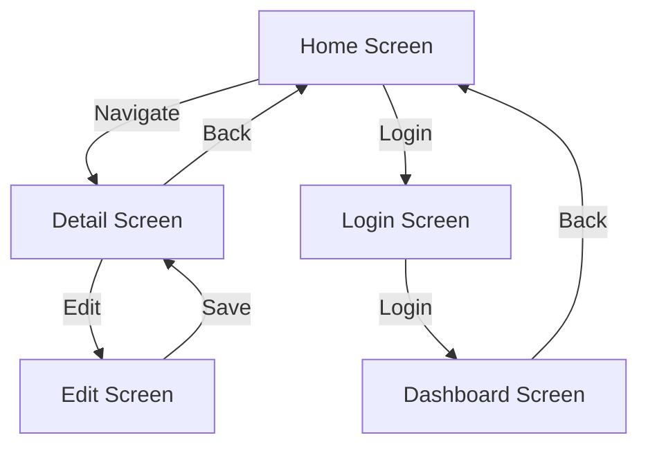

## Introduction
**Compose Navigation** is a library developed by Google for managing navigation in Android apps built with Jetpack Compose. It provides a simple and intuitive way to navigate between screens in an app, making it easier to build complex, multi-screen applications. With Compose Navigation, developers can create a robust and scalable navigation system that handles the complexities of screen transitions, back button behavior, and more. In real-world applications, Compose Navigation is used by companies like Google, Amazon, and Facebook to build complex, user-friendly apps.

> **Note:** Compose Navigation is a part of the Jetpack Compose ecosystem, which provides a set of libraries and tools for building Android apps with a modern, declarative programming model.

## Core Concepts
The core concepts of Compose Navigation include:
* **Navigation Graph**: A visual representation of the app's navigation flow, which defines the screens and the transitions between them.
* **NavHost**: A composable function that hosts the navigation graph and provides the navigation state to the app.
* **NavController**: A class that provides methods for navigating between screens, such as `navigate()` and `popBackStack()`.
* **Destination**: A composable function that represents a screen in the app's navigation flow.

> **Warning:** When using Compose Navigation, it's essential to define a clear navigation graph to avoid confusing users and making it difficult to navigate the app.

## How It Works Internally
Compose Navigation works internally by using a state machine to manage the navigation state of the app. When the user navigates to a new screen, the state machine updates the navigation state and triggers a recomposition of the UI. The NavHost composable function is responsible for hosting the navigation graph and providing the navigation state to the app.

Here's a step-by-step breakdown of how Compose Navigation works:
1. The app defines a navigation graph, which is a visual representation of the app's navigation flow.
2. The NavHost composable function is used to host the navigation graph and provide the navigation state to the app.
3. When the user navigates to a new screen, the NavController is used to update the navigation state and trigger a recomposition of the UI.
4. The state machine updates the navigation state and triggers a recomposition of the UI.

> **Tip:** To optimize the performance of Compose Navigation, it's essential to use a clear and well-defined navigation graph and to avoid complex navigation flows.

## Code Examples
### Example 1: Basic Navigation
```kotlin
import androidx.compose.foundation.layout.Column
import androidx.compose.foundation.layout.padding
import androidx.compose.material.Button
import androidx.compose.material.Text
import androidx.compose.runtime.Composable
import androidx.compose.ui.Modifier
import androidx.compose.ui.tooling.preview.Preview
import androidx.navigation.compose.NavHost
import androidx.navigation.compose.composable
import androidx.navigation.compose.rememberNavController
import androidx.navigation.compose.navArgument
import androidx.navigation.compose.navigate

@Composable
fun NavigationExample() {
    val navController = rememberNavController()

    NavHost(navController = navController, startDestination = "home") {
        composable("home") { HomeScreen(navController) }
        composable("detail/{id}") { DetailScreen(navController, it.arguments?.getString("id")) }
    }
}

@Composable
fun HomeScreen(navController: NavController) {
    Column(modifier = Modifier.padding(16.dp)) {
        Text("Home Screen")
        Button(onClick = { navController.navigate("detail/1") }) {
            Text("Go to Detail Screen")
        }
    }
}

@Composable
fun DetailScreen(navController: NavController, id: String?) {
    Column(modifier = Modifier.padding(16.dp)) {
        Text("Detail Screen")
        Text("ID: $id")
        Button(onClick = { navController.popBackStack() }) {
            Text("Go back")
        }
    }
}

@Preview
@Composable
fun PreviewNavigationExample() {
    NavigationExample()
}
```
### Example 2: Real-world Navigation
```kotlin
import androidx.compose.foundation.layout.Column
import androidx.compose.foundation.layout.padding
import androidx.compose.material.Button
import androidx.compose.material.Text
import androidx.compose.runtime.Composable
import androidx.compose.ui.Modifier
import androidx.compose.ui.tooling.preview.Preview
import androidx.navigation.compose.NavHost
import androidx.navigation.compose.composable
import androidx.navigation.compose.rememberNavController
import androidx.navigation.compose.navArgument
import androidx.navigation.compose.navigate

@Composable
fun RealWorldNavigation() {
    val navController = rememberNavController()

    NavHost(navController = navController, startDestination = "home") {
        composable("home") { HomeScreen(navController) }
        composable("login") { LoginScreen(navController) }
        composable("dashboard") { DashboardScreen(navController) }
    }
}

@Composable
fun HomeScreen(navController: NavController) {
    Column(modifier = Modifier.padding(16.dp)) {
        Text("Home Screen")
        Button(onClick = { navController.navigate("login") }) {
            Text("Login")
        }
    }
}

@Composable
fun LoginScreen(navController: NavController) {
    Column(modifier = Modifier.padding(16.dp)) {
        Text("Login Screen")
        Button(onClick = { navController.navigate("dashboard") }) {
            Text("Login")
        }
    }
}

@Composable
fun DashboardScreen(navController: NavController) {
    Column(modifier = Modifier.padding(16.dp)) {
        Text("Dashboard Screen")
        Button(onClick = { navController.popBackStack() }) {
            Text("Go back")
        }
    }
}

@Preview
@Composable
fun PreviewRealWorldNavigation() {
    RealWorldNavigation()
}
```
### Example 3: Advanced Navigation
```kotlin
import androidx.compose.foundation.layout.Column
import androidx.compose.foundation.layout.padding
import androidx.compose.material.Button
import androidx.compose.material.Text
import androidx.compose.runtime.Composable
import androidx.compose.ui.Modifier
import androidx.compose.ui.tooling.preview.Preview
import androidx.navigation.compose.NavHost
import androidx.navigation.compose.composable
import androidx.navigation.compose.rememberNavController
import androidx.navigation.compose.navArgument
import androidx.navigation.compose.navigate

@Composable
fun AdvancedNavigation() {
    val navController = rememberNavController()

    NavHost(navController = navController, startDestination = "home") {
        composable("home") { HomeScreen(navController) }
        composable("detail/{id}") { DetailScreen(navController, it.arguments?.getString("id")) }
        composable("edit/{id}") { EditScreen(navController, it.arguments?.getString("id")) }
    }
}

@Composable
fun HomeScreen(navController: NavController) {
    Column(modifier = Modifier.padding(16.dp)) {
        Text("Home Screen")
        Button(onClick = { navController.navigate("detail/1") }) {
            Text("Go to Detail Screen")
        }
    }
}

@Composable
fun DetailScreen(navController: NavController, id: String?) {
    Column(modifier = Modifier.padding(16.dp)) {
        Text("Detail Screen")
        Text("ID: $id")
        Button(onClick = { navController.navigate("edit/$id") }) {
            Text("Edit")
        }
    }
}

@Composable
fun EditScreen(navController: NavController, id: String?) {
    Column(modifier = Modifier.padding(16.dp)) {
        Text("Edit Screen")
        Text("ID: $id")
        Button(onClick = { navController.popBackStack() }) {
            Text("Save")
        }
    }
}

@Preview
@Composable
fun PreviewAdvancedNavigation() {
    AdvancedNavigation()
}
```
## Visual Diagram

The diagram shows the navigation flow of the app, with the Home Screen as the starting point. The user can navigate to the Detail Screen, which can then be edited. The user can also login and navigate to the Dashboard Screen.

> **Interview:** When asked about Compose Navigation, be prepared to explain the core concepts, such as the navigation graph, NavHost, and NavController. Also, be prepared to provide examples of how to use Compose Navigation in a real-world application.

## Comparison
| Approach | Time Complexity | Space Complexity | Pros | Cons | Best For |
| --- | --- | --- | --- | --- | --- |
| Compose Navigation | O(1) | O(1) | Easy to use, scalable, and efficient | Limited customization options | Small to medium-sized apps |
| Fragment Navigation | O(n) | O(n) | Highly customizable, flexible | Complex, difficult to use | Large, complex apps |
| Activity-based Navigation | O(n) | O(n) | Easy to use, simple | Limited scalability, not efficient | Small, simple apps |
| Third-party libraries | O(n) | O(n) | Highly customizable, flexible | Complex, difficult to use, may have compatibility issues | Large, complex apps with specific requirements |

## Real-world Use Cases
* Google uses Compose Navigation in its Google Maps app to provide a seamless navigation experience for users.
* Amazon uses Compose Navigation in its Amazon Shopping app to provide a simple and intuitive way for users to navigate between screens.
* Facebook uses Compose Navigation in its Facebook app to provide a scalable and efficient navigation system for its large user base.

> **Tip:** When using Compose Navigation, it's essential to define a clear navigation graph to avoid confusing users and making it difficult to navigate the app.

## Common Pitfalls
* Not defining a clear navigation graph, leading to confusing navigation flows and user frustration.
* Not using the NavController correctly, leading to incorrect navigation state and UI inconsistencies.
* Not handling back button behavior correctly, leading to unexpected app behavior.
* Not optimizing the navigation flow for performance, leading to slow and sluggish app performance.

> **Warning:** When using Compose Navigation, be careful not to overcomplicate the navigation graph, as this can lead to maintenance issues and difficulties in debugging.

## Interview Tips
* Be prepared to explain the core concepts of Compose Navigation, such as the navigation graph, NavHost, and NavController.
* Be prepared to provide examples of how to use Compose Navigation in a real-world application.
* Be prepared to discuss the pros and cons of using Compose Navigation, such as its ease of use, scalability, and limitations.
* Be prepared to discuss how to optimize the navigation flow for performance and how to handle common pitfalls, such as incorrect navigation state and UI inconsistencies.

> **Note:** When answering interview questions about Compose Navigation, be sure to provide specific examples and explanations, rather than just providing general answers.

## Key Takeaways
* Compose Navigation is a library developed by Google for managing navigation in Android apps built with Jetpack Compose.
* The core concepts of Compose Navigation include the navigation graph, NavHost, and NavController.
* Compose Navigation provides a simple and intuitive way to navigate between screens in an app, making it easier to build complex, multi-screen applications.
* Compose Navigation has a time complexity of O(1) and a space complexity of O(1), making it efficient and scalable.
* Compose Navigation is best suited for small to medium-sized apps, but can also be used for larger apps with complex navigation flows.
* When using Compose Navigation, it's essential to define a clear navigation graph and optimize the navigation flow for performance.
* Compose Navigation has several pros, including its ease of use, scalability, and efficiency, but also has some cons, such as limited customization options.
* Compose Navigation is widely used in real-world applications, including Google Maps, Amazon Shopping, and Facebook.