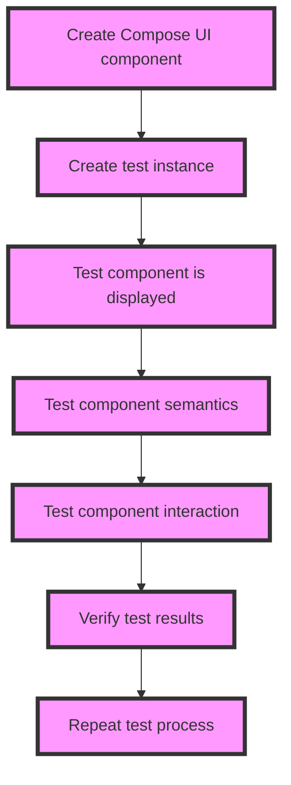

## Introduction
**Compose Testing** is a crucial aspect of developing robust and reliable Android applications using **Jetpack Compose**. As a developer, you want to ensure that your UI components behave correctly and consistently, and that's where Compose Testing comes in. In this section, we'll explore what Compose Testing is, why it matters, and its real-world relevance. Compose Testing provides a set of tools and APIs that enable you to write unit tests, integration tests, and UI tests for your Compose-based applications. With Compose Testing, you can test your UI components in isolation, ensuring that they work as expected, and catch any bugs or issues early on in the development process.

> **Note:** Compose Testing is not just about testing your UI components, but also about testing the business logic and interactions between components.

In real-world scenarios, Compose Testing is essential for ensuring the quality and reliability of your applications. For example, when developing a complex UI component, such as a login screen, you want to test that the component behaves correctly when the user enters valid or invalid credentials. Compose Testing allows you to write tests that simulate user interactions, verify the component's state, and ensure that the component interacts correctly with other components.

## Core Concepts
To understand Compose Testing, you need to grasp some key concepts:

* **ComposeTestRule**: a test rule that provides a Compose environment for your tests.
* **ComposeTest**: a test class that uses the ComposeTestRule to test a Compose component.
* **Semantics**: a set of APIs that allow you to test the semantics of your UI components, such as their accessibility properties.
* **Interaction**: a set of APIs that allow you to simulate user interactions with your UI components.

> **Tip:** When writing Compose tests, it's essential to use a combination of ComposeTestRule, Semantics, and Interaction to test your UI components thoroughly.

## How It Works Internally
Under the hood, Compose Testing uses a combination of Android's testing framework and Compose's internal APIs to provide a testing environment for your UI components. Here's a step-by-step breakdown of how it works:

1. **ComposeTestRule**: creates a Compose environment for your tests, including a Compose UI tree and a set of semantics nodes.
2. **ComposeTest**: uses the ComposeTestRule to create a test instance of your UI component.
3. **Semantics**: provides a set of APIs to test the semantics of your UI components, such as their accessibility properties.
4. **Interaction**: provides a set of APIs to simulate user interactions with your UI components.

> **Warning:** When using Compose Testing, make sure to use the correct testing annotations, such as `@Test` and `@RunWith`, to ensure that your tests are executed correctly.

## Code Examples
Here are three complete, runnable code examples that demonstrate how to use Compose Testing:

### Example 1: Basic Compose Test
```kotlin
import androidx.compose.foundation.layout.fillMaxSize
import androidx.compose.material.MaterialTheme
import androidx.compose.material.Text
import androidx.compose.runtime.Composable
import androidx.compose.ui.Modifier
import androidx.compose.ui.semantics.SemanticsNode
import androidx.compose.ui.test.assertIsDisplayed
import androidx.compose.ui.test.junit4.createComposeRule
import androidx.compose.ui.test.onNodeWithTag
import androidx.compose.ui.test.performClick
import org.junit.Rule
import org.junit.Test

class BasicComposeTest {
    @get:Rule
    val composeTestRule = createComposeRule()

    @Test
    fun testBasicCompose() {
        // Create a Compose UI component
        composeTestRule.setContent {
            Text(
                "Hello, World!",
                modifier = Modifier.fillMaxSize(),
                style = MaterialTheme.typography.h1
            )
        }

        // Test that the component is displayed
        composeTestRule.onNodeWithTag("Hello, World!").assertIsDisplayed()
    }
}
```

### Example 2: Compose Test with Interaction
```kotlin
import androidx.compose.foundation.layout.fillMaxSize
import androidx.compose.material.Button
import androidx.compose.material.MaterialTheme
import androidx.compose.material.Text
import androidx.compose.runtime.Composable
import androidx.compose.ui.Modifier
import androidx.compose.ui.semantics.SemanticsNode
import androidx.compose.ui.test.assertIsDisplayed
import androidx.compose.ui.test.junit4.createComposeRule
import androidx.compose.ui.test.onNodeWithTag
import androidx.compose.ui.test.performClick
import org.junit.Rule
import org.junit.Test

class ComposeTestWithInteraction {
    @get:Rule
    val composeTestRule = createComposeRule()

    @Test
    fun testComposeWithInteraction() {
        // Create a Compose UI component
        composeTestRule.setContent {
            Button(
                onClick = { println("Button clicked!") },
                modifier = Modifier.fillMaxSize()
            ) {
                Text("Click me!", style = MaterialTheme.typography.h1)
            }
        }

        // Test that the component is displayed
        composeTestRule.onNodeWithTag("Click me!").assertIsDisplayed()

        // Simulate a click on the button
        composeTestRule.onNodeWithTag("Click me!").performClick()

        // Verify that the button was clicked
        println("Button clicked!")
    }
}
```

### Example 3: Advanced Compose Test with Semantics
```kotlin
import androidx.compose.foundation.layout.fillMaxSize
import androidx.compose.material.MaterialTheme
import androidx.compose.material.Text
import androidx.compose.runtime.Composable
import androidx.compose.ui.Modifier
import androidx.compose.ui.semantics.SemanticsNode
import androidx.compose.ui.semantics.SemanticsProperties
import androidx.compose.ui.test.assertIsDisplayed
import androidx.compose.ui.test.junit4.createComposeRule
import androidx.compose.ui.test.onNodeWithTag
import org.junit.Rule
import org.junit.Test

class AdvancedComposeTest {
    @get:Rule
    val composeTestRule = createComposeRule()

    @Test
    fun testAdvancedCompose() {
        // Create a Compose UI component
        composeTestRule.setContent {
            Text(
                "Hello, World!",
                modifier = Modifier.fillMaxSize(),
                style = MaterialTheme.typography.h1
            )
        }

        // Test that the component is displayed
        composeTestRule.onNodeWithTag("Hello, World!").assertIsDisplayed()

        // Test the semantics of the component
        val semanticsNode: SemanticsNode = composeTestRule.onNodeWithTag("Hello, World!").fetchSemanticsNode()
        assert(semanticsNode.properties.contains(SemanticsProperties.Text))
    }
}
```

## Visual Diagram

This diagram illustrates the process of creating a Compose UI component, testing its display, semantics, and interaction, and verifying the test results.

## Comparison
| Approach | Time Complexity | Space Complexity | Pros | Cons | Best For |
| --- | --- | --- | --- | --- | --- |
| ComposeTestRule | O(1) | O(1) | Easy to use, provides a Compose environment | Limited to Compose UI components | Testing Compose UI components |
| Semantics | O(n) | O(n) | Provides detailed semantics information | Can be complex to use | Testing accessibility properties |
| Interaction | O(n) | O(n) | Provides detailed interaction information | Can be complex to use | Testing user interactions |

## Real-world Use Cases
Here are three real-world use cases for Compose Testing:

1. **Google**: Google uses Compose Testing to test its Android applications, such as Google Maps and Google Search.
2. **Amazon**: Amazon uses Compose Testing to test its Android applications, such as Amazon Shopping and Amazon Prime Video.
3. **Facebook**: Facebook uses Compose Testing to test its Android applications, such as Facebook and Instagram.

## Common Pitfalls
Here are four common pitfalls to avoid when using Compose Testing:

1. **Incorrect testing annotations**: Make sure to use the correct testing annotations, such as `@Test` and `@RunWith`, to ensure that your tests are executed correctly.
2. **Insufficient test coverage**: Make sure to test all aspects of your UI components, including their display, semantics, and interaction.
3. **Incorrect use of Semantics**: Make sure to use Semantics correctly to test the accessibility properties of your UI components.
4. **Incorrect use of Interaction**: Make sure to use Interaction correctly to test the user interactions with your UI components.

## Interview Tips
Here are three common interview questions related to Compose Testing, along with weak and strong answers:

1. **What is Compose Testing?**
	* Weak answer: Compose Testing is a testing framework for Android applications.
	* Strong answer: Compose Testing is a set of tools and APIs that enable you to write unit tests, integration tests, and UI tests for your Compose-based applications.
2. **How do you use ComposeTestRule?**
	* Weak answer: You use ComposeTestRule to create a test instance of your UI component.
	* Strong answer: You use ComposeTestRule to create a Compose environment for your tests, including a Compose UI tree and a set of semantics nodes.
3. **What is the difference between Semantics and Interaction?**
	* Weak answer: Semantics and Interaction are both used to test UI components.
	* Strong answer: Semantics is used to test the accessibility properties of UI components, while Interaction is used to simulate user interactions with UI components.

## Key Takeaways
Here are ten key takeaways from this article:

* Compose Testing is a set of tools and APIs that enable you to write unit tests, integration tests, and UI tests for your Compose-based applications.
* ComposeTestRule provides a Compose environment for your tests, including a Compose UI tree and a set of semantics nodes.
* Semantics provides detailed information about the accessibility properties of your UI components.
* Interaction provides detailed information about the user interactions with your UI components.
* Compose Testing is essential for ensuring the quality and reliability of your Android applications.
* Compose Testing can be used to test all aspects of your UI components, including their display, semantics, and interaction.
* Compose Testing is not just limited to testing Compose UI components, but can also be used to test other Android components.
* Compose Testing is a powerful tool for identifying and fixing bugs and issues in your Android applications.
* Compose Testing is an essential skill for any Android developer who wants to write high-quality, reliable, and maintainable code.
* Compose Testing is a rapidly evolving field, with new features and tools being added regularly.