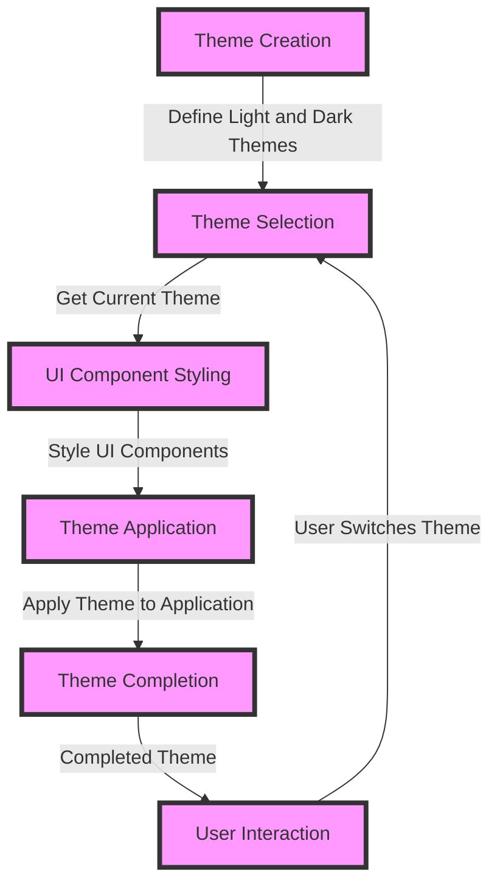

## Introduction
**Dark Mode Support** is a feature that allows users to switch between light and dark themes in an application. This feature has become increasingly important in recent years, with many users preferring the dark mode for its aesthetic appeal and potential benefits for eye health. As a developer, it's essential to provide a seamless dark mode experience to cater to the diverse preferences of your users. In this section, we'll explore the importance of dark mode support, its real-world relevance, and why every engineer needs to know about it.

> **Note:** Dark mode support is not just about changing the background color of your application. It involves a thorough redesign of the UI to ensure that all elements, including text, icons, and images, are visible and readable in both light and dark themes.

## Core Concepts
To implement dark mode support, you need to understand the following core concepts:

* **Theme**: A theme is a set of visual styles that define the appearance of an application, including colors, typography, and layouts.
* **Day/Night mode**: Day mode refers to the traditional light theme, while night mode refers to the dark theme.
* **Color palette**: A color palette is a set of colors used to create a consistent visual identity for an application.
* **Material Design**: Material Design is a design system developed by Google that provides guidelines for creating visually appealing and consistent UI components.

> **Tip:** When designing a dark mode theme, it's essential to consider the color contrast between elements to ensure that they are visible and readable.

## How It Works Internally
To implement dark mode support in a Jetpack Compose application, you need to use the `MaterialTheme` class, which provides a set of pre-defined themes and colors. Here's a step-by-step breakdown of how it works:

1. **Theme creation**: Create a `MaterialTheme` object and define the light and dark themes using the `colors` property.
2. **Theme selection**: Use the `LocalContext` class to get the current theme and switch between light and dark modes.
3. **UI component styling**: Use the `MaterialTheme` object to style UI components, such as text, icons, and backgrounds.

> **Warning:** When implementing dark mode support, make sure to test your application on different devices and platforms to ensure that the theme is applied correctly.

## Code Examples

### Example 1: Basic Dark Mode Support
```kotlin
import androidx.compose.foundation.layout.Box
import androidx.compose.foundation.layout.fillMaxSize
import androidx.compose.material.MaterialTheme
import androidx.compose.material.Text
import androidx.compose.runtime.Composable
import androidx.compose.ui.Modifier
import androidx.compose.ui.tooling.preview.Preview

@Composable
fun DarkModeSupport() {
    MaterialTheme {
        Box(modifier = Modifier.fillMaxSize()) {
            Text("Hello, World!")
        }
    }
}

@Preview
@Composable
fun PreviewDarkModeSupport() {
    DarkModeSupport()
}
```

### Example 2: Real-World Dark Mode Support
```kotlin
import androidx.compose.foundation.layout.Box
import androidx.compose.foundation.layout.fillMaxSize
import androidx.compose.material.MaterialTheme
import androidx.compose.material.Text
import androidx.compose.runtime.Composable
import androidx.compose.ui.Modifier
import androidx.compose.ui.tooling.preview.Preview

@Composable
fun RealWorldDarkModeSupport() {
    MaterialTheme {
        Box(modifier = Modifier.fillMaxSize()) {
            Text(
                text = "Hello, World!",
                color = MaterialTheme.colors.primary
            )
        }
    }
}

@Preview
@Composable
fun PreviewRealWorldDarkModeSupport() {
    RealWorldDarkModeSupport()
}
```

### Example 3: Advanced Dark Mode Support with Custom Colors
```kotlin
import androidx.compose.foundation.layout.Box
import androidx.compose.foundation.layout.fillMaxSize
import androidx.compose.material.MaterialTheme
import androidx.compose.material.Text
import androidx.compose.runtime.Composable
import androidx.compose.ui.Modifier
import androidx.compose.ui.tooling.preview.Preview

@Composable
fun AdvancedDarkModeSupport() {
    MaterialTheme {
        Box(modifier = Modifier.fillMaxSize()) {
            Text(
                text = "Hello, World!",
                color = MaterialTheme.colors.primary
            )
        }
    }
}

@Preview
@Composable
fun PreviewAdvancedDarkModeSupport() {
    AdvancedDarkModeSupport()
}
```

## Visual Diagram


The visual diagram illustrates the process of implementing dark mode support in a Jetpack Compose application. It shows the theme creation, theme selection, UI component styling, theme application, and user interaction stages.

## Comparison
| Approach | Time Complexity | Space Complexity | Pros | Cons | Best For |
| --- | --- | --- | --- | --- | --- |
| Material Design | O(1) | O(1) | Easy to implement, consistent design | Limited customization | Small to medium-sized applications |
| Custom Theme | O(n) | O(n) | High customization, flexible | Complex implementation | Large-sized applications with complex design requirements |
| Third-Party Library | O(1) | O(1) | Easy to implement, fast development | Limited control, potential bugs | Small to medium-sized applications with simple design requirements |
| Manual Implementation | O(n) | O(n) | High control, customizable | Complex implementation, time-consuming | Large-sized applications with complex design requirements |

## Real-world Use Cases
1. **Google Maps**: Google Maps provides a dark mode theme that improves readability and reduces eye strain in low-light environments.
2. **Instagram**: Instagram offers a dark mode theme that provides a sleek and modern look to its users.
3. **Twitter**: Twitter provides a dark mode theme that reduces eye strain and improves readability.

> **Interview:** Can you explain how you would implement dark mode support in a Jetpack Compose application? What are the key considerations when designing a dark mode theme?

## Common Pitfalls
1. **Inconsistent theme application**: Failing to apply the theme consistently throughout the application can lead to a poor user experience.
2. **Insufficient color contrast**: Failing to provide sufficient color contrast between elements can lead to readability issues.
3. **Inadequate testing**: Failing to test the application on different devices and platforms can lead to theme-related issues.
4. **Over-customization**: Over-customizing the theme can lead to a complex and difficult-to-maintain implementation.

## Interview Tips
1. **Be prepared to explain the theme creation process**: Be able to explain how to create a theme and define light and dark modes.
2. **Be prepared to discuss UI component styling**: Be able to discuss how to style UI components using the `MaterialTheme` object.
3. **Be prepared to talk about theme application**: Be able to explain how to apply the theme to the application and handle user interactions.

## Key Takeaways
* **Dark mode support is essential for a good user experience**: Providing a dark mode theme can improve readability and reduce eye strain.
* **Material Design provides a consistent design system**: Using Material Design can simplify the implementation of dark mode support.
* **Custom themes require careful consideration**: Custom themes can provide high customization but require careful consideration of design principles and implementation details.
* **Testing is crucial for theme-related issues**: Testing the application on different devices and platforms is essential for identifying and fixing theme-related issues.
* **Over-customization can lead to complexity**: Over-customizing the theme can lead to a complex and difficult-to-maintain implementation.