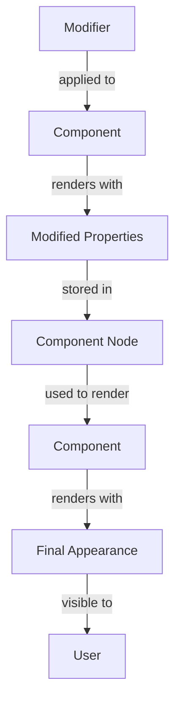

## Introduction
Modifiers in Jetpack Compose are a powerful tool for customizing the appearance and behavior of UI components. They can be used to add padding, change the background color, make a component clickable, and more. In this section, we'll explore what modifiers are, why they matter, and their real-world relevance. Modifiers are essential in Android app development, as they provide a flexible way to create complex UI layouts without the need for nested views.

> **Note:** Modifiers are a fundamental concept in Jetpack Compose, and understanding how to use them effectively is crucial for building robust and maintainable UI components.

## Core Concepts
Modifiers are functions that take a `Modifier` object as an argument and return a new `Modifier` object. They can be combined using the `then` function to create complex modifier chains. There are several types of modifiers, including:

* **Padding modifiers**: add space around a component
* **Size modifiers**: control the size of a component
* **Layout modifiers**: control the layout of a component
* **Interactive modifiers**: make a component clickable or focusable
* **Appearance modifiers**: change the appearance of a component, such as its background color or border

> **Tip:** When working with modifiers, it's essential to understand the order in which they are applied. Modifiers are applied in the order they are defined, so it's crucial to define them in the correct order to achieve the desired effect.

## How It Works Internally
Modifiers work by creating a new `Modifier` object that contains the modified properties. When a modifier is applied to a component, it creates a new `Modifier` object that contains the modified properties. This new object is then used to render the component. The `Modifier` class is a part of the Jetpack Compose UI toolkit and provides a set of functions for creating and combining modifiers.

Here's a step-by-step breakdown of how modifiers work internally:

1. A modifier function is called, passing a `Modifier` object as an argument.
2. The modifier function returns a new `Modifier` object that contains the modified properties.
3. The new `Modifier` object is then used to render the component.
4. The `Modifier` object is stored in the component's node, which is used to render the component.

> **Warning:** Modifiers can have a significant impact on performance, especially when used excessively. It's essential to use modifiers judiciously and only when necessary to avoid performance issues.

## Code Examples
### Example 1: Basic Modifier Usage
```kotlin
import androidx.compose.foundation.layout.padding
import androidx.compose.foundation.layout.size
import androidx.compose.material.Text
import androidx.compose.runtime.Composable
import androidx.compose.ui.Modifier
import androidx.compose.ui.unit.dp

@Composable
fun ModifierExample() {
    Text(
        text = "Hello, World!",
        modifier = Modifier
            .padding(16.dp)
            .size(100.dp)
    )
}
```
This example demonstrates how to use the `padding` and `size` modifiers to add space around a `Text` component and set its size.

### Example 2: Real-world Pattern
```kotlin
import androidx.compose.foundation.layout.Column
import androidx.compose.foundation.layout.fillMaxSize
import androidx.compose.foundation.layout.padding
import androidx.compose.material.Button
import androidx.compose.material.Text
import androidx.compose.runtime.Composable
import androidx.compose.ui.Modifier
import androidx.compose.ui.unit.dp

@Composable
fun LoginScreen() {
    Column(
        modifier = Modifier
            .fillMaxSize()
            .padding(16.dp)
    ) {
        Text(text = "Login")
        Button(onClick = { /* handle click */ }) {
            Text(text = "Login")
        }
    }
}
```
This example demonstrates how to use the `fillMaxSize` and `padding` modifiers to create a login screen with a column layout.

### Example 3: Advanced Modifier Usage
```kotlin
import androidx.compose.foundation.layout.Box
import androidx.compose.foundation.layout.fillMaxSize
import androidx.compose.foundation.layout.padding
import androidx.compose.material.Button
import androidx.compose.material.Text
import androidx.compose.runtime.Composable
import androidx.compose.ui.Modifier
import androidx.compose.ui.unit.dp

@Composable
fun AdvancedModifierExample() {
    Box(
        modifier = Modifier
            .fillMaxSize()
            .padding(16.dp)
    ) {
        Button(
            onClick = { /* handle click */ },
            modifier = Modifier
                .align(Alignment.Center)
                .padding(8.dp)
        ) {
            Text(text = "Click me!")
        }
    }
}
```
This example demonstrates how to use the `align` and `padding` modifiers to center a `Button` component within a `Box` layout.

## Visual Diagram

This diagram illustrates the process of applying a modifier to a component and how it affects the component's appearance.

> **Note:** The diagram shows the flow of modifier application and how it affects the component's appearance. It's essential to understand this process to use modifiers effectively.

## Comparison
| Modifier | Description | Time Complexity | Space Complexity | Pros | Cons |
| --- | --- | --- | --- | --- | --- |
| padding | adds space around a component | O(1) | O(1) | easy to use, flexible | can be slow for large components |
| size | sets the size of a component | O(1) | O(1) | easy to use, flexible | can be slow for large components |
| fillMaxSize | fills the available space | O(1) | O(1) | easy to use, flexible | can be slow for large components |
| clickable | makes a component clickable | O(1) | O(1) | easy to use, flexible | can be slow for large components |
| background | sets the background color of a component | O(1) | O(1) | easy to use, flexible | can be slow for large components |

> **Tip:** When choosing a modifier, consider the time and space complexity of the modifier, as well as its pros and cons. This will help you make an informed decision and use the modifier effectively.

## Real-world Use Cases
* **Google Maps**: uses modifiers to create custom map markers and overlays
* **Instagram**: uses modifiers to create custom UI components, such as buttons and text fields
* **Twitter**: uses modifiers to create custom UI components, such as buttons and text fields

> **Note:** Modifiers are widely used in real-world applications to create custom UI components and layouts. They provide a flexible and efficient way to create complex UI layouts.

## Common Pitfalls
* **Overusing modifiers**: using too many modifiers can slow down the application and make it harder to maintain
* **Not understanding modifier order**: not understanding the order in which modifiers are applied can lead to unexpected behavior
* **Not using modifiers judiciously**: not using modifiers judiciously can lead to performance issues and make the application harder to maintain
* **Not testing modifiers**: not testing modifiers can lead to unexpected behavior and bugs

> **Warning:** Modifiers can be tricky to use, and it's essential to avoid common pitfalls to ensure that your application is maintainable and efficient.

## Interview Tips
* **What is a modifier in Jetpack Compose?**: a modifier is a function that takes a `Modifier` object as an argument and returns a new `Modifier` object
* **How do you use modifiers in Jetpack Compose?**: modifiers are used to customize the appearance and behavior of UI components
* **What are some common modifiers in Jetpack Compose?**: common modifiers include `padding`, `size`, `fillMaxSize`, `clickable`, and `background`

> **Interview:** When asked about modifiers in an interview, be sure to explain what they are, how they are used, and provide examples of common modifiers.

## Key Takeaways
* **Modifiers are functions that take a `Modifier` object as an argument and return a new `Modifier` object**
* **Modifiers are used to customize the appearance and behavior of UI components**
* **Common modifiers include `padding`, `size`, `fillMaxSize`, `clickable`, and `background`**
* **Modifiers can be combined using the `then` function to create complex modifier chains**
* **Modifiers can have a significant impact on performance, especially when used excessively**
* **It's essential to use modifiers judiciously and only when necessary to avoid performance issues**
* **Modifiers are widely used in real-world applications to create custom UI components and layouts**
* **Understanding modifier order is crucial to achieving the desired effect**
* **Testing modifiers is essential to ensure that they work as expected and do not introduce bugs**