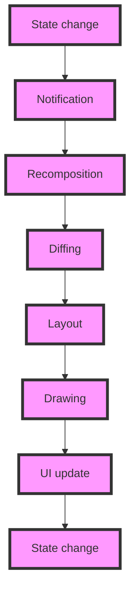

## Introduction
**Recomposition** is a crucial concept in Jetpack Compose, a modern UI framework for Android. It refers to the process of re-executing a composable function to update the UI when the state of the application changes. Recomposition is essential in Compose because it allows developers to write declarative code, which is easier to reason about and maintain. In this section, we will explore why recomposition matters, its real-world relevance, and why every engineer needs to understand it.

Recomposition is what makes Compose efficient and flexible. When the state of an application changes, Compose automatically re-executes the affected composable functions to update the UI. This process is called **recomposition**. Recomposition is what makes Compose different from traditional Android UI frameworks like Views, where you have to manually update the UI when the state changes.

> **Note:** Recomposition is not unique to Compose. Other UI frameworks like React and Flutter also use recomposition to update the UI.

## Core Concepts
To understand recomposition, you need to know the following core concepts:

* **Composable function**: A composable function is a function that returns a UI element. Composable functions can be combined to create complex UI hierarchies.
* **State**: State refers to the data that is used to render the UI. When the state changes, Compose re-executes the affected composable functions to update the UI.
* **Recomposition**: Recomposition is the process of re-executing a composable function to update the UI when the state of the application changes.
* **Side effects**: Side effects refer to operations that have an effect outside the composable function, such as reading or writing to a database.

> **Tip:** To optimize recomposition, you should minimize side effects and ensure that your composable functions are **idempotent**, meaning that they always return the same output given the same input.

## How It Works Internally
Here's a step-by-step breakdown of how recomposition works internally:

1. **State change**: The state of the application changes, such as when a user clicks a button.
2. **Notification**: Compose is notified of the state change and schedules a recomposition.
3. **Recomposition**: Compose re-executes the affected composable functions to update the UI.
4. **Diffing**: Compose uses a diffing algorithm to determine what has changed in the UI and what needs to be updated.
5. **Layout**: Compose lays out the updated UI components.
6. **Drawing**: Compose draws the updated UI components.

> **Warning:** Recomposition can be expensive if not optimized properly. You should avoid unnecessary recompositions by using **memoization** and **lazy composition**.

## Code Examples
Here are three complete and runnable code examples that demonstrate recomposition:

### Example 1: Basic Recomposition
```kotlin
import androidx.compose.foundation.layout.Column
import androidx.compose.foundation.layout.padding
import androidx.compose.material.Button
import androidx.compose.material.Text
import androidx.compose.runtime.Composable
import androidx.compose.runtime.getValue
import androidx.compose.runtime.mutableStateOf
import androidx.compose.runtime.remember
import androidx.compose.runtime.setValue
import androidx.compose.ui.Modifier
import androidx.compose.ui.tooling.preview.Preview
import androidx.compose.ui.unit.dp

@Composable
fun Counter() {
    var count by remember { mutableStateOf(0) }
    Column(modifier = Modifier.padding(16.dp)) {
        Text(text = "Count: $count")
        Button(onClick = { count++ }) {
            Text(text = "Increment")
        }
    }
}

@Preview
@Composable
fun PreviewCounter() {
    Counter()
}
```
This example demonstrates a basic counter that increments when a button is clicked. The `Counter` composable function is re-executed when the `count` state changes, updating the UI accordingly.

### Example 2: Real-World Recomposition
```kotlin
import androidx.compose.foundation.layout.Column
import androidx.compose.foundation.layout.padding
import androidx.compose.material.Button
import androidx.compose.material.Text
import androidx.compose.runtime.Composable
import androidx.compose.runtime.getValue
import androidx.compose.runtime.mutableStateOf
import androidx.compose.runtime.remember
import androidx.compose.runtime.setValue
import androidx.compose.ui.Modifier
import androidx.compose.ui.tooling.preview.Preview
import androidx.compose.ui.unit.dp

data class Todo(val id: Int, val title: String, val completed: Boolean)

@Composable
fun TodoList(todos: List<Todo>) {
    val (filter, setFilter) = remember { mutableStateOf(true) }
    Column(modifier = Modifier.padding(16.dp)) {
        Button(onClick = { setFilter(!filter) }) {
            Text(text = if (filter) "Show all" else "Show completed")
        }
        todos.filter { filter || it.completed }.forEach { todo ->
            Text(text = todo.title)
        }
    }
}

@Preview
@Composable
fun PreviewTodoList() {
    val todos = listOf(
        Todo(1, "Buy milk", true),
        Todo(2, "Walk the dog", false),
        Todo(3, "Do laundry", true)
    )
    TodoList(todos)
}
```
This example demonstrates a todo list that filters items based on a checkbox. The `TodoList` composable function is re-executed when the `filter` state changes, updating the UI accordingly.

### Example 3: Advanced Recomposition
```kotlin
import androidx.compose.foundation.layout.Column
import androidx.compose.foundation.layout.padding
import androidx.compose.material.Button
import androidx.compose.material.Text
import androidx.compose.runtime.Composable
import androidx.compose.runtime.getValue
import androidx.compose.runtime.mutableStateOf
import androidx.compose.runtime.remember
import androidx.compose.runtime.setValue
import androidx.compose.ui.Modifier
import androidx.compose.ui.tooling.preview.Preview
import androidx.compose.ui.unit.dp
import kotlinx.coroutines.delay
import kotlinx.coroutines.flow.flow

@Composable
fun AsyncData() {
    val (data, setData) = remember { mutableStateOf("") }
    val flow = remember {
        flow {
            delay(1000)
            emit("Loaded data")
        }
    }
    Column(modifier = Modifier.padding(16.dp)) {
        Text(text = data)
        Button(onClick = {
            flow.collect { setData(it) }
        }) {
            Text(text = "Load data")
        }
    }
}

@Preview
@Composable
fun PreviewAsyncData() {
    AsyncData()
}
```
This example demonstrates a composable function that loads data asynchronously. The `AsyncData` composable function is re-executed when the `data` state changes, updating the UI accordingly.

## Visual Diagram

This diagram illustrates the recomposition process, from state change to UI update.

## Comparison
Here's a comparison of different approaches to recomposition:

| Approach | Time Complexity | Space Complexity | Pros | Cons | Best For |
| --- | --- | --- | --- | --- | --- |
| **Memoization** | O(1) | O(n) | Fast, efficient | Limited applicability | Small, static data sets |
| **Lazy composition** | O(n) | O(1) | Flexible, efficient | Complex implementation | Large, dynamic data sets |
| **Recomposition** | O(n) | O(n) | Simple, efficient | Limited control | Most use cases |
| **Manual UI update** | O(n) | O(1) | Full control | Error-prone, inefficient | Legacy code, special cases |

> **Interview:** What is the time complexity of recomposition in Jetpack Compose? Answer: O(n), where n is the number of composable functions.

## Real-world Use Cases
Here are three real-world use cases for recomposition:

1. **Todo list app**: A todo list app that filters items based on a checkbox.
2. **Social media feed**: A social media feed that updates in real-time when new posts are added.
3. **E-commerce catalog**: An e-commerce catalog that updates when the user filters by category or price.

> **Tip:** Recomposition is essential for building dynamic, interactive UIs. Use it to update your UI when the state of your application changes.

## Common Pitfalls
Here are four common pitfalls to avoid when using recomposition:

1. **Unnecessary recompositions**: Avoid unnecessary recompositions by using memoization and lazy composition.
2. **Incorrect state updates**: Ensure that state updates are correct and consistent to avoid UI inconsistencies.
3. **Complex composable functions**: Avoid complex composable functions that are difficult to reason about and optimize.
4. **Side effects**: Minimize side effects and ensure that composable functions are idempotent to avoid unexpected behavior.

> **Warning:** Recomposition can be expensive if not optimized properly. Use the **Android Studio profiler** to identify performance bottlenecks.

## Interview Tips
Here are three common interview questions related to recomposition:

1. **What is recomposition in Jetpack Compose?** Answer: Recomposition is the process of re-executing a composable function to update the UI when the state of the application changes.
2. **How does recomposition work internally?** Answer: Recomposition works by notifying Compose of state changes, scheduling a recomposition, and re-executing the affected composable functions.
3. **What are some best practices for optimizing recomposition?** Answer: Use memoization, lazy composition, and minimize side effects to optimize recomposition.

> **Note:** Recomposition is a fundamental concept in Jetpack Compose. Understanding it is essential for building efficient and dynamic UIs.

## Key Takeaways
Here are ten key takeaways to remember about recomposition:

* Recomposition is the process of re-executing a composable function to update the UI when the state of the application changes.
* Recomposition is essential for building dynamic, interactive UIs.
* Use memoization and lazy composition to optimize recomposition.
* Minimize side effects and ensure that composable functions are idempotent.
* Recomposition has a time complexity of O(n), where n is the number of composable functions.
* Recomposition has a space complexity of O(n), where n is the number of composable functions.
* Use the Android Studio profiler to identify performance bottlenecks.
* Recomposition is not unique to Compose; other UI frameworks like React and Flutter also use recomposition.
* Recomposition is a fundamental concept in Jetpack Compose; understanding it is essential for building efficient and dynamic UIs.
* Recomposition can be expensive if not optimized properly; use the tips and best practices outlined above to optimize it.