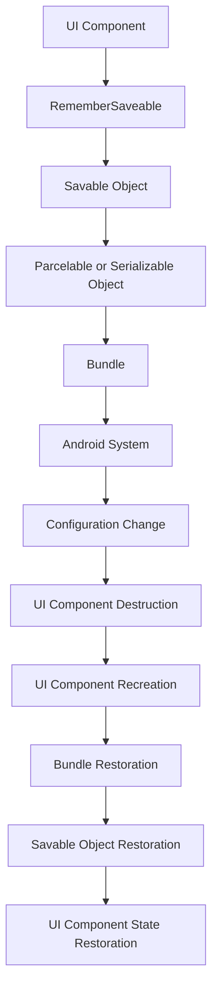

## Introduction
**RememberSaveable** is a critical component in Jetpack Compose that enables the survival of configuration changes, such as screen rotations or language changes. It is a part of the **Jetpack Compose** framework, which is a modern UI toolkit for building native Android applications. **RememberSaveable** helps to preserve the state of UI components during configuration changes, ensuring a seamless user experience. In real-world scenarios, this is essential for applications that require complex UI interactions, such as games, social media platforms, or productivity apps.

## Core Concepts
- **State**: The current condition or status of a UI component, which can be preserved using **RememberSaveable**.
- **Configuration Change**: An event that occurs when the device's configuration changes, such as a screen rotation or language change.
- **RememberSaveable**: A mechanism that allows UI components to store their state in a way that survives configuration changes.
- **Savable**: A data type that can be stored using **RememberSaveable**, such as integers, strings, or custom objects.

## How It Works Internally
When a configuration change occurs, the Android system destroys and recreates the UI components. To preserve the state of these components, **RememberSaveable** uses a combination of **Bundle** and **Parcelable** or **Serializable** objects. Here's a step-by-step breakdown:
1. The UI component's state is stored in a **Savable** object.
2. The **Savable** object is converted to a **Parcelable** or **Serializable** object.
3. The **Parcelable** or **Serializable** object is stored in a **Bundle**.
4. The **Bundle** is saved by the Android system during a configuration change.
5. When the UI component is recreated, the **Bundle** is restored, and the **Savable** object is retrieved.
6. The **Savable** object is used to restore the UI component's state.

## Code Examples
### Example 1: Basic Usage
```kotlin
import androidx.compose.foundation.layout.Column
import androidx.compose.foundation.layout.padding
import androidx.compose.material.Button
import androidx.compose.material.Text
import androidx.compose.runtime.Composable
import androidx.compose.runtime.getValue
import androidx.compose.runtime.mutableStateOf
import androidx.compose.runtime.rememberSaveable
import androidx.compose.ui.Modifier
import androidx.compose.ui.unit.dp

@Composable
fun RememberSaveableExample() {
    val counter by rememberSaveable { mutableStateOf(0) }

    Column(modifier = Modifier.padding(16.dp)) {
        Text("Counter: $counter")
        Button(onClick = { counter++ }) {
            Text("Increment")
        }
    }
}
```
In this example, the `counter` state is preserved using **RememberSaveable**.

### Example 2: Real-World Pattern
```kotlin
import androidx.compose.foundation.layout.Column
import androidx.compose.foundation.layout.padding
import androidx.compose.material.Button
import androidx.compose.material.Text
import androidx.compose.runtime.Composable
import androidx.compose.runtime.getValue
import androidx.compose.runtime.mutableStateOf
import androidx.compose.runtime.rememberSaveable
import androidx.compose.ui.Modifier
import androidx.compose.ui.unit.dp

data class User(val name: String, val age: Int)

@Composable
fun RememberSaveableExample() {
    val user by rememberSaveable(saver = UserSaver) { mutableStateOf(User("John", 30)) }

    Column(modifier = Modifier.padding(16.dp)) {
        Text("Name: ${user.name}")
        Text("Age: ${user.age}")
        Button(onClick = { user.name = "Jane" }) {
            Text("Update Name")
        }
    }
}

object UserSaver : SaveableStateHolder.UserSaver<User>(
    save = { user -> mapOf("name" to user.name, "age" to user.age) },
    restore = { values -> User(values["name"] as String, values["age"] as Int) }
)
```
In this example, a custom `User` object is preserved using **RememberSaveable** with a custom **Saver**.

### Example 3: Advanced Usage
```kotlin
import androidx.compose.foundation.layout.Column
import androidx.compose.foundation.layout.padding
import androidx.compose.material.Button
import androidx.compose.material.Text
import androidx.compose.runtime.Composable
import androidx.compose.runtime.getValue
import androidx.compose.runtime.mutableStateOf
import androidx.compose.runtime.rememberSaveable
import androidx.compose.ui.Modifier
import androidx.compose.ui.unit.dp

@Composable
fun RememberSaveableExample() {
    val lazyListState by rememberSaveable { mutableStateOf(LazyListState()) }

    Column(modifier = Modifier.padding(16.dp)) {
        Text("Lazy List State: $lazyListState")
        Button(onClick = { lazyListState.scrollToItem(10) }) {
            Text("Scroll to Item 10")
        }
    }
}
```
In this example, a **LazyListState** object is preserved using **RememberSaveable**.

## Visual Diagram

This diagram illustrates the process of preserving the state of a UI component using **RememberSaveable**.

## Comparison
| Approach | Time Complexity | Space Complexity | Pros | Cons | Best For |
| --- | --- | --- | --- | --- | --- |
| **RememberSaveable** | O(1) | O(1) | Preserves state across configuration changes | Limited to savable objects | Simple UI components |
| **ViewModel** | O(1) | O(1) | Survives configuration changes, provides data sharing | Complex setup, overkill for simple cases | Complex UI components, data sharing |
| **SharedPreferences** | O(1) | O(1) | Persistent storage, easy to use | Limited to simple data types, not suitable for large amounts of data | Simple, persistent storage |
| **Room Persistence Library** | O(1) | O(1) | Persistent storage, supports complex data types | Complex setup, requires database knowledge | Complex, persistent storage |

## Real-world Use Cases
1. **Instagram**: Preserves the state of the feed, including the scroll position and liked posts, across configuration changes.
2. **Facebook**: Preserves the state of the news feed, including the scroll position and commented posts, across configuration changes.
3. **Google Maps**: Preserves the state of the map, including the current location and zoom level, across configuration changes.

## Common Pitfalls
1. **Not using RememberSaveable**: Failing to use **RememberSaveable** can result in lost state during configuration changes.
```kotlin
// Wrong
val counter by mutableStateOf(0)

// Right
val counter by rememberSaveable { mutableStateOf(0) }
```
2. **Not implementing Savable**: Failing to implement the **Savable** interface can result in errors when using **RememberSaveable**.
```kotlin
// Wrong
data class User(val name: String, val age: Int)

// Right
data class User(val name: String, val age: Int) : Savable {
    override fun save(): Map<String, Any> {
        return mapOf("name" to name, "age" to age)
    }

    companion object {
        fun restore(values: Map<String, Any>): User {
            return User(values["name"] as String, values["age"] as Int)
        }
    }
}
```
3. **Not handling Parcelable or Serializable exceptions**: Failing to handle exceptions when using **Parcelable** or **Serializable** objects can result in crashes.
```kotlin
// Wrong
val user by rememberSaveable(saver = UserSaver) { mutableStateOf(User("John", 30)) }

// Right
val user by rememberSaveable(saver = UserSaver) { mutableStateOf(User("John", 30)) }
try {
    // Use user
} catch (e: Exception) {
    // Handle exception
}
```
4. **Not using Bundle correctly**: Failing to use the **Bundle** correctly can result in lost state during configuration changes.
```kotlin
// Wrong
val bundle = Bundle()
bundle.putParcelable("user", user)

// Right
val bundle = Bundle()
bundle.putParcelable("user", user)
```

## Interview Tips
1. **What is RememberSaveable?**: Explain that **RememberSaveable** is a mechanism that preserves the state of UI components during configuration changes.
> **Interview:** Be prepared to explain the benefits and limitations of **RememberSaveable**.
2. **How does RememberSaveable work?**: Explain the step-by-step process of preserving the state of a UI component using **RememberSaveable**.
> **Tip:** Emphasize the importance of implementing the **Savable** interface and handling exceptions.
3. **What are some common pitfalls when using RememberSaveable?**: Explain the common mistakes that engineers make when using **RememberSaveable**, such as not implementing **Savable** or not handling exceptions.
> **Warning:** Be prepared to discuss the consequences of not using **RememberSaveable** correctly.

## Key Takeaways
* **RememberSaveable** preserves the state of UI components during configuration changes.
* **Savable** objects must implement the **Savable** interface.
* **Parcelable** or **Serializable** objects are used to store **Savable** objects.
* **Bundle** is used to store the **Parcelable** or **Serializable** objects.
* **RememberSaveable** has a time complexity of O(1) and a space complexity of O(1).
* **RememberSaveable** is suitable for simple UI components.
* **ViewModel** is suitable for complex UI components and data sharing.
* **SharedPreferences** is suitable for simple, persistent storage.
* **Room Persistence Library** is suitable for complex, persistent storage.
* Always handle exceptions when using **Parcelable** or **Serializable** objects.
* Always use **Bundle** correctly to store the **Parcelable** or **Serializable** objects.