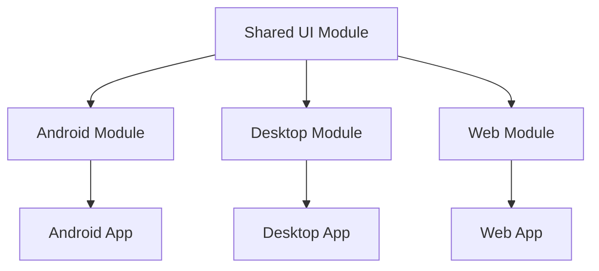

## Introduction
Compose Multiplatform is a UI framework developed by JetBrains, allowing developers to build user interfaces for multiple platforms, including Android, Desktop, and Web, using a single codebase. The Shared UI component is a crucial part of this framework, enabling developers to share UI code across different platforms. In this article, we will delve into the world of Compose Multiplatform: Shared UI, exploring its core concepts, code examples, real-world use cases, and common pitfalls to avoid.

## Core Concepts
Compose Multiplatform: Shared UI is built on top of the Kotlin programming language and utilizes the Compose framework. The core concepts of Shared UI include:

* **Composables**: These are the building blocks of the UI, represented as functions that return a UI element.
* **State**: Compose uses a state-driven approach, where the UI is updated based on the state of the application.
* **Layout**: Compose provides a flexible layout system, allowing developers to create complex layouts using a simple and intuitive API.
* **Material Design**: Compose Multiplatform: Shared UI supports Material Design, a design system developed by Google, providing a consistent look and feel across different platforms.

To use Compose Multiplatform: Shared UI, developers need to create a multi-module project, with a separate module for the shared UI code. This module will contain the Composable functions, which can be used across different platforms.

```kotlin
// Shared UI module
@Composable
fun Greeting(name: String) {
    Text(text = "Hello, $name!")
}
```

## Code Examples
Here are a few examples of using Compose Multiplatform: Shared UI:

### Example 1: Simple Composable
```kotlin
// Shared UI module
@Composable
fun Counter(count: Int, onIncrement: () -> Unit) {
    Row {
        Button(onClick = onIncrement) {
            Text(text = "Increment")
        }
        Text(text = "Count: $count")
    }
}
```

### Example 2: Material Design Composable
```kotlin
// Shared UI module
@Composable
fun MaterialGreeting(name: String) {
    MaterialTheme {
        Surface {
            Greeting(name = name)
        }
    }
}
```

### Example 3: Platform-Specific Composable
```kotlin
// Android module
@Composable
fun AndroidGreeting(name: String) {
    AndroidView(factory = { ctx -> TextView(ctx) }) { view ->
        view.text = "Hello, $name!"
    }
}
```

## Real-world Use Cases
Compose Multiplatform: Shared UI has several real-world use cases, including:

* **Cross-platform development**: Shared UI enables developers to share UI code across different platforms, reducing development time and increasing code reuse.
* **Complex UI components**: Compose Multiplatform: Shared UI provides a flexible and powerful API for creating complex UI components, making it ideal for building custom UI elements.
* **Material Design**: Shared UI supports Material Design, making it easy to create consistent and visually appealing UI components across different platforms.

## Common Pitfalls & How to Avoid Them
When using Compose Multiplatform: Shared UI, there are several common pitfalls to avoid:

> **Warning:** Avoid using platform-specific APIs in the shared UI module, as this can lead to compatibility issues.
> **Tip:** Use the `@Composable` annotation to mark Composable functions, ensuring they are properly optimized and rendered by the Compose framework.
> **Note:** Be mindful of the state management approach used in the shared UI module, as this can affect the overall performance and behavior of the application.

To avoid these pitfalls, developers should:

* Keep the shared UI module platform-agnostic, avoiding platform-specific APIs and focusing on shared UI logic.
* Use the `@Composable` annotation to mark Composable functions, ensuring they are properly optimized and rendered by the Compose framework.
* Implement a robust state management approach, using tools like `State` and `MutableState` to manage state changes and updates.

## Summary / Key Takeaways
In summary, Compose Multiplatform: Shared UI is a powerful framework for building shared UI components across different platforms. By understanding the core concepts, code examples, and real-world use cases, developers can create complex and visually appealing UI components, while avoiding common pitfalls and ensuring a smooth and efficient development process. Key takeaways include:

* Use the `@Composable` annotation to mark Composable functions.
* Keep the shared UI module platform-agnostic, avoiding platform-specific APIs.
* Implement a robust state management approach using `State` and `MutableState`.
* Use Material Design to create consistent and visually appealing UI components.

By following these guidelines and best practices, developers can unlock the full potential of Compose Multiplatform: Shared UI and create high-quality, cross-platform applications with a shared UI codebase. 

