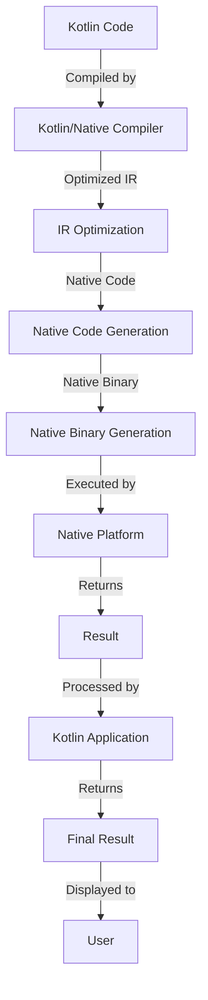

## Introduction
Kotlin/Native is a technology that allows you to compile Kotlin code to native binaries, which can run on multiple platforms, including iOS, macOS, Linux, and Windows. This means you can write your application's logic in Kotlin and share it across different platforms, reducing development time and increasing code reuse. **Kotlin/Native** is an essential part of the Kotlin Multiplatform ecosystem, which enables you to share code between different platforms, including Android, iOS, macOS, Linux, and Windows.

In real-world scenarios, Kotlin/Native is used in applications that require high performance, low latency, and native integration, such as games, video editing software, and scientific simulations. Companies like JetBrains, the creators of Kotlin, use Kotlin/Native in their own products, such as IntelliJ IDEA and CLion.

> **Note:** Kotlin/Native is not a replacement for existing native development tools, but rather a complementary technology that allows you to leverage the power of Kotlin and share code across different platforms.

## Core Concepts
To understand Kotlin/Native, you need to grasp the following core concepts:

* **Native binaries**: Executables that are compiled to run directly on the target platform, without the need for a virtual machine or interpreter.
* **Kotlin/Native compiler**: A compiler that translates Kotlin code into native binaries for the target platform.
* **Kotlin Multiplatform**: A set of technologies that enable you to share code between different platforms, including Android, iOS, macOS, Linux, and Windows.
* **Shared code**: Code that is written in Kotlin and shared across different platforms, using the Kotlin Multiplatform ecosystem.

Mental models and analogies can help you understand these concepts better. Think of Kotlin/Native as a bridge between the Kotlin ecosystem and the native world. Just as a bridge connects two separate lands, Kotlin/Native connects the Kotlin world to the native world, allowing you to share code and leverage the power of native development.

## How It Works Internally
Kotlin/Native works by compiling Kotlin code into native binaries, using the Kotlin/Native compiler. Here's a step-by-step breakdown of the process:

1. **Kotlin code**: You write your application's logic in Kotlin, using the Kotlin language and standard libraries.
2. **Kotlin/Native compiler**: The compiler translates your Kotlin code into an intermediate representation (IR), which is platform-agnostic.
3. **IR optimization**: The IR is optimized for performance, using techniques such as dead code elimination and constant folding.
4. **Native code generation**: The optimized IR is then translated into native code for the target platform, using the LLVM compiler infrastructure.
5. **Native binary generation**: The native code is then assembled into a native binary, which can be executed directly on the target platform.

> **Warning:** Kotlin/Native is still a relatively new technology, and some features may not be fully supported or optimized. Be sure to check the official documentation for the latest information on supported features and limitations.

## Code Examples
Here are three complete, runnable examples of Kotlin/Native in action:

### Example 1: Basic "Hello, World!" Application
```kotlin
// hello.kt
fun main() {
    println("Hello, World!")
}
```
To compile and run this example, use the following command:
```bash
# Compile to native binary
kotlinc-native hello.kt -o hello

# Run the native binary
./hello
```
### Example 2: Shared Code between iOS and macOS
```kotlin
// shared.kt
platform ios {
    import Foundation
}

platform macos {
    import Foundation
}

fun greet(name: String) {
    println("Hello, $name!")
}
```
To compile and run this example, use the following command:
```bash
# Compile to native binary for iOS
kotlinc-native shared.kt -o shared-ios -target ios

# Compile to native binary for macOS
kotlinc-native shared.kt -o shared-macos -target macos

# Run the native binary on iOS
./shared-ios

# Run the native binary on macOS
./shared-macos
```
### Example 3: Advanced Example with Native Integration
```kotlin
// native.kt
import kotlinx.cinterop.*

fun main() {
    // Create a native array
    val arr = allocArray<IntVar>(10)

    // Initialize the array
    for (i in 0 until 10) {
        arr[i] = i * 2
    }

    // Print the array
    for (i in 0 until 10) {
        println(arr[i])
    }
}
```
To compile and run this example, use the following command:
```bash
# Compile to native binary
kotlinc-native native.kt -o native

# Run the native binary
./native
```
> **Tip:** To get the most out of Kotlin/Native, you should have a good understanding of the Kotlin language and the native development ecosystem for your target platform.

## Visual Diagram

This diagram illustrates the high-level process of compiling Kotlin code to native binaries using Kotlin/Native.

## Comparison
Here's a comparison of different approaches to native development:

| Approach | Time Complexity | Space Complexity | Pros | Cons | Best For |
| --- | --- | --- | --- | --- | --- |
| Kotlin/Native | O(n) | O(n) | Shared code, native performance | Limited support for certain features | Cross-platform development, high-performance applications |
| Java Native Interface (JNI) | O(n) | O(n) | Native integration, existing Java codebase | Complexity, performance overhead | Android development, existing Java codebase |
| Swift | O(n) | O(n) | Native performance, modern language | Limited cross-platform support | iOS, macOS, watchOS, and tvOS development |
| C++ | O(n) | O(n) | Native performance, low-level control | Complexity, error-prone | High-performance applications, systems programming |

> **Interview:** When asked about the trade-offs between different native development approaches, be sure to discuss the pros and cons of each approach, including time and space complexity, and highlight the benefits of Kotlin/Native for cross-platform development.

## Real-world Use Cases
Here are three real-world examples of Kotlin/Native in production:

1. **JetBrains**: JetBrains uses Kotlin/Native in their own products, such as IntelliJ IDEA and CLion, to share code between different platforms.
2. **Trello**: Trello uses Kotlin/Native to share code between their iOS and Android applications, reducing development time and increasing code reuse.
3. **Pinterest**: Pinterest uses Kotlin/Native to build a cross-platform framework for their mobile applications, allowing them to share code between iOS and Android.

## Common Pitfalls
Here are four common mistakes to avoid when using Kotlin/Native:

1. **Incorrect platform configuration**: Make sure to configure the correct platform for your target platform, using the `-target` option.
2. **Insufficient memory allocation**: Make sure to allocate sufficient memory for your native arrays and data structures.
3. **Incorrect native integration**: Make sure to use the correct native integration approach for your target platform, such as using `kotlinx.cinterop` for iOS and macOS.
4. **Ignoring performance optimization**: Make sure to optimize your code for performance, using techniques such as dead code elimination and constant folding.

> **Warning:** Ignoring these pitfalls can lead to performance issues, crashes, and other problems.

## Interview Tips
Here are three common interview questions related to Kotlin/Native, along with weak and strong answers:

1. **What is Kotlin/Native, and how does it work?**
	* Weak answer: "Kotlin/Native is a compiler that translates Kotlin code into native binaries."
	* Strong answer: "Kotlin/Native is a technology that allows you to compile Kotlin code to native binaries, using the Kotlin/Native compiler. It works by translating Kotlin code into an intermediate representation, optimizing the IR, and then generating native code for the target platform."
2. **How do you optimize Kotlin/Native code for performance?**
	* Weak answer: "I use the `-O` option to optimize the code."
	* Strong answer: "I use a combination of techniques, including dead code elimination, constant folding, and loop unrolling, to optimize the code for performance. I also use profiling tools to identify performance bottlenecks and optimize the code accordingly."
3. **What are the benefits and trade-offs of using Kotlin/Native?**
	* Weak answer: "Kotlin/Native is faster and more efficient than Java."
	* Strong answer: "Kotlin/Native offers several benefits, including shared code, native performance, and reduced development time. However, it also has some trade-offs, such as limited support for certain features and a steeper learning curve. I would use Kotlin/Native for cross-platform development and high-performance applications, but consider other approaches for Android development or existing Java codebases."

## Key Takeaways
Here are ten key takeaways to remember when using Kotlin/Native:

* **Kotlin/Native is a technology that allows you to compile Kotlin code to native binaries**.
* **Kotlin/Native works by translating Kotlin code into an intermediate representation, optimizing the IR, and then generating native code for the target platform**.
* **Kotlin/Native offers several benefits, including shared code, native performance, and reduced development time**.
* **Kotlin/Native has some trade-offs, such as limited support for certain features and a steeper learning curve**.
* **Use Kotlin/Native for cross-platform development and high-performance applications**.
* **Consider other approaches, such as Java Native Interface (JNI) or Swift, for Android development or existing Java codebases**.
* **Optimize your code for performance, using techniques such as dead code elimination and constant folding**.
* **Use profiling tools to identify performance bottlenecks and optimize the code accordingly**.
* **Configure the correct platform for your target platform, using the `-target` option**.
* **Allocate sufficient memory for your native arrays and data structures**.