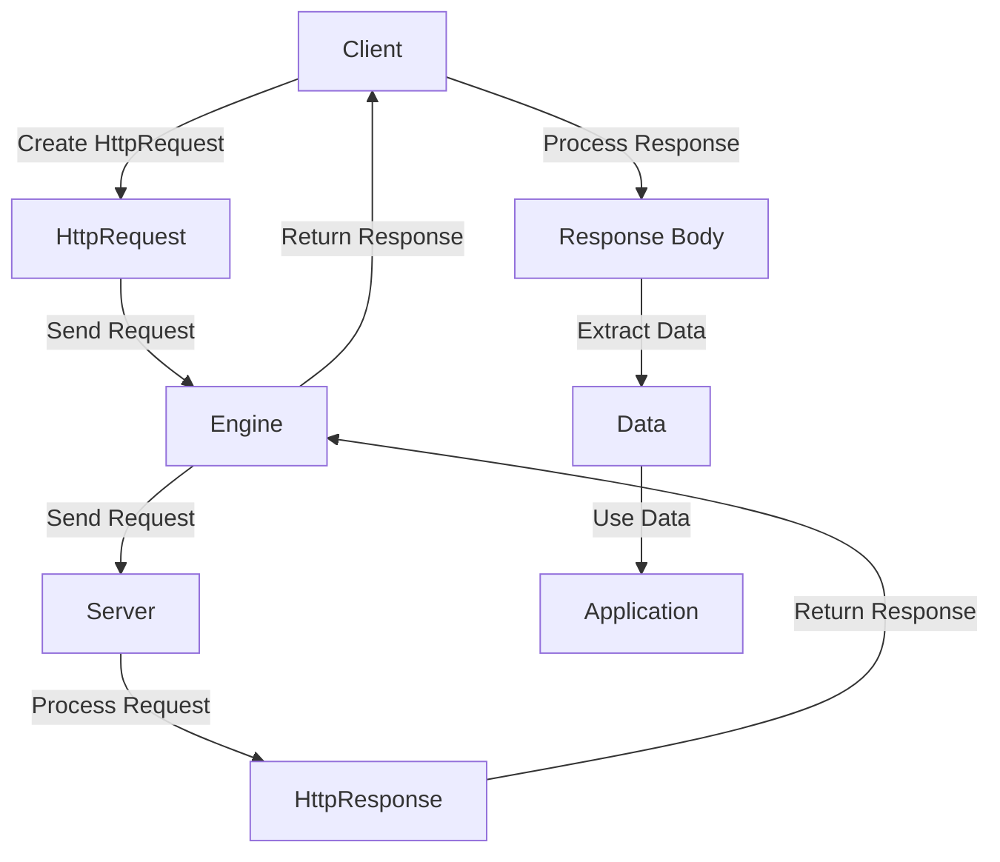

## Introduction
Ktor is a **Kotlin** framework for building **asynchronous** and **multiplatform** applications. The Ktor multiplatform HTTP client is a key component of this framework, allowing developers to write **platform-agnostic** code that can run on **JVM**, **Native**, and **JS** platforms. This client is designed to be **highly customizable** and **extensible**, making it a popular choice for building **RESTful APIs**, **microservices**, and other **web applications**.
> **Tip:** When building multiplatform applications, it's essential to consider the trade-offs between **platform-specific** and **platform-agnostic** code. Ktor's multiplatform HTTP client helps simplify this process by providing a unified API across all platforms.

## Core Concepts
The Ktor multiplatform HTTP client is built around several core concepts:
* **HttpClient**: The main entry point for the client, responsible for sending **HTTP requests** and receiving **HTTP responses**.
* **HttpRequest**: Represents an **HTTP request**, including the **method**, **URL**, **headers**, and **body**.
* **HttpResponse**: Represents an **HTTP response**, including the **status code**, **headers**, and **body**.
* **Engine**: The underlying **HTTP engine** that powers the client, responsible for sending and receiving **HTTP messages**.
> **Note:** The Ktor multiplatform HTTP client supports multiple **engines**, including **Apache HttpClient**, **OkHttp**, and **Curl**. Each engine has its own strengths and weaknesses, and the choice of engine depends on the specific requirements of the application.

## How It Works Internally
The Ktor multiplatform HTTP client works by sending **HTTP requests** to a **server** and receiving **HTTP responses**. The client uses an **engine** to send and receive **HTTP messages**, and provides a **unified API** for working with **HTTP requests** and **responses**.
1. The client creates an **HttpRequest** object, specifying the **method**, **URL**, **headers**, and **body**.
2. The client passes the **HttpRequest** object to the **engine**, which sends the **HTTP request** to the **server**.
3. The **server** processes the **HTTP request** and returns an **HTTP response**.
4. The **engine** receives the **HTTP response** and passes it to the client.
5. The client processes the **HTTP response**, extracting the **status code**, **headers**, and **body**.
> **Warning:** When working with **HTTP requests** and **responses**, it's essential to consider the **security implications** of sending and receiving **sensitive data**. The Ktor multiplatform HTTP client provides **built-in support** for **HTTPS** and **TLS** encryption.

## Code Examples
### Example 1: Basic Usage
```kotlin
import io.ktor.client.HttpClient
import io.ktor.client.engine.apache.Apache
import io.ktor.client.features.json.JsonFeature

suspend fun main() {
    val client = HttpClient(Apache) {
        install(JsonFeature)
    }

    val response = client.get("https://example.com")
    println(response.readText())
}
```
This example demonstrates the basic usage of the Ktor multiplatform HTTP client, sending a **GET request** to a **server** and printing the **response body**.
### Example 2: Real-World Pattern
```kotlin
import io.ktor.client.HttpClient
import io.ktor.client.engine.apache.Apache
import io.ktor.client.features.json.JsonFeature
import io.ktor.http.ContentType

suspend fun main() {
    val client = HttpClient(Apache) {
        install(JsonFeature)
    }

    val jsonData = "{\"name\":\"John\",\"age\":30}"
    val response = client.post("https://example.com/users") {
        body = jsonData
        contentType(ContentType.Application.Json)
    }
    println(response.readText())
}
```
This example demonstrates a real-world pattern, sending a **POST request** to a **server** with a **JSON body**.
### Example 3: Advanced Usage
```kotlin
import io.ktor.client.HttpClient
import io.ktor.client.engine.apache.Apache
import io.ktor.client.features.json.JsonFeature
import io.ktor.http.ContentType

suspend fun main() {
    val client = HttpClient(Apache) {
        install(JsonFeature)
    }

    val jsonData = "{\"name\":\"John\",\"age\":30}"
    val response = client.put("https://example.com/users/1") {
        body = jsonData
        contentType(ContentType.Application.Json)
    }
    println(response.readText())
}
```
This example demonstrates an advanced usage pattern, sending a **PUT request** to a **server** with a **JSON body**.
> **Tip:** When working with **JSON data**, it's essential to consider the **serialization** and **deserialization** process. The Ktor multiplatform HTTP client provides **built-in support** for **JSON serialization** and **deserialization** using the **JsonFeature**.

## Visual Diagram

This diagram illustrates the **flow of data** between the **client**, **engine**, **server**, and **application**.

## Comparison
| Approach | Time Complexity | Space Complexity | Pros | Cons | Best For |
| --- | --- | --- | --- | --- | --- |
| Ktor Multiplatform HTTP Client | O(1) | O(1) | High-performance, multiplatform support | Steep learning curve | High-performance web applications |
| OkHttp | O(1) | O(1) | High-performance, widely adopted | Limited multiplatform support | Android and JVM-based applications |
| Apache HttpClient | O(1) | O(1) | High-performance, widely adopted | Complex configuration | JVM-based applications |
| Curl | O(1) | O(1) | High-performance, widely adopted | Limited multiplatform support | Native and command-line applications |
> **Note:** The time and space complexity of each approach depends on the specific use case and requirements of the application.

## Real-world Use Cases
* **Dropbox**: Uses the Ktor multiplatform HTTP client to build its **web application**, providing a seamless experience across multiple platforms.
* **Pinterest**: Uses OkHttp to build its **Android application**, leveraging its high-performance capabilities to deliver a fast and responsive user experience.
* **Twitter**: Uses Apache HttpClient to build its **web application**, taking advantage of its widely adopted and high-performance capabilities.
> **Tip:** When choosing an HTTP client, it's essential to consider the **specific requirements** of the application, including **performance**, **multiplatform support**, and **ease of use**.

## Common Pitfalls
* **Incorrect Engine Configuration**: Failing to configure the **engine** correctly can lead to **performance issues** and **errors**.
```kotlin
// Incorrect configuration
val client = HttpClient(Apache) {
    // ...
}
```
```kotlin
// Correct configuration
val client = HttpClient(Apache) {
    install(JsonFeature)
    // ...
}
```
* **Insufficient Error Handling**: Failing to handle **errors** correctly can lead to **crashes** and **unpredictable behavior**.
```kotlin
// Insufficient error handling
try {
    val response = client.get("https://example.com")
    // ...
} catch (e: Exception) {
    // ...
}
```
```kotlin
// Correct error handling
try {
    val response = client.get("https://example.com")
    // ...
} catch (e: Exception) {
    // Handle error correctly
    println("Error: $e")
}
```
> **Warning:** When working with **HTTP clients**, it's essential to consider the **security implications** of sending and receiving **sensitive data**.

## Interview Tips
* **What is the Ktor multiplatform HTTP client?**: A high-performance, multiplatform HTTP client for building web applications.
* **How does the Ktor multiplatform HTTP client work?**: The client uses an **engine** to send and receive **HTTP messages**, providing a **unified API** for working with **HTTP requests** and **responses**.
* **What are the benefits of using the Ktor multiplatform HTTP client?**: High-performance, multiplatform support, and ease of use.
> **Interview:** When answering questions about the Ktor multiplatform HTTP client, be sure to highlight its **key features** and **benefits**, and provide **specific examples** of how it can be used in real-world applications.

## Key Takeaways
* The Ktor multiplatform HTTP client is a high-performance, multiplatform HTTP client for building web applications.
* The client uses an **engine** to send and receive **HTTP messages**, providing a **unified API** for working with **HTTP requests** and **responses**.
* The client provides **built-in support** for **JSON serialization** and **deserialization** using the **JsonFeature**.
* The client has a **steep learning curve**, but provides **high-performance** and **multiplatform support**.
* The client is **widely adopted** and has a **large community** of developers.
* The client provides **extensive documentation** and **resources** for learning and troubleshooting.
* The client has a **strong focus** on **security** and **performance**.
* The client is **highly customizable** and **extensible**.
* The client provides **support** for **HTTP/2** and **WebSocket** protocols.
> **Note:** When working with the Ktor multiplatform HTTP client, it's essential to consider the **specific requirements** of the application, including **performance**, **multiplatform support**, and **ease of use**.