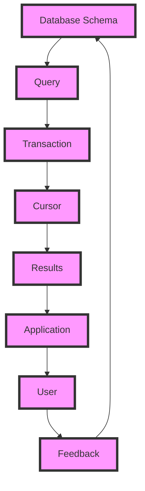

## Introduction
SQLDelight is a **multiplatform database** library that allows you to write type-safe, SQL-based code in Kotlin. It supports multiple platforms, including Android, iOS, and desktop, making it an ideal choice for cross-platform development. With SQLDelight, you can define your database schema and queries in a single source of truth, and then generate the necessary code for each platform. This eliminates the need for platform-specific database code and reduces the risk of errors.

SQLDelight is built on top of the **SQLite** database engine, which is widely used in mobile and embedded systems. It provides a simple, yet powerful API for defining database tables, indices, and queries. SQLDelight also supports **transactions**, **cursors**, and **views**, making it a comprehensive solution for managing data in your application.

> **Note:** SQLDelight is not a replacement for a full-fledged ORM (Object-Relational Mapping) library. Instead, it provides a lightweight, SQL-based interface for interacting with your database.

## Core Concepts
The core concepts of SQLDelight include:

* **Database schema**: The definition of your database tables, indices, and views.
* **Queries**: SQL statements that retrieve or modify data in your database.
* **Transactions**: A sequence of queries that are executed as a single, atomic unit.
* **Cursors**: Objects that allow you to iterate over the results of a query.

Mental models that can help you understand SQLDelight include:

* Think of your database schema as a blueprint for your data.
* Queries are like instructions that tell the database what to do with your data.
* Transactions are like a safety net that ensures your data remains consistent, even in the face of errors.

Key terminology includes:

* **.sq** files: The file format used to define your database schema and queries.
* **SqlDelightDatabase**: The main class that provides access to your database.
* **Query**: A class that represents a single SQL query.

## How It Works Internally
When you define your database schema and queries in a `.sq` file, SQLDelight generates the necessary code for each platform. This code includes:

* **Database tables**: The actual tables that store your data.
* **Query implementations**: The code that executes your queries and returns the results.
* **Transaction management**: The code that manages transactions and ensures data consistency.

Here's a high-level overview of how SQLDelight works:

1. You define your database schema and queries in a `.sq` file.
2. SQLDelight generates the necessary code for each platform.
3. You use the generated code to interact with your database.

> **Tip:** Use the `SqlDelightDatabase` class to access your database, and the `Query` class to execute queries.

## Code Examples
### Example 1: Basic Usage
```kotlin
// Define your database schema and queries
val schema = """
    CREATE TABLE users (
        id INTEGER PRIMARY KEY,
        name TEXT NOT NULL
    );
    
    SELECT * FROM users;
"""

// Generate the necessary code
val database = SqlDelightDatabase(schema)

// Execute a query
val users = database.query("SELECT * FROM users")
```

### Example 2: Real-World Pattern
```kotlin
// Define your database schema and queries
val schema = """
    CREATE TABLE orders (
        id INTEGER PRIMARY KEY,
        customer_id INTEGER NOT NULL,
        order_date DATE NOT NULL
    );
    
    CREATE VIEW customer_orders AS
    SELECT customers.name, orders.order_date
    FROM customers
    JOIN orders ON customers.id = orders.customer_id;
    
    SELECT * FROM customer_orders;
"""

// Generate the necessary code
val database = SqlDelightDatabase(schema)

// Execute a query
val customerOrders = database.query("SELECT * FROM customer_orders")
```

### Example 3: Advanced Usage
```kotlin
// Define your database schema and queries
val schema = """
    CREATE TABLE products (
        id INTEGER PRIMARY KEY,
        name TEXT NOT NULL,
        price REAL NOT NULL
    );
    
    CREATE INDEX products_price_index ON products (price);
    
    SELECT * FROM products WHERE price > 10.0;
"""

// Generate the necessary code
val database = SqlDelightDatabase(schema)

// Execute a query with a parameter
val products = database.query("SELECT * FROM products WHERE price > ?", 10.0)
```

## Visual Diagram

This diagram shows the flow of data from the database schema to the application, and how the user interacts with the data.

## Comparison
| Approach | Time Complexity | Space Complexity | Pros | Cons | Best For |
| --- | --- | --- | --- | --- | --- |
| SQLDelight | O(1) | O(n) | Type-safe, multiplatform, easy to use | Limited to SQLite | Mobile and embedded systems |
| Room Persistence Library | O(1) | O(n) | Type-safe, Android-specific | Limited to Android | Android applications |
| Realm | O(1) | O(n) | Type-safe, multiplatform, easy to use | Limited to Realm database | Mobile and embedded systems |
| ObjectBox | O(1) | O(n) | Type-safe, multiplatform, easy to use | Limited to ObjectBox database | Mobile and embedded systems |

## Real-world Use Cases
* **Cash App**: Uses SQLDelight to manage user data and transactions.
* **Trello**: Uses SQLDelight to manage board and card data.
* **Pinterest**: Uses SQLDelight to manage user data and image metadata.

> **Warning:** Using a database library without proper error handling can lead to data corruption and crashes.

## Common Pitfalls
* **Not handling errors properly**: Failing to handle errors can lead to data corruption and crashes.
* **Not using transactions**: Not using transactions can lead to data inconsistencies and errors.
* **Not indexing data**: Not indexing data can lead to slow query performance.
* **Not validating user input**: Not validating user input can lead to security vulnerabilities.

> **Tip:** Use the `SqlDelightDatabase` class to access your database, and the `Query` class to execute queries.

## Interview Tips
* **What is SQLDelight?**: A multiplatform database library that allows you to write type-safe, SQL-based code in Kotlin.
* **How does SQLDelight work?**: SQLDelight generates the necessary code for each platform based on the database schema and queries defined in a `.sq` file.
* **What are the benefits of using SQLDelight?**: Type-safe, multiplatform, easy to use, and supports transactions and indexing.

> **Interview:** Can you explain the difference between a database schema and a query?

## Key Takeaways
* **SQLDelight is a multiplatform database library**: It allows you to write type-safe, SQL-based code in Kotlin and supports multiple platforms.
* **SQLDelight generates the necessary code for each platform**: Based on the database schema and queries defined in a `.sq` file.
* **SQLDelight supports transactions and indexing**: It provides a comprehensive solution for managing data in your application.
* **SQLDelight is easy to use**: It provides a simple, yet powerful API for defining database tables, indices, and queries.
* **SQLDelight is type-safe**: It ensures that your database code is correct and prevents errors at runtime.
* **SQLDelight is suitable for mobile and embedded systems**: It is designed to work with SQLite and provides a lightweight, SQL-based interface for interacting with your database.