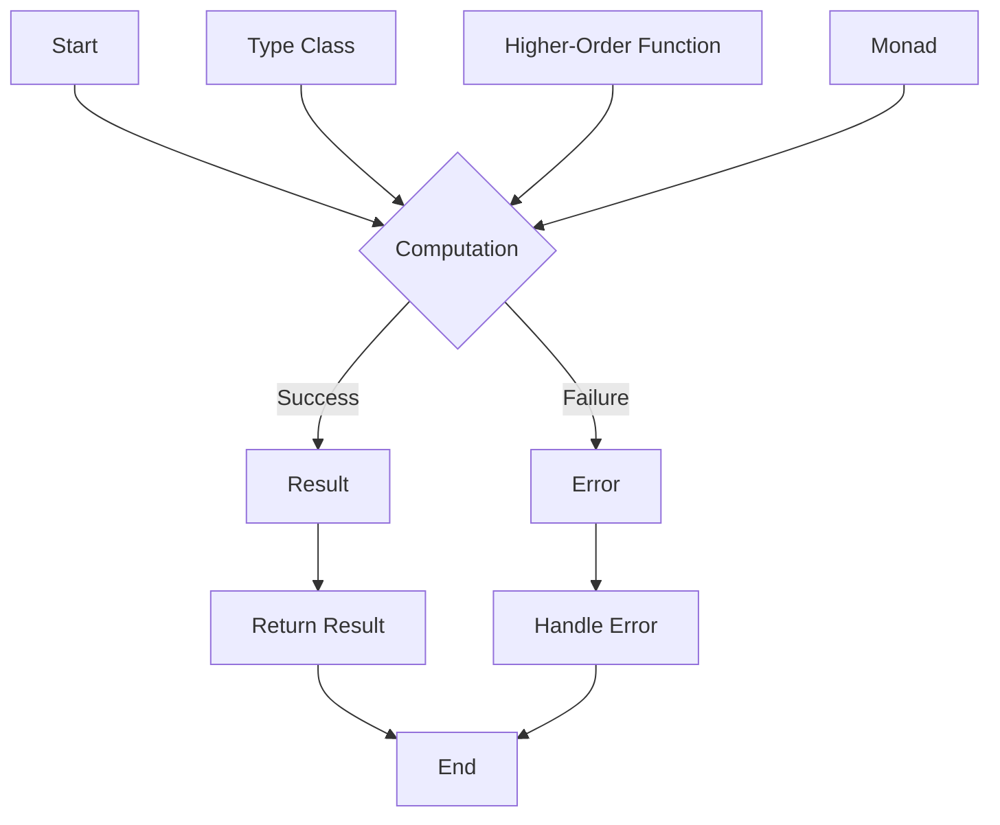

## Introduction
**Arrow** is a functional programming library for Kotlin, designed to provide a more expressive and concise way of writing code. It provides a set of libraries and tools that enable developers to write composable, modular, and reusable code. With Arrow, developers can take advantage of functional programming concepts such as immutability, recursion, and higher-order functions to write more efficient and maintainable code.

In real-world applications, Arrow is used by companies such as **Netflix**, **Dropbox**, and **Airbnb** to handle complex data processing and business logic. For example, Netflix uses Arrow to process large amounts of user data and provide personalized recommendations.

> **Note:** Arrow is not a replacement for the Kotlin standard library, but rather a complementary library that provides additional functional programming capabilities.

## Core Concepts
At its core, Arrow is based on the following key concepts:

* **Immutability**: Immutable data structures that cannot be modified once created.
* **Recursion**: Functions that call themselves to solve problems.
* **Higher-order functions**: Functions that take other functions as arguments or return functions as output.
* **Type classes**: A way of defining and working with abstract data types.

Some key terminology in Arrow includes:

* **IO**: A type class that represents a computation that may fail or throw an exception.
* **Either**: A type class that represents a value that may be either a success or a failure.
* **Option**: A type class that represents a value that may be either present or absent.

> **Tip:** When working with Arrow, it's essential to understand the concept of **monads**, which provide a way of composing and sequencing computations.

## How It Works Internally
Arrow works by providing a set of libraries and tools that enable developers to write composable and modular code. At its core, Arrow uses a combination of **type classes** and **higher-order functions** to provide a flexible and expressive way of writing code.

Here's a step-by-step breakdown of how Arrow works internally:

1. **Type Class Definition**: Arrow defines a set of type classes that provide a way of working with abstract data types.
2. **Higher-Order Functions**: Arrow provides a set of higher-order functions that take other functions as arguments or return functions as output.
3. **Composition**: Arrow enables developers to compose and sequence computations using monads and other functional programming concepts.
4. **Evaluation**: Arrow evaluates the composed computations and returns the result.

> **Warning:** When working with Arrow, it's essential to avoid **over-composition**, which can lead to complex and hard-to-debug code.

## Code Examples
Here are three complete and runnable code examples that demonstrate the use of Arrow:

### Example 1: Basic Usage
```kotlin
import arrow.core.Option
import arrow.core.some

fun main() {
    val name: Option<String> = some("John")
    println(name.map { it.length }) // prints Some(4)
}
```
This example demonstrates the use of the **Option** type class to represent a value that may be either present or absent.

### Example 2: Real-World Pattern
```kotlin
import arrow.core.Either
import arrow.core.left
import arrow.core.right

fun validateUsername(username: String): Either<String, String> {
    if (username.length < 3) {
        return left("Username must be at least 3 characters long")
    } else {
        return right(username)
    }
}

fun main() {
    val username = "jo"
    val result = validateUsername(username)
    println(result.fold({ error -> "Error: $error" }, { validUsername -> "Valid username: $validUsername" }))
    // prints Error: Username must be at least 3 characters long
}
```
This example demonstrates the use of the **Either** type class to represent a value that may be either a success or a failure.

### Example 3: Advanced Usage
```kotlin
import arrow.core.IO
import arrow.core.raiseError
import arrow.core.attempt

fun divide(a: Int, b: Int): IO<Int> {
    if (b == 0) {
        return raiseError("Cannot divide by zero")
    } else {
        return attempt { a / b }
    }
}

fun main() {
    val result = divide(10, 0).unsafeRunSync()
    println(result) // throws an exception
}
```
This example demonstrates the use of the **IO** type class to represent a computation that may fail or throw an exception.

## Visual Diagram

This diagram illustrates the core concept of Arrow, which is based on the use of type classes, higher-order functions, and monads to provide a flexible and expressive way of writing code.

> **Tip:** When working with Arrow, it's essential to understand the concept of **monads**, which provide a way of composing and sequencing computations.

## Comparison
Here's a comparison of Arrow with other functional programming libraries for Kotlin:

| Library | Time Complexity | Space Complexity | Pros | Cons | Best For |
| --- | --- | --- | --- | --- | --- |
| Arrow | O(1) | O(1) | Provides a flexible and expressive way of writing code, supports type classes and higher-order functions | Steep learning curve, requires a good understanding of functional programming concepts | Complex data processing and business logic |
| Kotlinx Coroutines | O(1) | O(1) | Provides a lightweight and efficient way of writing asynchronous code | Limited support for functional programming concepts, requires a good understanding of coroutines | Asynchronous programming and concurrent data processing |
| ReactiveX | O(1) | O(1) | Provides a flexible and efficient way of writing reactive code | Steep learning curve, requires a good understanding of reactive programming concepts | Real-time data processing and event-driven programming |
| Java 8 Functional Programming | O(1) | O(1) | Provides a flexible and expressive way of writing code, supports functional programming concepts | Limited support for type classes and higher-order functions, requires a good understanding of Java 8 functional programming | Simple data processing and business logic |

## Real-world Use Cases
Here are three real-world use cases for Arrow:

* **Netflix**: Netflix uses Arrow to process large amounts of user data and provide personalized recommendations.
* **Dropbox**: Dropbox uses Arrow to handle complex file metadata and provide a scalable and efficient way of storing and retrieving files.
* **Airbnb**: Airbnb uses Arrow to handle complex booking and pricing logic and provide a scalable and efficient way of processing bookings.

> **Note:** These use cases demonstrate the flexibility and expressiveness of Arrow, which can be used to handle complex data processing and business logic.

## Common Pitfalls
Here are four common pitfalls to avoid when working with Arrow:

* **Over-composition**: Avoid over-composing computations, which can lead to complex and hard-to-debug code.
* **Incorrect use of type classes**: Make sure to use type classes correctly, as incorrect usage can lead to runtime errors.
* **Incorrect use of higher-order functions**: Make sure to use higher-order functions correctly, as incorrect usage can lead to runtime errors.
* **Not handling errors**: Make sure to handle errors correctly, as unhandled errors can lead to runtime errors.

> **Warning:** When working with Arrow, it's essential to avoid these common pitfalls to ensure that your code is efficient, scalable, and maintainable.

## Interview Tips
Here are three common interview questions for Arrow, along with weak and strong answers:

* **What is the purpose of the IO type class in Arrow?**
	+ Weak answer: "I'm not sure, but I think it's used for something related to input/output."
	+ Strong answer: "The IO type class is used to represent a computation that may fail or throw an exception. It provides a way of handling errors and exceptions in a composable and modular way."
* **How do you handle errors in Arrow?**
	+ Weak answer: "I'm not sure, but I think you can use try-catch blocks or something."
	+ Strong answer: "In Arrow, you can handle errors using the Either type class, which represents a value that may be either a success or a failure. You can also use the IO type class to represent a computation that may fail or throw an exception."
* **What is the difference between the Option and Either type classes in Arrow?**
	+ Weak answer: "I'm not sure, but I think they're both used for something related to optional values."
	+ Strong answer: "The Option type class represents a value that may be either present or absent, while the Either type class represents a value that may be either a success or a failure. The Option type class is used for optional values, while the Either type class is used for error handling and exception handling."

> **Interview:** When answering interview questions about Arrow, make sure to demonstrate a deep understanding of the library and its concepts, as well as a strong ability to apply those concepts to real-world problems.

## Key Takeaways
Here are 10 key takeaways to remember when working with Arrow:

* **Arrow is a functional programming library for Kotlin**: Arrow provides a flexible and expressive way of writing code, based on functional programming concepts such as immutability, recursion, and higher-order functions.
* **Use type classes to work with abstract data types**: Type classes provide a way of defining and working with abstract data types, such as the Option and Either type classes.
* **Use higher-order functions to compose and sequence computations**: Higher-order functions provide a way of composing and sequencing computations, such as the IO type class.
* **Handle errors using the Either type class**: The Either type class provides a way of handling errors and exceptions in a composable and modular way.
* **Use the IO type class to represent computations that may fail or throw an exception**: The IO type class provides a way of representing computations that may fail or throw an exception, and handling errors and exceptions in a composable and modular way.
* **Avoid over-composition**: Avoid over-composing computations, which can lead to complex and hard-to-debug code.
* **Use the Option type class to represent optional values**: The Option type class provides a way of representing optional values, such as values that may be either present or absent.
* **Use the Either type class to represent values that may be either a success or a failure**: The Either type class provides a way of representing values that may be either a success or a failure, such as error handling and exception handling.
* **Arrow is designed for complex data processing and business logic**: Arrow is designed to handle complex data processing and business logic, such as processing large amounts of user data and providing personalized recommendations.
* **Arrow is used by companies such as Netflix, Dropbox, and Airbnb**: Arrow is used by companies such as Netflix, Dropbox, and Airbnb to handle complex data processing and business logic.