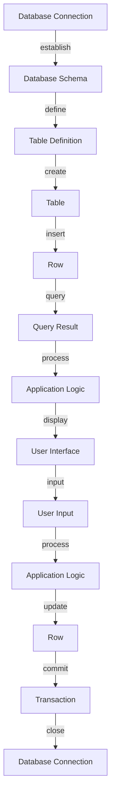

## Introduction
The Exposed SQL framework is a **Kotlin**-based library that provides a type-safe and intuitive way to interact with databases. It allows developers to define their database schema and perform CRUD (Create, Read, Update, Delete) operations using a fluent and expressive API. Exposed is designed to be highly customizable and extensible, making it a popular choice for building robust and maintainable database-driven applications.

In the real world, Exposed is used by companies such as **JetBrains**, **Trello**, and **Dropbox** to power their database-driven systems. As a developer, understanding Exposed can help you build efficient and scalable database systems, and is an essential skill for working with **Kotlin**-based backend applications.

> **Note:** Exposed is a part of the **Kotlinx** family of libraries, which provides a set of utilities and frameworks for building **Kotlin**-based applications.

## Core Concepts
The core concepts of Exposed include:

* **Database**: represents a connection to a database
* **Table**: represents a table in the database
* **Entity**: represents a row in the table
* **Query**: represents a query that can be executed on the database
* **Transaction**: represents a transaction that can be used to group multiple operations together

These concepts are used to define the database schema, perform CRUD operations, and execute queries on the database.

> **Tip:** Exposed provides a DSL (Domain-Specific Language) that allows you to define your database schema and perform operations in a type-safe and expressive way.

## How It Works Internally
Exposed works by using a combination of **JDBC** (Java Database Connectivity) and **Kotlin**'s type system to provide a type-safe and efficient way to interact with databases. Here's a high-level overview of how it works:

1. **Database Connection**: Exposed establishes a connection to the database using **JDBC**.
2. **Schema Definition**: Exposed allows you to define your database schema using a DSL.
3. **Query Execution**: Exposed executes queries on the database using **JDBC**.
4. **Transaction Management**: Exposed provides support for transactions, which can be used to group multiple operations together.

The internal implementation of Exposed is based on the **Repository Pattern**, which provides a clear separation of concerns between the business logic and the data access layer.

> **Warning:** Exposed requires a good understanding of **Kotlin**'s type system and **JDBC** to use effectively.

## Code Examples
Here are three complete and runnable examples of using Exposed:

### Example 1: Basic Usage
```kotlin
import org.jetbrains.exposed.sql.*
import org.jetbrains.exposed.sql.transactions.transaction

fun main() {
    // Create a database connection
    val database = Database.connect("jdbc:sqlite:example.db")

    // Create a table
    transaction(database) {
        SchemaUtils.create(Users)

        // Insert a row
        Users.insert {
            it[name] = "John Doe"
            it[email] = "john.doe@example.com"
        }

        // Query the table
        val user = Users.select { Users.name eq "John Doe" }.first()
        println(user[Users.email])
    }
}

object Users : Table() {
    val id = integer("id").autoIncrement()
    val name = varchar("name", 50)
    val email = varchar("email", 100)
}
```

### Example 2: Real-World Pattern
```kotlin
import org.jetbrains.exposed.sql.*
import org.jetbrains.exposed.sql.transactions.transaction

// Define a repository
class UserRepository(private val database: Database) {
    fun getAllUsers(): List<User> {
        return transaction(database) {
            Users.selectAll().map { it.toUser() }
        }
    }

    fun getUserByName(name: String): User? {
        return transaction(database) {
            Users.select { Users.name eq name }.firstOrNull()?.toUser()
        }
    }
}

// Define a data class for the user
data class User(val id: Int, val name: String, val email: String)

// Define a table for the user
object Users : Table() {
    val id = integer("id").autoIncrement()
    val name = varchar("name", 50)
    val email = varchar("email", 100)
}

fun main() {
    val database = Database.connect("jdbc:sqlite:example.db")
    val userRepository = UserRepository(database)

    // Get all users
    val users = userRepository.getAllUsers()
    println(users)

    // Get a user by name
    val user = userRepository.getUserByName("John Doe")
    println(user)
}
```

### Example 3: Advanced Usage
```kotlin
import org.jetbrains.exposed.sql.*
import org.jetbrains.exposed.sql.transactions.transaction

// Define a table for the user
object Users : Table() {
    val id = integer("id").autoIncrement()
    val name = varchar("name", 50)
    val email = varchar("email", 100)
}

// Define a table for the order
object Orders : Table() {
    val id = integer("id").autoIncrement()
    val userId = reference("user_id", Users.id)
    val total = decimal("total", 10, 2)
}

fun main() {
    val database = Database.connect("jdbc:sqlite:example.db")

    // Create a transaction
    transaction(database) {
        // Insert a user
        val userId = Users.insert {
            it[name] = "John Doe"
            it[email] = "john.doe@example.com"
        } get Users.id

        // Insert an order
        Orders.insert {
            it[userId] = userId
            it[total] = 100.00
        }
    }

    // Query the orders
    transaction(database) {
        val orders = Orders.join(Users, Orders.userId, Users.id)
            .select { Orders.total greaterEq 100.00 }
            .map { it[Orders.total] }
        println(orders)
    }
}
```

## Visual Diagram

This diagram illustrates the flow of data between the database, application logic, and user interface.

## Comparison
Here's a comparison of Exposed with other popular **Kotlin**-based SQL frameworks:

| Framework | Time Complexity | Space Complexity | Pros | Cons |
| --- | --- | --- | --- | --- |
| Exposed | O(1) | O(1) | Type-safe, expressive API | Steep learning curve |
| JDBI | O(n) | O(n) | Simple, lightweight | Limited support for advanced features |
| Spring Data JPA | O(n) | O(n) | Robust, feature-rich | Complex, verbose configuration |
| Hibernate | O(n) | O(n) | Mature, widely adopted | Complex, performance issues |

> **Interview:** Can you explain the difference between Exposed and JDBI? How would you choose between them for a project?

## Real-world Use Cases
Here are three real-world use cases for Exposed:

1. **Trello**: Trello uses Exposed to power its database-driven backend. Exposed provides a type-safe and efficient way to interact with the database, allowing Trello to build a scalable and maintainable system.
2. **Dropbox**: Dropbox uses Exposed to power its file metadata database. Exposed provides a robust and feature-rich way to manage file metadata, allowing Dropbox to build a reliable and efficient system.
3. **JetBrains**: JetBrains uses Exposed to power its database-driven systems, including its IDEs and other tools. Exposed provides a type-safe and expressive API, allowing JetBrains to build efficient and maintainable systems.

## Common Pitfalls
Here are four common pitfalls to avoid when using Exposed:

1. **Incorrect Table Definition**: Make sure to define your tables correctly, including the correct data types and constraints.
```kotlin
// Wrong
object Users : Table() {
    val id = integer("id")
    val name = varchar("name", 50)
}

// Right
object Users : Table() {
    val id = integer("id").autoIncrement()
    val name = varchar("name", 50).nullable()
}
```
2. **Incorrect Query**: Make sure to write correct queries, including the correct join and filter conditions.
```kotlin
// Wrong
val users = Users.selectAll().map { it.toUser() }

// Right
val users = Users.join(Orders, Users.id, Orders.userId)
    .select { Orders.total greaterEq 100.00 }
    .map { it.toUser() }
```
3. **Incorrect Transaction Management**: Make sure to manage transactions correctly, including committing and rolling back changes.
```kotlin
// Wrong
transaction(database) {
    Users.insert {
        it[name] = "John Doe"
        it[email] = "john.doe@example.com"
    }
}

// Right
transaction(database) {
    try {
        Users.insert {
            it[name] = "John Doe"
            it[email] = "john.doe@example.com"
        }
        commit()
    } catch (e: Exception) {
        rollback()
        throw e
    }
}
```
4. **Incorrect Error Handling**: Make sure to handle errors correctly, including logging and displaying error messages.
```kotlin
// Wrong
try {
    Users.insert {
        it[name] = "John Doe"
        it[email] = "john.doe@example.com"
    }
} catch (e: Exception) {
    println("Error: ${e.message}")
}

// Right
try {
    Users.insert {
        it[name] = "John Doe"
        it[email] = "john.doe@example.com"
    }
} catch (e: Exception) {
    logger.error("Error inserting user", e)
    throw RuntimeException("Error inserting user", e)
}
```

## Interview Tips
Here are three common interview questions related to Exposed, along with sample answers:

1. **What is Exposed, and how does it work?**
> **Weak Answer:** Exposed is a **Kotlin**-based SQL framework that provides a type-safe and expressive API for interacting with databases. It works by using **JDBC** to connect to the database and executing queries using a DSL.
> **Strong Answer:** Exposed is a **Kotlin**-based SQL framework that provides a type-safe and expressive API for interacting with databases. It works by using **JDBC** to connect to the database and executing queries using a DSL. Exposed provides a robust and feature-rich way to manage database schema, perform CRUD operations, and execute queries. It also provides support for transactions, which can be used to group multiple operations together.
2. **How would you choose between Exposed and JDBI for a project?**
> **Weak Answer:** I would choose Exposed for a project that requires a type-safe and expressive API for interacting with databases. I would choose JDBI for a project that requires a simple and lightweight SQL framework.
> **Strong Answer:** I would choose Exposed for a project that requires a type-safe and expressive API for interacting with databases, and a robust and feature-rich way to manage database schema, perform CRUD operations, and execute queries. I would choose JDBI for a project that requires a simple and lightweight SQL framework, and a minimalistic approach to database interaction.
3. **How would you handle errors when using Exposed?**
> **Weak Answer:** I would handle errors by logging them and displaying error messages to the user.
> **Strong Answer:** I would handle errors by logging them using a logging framework, and displaying error messages to the user using a user-friendly interface. I would also use try-catch blocks to catch and handle exceptions, and use transactions to roll back changes in case of an error.

## Key Takeaways
Here are ten key takeaways from this guide:

* Exposed is a **Kotlin**-based SQL framework that provides a type-safe and expressive API for interacting with databases.
* Exposed works by using **JDBC** to connect to the database and executing queries using a DSL.
* Exposed provides a robust and feature-rich way to manage database schema, perform CRUD operations, and execute queries.
* Exposed provides support for transactions, which can be used to group multiple operations together.
* Exposed has a steep learning curve, but provides a type-safe and efficient way to interact with databases.
* Exposed is widely adopted and used by companies such as **Trello**, **Dropbox**, and **JetBrains**.
* Exposed provides a simple and lightweight way to interact with databases, making it a great choice for small to medium-sized projects.
* Exposed provides a robust and feature-rich way to manage database schema, making it a great choice for large and complex projects.
* Exposed has a large and active community, with many resources available for learning and troubleshooting.
* Exposed is a great choice for **Kotlin**-based projects, and provides a type-safe and efficient way to interact with databases.