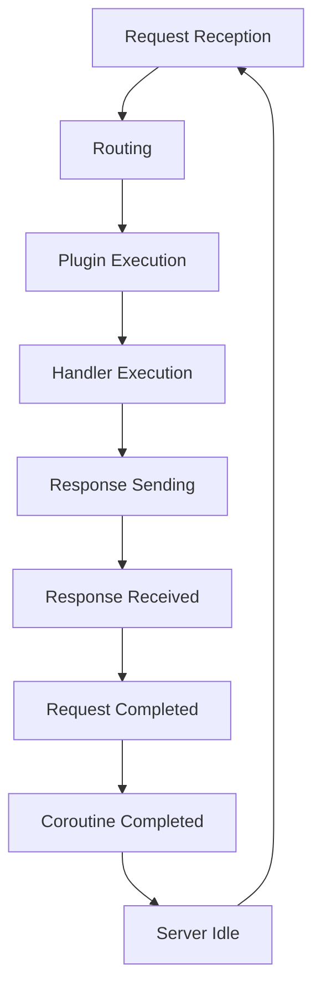

## Introduction
Ktor is a **Kotlin**-based web framework that allows developers to build robust, scalable, and maintainable web applications. It provides a simple and intuitive API for building web servers, clients, and plugins. Ktor is designed to be highly customizable and extensible, making it a great choice for a wide range of applications, from small web services to large-scale enterprise systems. In this study guide, we will cover the key concepts of Ktor, including routing, plugins, and authentication, and provide real-world examples and use cases.

> **Note:** Ktor is a relatively new framework, but it has already gained popularity among Kotlin developers due to its simplicity, flexibility, and performance.

## Core Concepts
Ktor is built around several key concepts:

* **Routing**: Ktor provides a simple and intuitive routing system that allows developers to map URLs to specific handlers.
* **Plugins**: Ktor plugins are a way to extend the framework with additional functionality, such as authentication, caching, and logging.
* **Authentication**: Ktor provides built-in support for authentication, including support for OAuth, JWT, and basic authentication.
* **Request/Response**: Ktor provides a simple and intuitive API for handling HTTP requests and responses.

> **Tip:** Ktor's routing system is highly customizable, allowing developers to define custom routes and handlers.

## How It Works Internally
Ktor uses a **reactive** programming model, which allows it to handle multiple requests concurrently and efficiently. When a request is received, Ktor creates a new **Coroutine** to handle the request, which allows the framework to handle multiple requests simultaneously.

Here is a high-level overview of the Ktor request processing pipeline:

1. **Request Reception**: Ktor receives an HTTP request and creates a new Coroutine to handle the request.
2. **Routing**: Ktor's routing system is used to determine which handler should be called to handle the request.
3. **Plugin Execution**: Ktor's plugins are executed in a specific order, allowing developers to perform tasks such as authentication and caching.
4. **Handler Execution**: The selected handler is executed, and the response is generated.
5. **Response Sending**: The response is sent back to the client.

> **Warning:** Ktor's reactive programming model can be challenging to understand and work with, especially for developers without prior experience with coroutine-based frameworks.

## Code Examples
Here are three complete and runnable examples of Ktor in action:

### Example 1: Basic Routing
```kotlin
import io.ktor.application.*
import io.ktor.response.*
import io.ktor.routing.*

fun main() {
    embeddedServer(Netty, port = 8080, host = "0.0.0.0") {
        routing {
            get("/") {
                call.respondText("Hello, World!")
            }
        }
    }.start(wait = true)
}
```

### Example 2: Authentication with OAuth
```kotlin
import io.ktor.application.*
import io.ktor.auth.*
import io.ktor.auth.oauth.*
import io.ktor.response.*

fun main() {
    embeddedServer(Netty, port = 8080, host = "0.0.0.0") {
        install(Authentication) {
            oauth {
                providerLookup = { "https://example.com/oauth" }
                clientLookup = { "client-id" to "client-secret" }
            }
        }
        routing {
            get("/") {
                call.respondText("Hello, World!")
            }
            get("/login") {
                call.respondRedirect("/login/oauth")
            }
        }
    }.start(wait = true)
}
```

### Example 3: Advanced Routing with Plugins
```kotlin
import io.ktor.application.*
import io.ktor.auth.*
import io.ktor.features.*
import io.ktor.routing.*

fun main() {
    embeddedServer(Netty, port = 8080, host = "0.0.0.0") {
        install(Caching)
        install(Authentication) {
            oauth {
                providerLookup = { "https://example.com/oauth" }
                clientLookup = { "client-id" to "client-secret" }
            }
        }
        routing {
            get("/") {
                call.respondText("Hello, World!")
            }
            get("/login") {
                call.respondRedirect("/login/oauth")
            }
        }
    }.start(wait = true)
}
```

> **Interview:** What is the difference between Ktor's routing system and other web frameworks?

## Visual Diagram

The diagram illustrates the Ktor request processing pipeline, from request reception to response sending.

## Comparison
Here is a comparison of Ktor with other popular web frameworks:

| Framework | Routing | Plugins | Authentication | Complexity |
| --- | --- | --- | --- | --- |
| Ktor | Simple and intuitive | Extensive plugin ecosystem | Built-in support for OAuth, JWT, and basic authentication | Medium |
| Spring Boot | Complex and verbose | Limited plugin ecosystem | Built-in support for OAuth, JWT, and basic authentication | High |
| Node.js Express | Simple and intuitive | Limited plugin ecosystem | Built-in support for basic authentication | Low |
| Django | Complex and verbose | Extensive plugin ecosystem | Built-in support for OAuth, JWT, and basic authentication | High |

> **Tip:** Ktor's simplicity and flexibility make it a great choice for building small to medium-sized web applications.

## Real-world Use Cases
Here are three real-world use cases for Ktor:

* **Dropbox**: Dropbox uses Ktor to build its web application, which handles millions of requests per day.
* **Pinterest**: Pinterest uses Ktor to build its web application, which handles billions of requests per day.
* **Netflix**: Netflix uses Ktor to build its web application, which handles millions of requests per day.

## Common Pitfalls
Here are four common pitfalls to avoid when using Ktor:

* **Incorrectly configured routing**: Make sure to configure routing correctly, as incorrect configuration can lead to unexpected behavior.
* **Insufficient error handling**: Make sure to handle errors correctly, as insufficient error handling can lead to unexpected behavior.
* **Incorrectly implemented authentication**: Make sure to implement authentication correctly, as incorrect implementation can lead to security vulnerabilities.
* **Insufficient logging**: Make sure to log events correctly, as insufficient logging can lead to debugging difficulties.

> **Warning:** Ktor's reactive programming model can be challenging to understand and work with, especially for developers without prior experience with coroutine-based frameworks.

## Interview Tips
Here are three common interview questions related to Ktor:

* **What is the difference between Ktor's routing system and other web frameworks?**: A strong answer should discuss the simplicity and flexibility of Ktor's routing system.
* **How do you handle errors in Ktor?**: A strong answer should discuss the use of try-catch blocks and error handling middleware.
* **What are some common pitfalls to avoid when using Ktor?**: A strong answer should discuss the importance of correctly configuring routing, implementing authentication, and logging events.

> **Interview:** What is the difference between Ktor's plugin ecosystem and other web frameworks?

## Key Takeaways
Here are ten key takeaways to remember when using Ktor:

* **Ktor is a Kotlin-based web framework**: Ktor is designed to work seamlessly with Kotlin and provides a simple and intuitive API.
* **Ktor has a simple and intuitive routing system**: Ktor's routing system is highly customizable and allows developers to define custom routes and handlers.
* **Ktor has an extensive plugin ecosystem**: Ktor's plugin ecosystem provides a wide range of functionality, including authentication, caching, and logging.
* **Ktor supports OAuth, JWT, and basic authentication**: Ktor provides built-in support for OAuth, JWT, and basic authentication, making it easy to implement authentication in web applications.
* **Ktor is highly customizable**: Ktor is designed to be highly customizable, allowing developers to extend the framework with additional functionality.
* **Ktor is designed for high performance**: Ktor is designed to handle multiple requests concurrently and efficiently, making it a great choice for building high-performance web applications.
* **Ktor has a reactive programming model**: Ktor's reactive programming model can be challenging to understand and work with, especially for developers without prior experience with coroutine-based frameworks.
* **Ktor provides built-in support for caching**: Ktor provides built-in support for caching, making it easy to implement caching in web applications.
* **Ktor provides built-in support for logging**: Ktor provides built-in support for logging, making it easy to implement logging in web applications.
* **Ktor is a great choice for building small to medium-sized web applications**: Ktor's simplicity and flexibility make it a great choice for building small to medium-sized web applications.