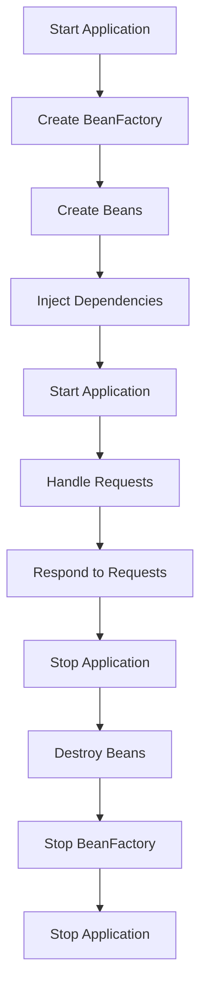

## Introduction
**Spring Boot** is a popular framework for building web applications and microservices using Java, and when combined with **Kotlin**, it provides a powerful and concise way to develop server-side applications. In this section, we'll explore what Spring Boot with Kotlin is, why it matters, and its real-world relevance. 
> **Note:** Kotlin is a statically typed programming language that runs on the Java Virtual Machine (JVM) and is designed to be more concise and safe than Java.

Spring Boot with Kotlin is a great choice for building server-side applications because it provides a lot of benefits, including:
- **Concise code**: Kotlin's syntax is more concise than Java's, which means you can write less code to achieve the same result.
- **Null safety**: Kotlin's type system is designed to eliminate null pointer exceptions, which makes your code safer and more reliable.
- **Interoperability**: Kotlin is fully interoperable with Java, which means you can easily use Java libraries and frameworks in your Kotlin projects.

In real-world scenarios, Spring Boot with Kotlin is used by many companies, such as **Netflix**, **Airbnb**, and **Pinterest**, to build scalable and maintainable server-side applications.

## Core Concepts
In this section, we'll dive into the core concepts of Spring Boot with Kotlin, including the **Spring Boot framework**, **Kotlin programming language**, and **dependency injection**.
- **Spring Boot framework**: Spring Boot is a framework that simplifies the process of building web applications and microservices using Spring.
- **Kotlin programming language**: Kotlin is a statically typed programming language that runs on the JVM and is designed to be more concise and safe than Java.
- **Dependency injection**: Dependency injection is a design pattern that allows you to inject dependencies into your application components, which makes your code more modular and testable.

> **Warning:** One common mistake when using Spring Boot with Kotlin is not properly configuring the dependency injection framework, which can lead to issues with the application's stability and performance.

Some key terminology to keep in mind when working with Spring Boot and Kotlin includes:
- **@Configuration**: This annotation is used to indicate that a class is a source of bean definitions.
- **@Bean**: This annotation is used to indicate that a method returns a bean to be managed by the Spring IoC container.
- **@Autowired**: This annotation is used to inject dependencies into a component.

## How It Works Internally
In this section, we'll explore how Spring Boot with Kotlin works internally, including the **application lifecycle**, **bean creation**, and **dependency injection**.
- **Application lifecycle**: The application lifecycle refers to the process of starting and stopping the application. In Spring Boot, the application lifecycle is managed by the **SpringApplication** class.
- **Bean creation**: Bean creation refers to the process of creating instances of classes that are managed by the Spring IoC container. In Spring Boot, bean creation is managed by the **BeanFactory** class.
- **Dependency injection**: Dependency injection refers to the process of injecting dependencies into components. In Spring Boot, dependency injection is managed by the **AutowiredAnnotationBeanPostProcessor** class.

> **Tip:** One way to improve the performance of a Spring Boot application is to use **lazy loading**, which allows you to defer the creation of beans until they are actually needed.

Here's a high-level overview of how Spring Boot with Kotlin works internally:
1. The application is started by creating an instance of the **SpringApplication** class.
2. The **SpringApplication** class creates an instance of the **BeanFactory** class, which is responsible for managing the application's beans.
3. The **BeanFactory** class creates instances of the application's components, including controllers, services, and repositories.
4. The **AutowiredAnnotationBeanPostProcessor** class injects dependencies into the application's components.
5. The application is ready to receive requests and respond to them.

## Code Examples
In this section, we'll explore three complete and runnable examples of using Spring Boot with Kotlin.
### Example 1: Basic "Hello World" Application
```kotlin
// Import the necessary dependencies
import org.springframework.boot.autoconfigure.SpringBootApplication
import org.springframework.boot.runApplication
import org.springframework.web.bind.annotation.GetMapping
import org.springframework.web.bind.annotation.RestController

// Define the application class
@SpringBootApplication
class HelloWorldApplication

// Define the controller class
@RestController
class HelloWorldController {
    @GetMapping("/")
    fun helloWorld(): String {
        return "Hello, World!"
    }
}

// Run the application
fun main() {
    runApplication<HelloWorldApplication>(*args)
}
```
This example demonstrates how to create a basic "Hello World" application using Spring Boot and Kotlin.

### Example 2: RESTful API with Spring Data JPA
```kotlin
// Import the necessary dependencies
import org.springframework.boot.autoconfigure.SpringBootApplication
import org.springframework.boot.runApplication
import org.springframework.data.jpa.repository.JpaRepository
import org.springframework.web.bind.annotation.GetMapping
import org.springframework.web.bind.annotation.PathVariable
import org.springframework.web.bind.annotation.RestController
import javax.persistence.Entity
import javax.persistence.GeneratedValue
import javax.persistence.GenerationType
import javax.persistence.Id

// Define the entity class
@Entity
data class User(
    @Id
    @GeneratedValue(strategy = GenerationType.IDENTITY)
    val id: Long,
    val name: String,
    val email: String
)

// Define the repository interface
interface UserRepository : JpaRepository<User, Long>

// Define the controller class
@RestController
class UserController(
    private val userRepository: UserRepository
) {
    @GetMapping("/users")
    fun getUsers(): List<User> {
        return userRepository.findAll()
    }

    @GetMapping("/users/{id}")
    fun getUser(@PathVariable id: Long): User? {
        return userRepository.findById(id).orElse(null)
    }
}

// Define the application class
@SpringBootApplication
class UserApplication

// Run the application
fun main() {
    runApplication<UserApplication>(*args)
}
```
This example demonstrates how to create a RESTful API using Spring Boot, Kotlin, and Spring Data JPA.

### Example 3: WebSockets with Spring Boot
```kotlin
// Import the necessary dependencies
import org.springframework.boot.autoconfigure.SpringBootApplication
import org.springframework.boot.runApplication
import org.springframework.web.socket.TextMessage
import org.springframework.web.socket.WebSocketSession
import org.springframework.web.socket.config.annotation.EnableWebSocket
import org.springframework.web.socket.config.annotation.WebSocketConfigurer
import org.springframework.web.socket.handler.TextWebSocketHandler

// Define the WebSocket handler class
class WebSocketHandler : TextWebSocketHandler() {
    override fun handleTextMessage(session: WebSocketSession, message: TextMessage) {
        // Handle incoming messages
        session.sendMessage(TextMessage("Hello, Client!"))
    }
}

// Define the WebSocket configurer class
@EnableWebSocket
class WebSocketConfig : WebSocketConfigurer {
    override fun registerWebSocketHandlers(registry: WebSocketHandlerRegistry) {
        registry.addHandler(WebSocketHandler(), "/ws")
    }
}

// Define the application class
@SpringBootApplication
class WebSocketApplication

// Run the application
fun main() {
    runApplication<WebSocketApplication>(*args)
}
```
This example demonstrates how to create a WebSocket application using Spring Boot and Kotlin.

## Visual Diagram

This diagram illustrates the high-level flow of a Spring Boot application with Kotlin.

## Comparison
| Framework | Time Complexity | Space Complexity | Pros | Cons | Best For |
| --- | --- | --- | --- | --- | --- |
| Spring Boot | O(1) | O(n) | Easy to use, high-level abstractions | Steep learning curve, complex configuration | Web applications, microservices |
| Play Framework | O(n) | O(n) | Fast, scalable, and reliable | Complex configuration, limited community support | Real-time web applications, high-traffic websites |
| Vert.x | O(1) | O(n) | Fast, lightweight, and modular | Limited community support, complex configuration | Real-time web applications, microservices |
| Dropwizard | O(1) | O(n) | Simple, lightweight, and easy to use | Limited community support, limited features | Small web applications, microservices |

> **Interview:** When asked about the differences between Spring Boot and Play Framework, a good answer would be: "Spring Boot is a more high-level framework that provides a lot of built-in features and abstractions, while Play Framework is a more low-level framework that provides more control over the underlying infrastructure. Spring Boot is better suited for web applications and microservices, while Play Framework is better suited for real-time web applications and high-traffic websites."

## Real-world Use Cases
Here are three real-world use cases for Spring Boot with Kotlin:
1. **Netflix**: Netflix uses Spring Boot to build its web applications and microservices.
2. **Airbnb**: Airbnb uses Spring Boot to build its web applications and microservices.
3. **Pinterest**: Pinterest uses Spring Boot to build its web applications and microservices.

> **Tip:** When building a Spring Boot application, it's a good idea to use a **continuous integration** tool like Jenkins or Travis CI to automate the build and deployment process.

## Common Pitfalls
Here are four common pitfalls to avoid when using Spring Boot with Kotlin:
1. **Not properly configuring the dependency injection framework**: This can lead to issues with the application's stability and performance.
2. **Not using lazy loading**: This can lead to performance issues and increased memory usage.
3. **Not using transactions**: This can lead to data inconsistencies and errors.
4. **Not using security**: This can lead to security vulnerabilities and data breaches.

> **Warning:** One common mistake when using Spring Boot with Kotlin is not properly securing the application, which can lead to security vulnerabilities and data breaches.

## Interview Tips
Here are three common interview questions and answers for Spring Boot with Kotlin:
1. **What is Spring Boot, and how does it work?**: A good answer would be: "Spring Boot is a framework that simplifies the process of building web applications and microservices using Spring. It works by providing a lot of built-in features and abstractions that make it easy to build and deploy applications."
2. **How does Spring Boot with Kotlin work?**: A good answer would be: "Spring Boot with Kotlin works by using the Kotlin programming language to build web applications and microservices using the Spring Boot framework. It provides a lot of benefits, including concise code, null safety, and interoperability with Java."
3. **What are some common use cases for Spring Boot with Kotlin?**: A good answer would be: "Some common use cases for Spring Boot with Kotlin include building web applications, microservices, and real-time web applications. It's also used by many companies, such as Netflix, Airbnb, and Pinterest, to build scalable and maintainable applications."

## Key Takeaways
Here are ten key takeaways to remember when using Spring Boot with Kotlin:
* **Use Spring Boot to build web applications and microservices**: Spring Boot provides a lot of built-in features and abstractions that make it easy to build and deploy applications.
* **Use Kotlin to write concise and safe code**: Kotlin is a statically typed programming language that runs on the JVM and is designed to be more concise and safe than Java.
* **Use dependency injection to manage dependencies**: Dependency injection is a design pattern that allows you to inject dependencies into your application components, which makes your code more modular and testable.
* **Use lazy loading to improve performance**: Lazy loading allows you to defer the creation of beans until they are actually needed, which can improve performance and reduce memory usage.
* **Use transactions to ensure data consistency**: Transactions ensure that data is consistent and accurate, even in the presence of errors or failures.
* **Use security to protect your application**: Security is critical to protecting your application and data from unauthorized access and malicious attacks.
* **Use continuous integration to automate the build and deployment process**: Continuous integration tools like Jenkins or Travis CI can automate the build and deployment process, which can save time and improve quality.
* **Test your application thoroughly**: Testing is critical to ensuring that your application works correctly and meets the required specifications.
* **Use monitoring and logging to troubleshoot issues**: Monitoring and logging can help you troubleshoot issues and improve the performance and reliability of your application.
* **Stay up-to-date with the latest version of Spring Boot and Kotlin**: Staying up-to-date with the latest version of Spring Boot and Kotlin can ensure that you have access to the latest features and bug fixes.