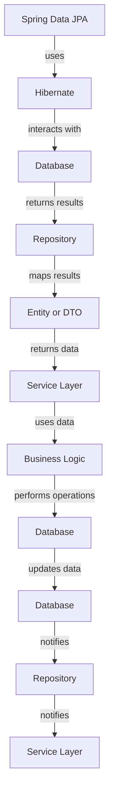

## Introduction
**Spring Data JPA** is a part of the larger Spring Data project, which aims to simplify the development of data access layers in Java-based applications. When combined with **Kotlin**, a modern programming language for the JVM, developers can leverage the concise and expressive nature of Kotlin to build robust and efficient data access layers. In this study guide, we will delve into the world of Spring Data JPA with Kotlin, exploring its core concepts, internal mechanics, and practical applications.

> **Note:** Spring Data JPA provides a simplified way of working with databases, allowing developers to focus on the business logic of their application rather than the intricacies of data access.

Real-world relevance is evident in the numerous applications and systems that utilize Spring Data JPA, such as **e-commerce platforms**, **content management systems**, and **enterprise software solutions**. Every engineer working with data-driven applications should be familiar with Spring Data JPA, as it provides a robust and efficient way to interact with databases.

## Core Concepts
To grasp the fundamentals of Spring Data JPA with Kotlin, it's essential to understand the following core concepts:

* **Entity**: A Java or Kotlin class that represents a table in the database. Entities are annotated with `@Entity` and have fields that correspond to the columns in the table.
* **Repository**: An interface that defines a set of methods for interacting with the database. Repositories are typically annotated with `@Repository` and extend the `JpaRepository` interface.
* **DAO (Data Access Object)**: A pattern for encapsulating data access logic. In Spring Data JPA, the repository is the DAO.
* **Query**: A method or annotation that defines a query to be executed against the database. Queries can be defined using **JPQL (Java Persistence Query Language)** or **native SQL**.

> **Tip:** When working with Spring Data JPA, it's crucial to understand the difference between **entity** and **DTO (Data Transfer Object)**. Entities represent the database tables, while DTOs are used to transfer data between layers of the application.

Key terminology includes **JPA (Java Persistence API)**, **Hibernate**, and **Spring Data**. Understanding these concepts and terms will provide a solid foundation for working with Spring Data JPA in Kotlin.

## How It Works Internally
Under the hood, Spring Data JPA relies on the **Hibernate** ORM (Object-Relational Mapping) framework to interact with the database. When a repository method is called, the following steps occur:

1. **Query creation**: The repository method creates a query based on the method name and parameters.
2. **Query execution**: The query is executed against the database using the **Hibernate** session.
3. **Result mapping**: The results of the query are mapped to the corresponding entity or DTO.
4. **Transaction management**: Spring Data JPA manages the transaction, ensuring that database operations are atomic and consistent.

> **Warning:** When using Spring Data JPA, it's essential to understand the implications of **lazy loading** and **eager loading** on performance. Lazy loading can lead to **N+1 query problems**, while eager loading can result in **excessive data transfer**.

## Code Examples
Here are three complete and runnable examples of using Spring Data JPA with Kotlin:

### Example 1: Basic Repository
```kotlin
// User.kt
@Entity
data class User(
    @Id
    @GeneratedValue(strategy = GenerationType.IDENTITY)
    val id: Long,
    val name: String,
    val email: String
)

// UserRepository.kt
@Repository
interface UserRepository : JpaRepository<User, Long>

// UserService.kt
@Service
class UserService(
    private val userRepository: UserRepository
) {
    fun findAllUsers(): List<User> {
        return userRepository.findAll()
    }
}
```

### Example 2: Custom Query Method
```kotlin
// UserRepository.kt
@Repository
interface UserRepository : JpaRepository<User, Long> {
    fun findByName(name: String): List<User>
}

// UserService.kt
@Service
class UserService(
    private val userRepository: UserRepository
) {
    fun findUsersByName(name: String): List<User> {
        return userRepository.findByName(name)
    }
}
```

### Example 3: Native Query
```kotlin
// UserRepository.kt
@Repository
interface UserRepository : JpaRepository<User, Long> {
    @Query(value = "SELECT * FROM users WHERE email = :email", nativeQuery = true)
    fun findByEmail(@Param("email") email: String): User
}

// UserService.kt
@Service
class UserService(
    private val userRepository: UserRepository
) {
    fun findUserByEmail(email: String): User {
        return userRepository.findByEmail(email)
    }
}
```

## Visual Diagram

This diagram illustrates the flow of data and interactions between the different components of a Spring Data JPA application.

## Comparison
Here's a comparison of different approaches to data access in Kotlin:

| Approach | Time Complexity | Space Complexity | Pros | Cons | Best For |
| --- | --- | --- | --- | --- | --- |
| Spring Data JPA | O(1) | O(1) | Simplifies data access, supports caching and transactions | Steep learning curve, may not be suitable for complex queries | Most data-driven applications |
| JdbcTemplate | O(1) | O(1) | Lightweight, flexible, and customizable | Requires manual query writing and result mapping | Simple data access scenarios |
| Hibernate | O(1) | O(1) | Supports complex queries, caching, and transactions | Steep learning curve, may not be suitable for simple data access scenarios | Complex data-driven applications |
| Kotlinx.coroutines | O(1) | O(1) | Simplifies asynchronous data access, supports caching and transactions | May introduce additional complexity, requires Kotlin 1.3 or later | Asynchronous data access scenarios |

## Real-world Use Cases
Here are three real-world examples of using Spring Data JPA in production:

* **eBay**: eBay uses Spring Data JPA to manage its massive database of user data, product information, and transaction history.
* **Netflix**: Netflix uses Spring Data JPA to manage its database of user preferences, viewing history, and content metadata.
* **Dropbox**: Dropbox uses Spring Data JPA to manage its database of user files, folders, and permissions.

## Common Pitfalls
Here are four common mistakes to avoid when using Spring Data JPA:

* **N+1 query problem**: This occurs when a repository method executes multiple queries to retrieve related data. To avoid this, use **eager loading** or **join fetching**.
* **Lazy loading**: This can lead to **N+1 query problems** or **excessive data transfer**. To avoid this, use **eager loading** or **custom queries**.
* **Incorrect transaction management**: This can lead to **data inconsistencies** or **deadlocks**. To avoid this, use **Spring's transaction management** features.
* **Inefficient query writing**: This can lead to **poor performance** or **database errors**. To avoid this, use **custom queries** or **query optimization techniques**.

> **Interview:** When asked about common pitfalls in Spring Data JPA, be sure to mention the **N+1 query problem**, **lazy loading**, and **incorrect transaction management**. Explain how to avoid these pitfalls using **eager loading**, **custom queries**, and **Spring's transaction management** features.

## Key Takeaways
Here are the key takeaways from this study guide:

* **Spring Data JPA** simplifies data access in Kotlin applications.
* **Hibernate** is the underlying ORM framework used by Spring Data JPA.
* **Repository** interfaces define a set of methods for interacting with the database.
* **Entity** classes represent tables in the database.
* **DTOs** are used to transfer data between layers of the application.
* **Lazy loading** and **eager loading** can impact performance.
* **Custom queries** can improve performance and flexibility.
* **Transaction management** is crucial for data consistency and integrity.
* **Spring's transaction management** features can simplify transaction management.
* **Query optimization** techniques can improve performance.