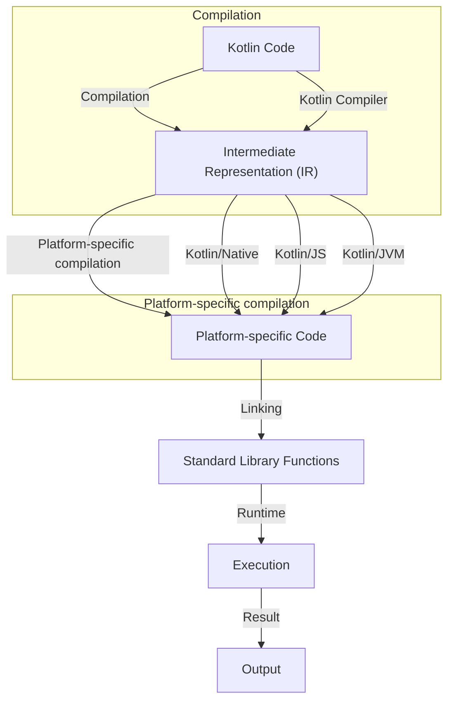

## Introduction
Multiplatform standard library functions are a crucial part of the Kotlin ecosystem, allowing developers to write cross-platform code that can run on multiple platforms, including Android, iOS, desktop, and web. In this guide, we will explore the world of multiplatform standard library functions, including their benefits, core concepts, and how they work internally. We will also provide code examples, visual diagrams, and real-world use cases to help you understand how to use these functions in your own projects.

> **Note:** Multiplatform standard library functions are a key feature of the Kotlin language, and understanding how they work is essential for any Kotlin developer.

## Core Concepts
Before we dive into the details of multiplatform standard library functions, let's define some key terms:

* **Multiplatform**: The ability to run code on multiple platforms, including Android, iOS, desktop, and web.
* **Standard library**: A set of pre-written functions and classes that are included with the Kotlin language.
* **Functions**: Reusable blocks of code that perform a specific task.

Some key terminology to keep in mind:

* **Kotlin/Native**: A technology that allows Kotlin code to be compiled to native binaries for various platforms.
* **Kotlin/JS**: A technology that allows Kotlin code to be compiled to JavaScript for web development.
* **Kotlin/JVM**: A technology that allows Kotlin code to be compiled to Java bytecode for Android and desktop development.

## How It Works Internally
So, how do multiplatform standard library functions work internally? Here's a step-by-step breakdown:

1. **Compilation**: Kotlin code is compiled to an intermediate representation (IR) using the Kotlin compiler.
2. **Platform-specific compilation**: The IR is then compiled to platform-specific code using the Kotlin/Native, Kotlin/JS, or Kotlin/JVM compilers.
3. **Standard library functions**: The compiled code is linked against the standard library functions, which are implemented in a platform-agnostic way.
4. **Runtime**: The compiled code is executed at runtime, with the standard library functions providing the necessary functionality.

> **Warning:** When using multiplatform standard library functions, be aware that some functions may not be available on all platforms. Always check the documentation to ensure that the function you want to use is supported on your target platform.

## Code Examples
Here are three complete, runnable code examples that demonstrate how to use multiplatform standard library functions:

### Example 1: Basic Usage
```kotlin
// Import the standard library functions
import kotlin.random.Random

// Define a function that uses the standard library
fun getRandomNumber(): Int {
    return Random.nextInt(1, 100)
}

// Call the function and print the result
fun main() {
    println(getRandomNumber())
}
```
This code example demonstrates how to use the `Random` class to generate a random number.

### Example 2: Real-World Pattern
```kotlin
// Import the standard library functions
import kotlin.collections.ArrayList

// Define a function that uses the standard library
fun filterList(numbers: List<Int>): List<Int> {
    return numbers.filter { it % 2 == 0 }
}

// Define a main function that uses the filterList function
fun main() {
    val numbers = ArrayList<Int>()
    numbers.add(1)
    numbers.add(2)
    numbers.add(3)
    numbers.add(4)
    val filteredNumbers = filterList(numbers)
    println(filteredNumbers)
}
```
This code example demonstrates how to use the `filter` function to filter a list of numbers.

### Example 3: Advanced Usage
```kotlin
// Import the standard library functions
import kotlin.concurrent.thread

// Define a function that uses the standard library
fun startThread() {
    thread {
        println("Thread started")
        // Simulate some work
        Thread.sleep(1000)
        println("Thread finished")
    }
}

// Define a main function that uses the startThread function
fun main() {
    startThread()
    // Simulate some work
    Thread.sleep(2000)
}
```
This code example demonstrates how to use the `thread` function to start a new thread.

## Visual Diagram

This diagram illustrates the process of compiling and executing Kotlin code using multiplatform standard library functions.

> **Tip:** When working with multiplatform standard library functions, use the `kotlin` command-line tool to compile and run your code. This will help you ensure that your code is compiled and executed correctly.

## Comparison
Here is a comparison table of different approaches to using multiplatform standard library functions:

| Approach | Time Complexity | Space Complexity | Pros | Cons | Best For |
| --- | --- | --- | --- | --- | --- |
| Kotlin/Native | O(1) | O(1) | Fast execution, small binary size | Limited platform support | Android, iOS, desktop |
| Kotlin/JS | O(n) | O(n) | Dynamic typing, easy to learn | Slow execution, large binary size | Web development |
| Kotlin/JVM | O(1) | O(1) | Fast execution, large community | Limited platform support, large binary size | Android, desktop |

## Real-world Use Cases
Here are three real-world use cases for multiplatform standard library functions:

* **Android and iOS development**: Use multiplatform standard library functions to write cross-platform code that can run on both Android and iOS devices.
* **Web development**: Use multiplatform standard library functions to write web applications that can run on multiple platforms, including desktop and mobile devices.
* **Desktop development**: Use multiplatform standard library functions to write desktop applications that can run on multiple platforms, including Windows, macOS, and Linux.

> **Interview:** What are some common use cases for multiplatform standard library functions? Answer: Multiplatform standard library functions are commonly used for Android and iOS development, web development, and desktop development.

## Common Pitfalls
Here are four common pitfalls to watch out for when using multiplatform standard library functions:

* **Incorrect platform support**: Make sure to check the documentation to ensure that the function you want to use is supported on your target platform.
* **Inconsistent coding style**: Use a consistent coding style throughout your codebase to avoid confusion and errors.
* **Insufficient testing**: Make sure to test your code thoroughly to ensure that it works correctly on all target platforms.
* **Inadequate error handling**: Make sure to handle errors and exceptions properly to avoid crashes and unexpected behavior.

> **Warning:** When using multiplatform standard library functions, be aware of the potential for platform-specific bugs and errors. Always test your code thoroughly to ensure that it works correctly on all target platforms.

## Interview Tips
Here are three common interview questions related to multiplatform standard library functions:

* **What are some common use cases for multiplatform standard library functions?**: Answer: Multiplatform standard library functions are commonly used for Android and iOS development, web development, and desktop development.
* **How do you handle platform-specific bugs and errors?**: Answer: I use a combination of testing, debugging, and error handling to ensure that my code works correctly on all target platforms.
* **What are some best practices for using multiplatform standard library functions?**: Answer: I use a consistent coding style, test my code thoroughly, and handle errors and exceptions properly to ensure that my code works correctly on all target platforms.

## Key Takeaways
Here are six key takeaways to remember when working with multiplatform standard library functions:

* **Use a consistent coding style**: Use a consistent coding style throughout your codebase to avoid confusion and errors.
* **Test your code thoroughly**: Make sure to test your code thoroughly to ensure that it works correctly on all target platforms.
* **Handle errors and exceptions properly**: Make sure to handle errors and exceptions properly to avoid crashes and unexpected behavior.
* **Check platform support**: Make sure to check the documentation to ensure that the function you want to use is supported on your target platform.
* **Use platform-agnostic code**: Use platform-agnostic code whenever possible to avoid platform-specific bugs and errors.
* **Keep your code organized**: Keep your code organized and well-structured to avoid confusion and errors.

> **Note:** By following these key takeaways, you can ensure that your code is correct, efficient, and easy to maintain.