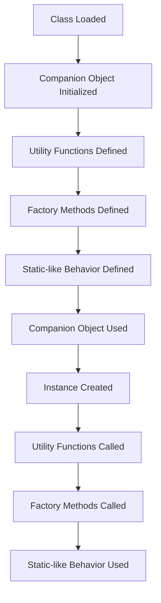

## Introduction
**Companion objects** are a powerful feature in Kotlin, allowing developers to define static-like behavior within a class. However, they can also lead to common pitfalls if not used correctly. In this section, we'll explore what companion objects are, why they matter, and their real-world relevance. Companion objects are useful when you need to define a factory method or a static constant within a class. They are also useful when you need to define a set of utility functions that are related to a class.

> **Note:** Companion objects are not the same as static members in other languages. They are objects that are associated with a class, and can be used to define static-like behavior.

## Core Concepts
A **companion object** is an object that is associated with a class. It is defined using the `companion object` keyword, and can contain properties, functions, and other members. Companion objects are useful when you need to define a set of utility functions that are related to a class. They can also be used to define factory methods, which are methods that create instances of a class.

> **Tip:** Use companion objects to define utility functions that are related to a class. This can help to keep your code organized and make it easier to use.

The key terminology related to companion objects includes:

* **Companion object**: an object that is associated with a class.
* **Factory method**: a method that creates instances of a class.
* **Static constant**: a constant that is defined within a class.

## How It Works Internally
When you define a companion object, Kotlin creates a new object that is associated with the class. This object is initialized when the class is loaded, and can be used to define static-like behavior. The companion object is essentially a singleton instance of the class, and can be used to define utility functions and factory methods.

Here's a step-by-step breakdown of how companion objects work internally:

1. The class is loaded, and the companion object is initialized.
2. The companion object is used to define utility functions and factory methods.
3. The utility functions and factory methods are used to create instances of the class.

> **Warning:** Be careful when using companion objects to define static-like behavior. Companion objects are not thread-safe, and can lead to concurrency issues if not used correctly.

## Code Examples
Here are three complete, runnable examples of companion objects:

### Example 1: Basic Companion Object
```kotlin
class MyClass {
    companion object {
        fun myFunction() {
            println("Hello, world!")
        }
    }
}

fun main() {
    MyClass.myFunction()
}
```
This example defines a basic companion object that contains a single function. The function is called using the class name, and prints "Hello, world!" to the console.

### Example 2: Factory Method
```kotlin
class MyClass(private val value: Int) {
    companion object {
        fun create(value: Int): MyClass {
            return MyClass(value)
        }
    }

    fun getValue(): Int {
        return value
    }
}

fun main() {
    val myObject = MyClass.create(10)
    println(myObject.getValue())
}
```
This example defines a companion object that contains a factory method. The factory method creates a new instance of the class, and returns it. The `getValue` function is used to retrieve the value of the object.

### Example 3: Advanced Companion Object
```kotlin
class MyClass {
    companion object {
        private var count = 0

        fun increment() {
            count++
        }

        fun getCount(): Int {
            return count
        }
    }
}

fun main() {
    MyClass.increment()
    println(MyClass.getCount())
}
```
This example defines a companion object that contains a private property and two functions. The `increment` function increments the private property, and the `getCount` function returns the value of the private property.

## Visual Diagram

This diagram illustrates the process of creating and using a companion object. It shows how the class is loaded, the companion object is initialized, and the utility functions and factory methods are defined. It also shows how the companion object is used to create instances of the class and call utility functions and factory methods.

## Comparison
Here's a comparison of companion objects with other approaches:

| Approach | Time Complexity | Space Complexity | Pros | Cons | Best For |
| --- | --- | --- | --- | --- | --- |
| Companion Object | O(1) | O(1) | Easy to use, flexible | Not thread-safe | Utility functions, factory methods |
| Static Members | O(1) | O(1) | Thread-safe, easy to use | Limited flexibility | Static constants, static functions |
| Singleton Pattern | O(1) | O(1) | Thread-safe, flexible | Complex to implement | Singleton instances |

> **Interview:** What is the difference between a companion object and a static member? A companion object is an object that is associated with a class, while a static member is a member that is defined within a class. Companion objects are not thread-safe, while static members are thread-safe.

## Real-world Use Cases
Here are three real-world use cases for companion objects:

1. **Android**: Companion objects are used extensively in Android development to define utility functions and factory methods.
2. **Kotlinx**: The Kotlinx library uses companion objects to define utility functions and factory methods for working with coroutines.
3. **Spring Boot**: Spring Boot uses companion objects to define utility functions and factory methods for working with Spring Boot applications.

## Common Pitfalls
Here are four common pitfalls to watch out for when using companion objects:

1. **Concurrency Issues**: Companion objects are not thread-safe, and can lead to concurrency issues if not used correctly.
2. **Overuse of Companion Objects**: Companion objects can make your code harder to read and understand if overused.
3. **Incorrect Use of Companion Objects**: Companion objects should not be used to define instance-specific behavior.
4. **Lack of Documentation**: Companion objects can be difficult to understand if not properly documented.

> **Tip:** Use companion objects sparingly and only when necessary. Make sure to document your companion objects clearly and concisely.

## Interview Tips
Here are three common interview questions related to companion objects, along with weak and strong answers:

1. **What is the difference between a companion object and a static member?**
	* Weak answer: "I'm not sure."
	* Strong answer: "A companion object is an object that is associated with a class, while a static member is a member that is defined within a class."
2. **How do you use a companion object to define a factory method?**
	* Weak answer: "I'm not sure."
	* Strong answer: "You define a companion object within the class, and then define the factory method within the companion object."
3. **What are some common pitfalls to watch out for when using companion objects?**
	* Weak answer: "I'm not sure."
	* Strong answer: "Some common pitfalls include concurrency issues, overuse of companion objects, incorrect use of companion objects, and lack of documentation."

## Key Takeaways
Here are ten key takeaways to remember when working with companion objects:

* Companion objects are objects that are associated with a class.
* Companion objects can be used to define utility functions and factory methods.
* Companion objects are not thread-safe.
* Companion objects can make your code harder to read and understand if overused.
* Companion objects should not be used to define instance-specific behavior.
* Companion objects can lead to concurrency issues if not used correctly.
* Companion objects should be documented clearly and concisely.
* Companion objects can be used to define static-like behavior.
* Companion objects can be used to define singleton instances.
* Companion objects are a powerful feature in Kotlin, but should be used sparingly and only when necessary.