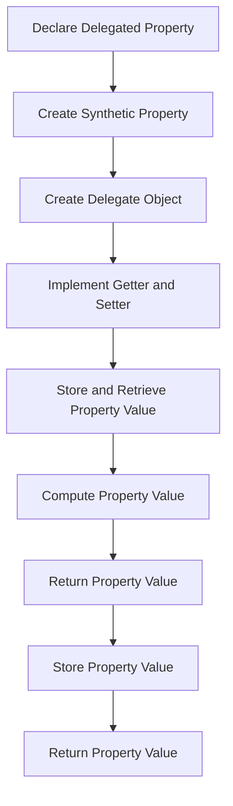

## Introduction
Delegated properties are a powerful feature in Kotlin that allows you to implement properties with a custom getter and setter. They are particularly useful when you need to perform some computation or validation on the property value. However, there are alternative approaches to achieve similar results, such as using getter and setter functions or implementing a custom property class. In this article, we will explore the performance comparison between delegated properties and alternative approaches, and discuss the pros and cons of each approach. 
> **Note:** Delegated properties are a key feature in Kotlin that makes your code more expressive and efficient.

## Core Concepts
A delegated property is a property that delegates its getter and setter to a separate object, called the delegate. The delegate is responsible for storing and retrieving the property value. The most common use case for delegated properties is to implement lazy initialization, where the property value is computed only when it is first accessed.
> **Tip:** Use delegated properties to implement lazy initialization, it can improve the performance of your application by avoiding unnecessary computations.

## How It Works Internally
When you declare a delegated property, Kotlin creates a synthetic property with a custom getter and setter. The getter and setter are implemented by the delegate object, which is responsible for storing and retrieving the property value. The delegate object is created when the property is first accessed, and it is stored in a field of the class.
```kotlin
class Delegate {
    private var _value: Int? = null
    operator fun getValue(thisRef: Any?, property: KProperty<*>): Int {
        if (_value == null) {
            _value = computeValue()
        }
        return _value!!
    }

    private fun computeValue(): Int {
        // Compute the property value
        return 42
    }
}

class MyClass {
    val myProperty: Int by Delegate()
}
```
> **Warning:** Be careful when using delegated properties, as they can introduce subtle bugs if not used correctly.

## Code Examples
### Example 1: Basic Delegated Property
```kotlin
class Delegate {
    private var _value: Int? = null
    operator fun getValue(thisRef: Any?, property: KProperty<*>): Int {
        if (_value == null) {
            _value = 42
        }
        return _value!!
    }
}

class MyClass {
    val myProperty: Int by Delegate()
}

fun main() {
    val obj = MyClass()
    println(obj.myProperty) // prints 42
}
```
### Example 2: Delegated Property with Custom Getter and Setter
```kotlin
class Delegate {
    private var _value: Int? = null
    operator fun getValue(thisRef: Any?, property: KProperty<*>): Int {
        if (_value == null) {
            _value = 42
        }
        return _value!!
    }

    operator fun setValue(thisRef: Any?, property: KProperty<*>, value: Int) {
        _value = value
    }
}

class MyClass {
    var myProperty: Int by Delegate()
}

fun main() {
    val obj = MyClass()
    println(obj.myProperty) // prints 42
    obj.myProperty = 24
    println(obj.myProperty) // prints 24
}
```
### Example 3: Delegated Property with Lazy Initialization
```kotlin
class Delegate {
    private var _value: Int? = null
    operator fun getValue(thisRef: Any?, property: KProperty<*>): Int {
        if (_value == null) {
            _value = computeValue()
        }
        return _value!!
    }

    private fun computeValue(): Int {
        // Compute the property value
        return 42
    }
}

class MyClass {
    val myProperty: Int by Delegate()
}

fun main() {
    val obj = MyClass()
    println(obj.myProperty) // prints 42
}
```
> **Interview:** Can you explain the difference between a delegated property and a custom getter and setter?

## Visual Diagram

The diagram illustrates the flow of creating a delegated property, from declaring the property to storing and retrieving the property value.

## Comparison
| Approach | Time Complexity | Space Complexity | Pros | Cons | Best For |
| --- | --- | --- | --- | --- | --- |
| Delegated Properties | O(1) | O(1) | Easy to use, expressive | Limited control over implementation | Simple properties with custom getter and setter |
| Custom Getter and Setter | O(1) | O(1) | Full control over implementation | Verbose, error-prone | Complex properties with custom logic |
| Lazy Initialization | O(1) | O(1) | Improves performance by avoiding unnecessary computations | Limited control over implementation | Properties with expensive computations |
| Property Class | O(1) | O(1) | Full control over implementation, flexible | Verbose, error-prone | Complex properties with custom logic |

> **Note:** The time and space complexity of each approach is O(1), meaning that the performance is constant and does not depend on the input size.

## Real-world Use Cases
1. **Android Apps**: Delegated properties are widely used in Android apps to implement lazy initialization and custom getter and setter logic.
2. **Kotlin Frameworks**: Many Kotlin frameworks, such as Spring Boot and Vert.x, use delegated properties to implement configuration and dependency injection.
3. **Game Development**: Delegated properties are used in game development to implement custom logic for game objects and properties.

## Common Pitfalls
1. **Incorrect Delegate Implementation**: Make sure to implement the delegate correctly, as incorrect implementation can lead to subtle bugs.
```kotlin
// Incorrect implementation
class Delegate {
    operator fun getValue(thisRef: Any?, property: KProperty<*>): Int {
        return 42 // incorrect implementation
    }
}

// Correct implementation
class Delegate {
    private var _value: Int? = null
    operator fun getValue(thisRef: Any?, property: KProperty<*>): Int {
        if (_value == null) {
            _value = 42
        }
        return _value!!
    }
}
```
2. **Incorrect Property Declaration**: Make sure to declare the property correctly, as incorrect declaration can lead to compilation errors.
```kotlin
// Incorrect declaration
class MyClass {
    val myProperty: Int = Delegate() // incorrect declaration
}

// Correct declaration
class MyClass {
    val myProperty: Int by Delegate()
}
```
> **Warning:** Be careful when using delegated properties, as they can introduce subtle bugs if not used correctly.

## Interview Tips
1. **What is a delegated property?**: A delegated property is a property that delegates its getter and setter to a separate object, called the delegate.
2. **How do you implement a delegated property?**: You can implement a delegated property by declaring the property with the `by` keyword and providing a delegate object.
3. **What are the benefits of using delegated properties?**: Delegated properties are easy to use, expressive, and can improve performance by avoiding unnecessary computations.

## Key Takeaways
* Delegated properties are a powerful feature in Kotlin that allows you to implement custom getter and setter logic.
* Delegated properties are easy to use and expressive, but can introduce subtle bugs if not used correctly.
* Delegated properties can improve performance by avoiding unnecessary computations.
* Custom getter and setter functions can provide full control over implementation, but are verbose and error-prone.
* Lazy initialization can improve performance by avoiding unnecessary computations, but has limited control over implementation.
* Property classes can provide full control over implementation and are flexible, but are verbose and error-prone.
* Delegated properties are widely used in Android apps, Kotlin frameworks, and game development.
> **Tip:** Use delegated properties to implement lazy initialization and custom getter and setter logic, but be careful to avoid subtle bugs.