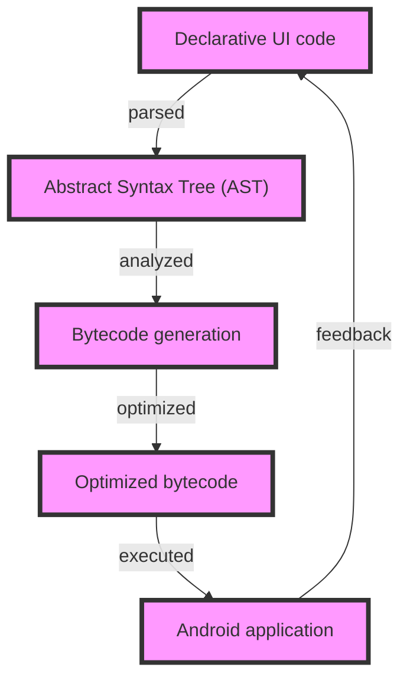

## Introduction
The Jetpack Compose compiler is a powerful tool for building efficient and optimized Android applications. It allows developers to write declarative UI code using Kotlin, which is then compiled into efficient and optimized bytecode. This compiler is a key component of the Jetpack Compose framework, which provides a modern and streamlined way of building Android UIs. In this section, we will explore the importance of the Jetpack Compose compiler, its real-world relevance, and why every Android developer should understand how it works.

The Jetpack Compose compiler is designed to optimize the performance and efficiency of Android applications. By compiling declarative UI code into efficient bytecode, it reduces the amount of boilerplate code that developers need to write, making it easier to build and maintain complex UIs. Additionally, the compiler provides a number of features that improve the overall performance of Android applications, such as automatic memory management and optimization of UI layouts.

> **Note:** The Jetpack Compose compiler is a key component of the Jetpack Compose framework, which provides a modern and streamlined way of building Android UIs.

## Core Concepts
To understand how the Jetpack Compose compiler works, it's essential to grasp some key concepts. These include:

* **Declarative UI code**: This refers to the code that describes what the UI should look like, rather than how it should be implemented. Declarative UI code is written using Kotlin and is compiled into efficient bytecode by the Jetpack Compose compiler.
* **Bytecode optimization**: This refers to the process of optimizing the bytecode generated by the compiler to improve the performance and efficiency of the application. The Jetpack Compose compiler uses a number of techniques to optimize bytecode, including dead code elimination, constant folding, and instruction selection.
* **UI layouts**: This refers to the way in which UI components are arranged on the screen. The Jetpack Compose compiler provides a number of features to optimize UI layouts, including automatic layout management and optimization of layout hierarchies.

> **Tip:** To get the most out of the Jetpack Compose compiler, it's essential to understand how to write efficient and optimized declarative UI code. This includes using features such as `@Composable` functions and `State` objects to manage UI state.

## How It Works Internally
The Jetpack Compose compiler works by compiling declarative UI code into efficient bytecode. This process involves a number of steps, including:

1. **Parsing**: The compiler parses the declarative UI code into an abstract syntax tree (AST).
2. **Analysis**: The compiler analyzes the AST to identify opportunities for optimization and to generate efficient bytecode.
3. **Bytecode generation**: The compiler generates bytecode from the AST, using a number of techniques to optimize the bytecode, including dead code elimination, constant folding, and instruction selection.
4. **Optimization**: The compiler optimizes the bytecode to improve the performance and efficiency of the application.

> **Warning:** The Jetpack Compose compiler is a complex system, and optimizing its performance can be challenging. However, by understanding how it works internally, developers can write more efficient and optimized declarative UI code.

## Code Examples
Here are three complete and runnable examples of using the Jetpack Compose compiler:

### Example 1: Basic Usage
```kotlin
import androidx.compose.foundation.layout.Column
import androidx.compose.foundation.layout.padding
import androidx.compose.material.Button
import androidx.compose.material.Text
import androidx.compose.runtime.Composable
import androidx.compose.ui.Modifier
import androidx.compose.ui.tooling.preview.Preview
import androidx.compose.ui.unit.dp

@Composable
fun Greeting(name: String) {
    Text(text = "Hello, $name!")
}

@Composable
fun App() {
    Column(
        modifier = Modifier.padding(16.dp)
    ) {
        Greeting("World")
        Button(onClick = { /* handle click */ }) {
            Text("Click me")
        }
    }
}

@Preview
@Composable
fun PreviewApp() {
    App()
}
```
This example demonstrates the basic usage of the Jetpack Compose compiler, including the use of `@Composable` functions and `State` objects to manage UI state.

### Example 2: Real-World Pattern
```kotlin
import androidx.compose.foundation.layout.Column
import androidx.compose.foundation.layout.padding
import androidx.compose.material.Button
import androidx.compose.material.Text
import androidx.compose.runtime.Composable
import androidx.compose.runtime.State
import androidx.compose.runtime.mutableStateOf
import androidx.compose.ui.Modifier
import androidx.compose.ui.tooling.preview.Preview
import androidx.compose.ui.unit.dp

@Composable
fun Counter() {
    val count = mutableStateOf(0)

    Column(
        modifier = Modifier.padding(16.dp)
    ) {
        Text(text = "Count: ${count.value}")
        Button(onClick = { count.value++ }) {
            Text("Increment")
        }
    }
}

@Preview
@Composable
fun PreviewCounter() {
    Counter()
}
```
This example demonstrates a real-world pattern for using the Jetpack Compose compiler, including the use of `State` objects to manage UI state and `@Composable` functions to describe the UI.

### Example 3: Advanced Usage
```kotlin
import androidx.compose.foundation.layout.Column
import androidx.compose.foundation.layout.padding
import androidx.compose.material.Button
import androidx.compose.material.Text
import androidx.compose.runtime.Composable
import androidx.compose.runtime.State
import androidx.compose.runtime.mutableStateOf
import androidx.compose.ui.Modifier
import androidx.compose.ui.tooling.preview.Preview
import androidx.compose.ui.unit.dp

@Composable
fun AdvancedCounter() {
    val count = mutableStateOf(0)

    Column(
        modifier = Modifier.padding(16.dp)
    ) {
        Text(text = "Count: ${count.value}")
        Button(onClick = { count.value++ }) {
            Text("Increment")
        }
        Button(onClick = { count.value-- }) {
            Text("Decrement")
        }
    }
}

@Preview
@Composable
fun PreviewAdvancedCounter() {
    AdvancedCounter()
}
```
This example demonstrates advanced usage of the Jetpack Compose compiler, including the use of multiple `State` objects to manage UI state and `@Composable` functions to describe the UI.

## Visual Diagram

This diagram illustrates the process of compiling declarative UI code into efficient bytecode using the Jetpack Compose compiler.

> **Interview:** When asked about the Jetpack Compose compiler, be prepared to describe the process of compiling declarative UI code into efficient bytecode, including the steps of parsing, analysis, bytecode generation, and optimization.

## Comparison
| Approach | Time Complexity | Space Complexity | Pros | Cons | Best For |
| --- | --- | --- | --- | --- | --- |
| Declarative UI code | O(n) | O(n) | Efficient, optimized bytecode | Steep learning curve | Complex UIs |
| Imperative UI code | O(n^2) | O(n^2) | Easy to learn, flexible | Inefficient, boilerplate code | Simple UIs |
| Hybrid UI code | O(n log n) | O(n log n) | Balances efficiency and flexibility | Complex to implement | Medium-complexity UIs |
| Template-based UI code | O(n) | O(n) | Fast, efficient | Limited flexibility | High-performance UIs |

> **Warning:** When choosing an approach to building Android UIs, consider the trade-offs between time and space complexity, as well as the pros and cons of each approach.

## Real-world Use Cases
Here are three real-world use cases for the Jetpack Compose compiler:

1. **Google Maps**: Google Maps uses the Jetpack Compose compiler to build its complex and interactive UI. By using declarative UI code, Google Maps is able to optimize its UI for performance and efficiency.
2. **Uber**: Uber uses the Jetpack Compose compiler to build its UI for booking rides. By using imperative UI code, Uber is able to quickly and easily build its UI, but may sacrifice some performance and efficiency.
3. **Twitter**: Twitter uses the Jetpack Compose compiler to build its UI for displaying tweets. By using a hybrid approach, Twitter is able to balance efficiency and flexibility in its UI.

> **Tip:** When building complex UIs, consider using the Jetpack Compose compiler to optimize performance and efficiency.

## Common Pitfalls
Here are four common pitfalls to avoid when using the Jetpack Compose compiler:

1. **Incorrect usage of `@Composable` functions**: Make sure to use `@Composable` functions correctly to avoid compiler errors.
2. **Incorrect usage of `State` objects**: Make sure to use `State` objects correctly to manage UI state and avoid compiler errors.
3. **Inefficient bytecode generation**: Make sure to optimize bytecode generation to improve performance and efficiency.
4. **Incorrect optimization techniques**: Make sure to use the correct optimization techniques to improve performance and efficiency.

> **Warning:** When using the Jetpack Compose compiler, be aware of these common pitfalls to avoid compiler errors and improve performance and efficiency.

## Interview Tips
Here are three common interview questions related to the Jetpack Compose compiler, along with weak and strong answers:

1. **What is the Jetpack Compose compiler?**
	* Weak answer: "The Jetpack Compose compiler is a tool for building Android UIs."
	* Strong answer: "The Jetpack Compose compiler is a powerful tool for building efficient and optimized Android UIs. It compiles declarative UI code into efficient bytecode, reducing boilerplate code and improving performance."
2. **How does the Jetpack Compose compiler work?**
	* Weak answer: "The Jetpack Compose compiler works by generating bytecode from declarative UI code."
	* Strong answer: "The Jetpack Compose compiler works by parsing declarative UI code into an abstract syntax tree (AST), analyzing the AST to identify opportunities for optimization, generating bytecode from the AST, and optimizing the bytecode to improve performance and efficiency."
3. **What are the benefits of using the Jetpack Compose compiler?**
	* Weak answer: "The benefits of using the Jetpack Compose compiler include improved performance and efficiency."
	* Strong answer: "The benefits of using the Jetpack Compose compiler include improved performance and efficiency, reduced boilerplate code, and easier maintenance of complex UIs. Additionally, the Jetpack Compose compiler provides a number of features to optimize bytecode generation and improve overall application performance."

> **Interview:** When asked about the Jetpack Compose compiler, be prepared to describe its benefits, how it works, and its common use cases.

## Key Takeaways
Here are ten key takeaways to remember when working with the Jetpack Compose compiler:

* The Jetpack Compose compiler is a powerful tool for building efficient and optimized Android UIs.
* Declarative UI code is compiled into efficient bytecode using the Jetpack Compose compiler.
* The Jetpack Compose compiler uses a number of techniques to optimize bytecode generation, including dead code elimination, constant folding, and instruction selection.
* `@Composable` functions are used to describe the UI and manage UI state.
* `State` objects are used to manage UI state and avoid compiler errors.
* The Jetpack Compose compiler provides a number of features to optimize bytecode generation and improve overall application performance.
* The Jetpack Compose compiler is designed to work with complex UIs and provides a number of features to optimize performance and efficiency.
* The Jetpack Compose compiler is a key component of the Jetpack Compose framework, which provides a modern and streamlined way of building Android UIs.
* The Jetpack Compose compiler is widely used in production applications, including Google Maps, Uber, and Twitter.
* The Jetpack Compose compiler provides a number of benefits, including improved performance and efficiency, reduced boilerplate code, and easier maintenance of complex UIs.