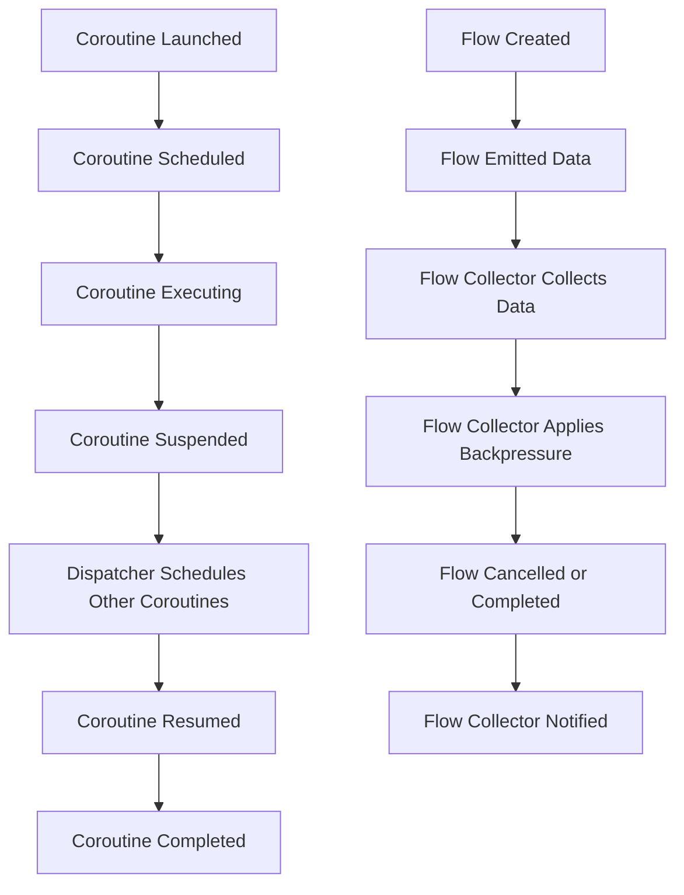

## Introduction
Coroutines and flows are fundamental concepts in Kotlin that enable efficient and scalable asynchronous programming. A coroutine is a special type of function that can suspend and resume its execution at specific points, allowing other coroutines to run in the meantime. Flows, on the other hand, are a way to handle asynchronous data streams in a declarative and composable manner. Understanding the lifecycle and mechanics of coroutines and flows is essential for building high-performance and concurrent systems in Kotlin. In this article, we will delve into the world of coroutines and flows, exploring their core concepts, internal mechanics, and real-world applications.

## Core Concepts
To grasp coroutines and flows, we need to understand the following key concepts:
- **Coroutine scope**: The scope in which a coroutine runs, defining its lifetime and cancellation behavior.
- **Coroutine context**: The context in which a coroutine runs, including its dispatcher, exception handler, and other configuration parameters.
- **Flow**: A stream of data that can be collected and processed asynchronously.
- **Flow collector**: An object that collects and processes the data emitted by a flow.
- **Backpressure**: The mechanism that allows a flow collector to control the rate at which data is emitted by a flow.

> **Note:** Coroutines and flows are designed to work together seamlessly, enabling efficient and scalable asynchronous programming in Kotlin.

## How It Works Internally
When a coroutine is launched, the following steps occur:
1. The coroutine is scheduled to run on a specific thread or dispatcher.
2. The coroutine executes until it reaches a suspension point, at which point it yields control back to the dispatcher.
3. The dispatcher schedules other coroutines to run, allowing for efficient concurrency.
4. When the suspended coroutine is resumed, it continues execution from the point where it was suspended.

Flows, on the other hand, work as follows:
1. A flow is created and configured with a specific context and collector.
2. The flow emits data, which is collected and processed by the flow collector.
3. The flow collector can apply backpressure to control the rate at which data is emitted.
4. The flow can be cancelled or completed, at which point the collector is notified and can take appropriate action.

> **Tip:** Understanding the internal mechanics of coroutines and flows is crucial for building high-performance and concurrent systems in Kotlin.

## Code Examples
### Example 1: Basic Coroutine
```kotlin
import kotlinx.coroutines.*

fun main() = runBlocking {
    launch {
        println("Coroutine started")
        delay(1000)
        println("Coroutine finished")
    }
}
```
This example demonstrates a basic coroutine that runs in the background and prints a message after a delay.

### Example 2: Flow Collector
```kotlin
import kotlinx.coroutines.*
import kotlinx.coroutines.flow.*

fun main() = runBlocking {
    flow {
        for (i in 1..5) {
            emit(i)
            delay(100)
        }
    }.collect { value ->
        println("Collected value: $value")
    }
}
```
This example shows a flow that emits numbers from 1 to 5, which are collected and printed by a flow collector.

### Example 3: Advanced Flow with Backpressure
```kotlin
import kotlinx.coroutines.*
import kotlinx.coroutines.flow.*

fun main() = runBlocking {
    flow {
        for (i in 1..10) {
            emit(i)
            delay(100)
        }
    }.buffer(2) // Apply backpressure
    .collect { value ->
        println("Collected value: $value")
        delay(200) // Simulate slow processing
    }
}
```
This example demonstrates a flow that emits numbers from 1 to 10, with backpressure applied to limit the buffer size to 2. The flow collector simulates slow processing by delaying each collection.

## Visual Diagram

This diagram illustrates the lifecycle of coroutines and flows, including the scheduling, execution, suspension, and resumption of coroutines, as well as the creation, emission, collection, and cancellation of flows.

## Comparison
| Approach | Time Complexity | Space Complexity | Pros | Cons | Best For |
| --- | --- | --- | --- | --- | --- |
| Coroutines | O(1) | O(1) | Efficient concurrency, lightweight | Complexity, error handling | I/O-bound operations |
| Flows | O(1) | O(n) | Declarative, composable, backpressure support | Complexity, performance overhead | Data streaming, real-time processing |
| Threads | O(n) | O(n) | Simple, well-understood | Heavyweight, error-prone | CPU-bound operations |
| RxJava | O(n) | O(n) | Reactive, composable, backpressure support | Complexity, performance overhead | Data streaming, real-time processing |

> **Warning:** Choosing the wrong approach can lead to performance issues, complexity, and maintainability problems.

## Real-world Use Cases
- **Netflix**: Uses Kotlin coroutines and flows to build high-performance, concurrent systems for streaming media.
- **Trello**: Employs Kotlin coroutines to handle asynchronous I/O operations and improve application responsiveness.
- **Pinterest**: Utilizes Kotlin flows to process and stream large amounts of data in real-time.

## Common Pitfalls
- **Incorrect coroutine scope**: Failing to properly scope coroutines can lead to memory leaks, crashes, or unexpected behavior.
- **Insufficient error handling**: Neglecting to handle errors in coroutines and flows can result in crashes, data corruption, or security vulnerabilities.
- **Inadequate backpressure**: Failing to apply backpressure to flows can lead to performance issues, data loss, or crashes.
- **Overusing coroutines**: Excessive use of coroutines can introduce complexity, performance overhead, and maintainability issues.

> **Tip:** Always use the correct coroutine scope, handle errors properly, and apply backpressure to flows to ensure efficient and scalable asynchronous programming.

## Interview Tips
- **What is the difference between a coroutine and a thread?**: A coroutine is a lightweight, efficient, and concurrent unit of execution, whereas a thread is a heavyweight, complex, and error-prone unit of execution.
- **How do you handle errors in coroutines and flows?**: Use try-catch blocks, error handlers, and exception handling mechanisms to handle errors in coroutines and flows.
- **What is backpressure in flows, and how do you apply it?**: Backpressure is the mechanism that allows a flow collector to control the rate at which data is emitted by a flow. Apply backpressure using the `buffer` or `conflate` operators.

## Key Takeaways
* Coroutines and flows are fundamental concepts in Kotlin for efficient and scalable asynchronous programming.
* Understanding the lifecycle and mechanics of coroutines and flows is essential for building high-performance and concurrent systems.
* Always use the correct coroutine scope, handle errors properly, and apply backpressure to flows.
* Coroutines have a time complexity of O(1) and a space complexity of O(1), making them suitable for I/O-bound operations.
* Flows have a time complexity of O(1) and a space complexity of O(n), making them suitable for data streaming and real-time processing.
* Choosing the wrong approach can lead to performance issues, complexity, and maintainability problems.
* Real-world companies like Netflix, Trello, and Pinterest use Kotlin coroutines and flows to build high-performance and concurrent systems.
* Common pitfalls include incorrect coroutine scope, insufficient error handling, inadequate backpressure, and overusing coroutines.