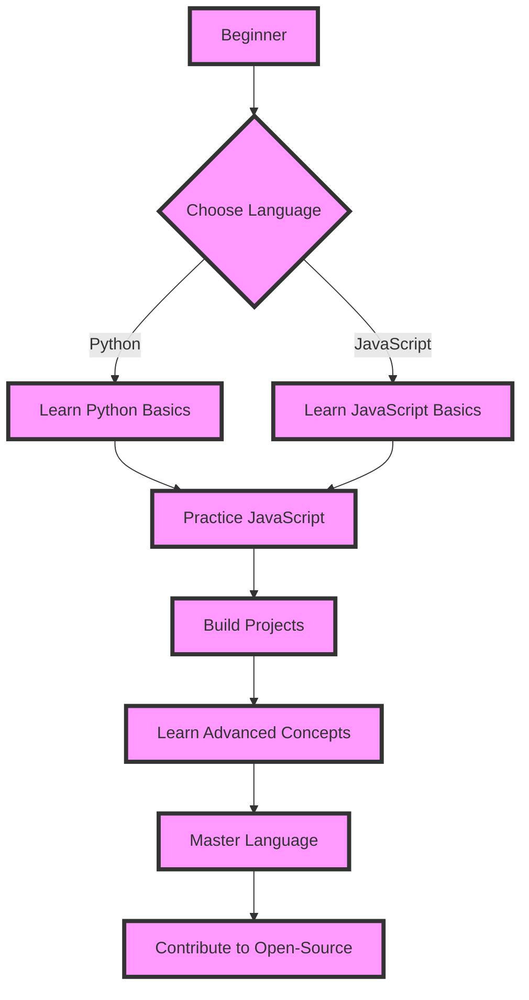

## Introduction
Choosing the right programming language as a beginner can be a daunting task. With so many languages to choose from, it's essential to understand the strengths and weaknesses of each language to make an informed decision. In this overview, we'll explore two popular languages for beginners: **Python** and **JavaScript**. We'll delve into the core concepts, internal mechanics, and provide code examples to help you decide which language is best for you. 
> **Note:** Python and JavaScript are both high-level languages, making them easier to learn and understand for beginners.

## Core Concepts
Before diving into the specifics of each language, let's define some key terms:
* **Syntax**: The set of rules that defines the structure of a programming language.
* **Variables**: Storage locations that hold values.
* **Data types**: The type of value a variable can hold (e.g., integer, string, boolean).
* **Control structures**: Statements that control the flow of a program (e.g., if-else statements, loops).
* **Functions**: Reusable blocks of code that perform a specific task.
> **Tip:** Understanding these core concepts is crucial for learning any programming language.

## How It Works Internally
Let's take a look at how Python and JavaScript work internally:
* **Python**: Python code is compiled into bytecode, which is then executed by the Python interpreter. The interpreter uses a **stack-based** execution model, where each function call is pushed onto a stack.
* **JavaScript**: JavaScript code is executed by a JavaScript engine, such as V8 (used by Google Chrome). The engine uses a **just-in-time (JIT)** compilation approach, where the code is compiled into machine code on the fly.
> **Warning:** Understanding the internal mechanics of a language can help you optimize your code, but it's not necessary for beginners.

## Code Examples
Here are three code examples to illustrate the basics of Python and JavaScript:
### Example 1: Basic Python
```python
# This is a basic Python program that prints "Hello, World!"
def greet(name):
    print(f"Hello, {name}!")

greet("World")
```
### Example 2: Real-world JavaScript
```javascript
// This is a real-world JavaScript example that uses a library to fetch data
const axios = require("axios");

async function fetchData(url) {
    try {
        const response = await axios.get(url);
        console.log(response.data);
    } catch (error) {
        console.error(error);
    }
}

fetchData("https://api.example.com/data");
```
### Example 3: Advanced Python
```python
# This is an advanced Python example that uses a decorator to log function calls
import logging
import functools

def log_calls(func):
    @functools.wraps(func)
    def wrapper(*args, **kwargs):
        logging.info(f"Calling {func.__name__} with args {args} and kwargs {kwargs}")
        return func(*args, **kwargs)
    return wrapper

@log_calls
def add(a, b):
    return a + b

result = add(2, 3)
print(result)
```
> **Interview:** Can you explain the difference between a **function** and a **method** in Python?

## Visual Diagram

This diagram illustrates the learning path for a beginner, from choosing a language to contributing to open-source projects.

## Comparison
| Language | Time Complexity | Space Complexity | Pros | Cons | Best For |
| --- | --- | --- | --- | --- | --- |
| Python | O(1) - O(n) | O(1) - O(n) | Easy to learn, versatile, large community | Slow performance, limited multithreading | Data science, web development, automation |
| JavaScript | O(1) - O(n) | O(1) - O(n) | Ubiquitous, dynamic, first-class functions | Security concerns, complex syntax | Web development, mobile app development, game development |
| Java | O(1) - O(n) | O(1) - O(n) | Platform-independent, object-oriented, robust | Verbose syntax, slow startup | Android app development, enterprise software, desktop applications |
| C++ | O(1) - O(n) | O(1) - O(n) | High-performance, control over memory, compiled language | Steep learning curve, error-prone | Operating systems, games, embedded systems |
> **Note:** The time and space complexity of a language depends on the specific implementation and use case.

## Real-world Use Cases
Here are three real-world examples of companies that use Python and JavaScript:
* **Instagram**: Instagram's backend is built using Python, using the Django framework.
* **Facebook**: Facebook's frontend is built using JavaScript, using the React library.
* **Google**: Google's search engine is built using a combination of languages, including Python, JavaScript, and C++.

## Common Pitfalls
Here are four common mistakes that beginners make when learning Python and JavaScript:
* **Not understanding the basics**: Not taking the time to learn the fundamentals of a language can lead to confusion and frustration.
* **Not practicing enough**: Not practicing coding regularly can lead to a lack of proficiency and difficulty in retaining knowledge.
* **Not using a linter**: Not using a linter can lead to sloppy code and a lack of attention to detail.
* **Not testing code**: Not testing code can lead to bugs and errors that can be difficult to debug.

## Interview Tips
Here are three common interview questions for Python and JavaScript, along with weak and strong answers:
* **What is the difference between null and undefined in JavaScript?**
	+ Weak answer: "I'm not sure, I've never really thought about it."
	+ Strong answer: "Null represents the absence of a value, while undefined represents an uninitialized variable. For example, `let x = null;` sets x to null, while `let x;` leaves x undefined."
* **How do you handle errors in Python?**
	+ Weak answer: "I just use try-except blocks and hope for the best."
	+ Strong answer: "I use try-except blocks to catch specific exceptions, and I also use logging to track errors and improve debugging. For example, `try: # code; except Exception as e: logging.error(e)`"
* **What is the purpose of the `this` keyword in JavaScript?**
	+ Weak answer: "I'm not sure, I've never really used it."
	+ Strong answer: "The `this` keyword refers to the current object in a function. For example, `function Person(name) { this.name = name; }` sets the `name` property of the `Person` object to the value of the `name` parameter."

## Key Takeaways
Here are ten key takeaways from this overview:
* **Python is a versatile language**: Python can be used for web development, data science, automation, and more.
* **JavaScript is ubiquitous**: JavaScript is used by most websites for client-side scripting.
* **Understanding the basics is crucial**: Taking the time to learn the fundamentals of a language is essential for success.
* **Practice is key**: Regular practice is necessary to develop proficiency in a language.
* **Using a linter is important**: Using a linter can help catch errors and improve code quality.
* **Testing code is essential**: Testing code is necessary to catch bugs and errors.
* **Python has a large community**: Python has a large and active community, with many resources available.
* **JavaScript has a complex syntax**: JavaScript has a complex syntax, with many nuances to learn.
* **Java is platform-independent**: Java is a platform-independent language, meaning that Java code can run on any platform that has a Java Virtual Machine (JVM) installed.
* **C++ is a high-performance language**: C++ is a high-performance language, with direct access to hardware resources.