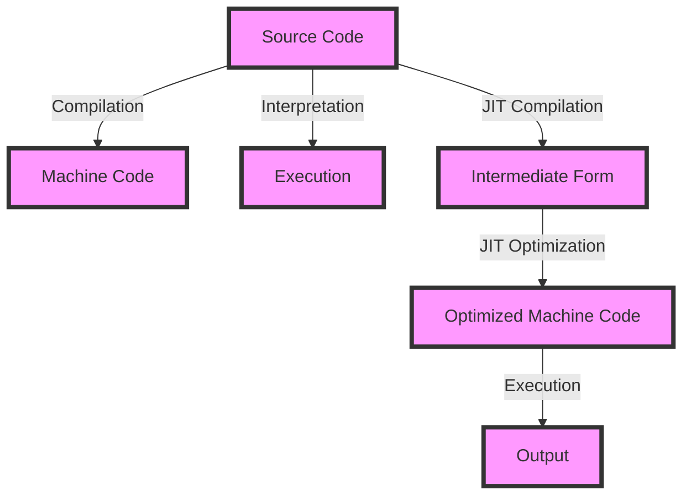

## Introduction
The debate between compiled, interpreted, and Just-In-Time (JIT) languages has been a longstanding one in the programming community. Each approach has its own strengths and weaknesses, and understanding the differences between them is crucial for developers to make informed decisions about which language to use for their projects. In this article, we will delve into the world of compiled, interpreted, and JIT languages, exploring their internal mechanics, performance trade-offs, and developer experience implications. We will also examine real-world use cases, common pitfalls, and interview tips to help you navigate this complex landscape.

## Core Concepts
Before we dive into the details, let's define some key terms:
* **Compiled languages**: These languages are converted into machine code beforehand, resulting in an executable file that can be run directly by the computer. Examples include C, C++, and Fortran.
* **Interpreted languages**: These languages are executed line-by-line by an interpreter at runtime, without the need for compilation. Examples include Python, JavaScript, and Ruby.
* **Just-In-Time (JIT) languages**: These languages combine elements of both compiled and interpreted languages. They are compiled into an intermediate form, which is then executed by a JIT compiler at runtime. Examples include Java and .NET.

> **Note:** The distinction between compiled and interpreted languages is not always clear-cut, as many languages use a combination of both approaches.

## How It Works Internally
Let's take a closer look at how each approach works internally:
* **Compiled languages**: The compilation process involves several stages, including lexical analysis, syntax analysis, semantic analysis, optimization, and code generation. The resulting machine code is stored in an executable file, which can be run directly by the computer.
* **Interpreted languages**: The interpretation process involves reading the source code line-by-line and executing it immediately. This approach requires an interpreter to be present at runtime, which can introduce performance overhead.
* **JIT languages**: The JIT compilation process involves compiling the intermediate form into machine code at runtime. This approach requires a JIT compiler to be present at runtime, which can introduce performance overhead. However, JIT compilers can also optimize the code for the specific hardware and runtime environment, resulting in improved performance.

## Code Examples
Here are three code examples to illustrate the differences between compiled, interpreted, and JIT languages:
### Example 1: C (Compiled)
```c
// hello.c
#include <stdio.h>

int main() {
    printf("Hello, World!\n");
    return 0;
}
```
This C code is compiled into machine code using a compiler like `gcc`, resulting in an executable file that can be run directly by the computer.

### Example 2: Python (Interpreted)
```python
# hello.py
print("Hello, World!")
```
This Python code is executed line-by-line by the Python interpreter at runtime.

### Example 3: Java (JIT)
```java
// Hello.java
public class Hello {
    public static void main(String[] args) {
        System.out.println("Hello, World!");
    }
}
```
This Java code is compiled into an intermediate form (bytecode) using the `javac` compiler, and then executed by the Java Virtual Machine (JVM) at runtime. The JVM uses a JIT compiler to optimize the bytecode for the specific hardware and runtime environment.

## Visual Diagram

This diagram illustrates the different approaches to executing source code. The compilation process results in machine code, which can be executed directly by the computer. The interpretation process involves executing the source code line-by-line at runtime. The JIT compilation process involves compiling the intermediate form into optimized machine code at runtime.

## Comparison
Here is a comparison table highlighting the trade-offs between compiled, interpreted, and JIT languages:
| Approach | Time Complexity | Space Complexity | Pros | Cons | Best For |
| --- | --- | --- | --- | --- | --- |
| Compiled | O(1) | O(n) | Fast execution, low overhead | Longer development cycle, platform-dependent | Systems programming, high-performance applications |
| Interpreted | O(n) | O(1) | Rapid development, flexible | Slow execution, high overhead | Scripting, prototyping, development |
| JIT | O(n) | O(n) | Fast execution, optimized for runtime environment | Complex implementation, high overhead | High-performance applications, dynamic languages |

## Real-world Use Cases
Here are three real-world use cases that illustrate the trade-offs between compiled, interpreted, and JIT languages:
* **Google's Chrome Browser**: Chrome uses a combination of compiled and JIT languages to achieve high performance and rapid development. The browser's core is written in C++, which is compiled into machine code for fast execution. The browser's JavaScript engine, V8, uses JIT compilation to optimize JavaScript code for the specific hardware and runtime environment.
* **Facebook's HipHop Virtual Machine (HHVM)**: HHVM is a JIT compiler for PHP, which is an interpreted language. HHVM uses JIT compilation to optimize PHP code for the specific hardware and runtime environment, resulting in significant performance improvements.
* **Oracle's Java Virtual Machine (JVM)**: The JVM is a JIT compiler for Java, which is a JIT language. The JVM uses JIT compilation to optimize Java bytecode for the specific hardware and runtime environment, resulting in high-performance execution.

## Common Pitfalls
Here are four common pitfalls to watch out for when working with compiled, interpreted, and JIT languages:
* **Over-optimization**: Over-optimizing compiled code can result in slower performance due to increased complexity.
* **Under-optimization**: Under-optimizing interpreted code can result in slower performance due to lack of optimization.
* **JIT compiler overhead**: The JIT compiler can introduce overhead due to compilation and optimization.
* **Platform dependence**: Compiled code can be platform-dependent, requiring recompilation for different platforms.

> **Warning:** Be careful when optimizing compiled code, as over-optimization can result in slower performance.

## Interview Tips
Here are three common interview questions related to compiled, interpreted, and JIT languages, along with weak and strong answers:
* **What is the difference between compiled and interpreted languages?**
	+ Weak answer: "Compiled languages are faster, while interpreted languages are slower."
	+ Strong answer: "Compiled languages are converted into machine code beforehand, resulting in fast execution. Interpreted languages are executed line-by-line at runtime, resulting in slower execution. However, interpreted languages offer rapid development and flexibility."
* **How does JIT compilation work?**
	+ Weak answer: "JIT compilation is like compilation, but it happens at runtime."
	+ Strong answer: "JIT compilation involves compiling the intermediate form into optimized machine code at runtime. This approach requires a JIT compiler to be present at runtime, which can introduce overhead. However, JIT compilation can result in significant performance improvements due to optimization for the specific hardware and runtime environment."
* **What are the trade-offs between compiled, interpreted, and JIT languages?**
	+ Weak answer: "Compiled languages are fast, but hard to develop. Interpreted languages are easy to develop, but slow. JIT languages are a compromise between the two."
	+ Strong answer: "Compiled languages offer fast execution, but require longer development cycles and are platform-dependent. Interpreted languages offer rapid development and flexibility, but result in slower execution. JIT languages offer fast execution and optimized performance, but require complex implementation and introduce overhead. The choice of language depends on the specific use case and requirements."

## Key Takeaways
Here are ten key takeaways to remember:
* **Compiled languages** are converted into machine code beforehand, resulting in fast execution.
* **Interpreted languages** are executed line-by-line at runtime, resulting in slower execution.
* **JIT languages** combine elements of both compiled and interpreted languages, offering fast execution and optimized performance.
* **JIT compilation** involves compiling the intermediate form into optimized machine code at runtime.
* **Platform dependence** is a consideration for compiled languages, requiring recompilation for different platforms.
* **Rapid development** is a benefit of interpreted languages, offering flexibility and ease of development.
* **Performance** is a consideration for all languages, with compiled languages offering fast execution and JIT languages offering optimized performance.
* **Complexity** is a consideration for JIT languages, requiring complex implementation and introducing overhead.
* **Trade-offs** exist between compiled, interpreted, and JIT languages, depending on the specific use case and requirements.
* **Optimization** is a consideration for all languages, with over-optimization resulting in slower performance and under-optimization resulting in slower performance.