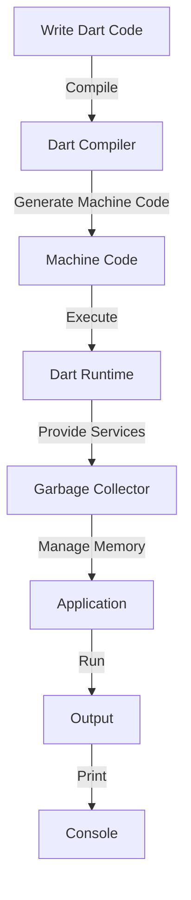

## Introduction
**Dart** is a modern, object-oriented programming language developed by Google. It is designed to be used for both mobile and web development, and is the primary language used for building **Flutter** applications. Dart's goal is to provide a simple, yet powerful language that allows developers to build fast, scalable, and maintainable applications. In this overview, we will explore the core concepts of Dart, its internal mechanics, and provide examples of how to use it for building real-world applications.

## Core Concepts
At its core, Dart is a **compiled language**, meaning that the code is translated into machine code before it is executed. This compilation process allows Dart to provide fast execution times and efficient memory management. Dart is also a **statically-typed language**, which means that the data type of a variable is known at compile time. This helps to prevent type-related errors and makes the code more maintainable.

Some key terminology in Dart includes:

* **Null Safety**: Dart's null safety feature ensures that variables cannot be null, unless explicitly declared as nullable.
* **Async/Await**: Dart's async/await syntax allows for writing asynchronous code that is easy to read and maintain.
* **Streams**: Dart's streams provide a way to handle asynchronous data streams in a reactive way.

## How It Works Internally
When you write Dart code, it is first compiled into **machine code** by the Dart compiler. This machine code is then executed by the Dart runtime, which provides the necessary services for the application to run. The Dart runtime includes a **garbage collector**, which automatically manages memory and prevents memory leaks.

Here is a high-level overview of the Dart compilation process:

1. **Lexical Analysis**: The Dart compiler breaks the source code into individual tokens.
2. **Syntax Analysis**: The Dart compiler parses the tokens into an abstract syntax tree (AST).
3. **Semantic Analysis**: The Dart compiler checks the AST for semantic errors, such as type errors.
4. **Optimization**: The Dart compiler optimizes the AST for performance.
5. **Code Generation**: The Dart compiler generates machine code from the optimized AST.

## Code Examples
### Example 1: Basic Dart Program
```dart
// Define a function to print a message
void printMessage(String message) {
  print(message);
}

// Call the function
void main() {
  printMessage('Hello, World!');
}
```
This example shows a basic Dart program that defines a function to print a message and calls that function in the `main` function.

### Example 2: Dart Class with Constructor
```dart
// Define a class with a constructor
class Person {
  String name;
  int age;

  // Constructor
  Person(this.name, this.age);

  // Method to print person details
  void printDetails() {
    print('Name: $name, Age: $age');
  }
}

// Create an instance of the Person class
void main() {
  Person person = Person('John Doe', 30);
  person.printDetails();
}
```
This example shows a Dart class with a constructor and a method to print person details.

### Example 3: Dart Async/Await Example
```dart
// Import the dart:io library
import 'dart:io';

// Define a function to read a file asynchronously
Future<String> readFile(String filePath) async {
  // Open the file
  File file = File(filePath);
  // Read the file contents
  String contents = await file.readAsString();
  return contents;
}

// Call the function
void main() async {
  String filePath = 'example.txt';
  String contents = await readFile(filePath);
  print(contents);
}
```
This example shows a Dart async/await example that reads a file asynchronously.

> **Note:** The `async` and `await` keywords are used to write asynchronous code that is easy to read and maintain.

## Visual Diagram

This diagram shows the high-level overview of the Dart compilation process and execution.

## Comparison
| Language | Type System | Null Safety | Async/Await | Performance |
| --- | --- | --- | --- | --- |
| Dart | Statically-typed | Supported | Supported | High |
| Java | Statically-typed | Not supported | Supported | Medium |
| JavaScript | Dynamically-typed | Not supported | Supported | Low |
| Kotlin | Statically-typed | Supported | Supported | High |
| Swift | Statically-typed | Supported | Supported | High |

> **Warning:** Choosing the wrong language for your project can lead to performance issues and maintenance problems.

## Real-world Use Cases
1. **Google Ads**: Google Ads uses Dart to build its mobile and web applications.
2. **Alibaba**: Alibaba uses Dart to build its mobile and web applications, including its popular e-commerce platform.
3. **BMW**: BMW uses Dart to build its mobile and web applications, including its connected car platform.

> **Tip:** Dart's cross-platform capabilities make it an ideal choice for building mobile and web applications.

## Common Pitfalls
1. **Not using null safety**: Not using null safety can lead to null pointer exceptions and crashes.
```dart
// Wrong way
String? name;
print(name.length); // Error: null pointer exception

// Right way
String? name;
if (name != null) {
  print(name.length);
}
```
2. **Not handling async/await errors**: Not handling async/await errors can lead to uncaught exceptions and crashes.
```dart
// Wrong way
void main() async {
  try {
    await readFile('example.txt');
  } catch (e) {
    // Ignore error
  }
}

// Right way
void main() async {
  try {
    await readFile('example.txt');
  } catch (e) {
    print('Error: $e');
  }
}
```
3. **Not using streams**: Not using streams can lead to performance issues and unresponsive UI.
```dart
// Wrong way
void main() {
  List<int> numbers = [];
  for (int i = 0; i < 1000000; i++) {
    numbers.add(i);
  }
  print(numbers.length);
}

// Right way
void main() {
  Stream<int> numbers = Stream.fromIterable(List.generate(1000000, (i) => i));
  numbers.listen((number) {
    print(number);
  });
}
```
4. **Not using garbage collection**: Not using garbage collection can lead to memory leaks and performance issues.
```dart
// Wrong way
void main() {
  List<int> numbers = [];
  for (int i = 0; i < 1000000; i++) {
    numbers.add(i);
  }
  // Not freeing memory
}

// Right way
void main() {
  List<int> numbers = [];
  for (int i = 0; i < 1000000; i++) {
    numbers.add(i);
  }
  // Freeing memory
  numbers.clear();
}
```
> **Interview:** What is the difference between a compiled language and an interpreted language? How does Dart's compilation process work?

## Interview Tips
1. **What is Dart's type system?**: Dart is a statically-typed language, which means that the data type of a variable is known at compile time.
2. **How does Dart's null safety work?**: Dart's null safety feature ensures that variables cannot be null, unless explicitly declared as nullable.
3. **What is the difference between async and await?**: Async is used to define an asynchronous function, while await is used to wait for the result of an asynchronous function.

> **Note:** Dart's type system and null safety features make it a safe and maintainable language.

## Key Takeaways
* Dart is a compiled, statically-typed language with null safety features.
* Dart's compilation process involves lexical analysis, syntax analysis, semantic analysis, optimization, and code generation.
* Dart's async/await syntax makes it easy to write asynchronous code.
* Dart's streams provide a way to handle asynchronous data streams in a reactive way.
* Dart's garbage collector automatically manages memory and prevents memory leaks.
* Choosing the wrong language for your project can lead to performance issues and maintenance problems.
* Dart's cross-platform capabilities make it an ideal choice for building mobile and web applications.
* Not using null safety, not handling async/await errors, not using streams, and not using garbage collection can lead to performance issues and crashes.
* Dart's type system and null safety features make it a safe and maintainable language.