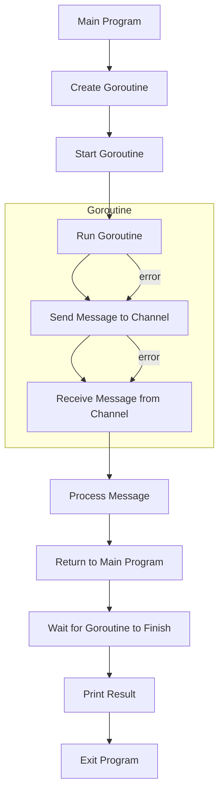

## Introduction
The **Go programming language**, also known as **Golang**, is a statically typed, compiled language developed by Google in 2009. It was designed to be simple, fast, and concurrent, making it an ideal choice for building cloud infrastructure, microservices, and command-line interfaces (CLIs). Go's simplicity and performance have made it a popular choice among developers, with companies like Netflix, Dropbox, and Uber using it in their production environments. 
> **Note:** Go's design goals were to create a language that is easy to learn, efficient, and scalable, with a focus on concurrency and parallelism.

## Core Concepts
Some of the core concepts in Go include:
* **Goroutines**: lightweight threads that can run concurrently with the main program flow.
* **Channels**: a way for goroutines to communicate with each other, allowing for safe and efficient data exchange.
* **Slices**: a dynamic array data structure that can grow or shrink as needed.
* **Structs**: a way to define custom data types, similar to classes in other languages.
* **Interfaces**: a way to define a contract or a set of methods that a type must implement.
> **Tip:** Go's **defer** statement is a powerful tool for managing resources, such as closing files or network connections, and can help prevent common errors.

## How It Works Internally
When a Go program is compiled, it is converted into machine code that can be executed directly by the computer's processor. The Go runtime provides a number of services, including:
* **Memory management**: the Go runtime manages memory allocation and deallocation for the program, using a combination of stack allocation and heap allocation.
* **Goroutine scheduling**: the Go runtime schedules goroutines to run concurrently, using a scheduling algorithm to determine which goroutines to run and when.
* **Channel communication**: the Go runtime provides a way for goroutines to communicate with each other using channels, which are implemented as a queue of messages.
> **Warning:** Go's **nil** value can be a source of bugs if not handled properly, as it can represent the absence of a value or an uninitialized variable.

## Code Examples
### Example 1: Basic Goroutine Usage
```go
package main

import (
    "fmt"
    "time"
)

func printNumbers() {
    for i := 0; i < 5; i++ {
        time.Sleep(500 * time.Millisecond)
        fmt.Println(i)
    }
}

func main() {
    go printNumbers()
    time.Sleep(3000 * time.Millisecond)
    fmt.Println("Done")
}
```
This example demonstrates the basic usage of goroutines, where a function is run concurrently with the main program flow.

### Example 2: Channel Communication
```go
package main

import (
    "fmt"
)

func producer(ch chan int) {
    for i := 0; i < 5; i++ {
        ch <- i
        fmt.Printf("Produced %d\n", i)
    }
    close(ch)
}

func consumer(ch chan int) {
    for {
        select {
        case msg, ok := <-ch:
            if !ok {
                fmt.Println("Channel closed")
                return
            }
            fmt.Printf("Consumed %d\n", msg)
        }
    }
}

func main() {
    ch := make(chan int)
    go producer(ch)
    go consumer(ch)
    fmt.Scanln()
}
```
This example demonstrates the use of channels for communication between goroutines, where a producer goroutine sends messages to a consumer goroutine.

### Example 3: Advanced Concurrency with WaitGroups
```go
package main

import (
    "fmt"
    "sync"
)

func worker(id int, wg *sync.WaitGroup) {
    defer wg.Done()
    fmt.Printf("Worker %d starting\n", id)
    // Simulate some work
    fmt.Printf("Worker %d done\n", id)
}

func main() {
    var wg sync.WaitGroup
    for i := 0; i < 5; i++ {
        wg.Add(1)
        go worker(i, &wg)
    }
    wg.Wait()
    fmt.Println("All workers done")
}
```
This example demonstrates the use of **WaitGroups** to synchronize the termination of multiple goroutines.

## Visual Diagram

This diagram illustrates the basic flow of a Go program, including the creation and execution of goroutines, communication between goroutines using channels, and the synchronization of goroutine termination using WaitGroups.

## Comparison
| Language | Time Complexity | Space Complexity | Pros | Cons | Best For |
| --- | --- | --- | --- | --- | --- |
| Go | O(1) | O(1) | Simple, fast, concurrent | Limited libraries, error handling | Cloud infrastructure, microservices, CLIs |
| Java | O(n) | O(n) | Robust libraries, strong typing | Verbose, slow | Android apps, enterprise software |
| Python | O(n) | O(n) | Easy to learn, flexible | Slow, limited concurrency | Data science, web development |
| C++ | O(1) | O(1) | Fast, low-level control | Complex, error-prone | Operating systems, games |
> **Interview:** When asked to compare Go with other languages, be sure to highlight its strengths in concurrency and performance, as well as its simplicity and ease of use.

## Real-world Use Cases
* **Netflix**: uses Go to build its cloud infrastructure, including its content delivery network and load balancing system.
* **Dropbox**: uses Go to build its file synchronization system, which allows users to access their files from anywhere.
* **Uber**: uses Go to build its microservices architecture, which allows it to scale its system to meet high demand.
> **Tip:** When discussing real-world use cases, be sure to highlight the benefits of using Go in each scenario, such as its performance, scalability, and simplicity.

## Common Pitfalls
* **Not handling errors properly**: Go's **err** type can be a source of bugs if not handled properly, as it can represent the absence of an error or an uninitialized variable.
* **Not using channels safely**: channels can be a source of bugs if not used safely, as they can deadlock or panic if not handled properly.
* **Not using goroutines efficiently**: goroutines can be a source of performance issues if not used efficiently, as they can consume system resources if not managed properly.
* **Not using WaitGroups correctly**: WaitGroups can be a source of bugs if not used correctly, as they can cause the program to hang or deadlock if not used properly.
> **Warning:** When discussing common pitfalls, be sure to provide examples of how to avoid each pitfall, as well as the consequences of not avoiding them.

## Interview Tips
* **What is the difference between a goroutine and a thread?**: a goroutine is a lightweight thread that can run concurrently with the main program flow, while a thread is a heavyweight thread that can consume system resources.
* **How do you handle errors in Go?**: errors in Go are handled using the **err** type, which can represent the absence of an error or an uninitialized variable.
* **What is the purpose of a WaitGroup?**: a WaitGroup is used to synchronize the termination of multiple goroutines, allowing the program to wait for all goroutines to finish before exiting.
> **Interview:** When answering interview questions, be sure to provide clear and concise answers that demonstrate your understanding of the topic, as well as your ability to think critically and solve problems.

## Key Takeaways
* **Go is a simple, fast, and concurrent language**: Go is designed to be easy to learn and use, with a focus on performance and concurrency.
* **Goroutines are lightweight threads**: goroutines are a key feature of Go, allowing for concurrent execution of program logic.
* **Channels are a safe way to communicate between goroutines**: channels provide a safe and efficient way for goroutines to communicate with each other.
* **WaitGroups are used to synchronize goroutine termination**: WaitGroups provide a way to synchronize the termination of multiple goroutines, allowing the program to wait for all goroutines to finish before exiting.
* **Error handling is critical in Go**: errors in Go can be a source of bugs if not handled properly, and should be handled using the **err** type.
* **Go has a strong focus on concurrency and parallelism**: Go is designed to take advantage of multiple CPU cores, making it a great choice for building high-performance systems.
* **Go has a growing ecosystem of libraries and tools**: Go has a growing ecosystem of libraries and tools, making it a great choice for building a wide range of applications.
* **Go is a great choice for building cloud infrastructure and microservices**: Go is a great choice for building cloud infrastructure and microservices, due to its performance, scalability, and simplicity.
* **Go is a great choice for building CLIs and command-line tools**: Go is a great choice for building CLIs and command-line tools, due to its simplicity and ease of use.