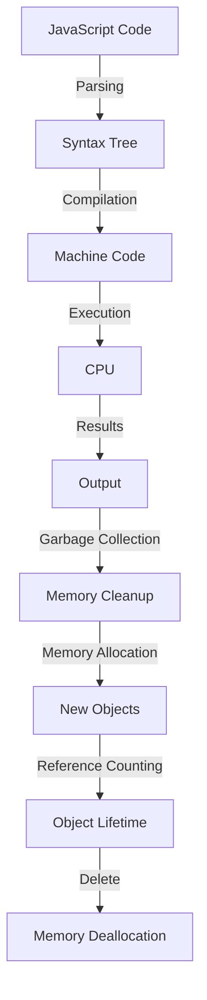

## Introduction
JavaScript is a **high-level**, **dynamic**, and **interpreted** programming language that is primarily used for client-side scripting on the web. It is also used for server-side programming with technologies like **Node.js**, and for developing mobile applications with frameworks like **React Native**. JavaScript is often referred to as the "language of the web" due to its widespread use in web development. Every engineer needs to know JavaScript because it is a fundamental skill for any web developer, and its applications extend far beyond the web.

> **Note:** JavaScript is not related to Java, despite the similar name. It was originally called "Mocha", but was later renamed to JavaScript to leverage the popularity of Java.

## Core Concepts
Some key concepts in JavaScript include:
* **Variables**: used to store and manipulate data
* **Data types**: JavaScript has several built-in data types, including **Number**, **String**, **Boolean**, **Array**, **Object**, and **Null**
* **Functions**: reusable blocks of code that perform a specific task
* **Objects**: used to represent complex data structures, and can contain properties and methods
* **Prototypal inheritance**: a mechanism for creating objects that inherit properties and methods from other objects

> **Warning:** JavaScript is a dynamically-typed language, which means that variable types are determined at runtime, rather than at compile time. This can lead to errors if not managed carefully.

## How It Works Internally
JavaScript engines, like **V8** (used by Google Chrome) and **SpiderMonkey** (used by Mozilla Firefox), are responsible for executing JavaScript code. Here is a high-level overview of how JavaScript engines work:
1. **Parsing**: the JavaScript engine reads the source code and breaks it down into a syntax tree
2. **Compilation**: the syntax tree is then compiled into machine code
3. **Execution**: the machine code is executed by the CPU
4. **Garbage collection**: the JavaScript engine periodically cleans up memory by removing objects that are no longer referenced

> **Tip:** Understanding how JavaScript engines work can help you optimize your code for better performance.

## Code Examples
### Example 1: Basic JavaScript
```javascript
// define a variable
let name = 'John';

// define a function
function greet(name) {
  console.log(`Hello, ${name}!`);
}

// call the function
greet(name);
```
This example demonstrates basic variable declaration and function definition in JavaScript.

### Example 2: JavaScript Object
```javascript
// define an object
let person = {
  name: 'John',
  age: 30,
  occupation: 'Software Engineer'
};

// access object properties
console.log(person.name); // outputs: John
console.log(person.age); // outputs: 30

// add a new property
person.country = 'USA';

// access the new property
console.log(person.country); // outputs: USA
```
This example demonstrates how to define and use objects in JavaScript.

### Example 3: JavaScript Async/Await
```javascript
// define an async function
async function fetchData() {
  try {
    // simulate a network request
    const response = await new Promise((resolve) => {
      setTimeout(() => {
        resolve({ data: 'Hello, World!' });
      }, 2000);
    });

    // log the response data
    console.log(response.data);
  } catch (error) {
    // log any errors
    console.error(error);
  }
}

// call the async function
fetchData();
```
This example demonstrates how to use async/await in JavaScript to handle asynchronous operations.

## Visual Diagram

This diagram illustrates the internal workings of a JavaScript engine, from parsing and compilation to execution and garbage collection.

## Comparison
| Language | Type System | Paradigm | Performance |
| --- | --- | --- | --- |
| JavaScript | Dynamic | Multi-paradigm | High |
| Java | Static | Object-oriented | Medium |
| Python | Dynamic | Multi-paradigm | Medium |
| C++ | Static | Object-oriented | Low-level, High |

> **Interview:** Be prepared to discuss the trade-offs between different programming languages, including type systems, paradigms, and performance characteristics.

## Real-world Use Cases
* **Google**: uses JavaScript extensively for client-side scripting and server-side programming with Node.js
* **Facebook**: uses JavaScript for client-side scripting and server-side programming with React and Node.js
* **Twitter**: uses JavaScript for client-side scripting and server-side programming with Node.js and Ruby on Rails

## Common Pitfalls
* **Null pointer exceptions**: can occur when trying to access properties or methods of null or undefined objects
* **Type errors**: can occur when trying to perform operations on incompatible data types
* **Scope issues**: can occur when variables are not properly scoped, leading to unexpected behavior
* **Memory leaks**: can occur when objects are not properly garbage collected, leading to performance issues

> **Warning:** Be careful when using JavaScript's dynamic typing, as it can lead to type errors and other issues if not managed carefully.

## Interview Tips
* **What is the difference between null and undefined?**: A strong answer should discuss the differences between null and undefined, including their uses and implications for code behavior.
* **How do you handle errors in JavaScript?**: A strong answer should discuss the use of try-catch blocks, error handling mechanisms, and best practices for error handling.
* **What is the purpose of the `this` keyword in JavaScript?**: A strong answer should discuss the use of the `this` keyword, including its role in object-oriented programming and its implications for code behavior.

## Key Takeaways
* JavaScript is a high-level, dynamic, and interpreted programming language
* JavaScript is used for client-side scripting, server-side programming, and mobile app development
* JavaScript engines, like V8 and SpiderMonkey, are responsible for executing JavaScript code
* Understanding how JavaScript engines work can help you optimize your code for better performance
* JavaScript has a dynamic type system, which can lead to type errors and other issues if not managed carefully
* JavaScript is a multi-paradigm language, supporting object-oriented, functional, and imperative programming styles
* JavaScript has a wide range of applications, including web development, mobile app development, and server-side programming.