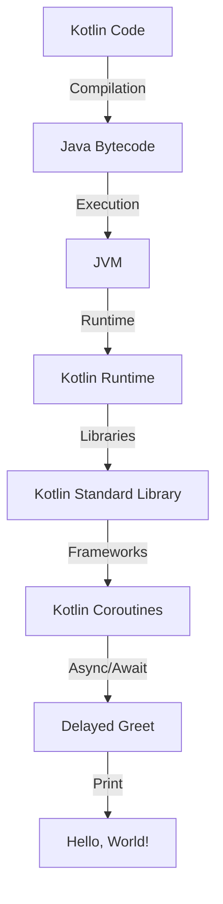

## Introduction
Kotlin is a **modern**, **statically typed** programming language that runs on the **Java Virtual Machine (JVM)**. It was designed to be more **concise**, **safe**, and **interoperable** with Java than Java itself. Kotlin was first released in 2011 by JetBrains, and it has gained significant traction in the Android development community. In fact, Google has officially endorsed Kotlin as a **first-class language** for Android app development.

Kotlin's relevance in the industry cannot be overstated. With its **null safety** features, **coroutines**, and **extension functions**, Kotlin provides a more **efficient** and **productive** way of developing Android apps. Moreover, Kotlin's **multiplatform** capabilities allow developers to share code between Android, iOS, and desktop platforms, making it an attractive choice for cross-platform development.

> **Note:** Kotlin's interoperability with Java means that developers can easily integrate Kotlin code into existing Java projects, and vice versa.

## Core Concepts
At its core, Kotlin is designed to be a **pragmatic** and **easy-to-learn** language. Here are some key concepts and terminology:

* **Null Safety**: Kotlin's type system is designed to eliminate the danger of **null pointer exceptions**. By using **optional types** and **safe calls**, developers can ensure that their code is **null-safe**.
* **Coroutines**: Kotlin's coroutines provide a **lightweight** and **efficient** way of writing **asynchronous** code. Coroutines allow developers to write **non-blocking** code that is easier to read and maintain.
* **Extension Functions**: Kotlin's extension functions allow developers to add **new functionality** to existing classes. This feature provides a **clean** and **concise** way of extending the behavior of existing classes.

> **Warning:** Kotlin's null safety features can be **disabled** using the `!!` operator, but this is generally not recommended as it can lead to **null pointer exceptions**.

## How It Works Internally
Kotlin's internal mechanics are designed to provide a **fast** and **efficient** way of executing code. Here's a step-by-step breakdown of how Kotlin works internally:

1. **Compilation**: Kotlin code is compiled into **Java bytecode** using the Kotlin compiler.
2. **Execution**: The compiled Java bytecode is executed on the **JVM**.
3. **Runtime**: The Kotlin runtime provides a set of **libraries** and **frameworks** that support the execution of Kotlin code.

> **Tip:** Kotlin's **inline functions** can be used to **optimize** performance-critical code. By using inline functions, developers can avoid the overhead of **function calls** and **object creation**.

## Code Examples
Here are three complete and runnable code examples that demonstrate Kotlin's features:

### Example 1: Basic Kotlin
```kotlin
// Define a simple function
fun greet(name: String) {
    println("Hello, $name!")
}

// Call the function
greet("World")
```
This example demonstrates Kotlin's **concise** syntax and **type inference**.

### Example 2: Kotlin Coroutines
```kotlin
import kotlinx.coroutines.*

// Define a coroutine
suspend fun delayedGreet(name: String) {
    delay(1000) // Delay for 1 second
    println("Hello, $name!")
}

// Launch the coroutine
fun main() {
    runBlocking {
        delayedGreet("World")
    }
}
```
This example demonstrates Kotlin's **coroutines** and **async/await** syntax.

### Example 3: Kotlin Extension Functions
```kotlin
// Define an extension function
fun String.greet() {
    println("Hello, $this!")
}

// Call the extension function
fun main() {
    "World".greet()
}
```
This example demonstrates Kotlin's **extension functions** and **operator overloading**.

## Visual Diagram

This diagram illustrates the internal mechanics of Kotlin, from compilation to execution.

> **Interview:** Can you explain the difference between Kotlin's **inline functions** and **regular functions**? How do they affect performance?

## Comparison
Here's a comparison of Kotlin with other programming languages:
| Language | Type System | Null Safety | Coroutines | Extension Functions |
| --- | --- | --- | --- | --- |
| Kotlin | Statically typed | Yes | Yes | Yes |
| Java | Statically typed | No | No | No |
| Swift | Statically typed | Yes | Yes | Yes |
| JavaScript | Dynamically typed | No | No | No |

> **Note:** Kotlin's **type system** and **null safety** features make it a more **reliable** and **maintainable** language than Java.

## Real-world Use Cases
Here are three real-world examples of Kotlin in production:

* **Trello**: Trello's Android app is built using Kotlin, and it provides a **fast** and **responsive** user experience.
* **Pinterest**: Pinterest's Android app is built using Kotlin, and it provides a **smooth** and **efficient** user experience.
* **Uber**: Uber's Android app is built using Kotlin, and it provides a **reliable** and **scalable** user experience.

> **Tip:** Kotlin's **multiplatform** capabilities make it an attractive choice for cross-platform development.

## Common Pitfalls
Here are four common mistakes that developers make when using Kotlin:

* **Not using null safety features**: Kotlin's null safety features are designed to eliminate the danger of **null pointer exceptions**. Not using these features can lead to **runtime errors**.
* **Not using coroutines**: Kotlin's coroutines provide a **lightweight** and **efficient** way of writing **asynchronous** code. Not using coroutines can lead to **performance issues**.
* **Not using extension functions**: Kotlin's extension functions provide a **clean** and **concise** way of extending the behavior of existing classes. Not using extension functions can lead to **verbose** and **hard-to-maintain** code.
* **Not using inline functions**: Kotlin's inline functions provide a **fast** and **efficient** way of optimizing performance-critical code. Not using inline functions can lead to **performance issues**.

> **Warning:** Kotlin's **operator overloading** features can be **misused**, leading to **ambiguous** and **hard-to-read** code.

## Interview Tips
Here are three common interview questions on Kotlin, along with weak and strong answers:

* **What is the difference between Kotlin's inline functions and regular functions?**
	+ Weak answer: "I'm not sure, but I think they're the same thing."
	+ Strong answer: "Kotlin's inline functions are designed to optimize performance-critical code by avoiding the overhead of function calls and object creation. Regular functions, on the other hand, are designed for general-purpose use and may incur additional overhead."
* **How do you handle null safety in Kotlin?**
	+ Weak answer: "I just use the `!!` operator to disable null safety."
	+ Strong answer: "I use Kotlin's null safety features, such as optional types and safe calls, to ensure that my code is null-safe. I also use the `?` operator to handle null values explicitly."
* **What is the benefit of using Kotlin's coroutines?**
	+ Weak answer: "I'm not sure, but I think they're just like Java's threads."
	+ Strong answer: "Kotlin's coroutines provide a lightweight and efficient way of writing asynchronous code. They allow developers to write non-blocking code that is easier to read and maintain, and they provide a more efficient way of handling concurrent programming tasks."

## Key Takeaways
Here are ten key takeaways from this article:

* Kotlin is a **modern**, **statically typed** programming language that runs on the **JVM**.
* Kotlin's **null safety** features eliminate the danger of **null pointer exceptions**.
* Kotlin's **coroutines** provide a **lightweight** and **efficient** way of writing **asynchronous** code.
* Kotlin's **extension functions** provide a **clean** and **concise** way of extending the behavior of existing classes.
* Kotlin's **inline functions** provide a **fast** and **efficient** way of optimizing performance-critical code.
* Kotlin's **multiplatform** capabilities make it an attractive choice for cross-platform development.
* Kotlin's **type system** and **null safety** features make it a more **reliable** and **maintainable** language than Java.
* Kotlin's **coroutines** and **async/await** syntax make it easier to write **concurrent** and **parallel** code.
* Kotlin's **operator overloading** features can be **misused**, leading to **ambiguous** and **hard-to-read** code.
* Kotlin's **documentation** and **community** resources make it easier to learn and use the language.