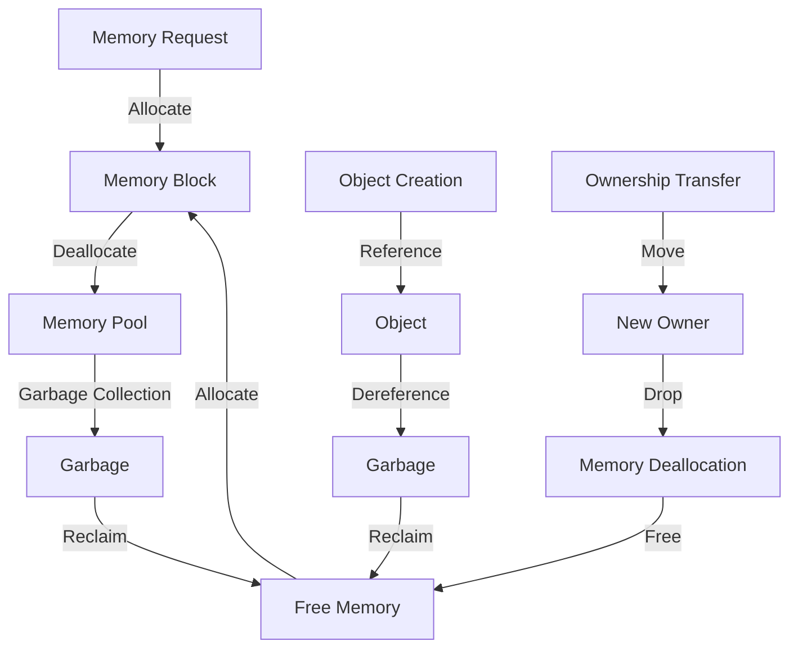

## Introduction
Memory management is a critical aspect of programming that deals with the allocation, deallocation, and optimization of memory usage in a program. It is essential to understand the basics of memory management to write efficient, scalable, and reliable code. In this overview, we will explore the different approaches to memory management, including manual memory management in C/C++, garbage-collected memory management in Java/Go/Python, and ownership-based memory management in Rust. We will delve into the core concepts, internal workings, and provide code examples to illustrate the differences between these approaches.

> **Note:** Memory management is a fundamental concept in computer science, and its importance cannot be overstated. A deep understanding of memory management is essential for any programmer, regardless of the programming language or paradigm.

## Core Concepts
Before diving into the specifics of each approach, let's define some key terms:

* **Memory allocation**: The process of assigning a portion of memory to a program or data structure.
* **Memory deallocation**: The process of releasing allocated memory back to the system.
* **Garbage collection**: A mechanism for automatically reclaiming memory occupied by objects that are no longer in use.
* **Ownership**: A concept in programming that refers to the responsibility of managing the lifetime of an object or resource.

> **Warning:** Manual memory management can lead to memory leaks, dangling pointers, and other issues if not done correctly. Garbage collection can introduce performance overhead and pauses in the program.

## How It Works Internally
Let's take a look at how each approach works internally:

* **Manual memory management (C/C++)**: The programmer is responsible for allocating and deallocating memory using functions like `malloc()` and `free()`. The memory is divided into blocks, and the programmer must keep track of the block sizes and addresses.
* **Garbage-collected memory management (Java/Go/Python)**: The runtime environment periodically scans the heap for objects that are no longer reachable and reclaims their memory. The garbage collector uses algorithms like mark-and-sweep or generational collection to identify garbage.
* **Ownership-based memory management (Rust)**: The programmer defines the ownership of objects using smart pointers like `Box` or `Rc`. The ownership system ensures that each object has a single owner, and the object is dropped when the owner goes out of scope.

## Code Examples
Here are three code examples to illustrate the differences between these approaches:

### Example 1: Manual Memory Management in C
```c
#include <stdio.h>
#include <stdlib.h>

int main() {
    // Allocate memory for an integer
    int* ptr = malloc(sizeof(int));
    *ptr = 10;
    printf("%d\n", *ptr);
    // Deallocate memory
    free(ptr);
    return 0;
}
```
### Example 2: Garbage-Collected Memory Management in Java
```java
public class MemoryExample {
    public static void main(String[] args) {
        // Create an object
        Object obj = new Object();
        // The object is garbage-collected when it goes out of scope
    }
}
```
### Example 3: Ownership-Based Memory Management in Rust
```rust
fn main() {
    // Create a Boxed integer
    let boxed_int = Box::new(10);
    // The Box is dropped when it goes out of scope
    println!("{}", boxed_int);
}
```
> **Tip:** In Rust, the ownership system ensures memory safety and prevents common errors like null pointer dereferences or use-after-free bugs.

## Visual Diagram

The diagram illustrates the memory management flow in each approach. The manual memory management flow involves allocating and deallocating memory blocks. The garbage-collected flow involves creating objects, referencing them, and reclaiming memory when they become garbage. The ownership-based flow involves transferring ownership and dropping objects when they go out of scope.

## Comparison
| Approach | Time Complexity | Space Complexity | Pros | Cons | Best For |
| --- | --- | --- | --- | --- | --- |
| Manual | O(1) | O(1) | Fine-grained control, low overhead | Error-prone, memory leaks | Systems programming, performance-critical code |
| Garbage Collection | O(n) | O(n) | Automatic memory management, reduces bugs | Performance overhead, pauses | High-level programming, rapid development |
| Ownership | O(1) | O(1) | Memory safety, prevents common errors | Steep learning curve, verbose syntax | Systems programming, safety-critical code |

> **Interview:** What are the trade-offs between manual memory management, garbage collection, and ownership-based memory management?

## Real-world Use Cases
Here are three real-world examples of memory management in different programming languages:

* **Google's Chrome browser**: Uses a combination of manual memory management and garbage collection to manage memory for web pages and browser components.
* **Amazon's DynamoDB**: Uses a custom memory management system to optimize memory usage for large-scale distributed databases.
* **Microsoft's Azure**: Uses a garbage-collected language like C# to manage memory for cloud-based services and applications.

## Common Pitfalls
Here are four common mistakes to watch out for when working with memory management:

* **Memory leaks**: Failing to deallocate memory when it is no longer needed, leading to memory exhaustion.
* **Dangling pointers**: Accessing memory that has already been deallocated, leading to crashes or unexpected behavior.
* **Use-after-free**: Accessing memory after it has been deallocated, leading to crashes or unexpected behavior.
* **Null pointer dereferences**: Accessing memory through a null pointer, leading to crashes or unexpected behavior.

> **Warning:** Memory-related bugs can be difficult to diagnose and fix, especially in large and complex systems.

## Interview Tips
Here are three common interview questions related to memory management:

* **What are the differences between stack and heap memory?**: The stack is used for local variables and function calls, while the heap is used for dynamic memory allocation.
* **How does garbage collection work?**: Garbage collection involves periodically scanning the heap for objects that are no longer reachable and reclaiming their memory.
* **What are the benefits and drawbacks of manual memory management?**: Manual memory management provides fine-grained control and low overhead but is error-prone and can lead to memory leaks.

> **Tip:** Be prepared to explain the trade-offs between different memory management approaches and provide examples of how they are used in real-world systems.

## Key Takeaways
Here are ten key takeaways to remember about memory management:

* **Memory management is critical for performance and reliability**: Inefficient memory management can lead to crashes, slowdowns, and security vulnerabilities.
* **Manual memory management requires careful attention to detail**: Manual memory management is error-prone and requires careful tracking of memory blocks and pointers.
* **Garbage collection can introduce performance overhead**: Garbage collection can pause the program and introduce additional overhead, especially for large heaps.
* **Ownership-based memory management provides memory safety guarantees**: Ownership-based memory management ensures that each object has a single owner and prevents common errors like null pointer dereferences.
* **Memory leaks can be difficult to diagnose and fix**: Memory leaks can be challenging to detect and fix, especially in large and complex systems.
* **Dangling pointers can lead to crashes or unexpected behavior**: Dangling pointers can cause crashes or unexpected behavior, especially when accessing memory that has already been deallocated.
* **Use-after-free bugs can be difficult to reproduce and fix**: Use-after-free bugs can be challenging to reproduce and fix, especially in large and complex systems.
* **Null pointer dereferences can lead to crashes or unexpected behavior**: Null pointer dereferences can cause crashes or unexpected behavior, especially when accessing memory through a null pointer.
* **Memory management is language-dependent**: Different programming languages have different memory management models and trade-offs.
* **Memory management is a critical aspect of systems programming**: Memory management is essential for building efficient, reliable, and secure systems.